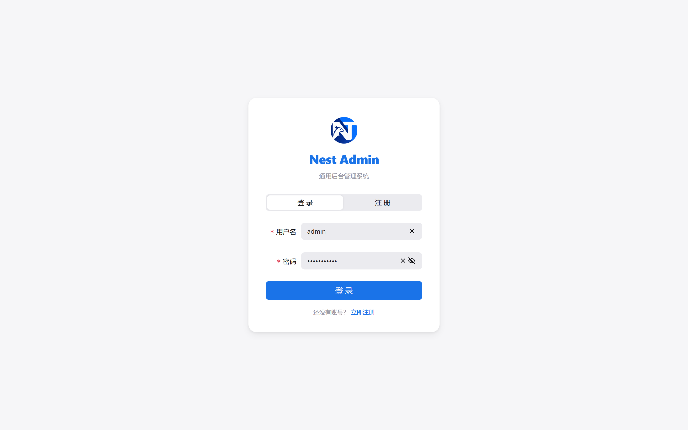
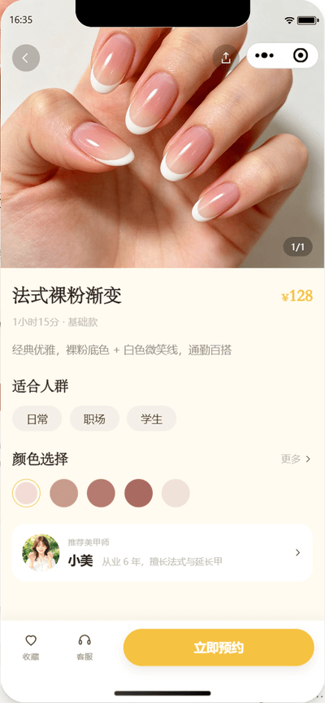

# manicure-api

[简体中文](./README.md) | **English**

A nail-salon **booking & store-management** system in three parts:

- **Backend API** — NestJS 12 + Fastify + Drizzle ORM + MySQL 8 (61 tables: 31 business / 20 system / 7 AI / 3 mini-program identity);
- **Admin frontend** — Vue 3 + Vite + lew-ui, **44 pages** (26 business + 18 platform);
- **WeChat Mini Program** — native TypeScript, **29 pages**, dual mode (customer / nail-technician workbench), 7 preset themes + 10-color custom palette.

Business scope: booking & scheduling (available-slot algorithm) · membership (level discount / stored value / visit cards / points / coupons) · cashier (WeChat Native, Alipay face-to-face, deposit & balance, split payments, refund liability + approval) · receivables (on-account credit) · reports & commissions · operations (reviews / recurring bookings / notifications).
Platform scope: RBAC, departments/posts/dictionaries/configs, login & operation audit, scheduled jobs, file management, code generator, AI operations assistant.

[](https://bun.sh)
[](https://nestjs.com)
[](https://www.typescriptlang.org)
[](https://vuejs.org)
[](https://vitejs.dev)
[](https://developers.weixin.qq.com/miniprogram/dev/framework/)
[](./LICENSE)

## Table of Contents

- [Screenshots](#screenshots)
- [Features](#features)
- [Mini Program](#mini-program)
- [AI Operations Assistant](#ai-operations-assistant)
- [Tech Stack](#tech-stack)
- [Quick Start](#quick-start)
- [Project Structure](#project-structure)
- [Environment Variables](#environment-variables)
- [Commands](#commands)
- [Testing](#testing)
- [Deployment](#deployment)
- [Docs & Conventions](#docs--conventions)
- [License](#license)

## Screenshots

**Admin**




**WeChat Mini Program** (`docs/screenshots/miniapp/`)





## Features

### Business (26 admin pages + mini-program `/app` APIs)

| Group                    | Pages                                                                                          | Notes                                                                                     |
| ------------------------ | ---------------------------------------------------------------------------------------------- | ----------------------------------------------------------------------------------------- |
| **Base data**            | `/biz/service-items` `/biz/staffs` `/biz/schedules` `/biz/customers`                            | Service items (duration/buffer drive slot occupancy), technicians + "services they can do", weekly shift templates + date overrides, customer records (also member records; phone is the unique anchor) |
| **Booking**              | `/biz/bookings` `/biz/recurrences` `/biz/app-staff-grants`                                      | Available slots (shift − bookings − buffer), create/reschedule/cancel/settle, recurring rules with idempotent batch generation, workbench access approval |
| **Membership & assets**  | `/biz/member-levels` `/biz/members` `/biz/recharge-plans` `/biz/card-types` `/biz/member-cards` `/biz/points-goods` `/biz/coupons` | Level discount (per-mille), principal vs. bonus balance, card types & redemption, points earn/redeem, coupon templates & issuing |
| **Cashier & money**      | `/biz/cashier` `/biz/payments` `/biz/refunds` `/biz/payment-diffs`                              | WeChat Native QR / Alipay face-to-face, offline payments, deposit & balance, split payments, refund liability with separated apply/approve, channel reconciliation diffs |
| **Receivables**          | `/biz/credit-accounts` `/biz/receivables`                                                       | Credit subjects (customer/company/staff), limits & terms, write-off cannot exceed the balance, aging |
| **Operations & reports** | `/biz/reviews` `/biz/reports` `/biz/commission-rules` `/biz/commission-records` `/biz/notice-templates` `/biz/notice-logs` | One review per booking + replies, report definitions (net revenue / business-day cut / card redemptions listed separately), commission rules, settlement & reversal, SMS + in-app notification templates and logs |

### Platform

| Group                 | Pages                                                                              |
| --------------------- | ---------------------------------------------------------------------------------- |
| **System**            | users · roles (menu + data scope) · menus (tree + button permissions) · depts · posts · dicts · configs |
| **Monitoring**        | login logs · operation logs (auto-audited by interceptor) · online users (force logout) · Redis cache |
| **Ops tooling**       | scheduled jobs (cron + manual run + logs) · files · code generator                  |
| **Other**             | dashboard · profile · AI assistant · login / error                                  |

> Menus and button permissions are seeded from `src/database/seed/menus.ts`, and the **admin routes are generated from them** — add a page, update the seed.

## Mini Program

`miniapp/` is a **native WeChat Mini Program in TypeScript** (29 pages, custom tab bar, theme system).
It talks to the backend through a dedicated auth domain `/api/v1/app/**` (its own `AppAccessTokenGuard`; admin tokens and app tokens are mutually rejected; DTOs are not shared with the admin API).

| Group                    | Pages                                                                                                     |
| ------------------------ | --------------------------------------------------------------------------------------------------------- |
| **Browse & book**        | home · style list (pick 1–3) · style detail · pick technician · pick time · confirm · my bookings · booking detail · payment · payment result · cancellation info · review |
| **Membership**           | member center · top-up · my visit cards · points redemption · my coupons · favorites · addresses          |
| **Other**                | shop info · messages · feedback · login / bind phone · profile · theme settings                            |
| **Technician workbench** | workbench (today's schedule + performance + arrive/complete) · my bookings · performance detail · my reviews |

- **Dual-mode tab bar**: customer (home / bookings / profile) ↔ workbench (workbench / bookings / profile). The mode is only a preference — server-side authorization decides whether the workbench is reachable, and revoked access falls back automatically;
- **Theme system**: 7 presets + 10-color custom palette, derived design tokens, navigation bar sync, persisted; the tab bar uses the same tokens;
- **`/app` APIs**: auth · catalog · membership · bookings/reviews/subscribe/payment notify · technician workbench (the full endpoint list is in the Chinese README);
- **Only JSAPI payment is still a stub** (`POST /app/payments/wxpay/jsapi` returns 501 until the WeChat Pay JSAPI channel is enabled); every other endpoint is a real implementation.

## AI Operations Assistant

An agent that lets you operate the admin backend in natural language (`src/ai/`, opened from the header robot icon or `/ai`).

- **Natural language → tool calls**: the LLM picks registered backend tools, with full policy evaluation (permissions + risk levels + approval policy + per-tool rate limits);
- **Approval loop**: high-risk operations render an inline confirm bar (cancel / confirm) inside the conversation, then the LLM summarizes; approval metadata is persisted so results survive a refresh;
- **Real streaming**: SSE token deltas (not a typewriter simulation), compatible with DeepSeek thinking mode;
- **Multi-step tasks & undo**: multi-step operations become a task timeline, successful steps support one-click Saga rollback;
- **Safety**: tool results are redacted, ActionIntent one-shot tokens + preview-snapshot TOCTOU checks, everything audited.

> Requires `DEEPSEEK_API_KEY` and `AI_ENABLED=true` (disabled by default).

## Tech Stack

| Part               | Choices                                                                                                     |
| ------------------ | ----------------------------------------------------------------------------------------------------------- |
| **Backend**        | NestJS 12 + Fastify · Drizzle ORM 1.0 (MySQL 8) · Zod 4 · jose (JWT) · Bun.password (argon2id) · @nestjs/schedule + cron · Swagger |
| **Admin frontend** | Vue 3.5 + Vite 8 + TS 5.9 · Vue Router 5 · Pinia 3 · lew-ui · UnoCSS · ECharts 6 · axios (auto refresh + queued retries) |
| **Mini Program**   | Native WeChat Mini Program + TypeScript (glass-easel) · hand-rolled design tokens (no third-party UI library) |
| **Tooling**        | Bun 1.4 as the only runtime (app / migrations / seeds / tests) · oxlint + oxfmt · bun test (vitest-style assertions) |

## Quick Start

### Prerequisites

- **Bun >= 1.4** (runtime and package manager for both backend and frontend)
- **MySQL 8** (integration tests need an account that can create databases)
- Redis (**optional** — without it, cache / online users / some jobs degrade gracefully)
- WeChat DevTools (for the mini program)

### Backend

```bash
git clone <repo-url> && cd manicure-project

cp .env.example .env          # fill DATABASE_URL / JWT_* / SEED_ADMIN_PASSWORD
bun install
bun run db:migrate            # create tables (migrations are generated by drizzle-kit)
bun run db:seed               # admin user (username: admin, password: SEED_ADMIN_PASSWORD)
bun run db:seed:menus         # menus + permission codes (idempotent)
bun run db:seed:biz           # business defaults: member levels / refund policies / notice templates / jobs / configs
bun run db:seed:nail          # nail-shop base data: items / staff / shifts / card types / top-up plans / points goods / commission rules / credit subjects
bun run dev                   # http://localhost:3000 , Swagger at /api/v1/docs
```

`bun run db:seed:demo` adds **demo** customers/members (development only — do not run in production).

### Admin frontend

```bash
cd web
bun install
bun run dev                   # http://localhost:5173 , /api proxies to :3000
```

Default admin: username `admin`, password = the `SEED_ADMIN_PASSWORD` used by `db:seed`.

### WeChat Mini Program

```bash
# Open miniapp/ with WeChat DevTools (appid lives in project.config.json),
# or just type-check it:
bunx tsc --noEmit -p miniapp/tsconfig.json
```

Three things matter when running it on a device/simulator (documented in `miniapp/miniprogram/config.ts`):

1. `API_BASE` must use your **LAN IP** (`127.0.0.1` points at the phone itself on a real device);
2. `urlCheck: false` in the DevTools private config (this project runs over http + IP);
3. allow inbound port 3000 through the Windows firewall — verify from the **phone browser**, not the PC.

`/app` login requires `WX_MINIAPP_APPID` / `WX_MINIAPP_SECRET` (returns 503 "mini program disabled" by design when unset).
For local development you can set `WX_MINIAPP_FAKE=true` to use the fake WeChat provider (**force-disabled in production**).

## Project Structure

```
.
├── src/                              # Backend
│   ├── main.ts                       # bootstrap (helmet / rate-limit / multipart / Swagger)
│   ├── config/                       # env schema (Zod) + per-channel "configured" flags
│   ├── database/
│   │   ├── schema/index.ts           # 61 tables + defineRelations (single file)
│   │   ├── migrations/               # SQL migrations generated by drizzle-kit
│   │   └── seed/                     # index(admin) / menus / biz / nail / demo
│   ├── common/                       # auth(JWT+RBAC) · cache · data-scope · logging · money
│   ├── ai/                           # AI assistant (agent / gateway / approval / task / llm / tools)
│   └── modules/
│       ├── biz/                      # base-data · scheduling · booking · membership
│       │                             # payment · credit · reports · operations · common
│       ├── app/                      # mini program domain (auth / catalog / member / payments / staff)
│       ├── system/ monitor/ dashboard/ jobs/ files/ generator/ health/
│       └── generated/                # code generator output (gitignored)
├── web/                              # Admin frontend (Vue 3 + Vite, 44 pages)
├── miniapp/                          # WeChat Mini Program (native TS, 29 pages)
├── tests/integration/                # b1~b7 integration tests against a real MySQL + harness
├── docs/                             # specs / plans / pitfalls / handover / screenshots / brand
├── .agents/skills/                   # per-module development skills (for humans and AI agents)
├── uploads/                          # uploaded files
└── ecosystem.config.js               # PM2 deployment config
```

## Environment Variables

**Core**

| Variable              | Required | Default                 | Description                       |
| --------------------- | :------: | ----------------------- | --------------------------------- |
| `NODE_ENV`            |    no    | `development`           | Runtime environment               |
| `PORT`                |    no    | `3000`                  | Server port                       |
| `API_PREFIX`          |    no    | `api/v1`                | API prefix                        |
| `DATABASE_URL`        |  **yes** | —                       | MySQL connection string           |
| `REDIS_URL`           |    no    | —                       | Redis connection (optional)       |
| `JWT_ISSUER`          |  **yes** | —                       | JWT issuer                        |
| `JWT_AUDIENCE`        |  **yes** | —                       | JWT audience                      |
| `JWT_ACCESS_SECRET`   |  **yes** | —                       | Access token secret (>=32 chars)  |
| `JWT_REFRESH_SECRET`  |  **yes** | —                       | Refresh token secret (>=32 chars) |
| `JWT_ACCESS_TTL`      |    no    | `15m`                   | Access token TTL                  |
| `JWT_REFRESH_TTL`     |    no    | `7d`                    | Refresh token TTL                 |
| `CORS_ORIGINS`        |    no    | `http://localhost:5173` | Allowed origins (comma separated) |
| `UPLOAD_DIR`          |    no    | `uploads`               | Upload directory                  |
| `SWAGGER_ENABLED`     |    no    | `true`                  | Enable Swagger                    |
| `SWAGGER_PATH`        |    no    | `docs`                  | Swagger path                      |
| `SEED_ADMIN_PASSWORD` |    no    | —                       | Admin password used by `db:seed`  |

**WeChat Mini Program**

| Variable            | Required | Description                                                             |
| ------------------- | :------: | ----------------------------------------------------------------------- |
| `WX_MINIAPP_APPID`  |    no    | Mini program AppID (with the secret it enables `/app` login)            |
| `WX_MINIAPP_SECRET` |    no    | Mini program AppSecret                                                  |
| `WX_MINIAPP_FAKE`   |    no    | `true` uses the fake WeChat provider (**force-disabled in production**) |

**Payment channels** (an unconfigured channel returns "not enabled" instead of failing startup)

| Variable                                                                                               | Description                           |
| ------------------------------------------------------------------------------------------------------ | ------------------------------------- |
| `WXPAY_APPID` `WXPAY_MCHID` `WXPAY_SERIAL_NO` `WXPAY_PRIVATE_KEY` `WXPAY_API_V3_KEY` `WXPAY_NOTIFY_URL` | WeChat Pay Native (all six required)  |
| `WXPAY_PLATFORM_PUBLIC_KEY`                                                                             | Optional platform public key (skips the online download; does **not** affect the enabled check) |
| `ALIPAY_APP_ID` `ALIPAY_PRIVATE_KEY` `ALIPAY_PUBLIC_KEY` `ALIPAY_NOTIFY_URL`                            | Alipay face-to-face                   |

**Notifications & AI**

| Variable                                                    | Default                    | Description                                           |
| ----------------------------------------------------------- | -------------------------- | ----------------------------------------------------- |
| `SMS_PROVIDER`                                              | `none`                     | `none` / `aliyun` / `tencent` / `mock`                |
| `SMS_ACCESS_KEY_ID` `SMS_ACCESS_KEY_SECRET` `SMS_SIGN_NAME` | —                          | SMS credentials (a missing one degrades to in-app only) |
| `AI_ENABLED`                                                | `false`                    | Enable the AI assistant                               |
| `DEEPSEEK_API_KEY`                                          | —                          | Required when AI is enabled                           |
| `DEEPSEEK_BASE_URL`                                         | `https://api.deepseek.com` | API base URL                                          |
| `DEEPSEEK_MODEL`                                            | `deepseek-chat`            | Model id                                              |

## Commands

```bash
# Backend (repository root)
bun run dev              # dev (bun --watch src/main.ts)
bun run build            # compile to output/server
bun run start            # production start
bun run typecheck        # tsc --noEmit
bun run lint / lint:fix  # oxlint
bun run format / format:check
bun run test             # bun test (unit + integration)
bun run test:coverage
bun run db:generate      # generate migrations from the schema (never hand-write SQL)
bun run db:migrate
bun run db:seed / db:seed:menus / db:seed:biz / db:seed:nail / db:seed:demo
bun run db:studio        # Drizzle Studio

# Admin frontend (web/)
bun run dev              # 5173
bun run build            # vue-tsc --noEmit && vite build (output to ../output/web)
bun run typecheck / lint

# Mini Program (run from the repository root; miniapp has no local typescript)
bunx tsc --noEmit -p miniapp/tsconfig.json
```

## Testing

```bash
bun run test                 # everything: unit + integration (105 files / 1158 tests)
bun run test:watch
bun run test:coverage
```

- **Unit tests** (`*.spec.ts` next to the source) import from `'vitest'` only for assertions/mocks; they run on **bun test** directly;
- **Integration tests** (`tests/integration/*.int.spec.ts`, b1~b7) run against a **real MySQL**: the harness derives a dedicated test database from `TEST_DATABASE_URL` → `.env.test` → `<DATABASE_URL>_test`, creates it when missing, migrates, and truncates between cases. They cover concurrency, idempotent replays, timezone edges, money invariants and channel-callback signature verification — the things unit tests cannot prove.

## Deployment

The backend ships with PM2 ([`ecosystem.config.js`](./ecosystem.config.js)):

```bash
bun install && bun run build && bun install --production
mkdir -p logs && pm2 start ecosystem.config.js && pm2 save
```

It runs `output/server/main.js` with the `bun` interpreter, takes the port from `PORT` (**1011** in the config), enables `autorestart` and graceful shutdown, and writes to `logs/out.log` / `logs/error.log`.

The admin frontend builds to `output/web/` — serve it with nginx (or any static host) and reverse-proxy `/api` to the backend.

> ⚠️ Production prerequisites outside the codebase: mini-program entity verification & filing, ICP filing + HTTPS for the admin domain, request-domain allowlist, production AppID/AppSecret, WeChat Pay merchant id + APIv3 certificate, subscribe-message templates, and replacing the placeholder terms/privacy text. See section 5 of [`docs/HANDOVER-miniapp.md`](./docs/HANDOVER-miniapp.md).

## Docs & Conventions

| Location                                                 | Contents                                                                       |
| -------------------------------------------------------- | ------------------------------------------------------------------------------ |
| [`docs/superpowers/specs/`](./docs/superpowers/specs)     | **Single source of truth**: schema, state machines, money/time rules, API contracts |
| [`docs/superpowers/plans/`](./docs/superpowers/plans)     | Delivery plans (batches B1~B6, mini program, rename)                            |
| [`docs/pitfalls/`](./docs/pitfalls)                       | Pitfall logs: `server.md` / `web.md` / `miniapp.md` / `tooling.md`              |
| [`docs/HANDOVER-miniapp.md`](./docs/HANDOVER-miniapp.md)  | Mini program + `/app` identity handover, acceptance ledger, open items          |
| [`docs/brand/`](./docs/brand)                             | Brand logo master + export pipeline                                             |
| [`.agents/skills/`](./.agents/skills)                     | Per-module skills (overview / money invariants / booking core / scheduling / membership / cashier / credit / reports / notifications / recurring / mini program / admin frontend / testing) |

Project-wide rules worth knowing before changing code:

- Money is **integer cents**; divide by 100 only for display, always rounding **down**; **money is computed server-side only**;
- Time is stored in **UTC**; "shop-local day → absolute instant range" must go through `shopDayRange()`;
- List endpoints return `{ items, page, pageSize }` (no `total`); the client fetches one extra row to detect `hasMore`;
- Any write touching money, balances, points, visit cards or receivables must follow the `money-invariants` skill (conditional-update template + global lock order);
- New pages must be registered in `seed/menus.ts` (permission codes are lowercase, e.g. `biz:serviceitem:list`).

## License

MIT
