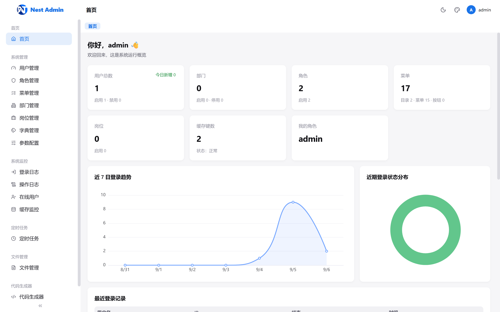
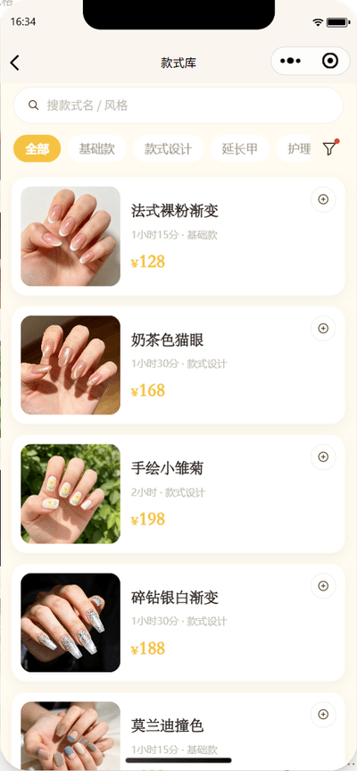
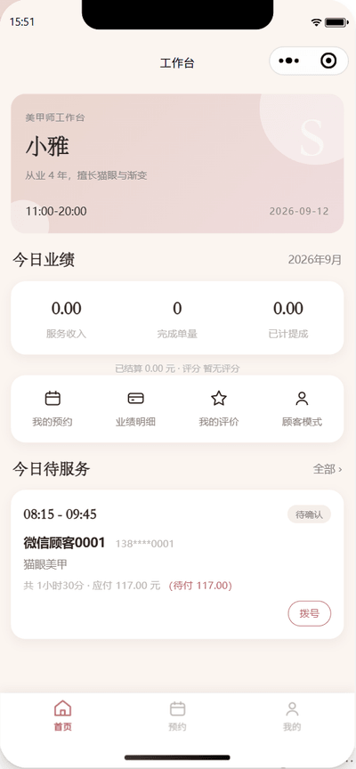

# manicure-api

**简体中文** | [English](./README.en.md)

美甲门店的**到店预约与经营管理**系统，三端一体：

- **后端 API** —— NestJS 12 + Fastify + Drizzle ORM + MySQL 8（61 张表：业务 31 / 系统 18 / AI 7 / 小程序身份 3 / 通知 2）；
- **后台管理前端** —— Vue 3 + Vite + lew-ui，**46 个页面**（业务 26 + 基座 18 + AI 面板等）；
- **微信小程序** —— 原生 TypeScript，**29 个页面**，顾客端与**美甲师工作台**双模式、7 套预设主题 + 10 色自定义色板。

业务覆盖：预约与排班（可约时段算法）· 会员（等级折扣 / 储值 / 次卡 / 积分 / 优惠券）· 收银（微信 Native、支付宝当面付、定金尾款、混合支付、退款判责与审批）· 挂账应收 · 报表与提成 · 运营（评价 / 周期预约 / 通知）。
基座覆盖：RBAC 权限、部门/岗位/字典/配置、操作与登录审计、定时任务、文件管理、代码生成器、AI 操作助手。

[](https://bun.sh)
[](https://nestjs.com)
[](https://www.typescriptlang.org)
[](https://vuejs.org)
[](https://vitejs.dev)
[](https://developers.weixin.qq.com/miniprogram/dev/framework/)
[](./LICENSE)

## 目录

- [界面预览](#界面预览)
- [功能模块](#功能模块)
- [小程序端](#小程序端)
- [AI 操作助手](#ai-操作助手)
- [技术栈](#技术栈)
- [快速开始](#快速开始)
- [项目结构](#项目结构)
- [环境变量](#环境变量)
- [命令](#命令)
- [测试](#测试)
- [部署](#部署)
- [文档与协作](#文档与协作)
- [License](#license)

## 界面预览

**后台管理端**




**微信小程序端**（`project-design/screenshots/miniapp/`）






## 功能模块

### 一、美甲业务（后台 26 个页面 + 小程序 app 域接口）

| 分组           | 页面                                                            | 说明                                                                       |
| -------------- | --------------------------------------------------------------- | -------------------------------------------------------------------------- |
| **基础数据**   | `/biz/service-items` `/biz/staffs` `/biz/schedules` `/biz/customers` | 服务项目（时长/缓冲决定占位）、美甲师与「可做项目」、周模板+日期例外排班、顾客档案（兼会员档案，手机号唯一锚点） |
| **预约**       | `/biz/bookings` `/biz/recurrences` `/biz/app-staff-grants`       | 可约时段（班次−预约−缓冲）、下单/改期/取消/结算、周期预约规则批量生成、美甲师工作台开通审批 |
| **会员与资产** | `/biz/member-levels` `/biz/members` `/biz/recharge-plans` `/biz/card-types` `/biz/member-cards` `/biz/points-goods` `/biz/coupons` | 等级折扣（千分比）、储值本金与赠送余额、次卡卡种与核销、积分累计/抵扣/兑换、优惠券模板与发券 |
| **收银与资金** | `/biz/cashier` `/biz/payments` `/biz/refunds` `/biz/payment-diffs` | 微信 Native 扫码 / 支付宝当面付、线下收款记账、定金与尾款、混合支付、退款判责与「申请/审批」分离、渠道对账差异 |
| **挂账应收**   | `/biz/credit-accounts` `/biz/receivables`                        | 挂账主体（顾客/公司/员工）、额度与账期、销账不得超额的应收台账与账龄       |
| **运营与报表** | `/biz/reviews` `/biz/reports` `/biz/commission-rules` `/biz/commission-records` `/biz/notice-templates` `/biz/notice-logs` | 一单一评与回复、报表口径（净营收 / 营业日切分 / 次卡核销单列）、提成规则与结算冲销、短信+站内通知模板与发送记录 |

### 二、后台基座

| 分组         | 页面                                                                        |
| ------------ | --------------------------------------------------------------------------- |
| **系统管理** | `users` 用户与角色分配 · `roles` 菜单权限与数据权限 · `menus` 树形菜单与按钮权限 · `depts` 部门 · `posts` 岗位 · `dicts` 字典 · `configs` 参数配置 |
| **系统监控** | `login-logs` 登录日志 · `operation-logs` 操作审计（拦截器自动落库） · `online` 在线用户（可强制下线） · `cache` Redis 监控 |
| **运维工具** | `jobs` 定时任务（cron + 手动执行 + 日志） · `files` 文件管理 · `generator` 代码生成器 |
| **其它**     | `dashboard` 数据看板 · `profile` 个人中心 · `ai` AI 操作助手 · `login` / `error` |

> 菜单与按钮权限点由 `src/database/seed/menus.ts` 驱动，**前端路由据此自动生成**（新增页面要同步 seed，见「文档与协作」）。

## 小程序端

`miniapp/` 是**微信原生 TypeScript** 工程（29 个页面 + 自定义 TabBar + 主题系统），
通过独立的 app 认证域 `/api/v1/app/**` 访问后端（`AppAccessTokenGuard`，与后台 token 双向拒绝，不复用后台 DTO）。

| 分组           | 页面                                                                                        |
| -------------- | ------------------------------------------------------------------------------------------- |
| **浏览与预约** | 首页 · 款式库（多选 1~3） · 款式详情 · 选美甲师 · 选时间 · 确认预约 · 我的预约 · 订单详情 · 支付 · 支付结果 · 取消说明 · 服务评价 |
| **会员与资产** | 会员中心 · 充值 · 我的次卡 · 积分兑换 · 我的优惠券 · 我的收藏 · 收货地址 |
| **其它**       | 门店信息 · 消息中心 · 意见反馈 · 登录/绑定手机号 · 我的 · 主题设置 |
| **美甲师工作台** | 工作台（今日日程 + 业绩 + 到店/完成） · 我的预约 · 业绩明细 · 我的评价 |

- **双模式 TabBar**：顾客（首页/预约/我的）↔ 工作台（工作台/我的预约/我的），模式只是偏好，「能不能进工作台」由服务端授权决定，撤权自动落回顾客模式；
- **主题系统**：7 套预设 + 10 色自定义色板，令牌派生、导航栏联动、持久化，底部 TabBar 一起吃令牌；
- **app 域接口**：认证（`POST /app/auth/login`、`POST /app/auth/phone`）· 目录（`GET /app/service-items|staffs|available-slots`）· 会员（`GET /app/member/me|cards`、`GET /app/recharge-plans|points-goods|coupon-offers|coupons`、`POST /app/points/redeem|coupons/claim`）· 预约与支付（`GET/POST /app/bookings`、`/app/bookings/:id`、`/app/bookings/:id/cancel`、`POST /app/reviews|subscribe`、`POST /app/payments/wxpay/notify`）· 工作台（`POST /app/staff/apply`、`GET /app/staff/me|bookings|schedule|performance|reviews`、`GET /app/staff/bookings/:id/phone`、`POST /app/staff/bookings/:id/arrived|complete`）；
- **尚未接通道的只有 JSAPI 支付**（`POST /app/payments/wxpay/jsapi` 仍是 501 契约位，小程序内支付等通道开通后在 P2 接），其余接口都是真实现。

> 小程序「预留 → 落地」的完整背景、验收账本与遗留项见 [`project-design/HANDOVER-miniapp.md`](./project-design/HANDOVER-miniapp.md)。

## AI 操作助手

内置“用自然语言操作系统后台”的 Agent 能力，后端位于 `src/ai/`，Web 端通过顶部 Header 的 AI 机器人图标唤出面板使用（也可直达 `/ai` 页面）。

- **自然语言 → 工具调用**：LLM 自主决策调用已注册的后台工具（用户/部门/字典/菜单等），全程策略评估（权限 + 风险分级 + 审批策略 + 工具限流）；
- **审批闭环**：高风险操作在会话消息内内嵌确认条完成「取消 / 确认执行」，确认后由 LLM 生成总结回复；审批结果元数据持久化，刷新/重新进入仍还原结果条样式；
- **真流式回复**：基于 SSE 的文本增量推送（非模拟打字机）；兼容 DeepSeek thinking 模式；
- **多步任务与撤销**：多步操作进入任务时间线，成功步骤支持一键 Saga 撤销；
- **安全**：Tool 返回统一脱敏；ActionIntent 一次性 token + 预览快照 TOCTOU 校验；全程审计留痕。

> 需配置 `DEEPSEEK_API_KEY` 且 `AI_ENABLED=true`（默认关闭），详见环境变量表。

## 技术栈

| 端         | 选型                                                                                                        |
| ---------- | ----------------------------------------------------------------------------------------------------------- |
| **后端**   | NestJS 12 + Fastify · Drizzle ORM 1.0.0-rc.3（MySQL 8）· Zod 4 校验 · jose（JWT）· Bun.password（argon2id）· @nestjs/schedule + cron · @nestjs/swagger |
| **后台前端** | Vue 3.5 + Vite 8 + TypeScript 6 · Vue Router 5 · Pinia 3 · lew-ui 2.8 · UnoCSS · ECharts 6 · axios（401 自动刷新 + 并发排队） |
| **小程序** | 微信原生小程序 + TypeScript（glass-easel）· 自绘主题令牌 + 薄封装工具层（不引第三方 UI 库） |
| **工程**   | Bun 1.4（唯一运行时：应用 / 迁移 / seed / 测试）· oxlint + oxfmt · bun test（断言沿用 vitest API） |

后端不引入 tsx / Node 启动方式；`web/` 与 `miniapp/` 各自独立安装依赖。

## 快速开始

### 环境要求

- **Bun >= 1.4**（后端与前端都用它：运行时 + 包管理器）
- **MySQL 8**（集成测试需要一个可建库的账号）
- Redis（**可选**，不配置则缓存 / 在线用户 / 部分任务自动降级）
- 微信开发者工具（跑小程序时）

### 后端

```bash
git clone <repo-url> && cd manicure-project

cp .env.example .env          # 填 DATABASE_URL / JWT_* / SEED_ADMIN_PASSWORD
bun install
bun run db:migrate            # 建表（migrations 由 drizzle-kit 生成）
bun run db:seed               # 管理员（用户名 admin，密码取 SEED_ADMIN_PASSWORD）
bun run db:seed:menus         # 菜单与权限点（幂等，可重复执行）
bun run db:seed:biz           # 业务默认值：会员等级 / 退款判责规则 / 通知模板 / 定时任务 / 业务参数
bun run db:seed:nail          # 美甲店基础数据：项目 / 美甲师 / 排班 / 卡种 / 充值方案 / 积分兑换品 / 提成规则 / 挂账主体
bun run dev                   # http://localhost:3000 ，Swagger: /api/v1/docs
```

`bun run db:seed:demo` 是**演示用**顾客与会员数据（可选，生产不要跑）。

### 后台前端

```bash
cd web
bun install
bun run dev                   # http://localhost:5173 ，/api 代理到 3000
```

默认管理员：用户名 `admin`，密码为 `db:seed` 时的 `SEED_ADMIN_PASSWORD`。

### 微信小程序

```bash
# 用微信开发者工具「导入项目」，目录选 miniapp/（appid 在 project.config.json）
# 或先做类型检查：
bunx tsc --noEmit -p miniapp/tsconfig.json
```

真机/模拟器联调的三件事（都在 `miniapp/miniprogram/config.ts` 的注释里）：

1. `API_BASE` 用**局域网 IP**（不是 `127.0.0.1`，真机上那是手机自己），换网络后 DHCP 可能改号；
2. 开发者工具 `project.private.config.json` 里 `urlCheck: false`（本项目走 http + IP）；
3. Windows 防火墙放行 3000 入站；自检用**手机浏览器**打开 `http://<局域网IP>:3000/api/v1/health`。

后端的 app 域登录需要 `WX_MINIAPP_APPID` / `WX_MINIAPP_SECRET`（未配置时按设计返回 503「小程序端未启用」）；
本地开发可临时用 `WX_MINIAPP_FAKE=true` 走假微信实现（**生产强制失效**）。

## 项目结构

```
.
├── src/                              # 后端
│   ├── main.ts                       # 启动入口（helmet / rate-limit / multipart / Swagger）
│   ├── config/                       # 环境变量（Zod 校验 + 通道 configured 判定）
│   ├── database/
│   │   ├── schema/index.ts           # 61 张表定义 + defineRelations（单文件）
│   │   ├── migrations/               # drizzle-kit 生成的 SQL 迁移
│   │   └── seed/                     # index(管理员) / menus / biz / nail / demo
│   ├── common/                       # auth(JWT+RBAC) · cache(Redis) · data-scope · logging · money
│   ├── ai/                           # AI 操作助手（agent / gateway / approval / task / llm / tools）
│   └── modules/
│       ├── biz/                      # 美甲业务：base-data · scheduling · booking · membership
│       │                             #          payment · credit · reports · operations · common
│       ├── app/                      # 小程序域：auth · catalog · member · payments · staff（独立守卫）
│       ├── system/ monitor/ dashboard/ jobs/ files/ generator/ health/
│       └── generated/                # 代码生成器输出（gitignore）
├── web/                              # 后台前端（Vue 3 + Vite，46 个页面）
├── miniapp/                          # 微信小程序（原生 TS，29 个页面）
│   ├── miniprogram/                  # pages / custom-tab-bar / store / theme / utils / assets
│   └── project.config.json           # appid 与编译配置
├── tests/integration/                # b1~b7 集成测试（真实 MySQL）+ harness
├── docs/                             # 对客操作手册（Markdown + VitePress，面向门店人员）
├── dev-docs/                         # 开发者文档（VitePress，架构 / 数据 / 接口 / 测试 / 部署）
├── project-design/                   # 设计资料库（spec / 施工计划 / 踩坑 / UI 稿 / 品牌 / 截图）
├── .agents/skills/                   # 按模块拆分的开发技能（给人和 AI 共用）
├── scripts/                          # 仓库脚本（文档死链校验等）
├── uploads/                          # 文件上传目录
└── ecosystem.config.js               # PM2 部署配置
```

## 环境变量

> ⚠️ **只有根目录的 `.env` 会被加载**：`src/app.module.ts` 里是 `ConfigModule.forRoot({ isGlobal: true })`，
> 没传 `envFilePath`，所以 `.env.development` / `.env.prod` 不会被应用自动读取（集成测试 harness 另行手工解析 `.env.test`）。
> 换环境请直接改 `.env`，或者用进程环境变量覆盖（`PORT=3000 bun run dev`）。

**基础**

| 变量                 |  必填  | 默认值                  | 说明                              |
| -------------------- | :----: | ----------------------- | --------------------------------- |
| `NODE_ENV`           |   否   | `development`           | 运行环境                          |
| `PORT`               |   否   | `3000`                  | 服务端口                          |
| `API_PREFIX`         |   否   | `api/v1`                | API 前缀                          |
| `DATABASE_URL`       | **是** | —                       | MySQL 连接字符串                  |
| `REDIS_URL`          |   否   | —                       | Redis 连接（不配置则降级）        |
| `JWT_ISSUER`         | **是** | —                       | JWT 签发者                        |
| `JWT_AUDIENCE`       | **是** | —                       | JWT 受众                          |
| `JWT_ACCESS_SECRET`  | **是** | —                       | Access Token 密钥（≥32 字符）     |
| `JWT_REFRESH_SECRET` | **是** | —                       | Refresh Token 密钥（≥32 字符）    |
| `JWT_ACCESS_TTL`     |   否   | `15m`                   | Access Token 有效期               |
| `JWT_REFRESH_TTL`    |   否   | `7d`                    | Refresh Token 有效期              |
| `CORS_ORIGINS`       |   否   | `http://localhost:5173` | CORS 允许来源（逗号分隔）         |
| `UPLOAD_DIR`         |   否   | `uploads`               | 文件上传目录                      |
| `SWAGGER_ENABLED`    |   否   | `true`                  | 是否启用 Swagger                  |
| `SWAGGER_PATH`       |   否   | `docs`                  | Swagger 路径                      |
| `SEED_ADMIN_PASSWORD` | **仅 seed** | —                  | `db:seed` 时的管理员密码；**不填会直接抛错** |

**微信小程序**

| 变量                | 必填 | 说明                                                             |
| ------------------- | :--: | ---------------------------------------------------------------- |
| `WX_MINIAPP_APPID`  |  否  | 小程序 AppID（与 Secret 一起决定 app 域登录是否可用）            |
| `WX_MINIAPP_SECRET` |  否  | 小程序 AppSecret                                                 |
| `WX_MINIAPP_FAKE`   |  否  | `true` 走假微信实现（**生产强制失效**），仅本地/测试用           |

**支付通道**（未配置时通道返回「未启用」，不影响进程启动）

| 变量                                                                                  | 说明                       |
| ------------------------------------------------------------------------------------- | -------------------------- |
| `WXPAY_APPID` `WXPAY_MCHID` `WXPAY_SERIAL_NO` `WXPAY_PRIVATE_KEY` `WXPAY_API_V3_KEY` `WXPAY_NOTIFY_URL` | 微信支付 Native 扫码（六项齐全才算启用） |
| `WXPAY_PLATFORM_PUBLIC_KEY`                                                           | 可选：平台证书公钥，配了免联网下载（**不参与启用判定**） |
| `ALIPAY_APP_ID` `ALIPAY_PRIVATE_KEY` `ALIPAY_PUBLIC_KEY` `ALIPAY_NOTIFY_URL`           | 支付宝当面付               |

**通知与 AI**

| 变量                                                   | 默认值                     | 说明                                          |
| ------------------------------------------------------ | -------------------------- | --------------------------------------------- |
| `SMS_PROVIDER`                                         | `none`                     | `none` / `aliyun` / `tencent` / `mock`        |
| `SMS_ACCESS_KEY_ID` `SMS_ACCESS_KEY_SECRET` `SMS_SIGN_NAME` | —                      | 短信凭据（缺一项即降级为「只写站内消息」）     |
| `AI_ENABLED`                                           | `false`                    | 是否启用 AI 操作助手                          |
| `DEEPSEEK_API_KEY`                                     | —                          | 启用 AI 时填写                                |
| `DEEPSEEK_BASE_URL`                                    | `https://api.deepseek.com` | DeepSeek 接口地址                             |
| `DEEPSEEK_MODEL`                                       | `deepseek-chat`            | DeepSeek 模型                                 |

## 命令

```bash
# 后端（根目录）
bun run dev              # 开发（bun --watch src/main.ts）
bun run build            # 编译到 output/server
bun run start            # 生产启动
bun run typecheck        # tsc --noEmit
bun run lint / lint:fix  # oxlint
bun run format / format:check
bun run test             # bun test（单元 + 集成）
bun run test:coverage
bun run db:generate      # 由 schema 生成迁移（不要手写 SQL）
bun run db:migrate       # 执行迁移
bun run db:seed / db:seed:menus / db:seed:biz / db:seed:nail / db:seed:demo
bun run db:studio        # Drizzle Studio

# 后台前端（web/）
bun run dev              # 5173
bun run build            # vue-tsc --noEmit && vite build（产物到 ../output/web）
bun run typecheck / lint

# 小程序（根目录执行即可，miniapp 自身不装 typescript）
bunx tsc --noEmit -p miniapp/tsconfig.json
bun scripts/verify-wxml-tags.mjs   # WXML 标签配对（tsc 不管 WXML；离线、秒级）
```

### 文档自检

改完 `docs/` 或 `dev-docs/` 的 Markdown 后，用这两个脚本自检（两站都开着 `ignoreDeadLinks: false`，死链会让构建失败）：

```bash
bun scripts/verify-docs-links.mjs              # 死链 + 锚点 + frontmatter title（秒级，离线）
bun scripts/verify-mermaid-render.mjs <站点URL> # 用真实 Chrome 验证 mermaid 图渲染成 SVG
```

`verify-mermaid-render.mjs` 只在需要时用（它要起一个无头 Chrome）：
先 `cd dev-docs && bun run preview` 或任意静态服务，再把 URL 传进去。

## 测试

```bash
bun run test                 # 全量：单元 + 集成（104 个文件：单元 82 + 集成 18 + 前端 4）
bun run test:watch
bun run test:coverage
```

- **单元测试** `*.spec.ts` 与源码同目录，`from 'vitest'` 只当断言/mock 库用，由 **bun test** 直接执行（不经过 vitest runner）；
- **集成测试** `tests/integration/*.int.spec.ts`（b1~b7）跑在**真实 MySQL** 上：
  按 `TEST_DATABASE_URL` → `.env.test` → `<DATABASE_URL>_test` 推导独立测试库，缺库自动建库、跑迁移、逐用例清表，
  覆盖并发抢单、幂等重放、时区边界、资金不变量、渠道回调验签等「单测测不出来」的路径；
- 新增验收条目请对照 [`project-design/pitfalls/`](./project-design/pitfalls) 与 `.agents/skills/testing-acceptance`。

## 部署

后端用 PM2 部署（配置见 [`ecosystem.config.js`](./ecosystem.config.js)）：

```bash
bun install && bun run build && bun install --production
mkdir -p logs && pm2 start ecosystem.config.js && pm2 save
```

默认以 `bun` 解释器运行 `output/server/main.js`，端口由 `PORT` 注入（配置里是 **1011**），
`autorestart` + 优雅关停（`enableShutdownHooks`）已开；日志在 `logs/out.log` / `logs/error.log`。

后台前端 `web/` 构建产物在 `output/web/`，交给 nginx 等静态服务托管并把 `/api` 反向代理到后端即可。

> ⚠️ 上线前必须完成的外部事项（与代码无关但决定上线日）：小程序主体认证与备案、后台域名备案 + HTTPS、
> 服务器域名白名单、正式 AppID/AppSecret、微信支付商户号与 APIv3 证书、订阅消息模板、隐私协议与用户协议正文替换。
> 清单见 [`project-design/HANDOVER-miniapp.md`](./project-design/HANDOVER-miniapp.md) 第 5 节「人工门禁现状」。

### 文档站构建

两套 Markdown 文档都可以独立构建成静态站点：

```bash
# 对客操作手册（VitePress 2，端口 5190 / 预览 5191）
cd docs && bun install && bun run dev          # http://localhost:5190
cd docs && bun run build                       # 产物 .vitepress/dist

# 开发者文档（VitePress 2，端口 5180 / 预览 5181）
cd dev-docs && bun install && bun run dev      # http://localhost:5180
cd dev-docs && bun run build                   # 产物 .vitepress/dist
```

`DOCS_BASE=/manicure/dev-docs/` 可把站点部署到子路径（两站同机时用不同子路径区分）。

## 文档与协作

项目文档按**读者**分三层，不要混用：

| 目录                                             | 读者                     | 内容                                                                 |
| ------------------------------------------------ | ------------------------ | -------------------------------------------------------------------- |
| [`docs/`](./docs)                                 | **门店人员（对客）**     | 操作手册：每个模块怎么用、注意事项、支付开通清单、模块之间的配合逻辑 |
| [`dev-docs/`](./dev-docs)                         | **开发者 / 测试 / 运维** | 技术文档（VitePress 2）：架构、数据模型、状态机、接口契约、测试与部署 |
| [`project-design/`](./project-design)             | **产品 / 设计 / 交接**   | 设计资料库：原始 spec、施工计划、UI 设计稿、踩坑记录、交接说明       |

`project-design/` 细分：

| 位置                                                                 | 内容                                                                     |
| -------------------------------------------------------------------- | ------------------------------------------------------------------------ |
| [`project-design/superpowers/specs/`](./project-design/superpowers/specs) | 需求与设计 spec（**早期设计意图**，表结构等现状以代码为准）           |
| [`project-design/superpowers/plans/`](./project-design/superpowers/plans) | 施工单与批次计划（B1~B6、小程序、重命名等）                            |
| [`project-design/pitfalls/`](./project-design/pitfalls)                   | 踩坑记录：`server.md` / `web.md` / `miniapp.md` / `tooling.md`（改代码前先扫一眼） |
| [`project-design/HANDOVER-miniapp.md`](./project-design/HANDOVER-miniapp.md) | 小程序 + app 域身份的交接说明、验收账本、遗留项与人工门禁              |
| [`project-design/brand/`](./project-design/brand)                         | 品牌 LOGO 母版与导出流程                                                 |
| [`project-design/screenshots/`](./project-design/screenshots)             | 后台与小程序界面截图                                                     |
| [`.agents/skills/`](./.agents/skills)                                     | 按模块拆分的开发技能（项目总纲 / 资金不变量 / 预约主链路 / 排班 / 会员 / 收银 / 挂账 / 报表 / 通知 / 周期预约 / 小程序 / 后台前端 / 测试验收） |

几条贯穿全项目的口径（改代码前务必先看总纲技能）：

- 金额一律**整数分**，展示层 ÷100，取整方向**向下**；**只在服务端算钱**；
- 时间一律 **UTC 存储**，「店内本地日 → 绝对时刻区间」只能走 `shopDayRange()`；
- 列表接口返回 `{ items, page, pageSize }`（**没有 total**），前端多取一条判 `hasMore`；
- 涉及钱、余额、积分、次卡、应收的写入，先加载 `money-invariants` 技能（条件更新模板 + 全局锁顺序）；
- 新增页面要同步 `seed/menus.ts` 的菜单与权限点（权限点全小写，如 `biz:serviceitem:list`）。

## License

MIT
