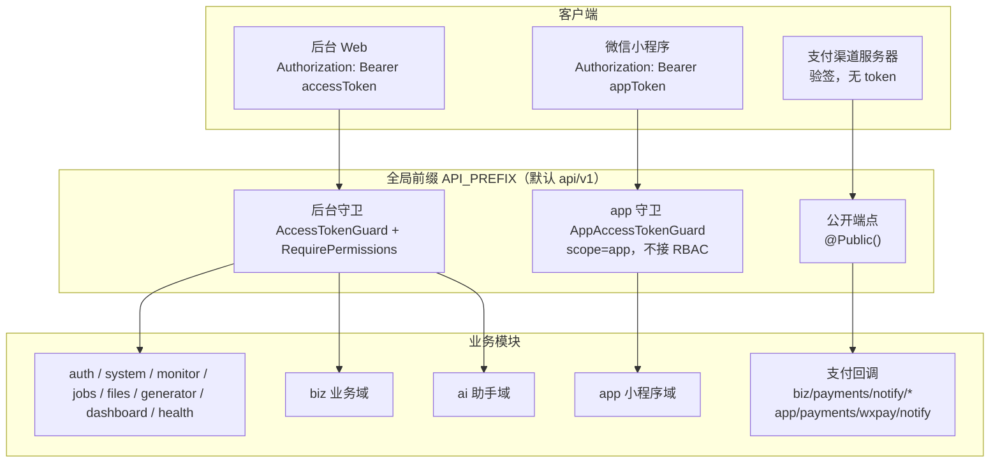

# 接口契约索引

本页是**全量接口契约清单**，按模块分组，可与源码逐条对照。

- **唯一权威来源**：`src/modules/**/*.controller.ts` 与 `src/ai/gateway/ai.gateway.controller.ts` 上的 `@Controller` / `@Get` / `@Post` / `@Put` / `@Patch` / `@Delete` 装饰器。
- 路径列写的是**去掉全局前缀后的相对路径**；实际调用时前面要拼 `API_PREFIX`。本页每张表的路径都按「全局前缀 + Controller 前缀 + 方法路径」组合后的**完整路径**给出。
- 权限点列写的是 `@RequirePermissions(...)` 的字面值；标记 `—` 表示该方法**没有权限点校验**（可能是公开端点、后台任意登录用户可用，或 app 域自有鉴权）。

::: warning 不要用早期设计稿当契约
`project-design/superpowers/specs/2026-09-11-nail-salon-booking-design.md`（v1.3）是**早期设计意图**，其中部分接口路径、字段名、「本期不实现」的判定**已经和代码不一致**。接口契约**一律以 `src/` 源码为准**，两者的逐条差异见文末「契约差异备忘」。设计意图与取舍可参考 [后端分层与请求链路](/backend/)。
:::

## 一、通用约定

### 1.1 全局前缀与 Swagger

| 项                  | 真实值                                                                                      | 代码位置                                                                                                         |
| ------------------- | ------------------------------------------------------------------------------------------- | ---------------------------------------------------------------------------------------------------------------- |
| 全局前缀            | `API_PREFIX`，默认 `api/v1`                                                                 | `src/config/app-config.service.ts`（zod 默认值）、`src/main.ts` 的 `app.setGlobalPrefix(config.apiPrefix)`       |
| Swagger 开关        | `SWAGGER_ENABLED`，默认 `true`                                                              | `src/config/app-config.service.ts`                                                                               |
| Swagger 路径        | `SWAGGER_PATH`，默认 `docs` → 实际可访问 **`/api/v1/docs`**                                 | `src/main.ts`：`SwaggerModule.setup(config.swagger.SWAGGER_PATH, ...)`，日志打印 `/${apiPrefix}/${SWAGGER_PATH}` |
| Swagger 标题 / 版本 | `SWAGGER_TITLE`（默认「美甲店管理系统 API」）/ `SWAGGER_VERSION`（默认 `0.1.0`）            | `src/config/app-config.service.ts`                                                                               |
| 监听                | `PORT`（默认 `3000`，`0.0.0.0`）                                                            | `src/main.ts`                                                                                                    |
| CORS                | `CORS_ORIGINS`（逗号分隔，默认 `http://localhost:5173`），`credentials: true`               | `src/config/app-config.service.ts`                                                                               |
| 限流                | 全局 `@fastify/rate-limit`：`max: 100` / `timeWindow: '1 minute'`                           | `src/main.ts`                                                                                                    |
| 请求体上传          | `@fastify/multipart`：`files: 1`、`fileSize: 10 * 1024 * 1024`（10 MB）                     | `src/main.ts`                                                                                                    |
| 原始报文            | Fastify `rawBody: true` —— **支付回调验签依赖它**，不要用 `JSON.stringify(body)` 重算签名串 | `src/main.ts`                                                                                                    |

所以一条真实请求是：`{BASE}/api/v1/{controller 前缀}/{方法路径}`，例如 `POST {BASE}/api/v1/biz/bookings`。

### 1.2 认证方式

| 域                   | 请求头                                   | 签发方                        | 校验方                                              | 能否互打                     |
| -------------------- | ---------------------------------------- | ----------------------------- | --------------------------------------------------- | ---------------------------- |
| **后台 admin 域**    | `Authorization: Bearer <accessToken>`    | `POST /api/v1/auth/login`     | 全局 `AccessTokenGuard`（`src/app.module.ts` 注册） | app token 打 `biz/**` → 401  |
| **小程序 app 域**    | `Authorization: Bearer <appAccessToken>` | `POST /api/v1/app/auth/login` | `AppAccessTokenGuard`（路由级）                     | 后台 token 打 `app/**` → 401 |
| **渠道回调（公开）** | 无 `Authorization`；靠**渠道验签**       | —                             | 各回调 handler 自行验签                             | 不适用                       |

双向拒绝的实现方式（`src/modules/app/auth/app-access-token.guard.ts`）：

- 两个守卫**共用**同一套 `JWT_ACCESS_SECRET` / `issuer` / `audience`，靠 payload 形态区分：
  - 后台 token payload 含 `username`、`roles`、`permissions`，**不含** `scope`；
  - app token payload 含 `scope: 'app'` 与 `openid`，**故意不含** `username`。
- `AppAccessTokenGuard` 要求 `payload.scope === 'app'`；`AccessTokenGuard` 要求 `payload.username` 是字符串。因此两边天然互斥，**不需要改守卫代码**。
- app 域的 Controller 都标了 `@Public()` 用来**跳过全局后台守卫**，再由 `AppAccessTokenGuard` 做真正的鉴权。
- **app 域不接 RBAC**：没有权限点、没有角色，所有查询强制 `customer_id = 当前绑定顾客`（「本人数据」）。

**超级管理员是 `*:*:*` 三段通配符，不是 `*`**：`src/common/auth/access-token.guard.ts`、`src/common/data-scope/data-scope.ts`、`auth.service.ts`、`web/src/store/user.ts`、AI 的 `permissions.service.ts` / `tool.registry.ts` 全部按字面量 `*:*:*` 判断；`auth.service.ts` 对 `isSystem === true` 或 `key === 'admin'` 的角色直接下发 `['*:*:*']`。

::: warning 权限不足返回的是 401，不是 403
`AccessTokenGuard` 在权限点不匹配时抛的是 `UnauthorizedException('权限不足')` —— 经全局异常过滤器原样透传后就是 **`401`**。`403` 只出现在 **Service 层**主动抛 `ForbiddenException` 的场景（例如数据权限范围外的单据、`biz:booking:adjust` 改价权限缺失）。

前端拦截器若按「401 → 跳登录页」处理，会把「权限不足」误判成「登录失效」。判断权限问题请结合响应体 `message`，不要只看状态码。
:::

### 1.3 分页约定

统一由 `src/modules/biz/common/query.ts` 的 `parsePagination()` 实现：

| 项                   | 约定                                                                                                                 |
| -------------------- | -------------------------------------------------------------------------------------------------------------------- |
| 请求参数             | `page`（从 1 开始，默认 1）、`pageSize`（默认 `DEFAULT_PAGE_SIZE = 20`，上限 `MAX_PAGE_SIZE = 100`，超出被夹到 100） |
| 响应结构             | `{ items: T[], page: number, pageSize: number }`                                                                     |
| **`total`**          | **没有 `total` 字段**（这是刻意的设计，避免大表 `COUNT(*)`）                                                         |
| 前端判是否还有下一页 | **多取一条**：请求 `pageSize + 1`，返回数组长度 `> pageSize` 即 `hasMore = true`，展示时 `slice(0, pageSize)`        |
| 前端估算 total       | 仅用于分页器展示：`hasMore ? page * pageSize + 1 : (page - 1) * pageSize + items.length`                             |

`web/src/composables/useTable.ts` 就是按上面的口径实现的 —— 自己写列表页时不要另起一套。

### 1.4 查询参数通用约定

| 约定            | 说明                                                                                                                                           |
| --------------- | ---------------------------------------------------------------------------------------------------------------------------------------------- |
| 关键字          | 参数名 `keyword`，服务端做 `%kw%` 模糊匹配（`keywordLike()`）；空串/纯空格视为**没有筛选**                                                     |
| 日期区间        | `dateFrom` / `dateTo`，值都是**店内本地日** `YYYY-MM-DD`，**两端都含**。实现上右边界取 `dateTo + 1 天` 的 `00:00`（`localDateRange()`）        |
| 单日筛选        | `date`（`biz/bookings` 用），同样是店内本地日                                                                                                  |
| 日期时间字段    | 传**带偏移的 ISO 8601**（如 `2026-09-11T10:00:00+08:00`）；预约创建/改期的 `startAt` 用正则强制以 `Z` 或 `±HH:MM` 结尾                         |
| 空字符串        | 前端清空下拉框常发 `''`；服务端多处用 `z.preprocess` 把 `''`/`null` 统一当「不筛选」                                                           |
| 枚举筛选        | 传字面量枚举值；不传即不筛选                                                                                                                   |
| 数组参数        | 有逗号分隔（`serviceItemIds=1,2`）与重复传参（`serviceItemIds=1&serviceItemIds=2`）两种写法，`biz/bookings/available-slots` 两种都支持并会去重 |
| `pageSize` 上限 | 100（超限被夹紧，不报错）                                                                                                                      |

### 1.5 错误响应结构

由 `src/common/filters/global-exception.filter.ts` 的全局 `@Catch()` 过滤器统一产出。四种形态：

| 场景                                                                         | HTTP     | 响应体                                                                                                                                                             |
| ---------------------------------------------------------------------------- | -------- | ------------------------------------------------------------------------------------------------------------------------------------------------------------------ |
| zod 入参校验失败（`ZodError`）                                               | `400`    | `{ statusCode: 400, message: string[], error: 'Bad Request' }` —— `message` 是 `「中文字段名：原因」` 的**数组**，全站已启用 zod 中文 locale（`z.config(zhCN())`） |
| 业务异常（`HttpException`）                                                  | 原状态码 | 透传 NestJS 原始结构；字符串响应被包装成 `{ statusCode, message }`                                                                                                 |
| Fastify 插件的 4xx（限流 429、请求体过大 413 等**普通 Error + statusCode**） | 原状态码 | `{ statusCode, message, error }`，429 的 `message` 固定为 `请求过于频繁，请稍后再试`                                                                               |
| 未知异常                                                                     | `500`    | `{ statusCode: 500, message: '服务器内部错误，请稍后重试', error: 'Internal Server Error' }`                                                                       |

**共同点：所有异常响应都会额外带上 `requestId`**（客户端若带 `request-id` 请求头则原样回填，否则由 Fastify 生成）。排障时「用户报的号」与「日志里的号」是同一个。

::: warning 5xx 一律兜底
Fastify 插件给的 `statusCode` 只有 **4xx** 会被透传；`5xx` 仍按未知异常处理，返回 `500` + 通用中文提示 —— 不让第三方插件的状态码决定成功/失败语义。
:::

### 1.6 金额与时间字段约定

| 项             | 约定                                                                                                                                                                                                                               |
| -------------- | ---------------------------------------------------------------------------------------------------------------------------------------------------------------------------------------------------------------------------------- |
| 金额单位       | **整数「分」**。字段名普遍以 `Amount` / `amount` 结尾（`amount`、`paidAmount`、`dueAmount`、`refundAmount`、`receivedAmount`、`adjustAmount`、`fixedAmount`、`actualAmount`）。**不要传小数元**，schema 用 `z.number().int()` 校验 |
| 比例 / 折扣    | **千分比整数**（`permille`）。`100` = 10%；会员等级折扣率、提成比例都是千分比                                                                                                                                                      |
| 时间字段       | **UTC ISO 8601 字符串**。`datetime` 列由 Drizzle 以 UTC 存取                                                                                                                                                                       |
| 「店内本地日」 | `YYYY-MM-DD`，按 `DEFAULT_SHOP_TIMEZONE` 切分（`src/modules/biz/common/shop-time.ts`）；报表营业日、排班、账龄、对账日期都用这个口径                                                                                               |
| 时段时刻       | `HH:MM` 或 `HH:MM:SS`（排班/周期预约的 `startTime`/`endTime`）                                                                                                                                                                     |
| 星期           | **ISO 8601**：`1` = 周一 … `7` = 周日（排班 `weekday`、周期预约 `weekday`）                                                                                                                                                        |
| 结算期间       | `period` = `yyyyMM`，如 `202609`                                                                                                                                                                                                   |

### 1.7 状态枚举（与 `src/database/schema/index.ts` 对齐）

| 实体 / 字段                   | 取值                                                                                                                        |
| ----------------------------- | --------------------------------------------------------------------------------------------------------------------------- |
| 预约 `biz_booking.status`     | `pending` / `confirmed` / `arrived` / `completed` / `cancelled` / `no_show`                                                 |
| 预约 `pay_status`             | `unpaid` / `partial` / `paid` / `refunded` / `credit`                                                                       |
| 预约 `channel`                | `admin` / `miniapp`                                                                                                         |
| 支付单 `biz_payment.purpose`  | `deposit` / `final` / `recharge` / `card_buy` / `credit_settle`                                                             |
| 支付单 `channel`              | `wxpay_native` / `alipay_qr` / `wxpay_jsapi` / `cash` / `wechat_offline` / `alipay_offline` / `balance` / `card` / `credit` |
| 支付单 `status`               | `pending` / `success` / `failed` / `closed` / `refunded` / `partial_refunded`                                               |
| 退款单 `status`               | `pending` / `approved` / `rejected` / `success` / `failed`                                                                  |
| 退款单 `mode`                 | `original`（原路） / `cash`（现金） / `balance`（退入储值）                                                                 |
| 退款单 `liable`               | `store` / `customer` / `force_majeure`                                                                                      |
| 次卡 `biz_member_card.status` | `active` / `used_up` / `expired` / `refunded`                                                                               |
| 应收单 `status`               | `open` / `partial` / `settled` / `overdue` / `cancelled`                                                                    |
| 挂账主体 `type`               | `customer` / `company` / `staff`                                                                                            |
| 提成记录 `status`             | `accrued` / `settled` / `reversed`                                                                                          |
| 提成规则 `scope`              | `staff` / `category` / `service_item`（优先级 `service_item` > `category` > `staff`）                                       |
| 周期预约 `status`             | `active` / `paused` / `stopped`                                                                                             |
| 通知日志 `status`             | `pending` / `success` / `failed` / `skipped`                                                                                |
| 评价 `status`                 | `published` / `hidden`                                                                                                      |
| 对账差异 `status`             | `pending` / `resolved` / `ignored`                                                                                          |
| 通用启用状态                  | `active` / `disabled`                                                                                                       |

::: warning 一处「代码与校验器不一致」的枚举
`biz_payment.channel` 的**数据库枚举**包含 `wxpay_jsapi`，但 `payments.controller.ts` 里 zod 的 `CHANNELS` 常量**不含**它。也就是说后台不可能通过 `POST /biz/payments` 主动建 `wxpay_jsapi` 单 —— 该值只为小程序 JSAPI 预支付单预留。
:::

### 1.8 分层示意

## 二、全量接口清单

> 下表路径均为**完整路径**（已含 `/api/v1`）。`权限点` 为 `—` 时见该表下方的说明。
>
> **统计口径**：全仓库 `*.controller.ts` 共 53 个文件、**298** 个路由装饰器方法。其中 `src/modules/generated/test/` 下 5 个路由是**代码生成器的示例产物**（`@Controller('sys_user')`），该 `user.module.ts` **没有被 `AppModule` 导入**，因此不会注册进路由表，本清单不收录。故本清单收录**真实可访问路由 293 个**。

::: tip 代码生成器会产出「未挂载」的 Controller
`POST /api/v1/generator/generate` 生成的示例模块放在 `src/modules/generated/{表名}/`，**不会自动加进 `src/app.module.ts`**。看到 `generated/` 下的新 Controller 时，先确认它是否已被导入，再去判定它的接口算不算契约的一部分。
:::

### 2.1 认证与账号（`src/modules/auth/auth.controller.ts`）

| 方法  | 路径                    | 权限点 | 说明                                                             | 备注                                         |
| ----- | ----------------------- | ------ | ---------------------------------------------------------------- | -------------------------------------------- |
| POST  | `/api/v1/auth/login`    | —      | 用户登录                                                         | **公开**；`@HttpCode(200)`；写登录日志       |
| POST  | `/api/v1/auth/register` | —      | 用户注册                                                         | **公开**；`@HttpCode(200)`                   |
| POST  | `/api/v1/auth/refresh`  | —      | 用 refreshToken 换新令牌                                         | **公开**；`@HttpCode(200)`                   |
| POST  | `/api/v1/auth/logout`   | —      | 退出登录（吊销当前会话）                                         | `@HttpCode(200)`                             |
| GET   | `/api/v1/auth/profile`  | —      | 获取当前用户资料                                                 | 需登录，不需权限点                           |
| PATCH | `/api/v1/auth/profile`  | —      | 更新当前用户资料（`displayName` / `email` / `phone` / `avatar`） | `avatar` 必须是站内相对路径或 `http(s)` 链接 |
| PATCH | `/api/v1/auth/password` | —      | 修改当前用户密码                                                 | body：`oldPassword`、`newPassword`（≥8 位）  |

登录请求 schema（`LoginRequest`）：`username`（1~~64）、`password`（8~~128）。
注册请求 schema（`RegisterRequest`）：`username`（3~~64）、`displayName`（1~~64）、`password`（≥8）、`email?`、`phone?`。

### 2.2 系统管理 —— 用户

`src/modules/system/users/users.controller.ts`，Controller 前缀 `system/users`。

| 方法   | 路径                       | 权限点               | 说明         | 备注                           |
| ------ | -------------------------- | -------------------- | ------------ | ------------------------------ |
| GET    | `/api/v1/system/users`     | `system:user:list`   | 获取用户列表 | 分页；无 `total`               |
| POST   | `/api/v1/system/users`     | `system:user:create` | 新增用户     | `roleIds` 最多 100 个          |
| PATCH  | `/api/v1/system/users/:id` | `system:user:update` | 修改用户     | 可改密码（≥12 位）、状态、角色 |
| DELETE | `/api/v1/system/users/:id` | `system:user:delete` | 删除用户     | 软删                           |

### 2.3 系统管理 —— 角色

`src/modules/system/roles/roles.controller.ts`，前缀 `system/roles`。

| 方法   | 路径                             | 权限点               | 说明                               | 备注                     |
| ------ | -------------------------------- | -------------------- | ---------------------------------- | ------------------------ |
| GET    | `/api/v1/system/roles`           | `system:role:list`   | 获取角色列表                       | 分页                     |
| POST   | `/api/v1/system/roles`           | `system:role:create` | 新增角色                           |                          |
| PATCH  | `/api/v1/system/roles/:id`       | `system:role:update` | 修改角色（含数据权限 `dataScope`） |                          |
| POST   | `/api/v1/system/roles/:id/menus` | `system:role:update` | **设置角色菜单权限**               | 整体替换 `sys_role_menu` |
| DELETE | `/api/v1/system/roles/:id`       | `system:role:delete` | 删除角色                           |                          |

### 2.4 系统管理 —— 菜单

`src/modules/system/menus/menus.controller.ts`，前缀 `system/menus`。

| 方法   | 路径                          | 权限点               | 说明                     | 备注                                                       |
| ------ | ----------------------------- | -------------------- | ------------------------ | ---------------------------------------------------------- |
| GET    | `/api/v1/system/menus`        | `system:menu:list`   | 获取菜单树               |                                                            |
| GET    | `/api/v1/system/menus/routes` | —                    | **获取当前用户动态路由** | 无权限点：返回值按当前用户已授权菜单生成，是前端路由的来源 |
| GET    | `/api/v1/system/menus/:id`    | `system:menu:list`   | 获取菜单详情             |                                                            |
| POST   | `/api/v1/system/menus`        | `system:menu:create` | 新增菜单                 |                                                            |
| PATCH  | `/api/v1/system/menus/:id`    | `system:menu:update` | 修改菜单                 |                                                            |
| DELETE | `/api/v1/system/menus/:id`    | `system:menu:delete` | 删除菜单                 |                                                            |

权限点与菜单的完整对应关系见[权限点与菜单清单](/appendix/permissions)。

### 2.5 系统管理 —— 部门 / 岗位 / 字典 / 参数

| 模块     | 方法   | 路径                                  | 权限点                 | 说明                                     |
| -------- | ------ | ------------------------------------- | ---------------------- | ---------------------------------------- |
| 部门     | GET    | `/api/v1/system/depts`                | `system:dept:list`     | 获取部门树                               |
| 部门     | GET    | `/api/v1/system/depts/:id`            | `system:dept:list`     | 获取部门详情                             |
| 部门     | POST   | `/api/v1/system/depts`                | `system:dept:create`   | 新增部门                                 |
| 部门     | PATCH  | `/api/v1/system/depts/:id`            | `system:dept:update`   | 修改部门                                 |
| 部门     | DELETE | `/api/v1/system/depts/:id`            | `system:dept:delete`   | 删除部门                                 |
| 岗位     | GET    | `/api/v1/system/posts`                | `system:post:list`     | 获取岗位列表                             |
| 岗位     | GET    | `/api/v1/system/posts/:id`            | `system:post:list`     | 获取岗位详情                             |
| 岗位     | POST   | `/api/v1/system/posts`                | `system:post:create`   | 新增岗位                                 |
| 岗位     | PATCH  | `/api/v1/system/posts/:id`            | `system:post:update`   | 修改岗位                                 |
| 岗位     | DELETE | `/api/v1/system/posts/:id`            | `system:post:delete`   | 删除岗位                                 |
| 字典类型 | GET    | `/api/v1/system/dict-types`           | `system:dict:list`     | 获取字典类型列表                         |
| 字典类型 | GET    | `/api/v1/system/dict-types/:id`       | `system:dict:list`     | 获取字典类型详情                         |
| 字典类型 | POST   | `/api/v1/system/dict-types`           | `system:dict:create`   | 新增字典类型                             |
| 字典类型 | PATCH  | `/api/v1/system/dict-types/:id`       | `system:dict:update`   | 修改字典类型                             |
| 字典类型 | DELETE | `/api/v1/system/dict-types/:id`       | `system:dict:delete`   | 删除字典类型                             |
| 字典数据 | GET    | `/api/v1/system/dict-data`            | `system:dict:list`     | 获取字典数据列表                         |
| 字典数据 | GET    | `/api/v1/system/dict-data/type/:type` | `system:dict:list`     | **按类型取字典数据**（前端下拉框最常用） |
| 字典数据 | GET    | `/api/v1/system/dict-data/:id`        | `system:dict:list`     | 获取字典数据详情                         |
| 字典数据 | POST   | `/api/v1/system/dict-data`            | `system:dict:create`   | 新增字典数据                             |
| 字典数据 | PATCH  | `/api/v1/system/dict-data/:id`        | `system:dict:update`   | 修改字典数据                             |
| 字典数据 | DELETE | `/api/v1/system/dict-data/:id`        | `system:dict:delete`   | 删除字典数据                             |
| 参数配置 | GET    | `/api/v1/system/configs`              | `system:config:list`   | 获取参数列表                             |
| 参数配置 | GET    | `/api/v1/system/configs/key/:key`     | `system:config:list`   | **按键查参数**（业务参数读取入口）       |
| 参数配置 | GET    | `/api/v1/system/configs/:id`          | `system:config:list`   | 获取参数详情                             |
| 参数配置 | POST   | `/api/v1/system/configs`              | `system:config:create` | 新增参数                                 |
| 参数配置 | PATCH  | `/api/v1/system/configs/:id`          | `system:config:update` | 修改参数                                 |
| 参数配置 | DELETE | `/api/v1/system/configs/:id`          | `system:config:delete` | 删除参数                                 |

::: tip 路由顺序陷阱
`system/configs/key/:key` 与 `system/dict-data/type/:type` 这类**静态段路由**必须声明在 `:id` 之前，否则会被 `:id` 吞掉。`biz/receivables/summary` 的源码里就留了这条注释。新增接口时注意顺序。
:::

### 2.6 监控与运维

| 模块       | 方法   | 路径                                      | 权限点                      | 说明                                                    |
| ---------- | ------ | ----------------------------------------- | --------------------------- | ------------------------------------------------------- |
| 登录日志   | GET    | `/api/v1/monitor/login-logs`              | `monitor:loginlog:list`     | 登录日志列表                                            |
| 登录日志   | GET    | `/api/v1/monitor/login-logs/:id`          | `monitor:loginlog:list`     | 登录日志详情                                            |
| 登录日志   | DELETE | `/api/v1/monitor/login-logs/:id`          | `monitor:loginlog:delete`   | 删除指定登录日志                                        |
| 登录日志   | DELETE | `/api/v1/monitor/login-logs`              | `monitor:loginlog:delete`   | **清空所有登录日志**                                    |
| 操作日志   | GET    | `/api/v1/monitor/operation-logs`          | `monitor:operlog:list`      | 操作日志列表                                            |
| 操作日志   | GET    | `/api/v1/monitor/operation-logs/:id`      | `monitor:operlog:list`      | 操作日志详情                                            |
| 操作日志   | DELETE | `/api/v1/monitor/operation-logs/:id`      | `monitor:operlog:delete`    | 删除指定操作日志                                        |
| 操作日志   | DELETE | `/api/v1/monitor/operation-logs`          | `monitor:operlog:delete`    | **清空所有操作日志**                                    |
| 在线用户   | GET    | `/api/v1/monitor/online`                  | `monitor:online:list`       | 在线用户列表                                            |
| 在线用户   | DELETE | `/api/v1/monitor/online/:userId`          | `monitor:online:delete`     | **强制下线**                                            |
| 缓存监控   | GET    | `/api/v1/monitor/cache`                   | `monitor:cache:list`        | Redis 缓存信息（Redis 不可用时降级）                    |
| 定时任务   | GET    | `/api/v1/system/jobs`                     | `system:job:list`           | 任务列表                                                |
| 定时任务   | GET    | `/api/v1/system/jobs/:id`                 | `system:job:list`           | 任务详情                                                |
| 定时任务   | GET    | `/api/v1/system/jobs/:id/logs`            | `system:job:list`           | 任务执行日志                                            |
| 定时任务   | POST   | `/api/v1/system/jobs`                     | `system:job:create`         | 新增任务                                                |
| 定时任务   | POST   | `/api/v1/system/jobs/:id/run`             | `system:job:run`            | **手动执行任务**（幂等由任务自身保证）                  |
| 定时任务   | PATCH  | `/api/v1/system/jobs/:id`                 | `system:job:update`         | 修改任务                                                |
| 定时任务   | DELETE | `/api/v1/system/jobs`                     | `system:job:delete`         | **清空任务日志**                                        |
| 定时任务   | DELETE | `/api/v1/system/jobs/:id`                 | `system:job:delete`         | 删除任务                                                |
| 文件       | POST   | `/api/v1/files/upload`                    | —                           | 上传文件（multipart，单文件 ≤10 MB）                    |
| 文件       | GET    | `/api/v1/files`                           | `system:file:list`          | 文件列表                                                |
| 文件       | GET    | `/api/v1/files/:id/download`              | —                           | **下载文件**；`@Public()`，公开可下载（头像等静态引用） |
| 文件       | GET    | `/api/v1/files/:id`                       | `system:file:list`          | 文件详情                                                |
| 文件       | DELETE | `/api/v1/files/:id`                       | `system:file:delete`        | 删除文件                                                |
| 代码生成器 | GET    | `/api/v1/generator/tables`                | `system:generator:list`     | 数据库表列表                                            |
| 代码生成器 | GET    | `/api/v1/generator/tables/:table/columns` | `system:generator:list`     | 表字段信息                                              |
| 代码生成器 | POST   | `/api/v1/generator/preview`               | `system:generator:list`     | 预览生成代码                                            |
| 代码生成器 | POST   | `/api/v1/generator/generate`              | `system:generator:generate` | 生成代码文件（写盘）                                    |

`files/upload` 没有权限点，任何已登录后台账号都能上传；**下载是 `@Public()`** —— 分享头像/图片 URL 时要知道这一点。

### 2.7 仪表盘与健康检查

| 模块     | 方法 | 路径                      | 权限点             | 说明                                      |
| -------- | ---- | ------------------------- | ------------------ | ----------------------------------------- |
| 仪表盘   | GET  | `/api/v1/dashboard/users` | `system:user:list` | 用户统计（总数 / 启用 / 禁用 / 今日新增） |
| 仪表盘   | GET  | `/api/v1/dashboard/depts` | `system:dept:list` | 部门统计                                  |
| 仪表盘   | GET  | `/api/v1/dashboard/roles` | `system:role:list` | 角色统计                                  |
| 仪表盘   | GET  | `/api/v1/dashboard/menus` | `system:menu:list` | 菜单统计（总数 / 目录 / 菜单 / 按钮）     |
| 仪表盘   | GET  | `/api/v1/dashboard/posts` | `system:post:list` | 岗位统计                                  |
| 健康检查 | GET  | `/api/v1/health`          | —                  | **`@Public()` 健康检查**，用作探针        |

仪表盘有意思的地方：**每个统计接口复用它对应资源的 `list` 权限点**，不额外定义 `dashboard:*` 权限点。

### 2.8 业务·基础数据

| 模块     | 方法   | 路径                                           | 权限点                   | 说明                              | 备注                                           |
| -------- | ------ | ---------------------------------------------- | ------------------------ | --------------------------------- | ---------------------------------------------- |
| 服务项目 | GET    | `/api/v1/biz/service-items`                    | `biz:serviceitem:list`   | 服务项目列表                      | 分页                                           |
| 服务项目 | GET    | `/api/v1/biz/service-items/:id`                | `biz:serviceitem:list`   | 服务项目详情                      |                                                |
| 服务项目 | POST   | `/api/v1/biz/service-items`                    | `biz:serviceitem:create` | 新增服务项目                      |                                                |
| 服务项目 | PATCH  | `/api/v1/biz/service-items/:id`                | `biz:serviceitem:update` | 修改服务项目                      |                                                |
| 服务项目 | DELETE | `/api/v1/biz/service-items/:id`                | `biz:serviceitem:delete` | 删除服务项目                      | 被未完成预约引用 → `409`                       |
| 美甲师   | GET    | `/api/v1/biz/staffs`                           | `biz:staff:list`         | 美甲师列表                        | 分页                                           |
| 美甲师   | GET    | `/api/v1/biz/staffs/:id`                       | `biz:staff:list`         | 美甲师详情                        |                                                |
| 美甲师   | GET    | `/api/v1/biz/staffs/:id/service-items`         | `biz:staff:list`         | 美甲师可做项目                    | **空数组 = 可做全部**                          |
| 美甲师   | PUT    | `/api/v1/biz/staffs/:id/service-items`         | `biz:staff:items`        | **整体替换**可做项目              | 空数组 = 可做全部；幂等                        |
| 美甲师   | POST   | `/api/v1/biz/staffs`                           | `biz:staff:create`       | 新增美甲师                        |                                                |
| 美甲师   | PATCH  | `/api/v1/biz/staffs/:id`                       | `biz:staff:update`       | 修改美甲师                        |                                                |
| 美甲师   | DELETE | `/api/v1/biz/staffs/:id`                       | `biz:staff:delete`       | 删除美甲师                        | 存在未完成预约 → `409`                         |
| 排班     | GET    | `/api/v1/biz/staffs/:id/weekly-shifts`         | `biz:schedule:list`      | 周模板班次（7 天全部段）          | 与美甲师共用前缀                               |
| 排班     | PUT    | `/api/v1/biz/staffs/:id/weekly-shifts`         | `biz:schedule:update`    | **整体替换周模板**                | 事务内先删后插；越界预约 → `409` + `conflicts` |
| 排班     | GET    | `/api/v1/biz/staffs/:id/overrides`             | `biz:schedule:list`      | 日期例外列表                      |                                                |
| 排班     | POST   | `/api/v1/biz/staffs/:id/overrides`             | `biz:schedule:update`    | 新增日期例外（请假 / 自定义时段） | `force` 可强制落库                             |
| 排班     | DELETE | `/api/v1/biz/staffs/:id/overrides/:overrideId` | `biz:schedule:update`    | 删除日期例外                      |                                                |
| 顾客     | GET    | `/api/v1/biz/customers`                        | `biz:customer:list`      | 顾客列表                          | 分页                                           |
| 顾客     | GET    | `/api/v1/biz/customers/:id`                    | `biz:customer:list`      | 顾客详情                          |                                                |
| 顾客     | GET    | `/api/v1/biz/customers/:id/bookings`           | `biz:customer:list`      | 顾客历史预约                      | 分页                                           |
| 顾客     | POST   | `/api/v1/biz/customers`                        | `biz:customer:create`    | 新增顾客                          | 手机号重复 → `409`                             |
| 顾客     | PATCH  | `/api/v1/biz/customers/:id`                    | `biz:customer:update`    | 修改顾客                          |                                                |
| 顾客     | POST   | `/api/v1/biz/customers/:id/recount`            | `biz:customer:update`    | 重算到店次数 / 最近到店时间       | **幂等**，对账修复                             |
| 顾客     | POST   | `/api/v1/biz/customers/:id/restore`            | `biz:customer:update`    | 恢复已删除顾客                    | **幂等**                                       |
| 顾客     | DELETE | `/api/v1/biz/customers/:id`                    | `biz:customer:delete`    | 删除顾客                          | 存在预约记录 → `409`                           |

### 2.9 业务·预约

| 方法   | 路径                                               | 权限点                                    | 说明                                       | 备注                                                                                                                                                                                                           |
| ------ | -------------------------------------------------- | ----------------------------------------- | ------------------------------------------ | -------------------------------------------------------------------------------------------------------------------------------------------------------------------------------------------------------------- |
| GET    | `/api/v1/biz/bookings/available-slots`             | `biz:booking:list`                        | 查询可约时段（店内本地日）                 | `staffId` + `date` + `serviceItemIds` 必填；`channel=admin\|miniapp`                                                                                                                                           |
| GET    | `/api/v1/biz/bookings`                             | `biz:booking:list`                        | 预约列表                                   | **无 `total`**，前端多取一条判 `hasMore`；筛选项 `status` / `payStatus` / `staffId` / `customerId` / `date` / `keyword` / `collectable`（收银台队列专用：`collectable=true` 排掉已取消与爽约，预约列表不要传） |
| GET    | `/api/v1/biz/bookings/customers/:customerId/brief` | `biz:booking:list`                        | 顾客账务摘要（折扣 / 余额）                | 创建弹窗用                                                                                                                                                                                                     |
| GET    | `/api/v1/biz/bookings/:id`                         | `biz:booking:list`                        | 预约详情（含项目明细与支付单）             |                                                                                                                                                                                                                |
| POST   | `/api/v1/biz/bookings`                             | `biz:booking:create`                      | **创建预约**（建单 + 收定金/全款，同事务） | 时段被占 / 顾客同时段已有单 → `409`                                                                                                                                                                            |
| PATCH  | `/api/v1/biz/bookings/:id`                         | `biz:booking:update`                      | **改期 / 改美甲师 / 改项目**               | 锁 + 复检                                                                                                                                                                                                      |
| POST   | `/api/v1/biz/bookings/:id/confirm`                 | `biz:booking:update`                      | 确认预约（`pending` → `confirmed`）        | 幂等：已是 `confirmed` → `changed: false`                                                                                                                                                                      |
| POST   | `/api/v1/biz/bookings/:id/arrive`                  | `biz:booking:arrive`                      | 顾客到店（`confirmed` → `arrived`）        | 幂等                                                                                                                                                                                                           |
| POST   | `/api/v1/biz/bookings/:id/complete`                | `biz:booking:complete`                    | 服务完成（`arrived` → `completed`）        | 累加到店统计 + 计提提成；幂等                                                                                                                                                                                  |
| POST   | `/api/v1/biz/bookings/:id/settle`                  | `biz:payment:create`                      | **结算尾款 / 挂账 / 补收**                 | 支持混合支付；权限点是支付类而非预约类                                                                                                                                                                         |
| POST   | `/api/v1/biz/bookings/:id/no-show`                 | `biz:booking:noshow`                      | 标记爽约（`confirmed` → `no_show`）        | `reason` 必填                                                                                                                                                                                                  |
| POST   | `/api/v1/biz/bookings/:id/cancel`                  | `biz:booking:cancel`                      | **取消预约**                               | 有实收时提示走退款流程；`reason` 必填                                                                                                                                                                          |
| GET    | `/api/v1/biz/bookings/:id/refund-preview`          | `biz:refund:apply`                        | 退款阶段试算                               | 只读                                                                                                                                                                                                           |
| POST   | `/api/v1/biz/bookings/:id/refund`                  | `biz:refund:apply` / `biz:refund:approve` | 发起退款（**建单即执行**）                 | 服务中需店长，金额必填                                                                                                                                                                                         |
| POST   | `/api/v1/biz/bookings/:id/recount`                 | `biz:booking:update`                      | 对账修复：重算时长 / 结束时间与资金字段    | **幂等**                                                                                                                                                                                                       |
| DELETE | `/api/v1/biz/bookings/:id`                         | `biz:booking:delete`                      | 软删（仅误录清理）                         | 有实收时拒绝，须先退款                                                                                                                                                                                         |

**周期预约**（`src/modules/biz/operations/recurrences/recurrences.controller.ts`，前缀 `biz/recurrences`）：

| 方法   | 路径                                        | 权限点                  | 说明                                         | 备注                                         |
| ------ | ------------------------------------------- | ----------------------- | -------------------------------------------- | -------------------------------------------- |
| GET    | `/api/v1/biz/recurrences`                   | `biz:recurrence:list`   | 周期规则列表                                 | 含 `generatedUntil` 与下次生成日             |
| POST   | `/api/v1/biz/recurrences`                   | `biz:recurrence:create` | **创建规则并立即生成第一个窗口**             | 返回 `{ id, generated, skipped, conflicts }` |
| GET    | `/api/v1/biz/recurrences/:id/bookings`      | `biz:recurrence:list`   | 该规则已生成的预约                           | 分页                                         |
| PATCH  | `/api/v1/biz/recurrences/:id`               | `biz:recurrence:update` | 改规则（**只影响未来生成，不回溯已生成单**） |                                              |
| POST   | `/api/v1/biz/recurrences/:id/pause`         | `biz:recurrence:update` | 暂停生成                                     | 已生成的单不受影响                           |
| POST   | `/api/v1/biz/recurrences/:id/resume`        | `biz:recurrence:update` | 恢复生成                                     |                                              |
| POST   | `/api/v1/biz/recurrences/:id/stop`          | `biz:recurrence:update` | 停止生成（终态）                             |                                              |
| POST   | `/api/v1/biz/recurrences/:id/revoke-window` | `biz:recurrence:update` | 撤销本窗口生成的单                           | 仅限**未被收款**的单                         |
| DELETE | `/api/v1/biz/recurrences/:id`               | `biz:recurrence:delete` | 删除规则                                     |                                              |

**美甲师工作台授权**（`src/modules/app/staff/app-staff-grants.controller.ts`，但注意它挂在**后台**前缀下）：

| 方法 | 路径                                       | 权限点            | 说明                             | 备注                   |
| ---- | ------------------------------------------ | ----------------- | -------------------------------- | ---------------------- |
| GET  | `/api/v1/biz/app-staff-grants`             | `biz:staff:grant` | 工作台开通申请列表               | 页面级一个权限点管整页 |
| POST | `/api/v1/biz/app-staff-grants/:id/approve` | `biz:staff:grant` | 通过申请（`pending` → `active`） |                        |
| POST | `/api/v1/biz/app-staff-grants/:id/reject`  | `biz:staff:grant` | 驳回申请                         |                        |

::: tip 这个 Controller 的位置容易看错
文件在 `src/modules/app/staff/` 下，但 `@Controller('biz/app-staff-grants')` —— 它是**后台**接口（走 `access-token` + RBAC），不是 app 域接口。只看目录会判断错鉴权方式。
:::

### 2.10 业务·会员资产

| 模块     | 方法   | 路径                                    | 权限点                    | 说明                                                 |
| -------- | ------ | --------------------------------------- | ------------------------- | ---------------------------------------------------- |
| 会员等级 | GET    | `/api/v1/biz/member-levels`             | `biz:memberlevel:list`    | 会员等级列表                                         |
| 会员等级 | GET    | `/api/v1/biz/member-levels/:id`         | `biz:memberlevel:list`    | 会员等级详情                                         |
| 会员等级 | POST   | `/api/v1/biz/member-levels`             | `biz:memberlevel:create`  | 新增等级（门槛随排序单调校验）                       |
| 会员等级 | PATCH  | `/api/v1/biz/member-levels/:id`         | `biz:memberlevel:update`  | 修改等级                                             |
| 会员等级 | DELETE | `/api/v1/biz/member-levels/:id`         | `biz:memberlevel:delete`  | 删除等级（有会员使用 → 拒绝）                        |
| 充值方案 | GET    | `/api/v1/biz/recharge-plans`            | `biz:rechargeplan:list`   | 充值方案列表                                         |
| 充值方案 | GET    | `/api/v1/biz/recharge-plans/:id`        | `biz:rechargeplan:list`   | 充值方案详情                                         |
| 充值方案 | POST   | `/api/v1/biz/recharge-plans`            | `biz:rechargeplan:create` | 新增方案（赠送比例上限校验）                         |
| 充值方案 | PATCH  | `/api/v1/biz/recharge-plans/:id`        | `biz:rechargeplan:update` | 修改方案                                             |
| 充值方案 | DELETE | `/api/v1/biz/recharge-plans/:id`        | `biz:rechargeplan:delete` | 删除方案                                             |
| 卡种     | GET    | `/api/v1/biz/card-types`                | `biz:cardtype:list`       | 卡种列表（含适用项目）                               |
| 卡种     | GET    | `/api/v1/biz/card-types/:id`            | `biz:cardtype:list`       | 卡种详情                                             |
| 卡种     | POST   | `/api/v1/biz/card-types`                | `biz:cardtype:create`     | 新增卡种 + 适用项目（整体替换）                      |
| 卡种     | PATCH  | `/api/v1/biz/card-types/:id`            | `biz:cardtype:update`     | 修改卡种（传 `serviceItemIds` 时整体替换）           |
| 卡种     | DELETE | `/api/v1/biz/card-types/:id`            | `biz:cardtype:delete`     | 删除卡种（软删）                                     |
| 会员     | GET    | `/api/v1/biz/members`                   | `biz:member:list`         | 会员列表（姓名 / 手机号 / 会员号 + 等级 + 余额筛选） |
| 会员     | GET    | `/api/v1/biz/members/:id`               | `biz:member:list`         | 会员详情（档案 + 等级 + 余额 + 积分 + 次卡）         |
| 会员     | GET    | `/api/v1/biz/members/:id/transactions`  | `biz:member:list`         | 会员账务流水（只读、分页）                           |
| 会员     | POST   | `/api/v1/biz/members`                   | `biz:member:update`       | 纳为会员 / 确保会员档案                              |
| 会员     | POST   | `/api/v1/biz/members/:id/recharge`      | `biz:member:recharge`     | **充值**（方案或自定义金额；赠送比例上限校验）       |
| 会员     | POST   | `/api/v1/biz/members/:id/refund`        | `biz:member:refund`       | **储值冲正 / 退款审批入口**                          |
| 会员     | POST   | `/api/v1/biz/members/:id/adjust`        | `biz:member:adjust`       | **手工调级 / 调积分 / 调余额**（必填原因，写流水）   |
| 会员     | POST   | `/api/v1/biz/members/:id/coupons`       | `biz:member:coupon`       | 给顾客发券（面额 / 门槛按下发时快照）                |
| 会员     | GET    | `/api/v1/biz/members/:id/coupons`       | `biz:member:list`         | 顾客的优惠券列表                                     |
| 会员     | POST   | `/api/v1/biz/members/:id/recount`       | `biz:member:recount`      | 按流水重算余额 / 积分 / 等级（对账修复，幂等）       |
| 次卡     | GET    | `/api/v1/biz/member-cards`              | `biz:card:list`           | 次卡列表                                             |
| 次卡     | GET    | `/api/v1/biz/member-cards/:id`          | `biz:card:list`           | 次卡详情（含适用项目与核销记录）                     |
| 次卡     | POST   | `/api/v1/biz/member-cards`              | `biz:card:issue`          | **发卡**                                             |
| 次卡     | POST   | `/api/v1/biz/member-cards/:id/use`      | `biz:card:use`            | **核销一次**                                         |
| 次卡     | POST   | `/api/v1/biz/member-cards/:id/revert`   | `biz:card:revoke`         | 撤销一次核销（回补次数，必填原因）                   |
| 次卡     | POST   | `/api/v1/biz/member-cards/:id/refund`   | `biz:card:refund`         | 退卡（人工填退款金额，置 `refunded` 并写流水）       |
| 积分     | POST   | `/api/v1/biz/points/preview`            | `biz:member:list`         | 积分抵扣试算（服务端复算上限）                       |
| 积分     | POST   | `/api/v1/biz/members/:id/redeem`        | `biz:points:redeem`       | **积分兑换**（同事务扣积分 + 发次卡）                |
| 积分     | GET    | `/api/v1/biz/points-redeems`            | `biz:points:redeem`       | 兑换记录列表                                         |
| 积分     | POST   | `/api/v1/biz/points-redeems/:id/revert` | `biz:points:revert`       | 撤销兑换（回补积分 + 废卡，必填原因）                |
| 兑换品   | GET    | `/api/v1/biz/points-goods`              | `biz:pointsgoods:list`    | 兑换品列表（所需积分 / 库存 / 限兑）                 |
| 兑换品   | GET    | `/api/v1/biz/points-goods/:id`          | `biz:pointsgoods:list`    | 兑换品详情                                           |
| 兑换品   | POST   | `/api/v1/biz/points-goods`              | `biz:pointsgoods:create`  | 新增兑换品（指向卡种）                               |
| 兑换品   | PATCH  | `/api/v1/biz/points-goods/:id`          | `biz:pointsgoods:update`  | 修改兑换品                                           |
| 兑换品   | DELETE | `/api/v1/biz/points-goods/:id`          | `biz:pointsgoods:delete`  | 删除兑换品（软删）                                   |
| 券模板   | GET    | `/api/v1/biz/coupon-templates`          | `biz:coupon:list`         | 券模板列表（含已发出张数）                           |
| 券模板   | GET    | `/api/v1/biz/coupon-templates/:id`      | `biz:coupon:list`         | 券模板详情                                           |
| 券模板   | POST   | `/api/v1/biz/coupon-templates`          | `biz:coupon:create`       | 新增券模板                                           |
| 券模板   | PATCH  | `/api/v1/biz/coupon-templates/:id`      | `biz:coupon:update`       | 修改券模板                                           |
| 券模板   | DELETE | `/api/v1/biz/coupon-templates/:id`      | `biz:coupon:delete`       | 停用券模板（软删，不影响已发出的券）                 |

### 2.11 业务·收银资金

| 模块     | 方法   | 路径                                  | 权限点                                    | 说明                                           | 备注                            |
| -------- | ------ | ------------------------------------- | ----------------------------------------- | ---------------------------------------------- | ------------------------------- |
| 支付单   | GET    | `/api/v1/biz/payments`                | `biz:payment:list`                        | 支付单列表                                     | 分页                            |
| 支付单   | POST   | `/api/v1/biz/payments`                | `biz:payment:create`                      | **支付下单 / 线下收款记账**                    | 在线渠道返回二维码              |
| 支付单   | GET    | `/api/v1/biz/payments/:id`            | `biz:payment:list`                        | 支付单详情（含 `payment_log` 轨迹）            |                                 |
| 支付单   | GET    | `/api/v1/biz/payments/:id/status`     | `biz:payment:list`                        | **收银台轮询支付状态**（轻量）                 |                                 |
| 支付单   | POST   | `/api/v1/biz/payments/:id/query`      | `biz:payment:create`                      | **主动向渠道查单**（回调丢失兜底）             | 走与回调同一条幂等落地          |
| 支付单   | POST   | `/api/v1/biz/payments/:id/close`      | `biz:payment:close`                       | **关单**（仅待支付）                           |                                 |
| 支付回调 | POST   | `/api/v1/biz/payments/notify/wxpay`   | —                                         | 微信支付回调                                   | **公开端点**，自行验签 + 幂等   |
| 支付回调 | POST   | `/api/v1/biz/payments/notify/alipay`  | —                                         | 支付宝回调                                     | **公开端点**，应答 `text/plain` |
| 退款     | POST   | `/api/v1/biz/refunds/preview`         | `biz:refund:apply`                        | 退款阶段试算（只读）                           |                                 |
| 退款     | POST   | `/api/v1/biz/refunds`                 | `biz:refund:apply` / `biz:refund:approve` | 发起退款（建单即执行）                         |                                 |
| 退款     | GET    | `/api/v1/biz/refunds`                 | `biz:refund:list`                         | 退款单列表                                     | 分页                            |
| 退款     | POST   | `/api/v1/biz/refunds/:id/approve`     | `biz:refund:approve`                      | **重试执行退款**（失败单）                     | 幂等                            |
| 退款     | POST   | `/api/v1/biz/refunds/:id/reject`      | `biz:refund:approve`                      | 驳回退款申请（必填原因）                       |                                 |
| 对账差异 | GET    | `/api/v1/biz/payment-diffs`           | `biz:payment:reconcile`                   | 对账差异列表                                   | 分页                            |
| 对账差异 | POST   | `/api/v1/biz/payment-diffs/reconcile` | `biz:payment:reconcile`                   | **触发指定日期对账**                           | 可重入，不产生重复差异          |
| 对账差异 | PATCH  | `/api/v1/biz/payment-diffs/:id`       | `biz:payment:reconcile`                   | 标记差异已处理 / 忽略（必须填备注）            |                                 |
| 挂账主体 | GET    | `/api/v1/biz/credit-accounts`         | `biz:credit:list`                         | 主体列表（额度与已挂未结金额）                 |                                 |
| 挂账主体 | POST   | `/api/v1/biz/credit-accounts`         | `biz:credit:create`                       | 新增挂账主体                                   |                                 |
| 挂账主体 | PATCH  | `/api/v1/biz/credit-accounts/:id`     | `biz:credit:update`                       | 修改挂账主体                                   |                                 |
| 挂账主体 | DELETE | `/api/v1/biz/credit-accounts/:id`     | `biz:credit:delete`                       | 删除主体（有未结应收 → 拒绝）                  |                                 |
| 应收台账 | GET    | `/api/v1/biz/receivables/summary`     | `biz:receivable:list`                     | 挂账汇总（账龄 0-30 / 31-60 / 60+ 与逾期金额） | **必须声明在 `:id` 之前**       |
| 应收台账 | GET    | `/api/v1/biz/receivables`             | `biz:receivable:list`                     | 应收台账列表                                   | 分页                            |
| 应收台账 | GET    | `/api/v1/biz/receivables/:id`         | `biz:receivable:list`                     | 应收单详情（含销账记录）                       |                                 |
| 应收台账 | POST   | `/api/v1/biz/receivables/:id/settle`  | `biz:receivable:settle`                   | **销账**（多笔混合；在线渠道返回二维码）       | 销账不得超额                    |
| 应收台账 | POST   | `/api/v1/biz/receivables/:id/cancel`  | `biz:receivable:cancel`                   | 作废应收单（必填原因，仅未销账时）             |                                 |

### 2.12 业务·运营报表

| 模块     | 方法   | 路径                                         | 权限点                                     | 说明                                                                                      |
| -------- | ------ | -------------------------------------------- | ------------------------------------------ | ----------------------------------------------------------------------------------------- |
| 评价     | GET    | `/api/v1/biz/reviews`                        | `biz:review:list`                          | 评价列表（美甲师只能看自己的评价）                                                        |
| 评价     | POST   | `/api/v1/biz/reviews`                        | `biz:review:create`                        | 后台代录评价（一单一评）                                                                  |
| 评价     | POST   | `/api/v1/biz/reviews/:id/reply`              | `biz:review:reply`                         | 店家回复评价                                                                              |
| 评价     | PATCH  | `/api/v1/biz/reviews/:id`                    | `biz:review:hide`                          | 隐藏 / 公开评价                                                                           |
| 评价     | DELETE | `/api/v1/biz/reviews/:id`                    | `biz:review:delete`                        | 删除评价（软删）                                                                          |
| 报表     | GET    | `/api/v1/biz/reports/home`                   | `biz:report:view` **或** `biz:report:home` | **首页经营概览**（按店：营收/单量/成单率/退款率 + 门店对比 + 待办；轻量版不下发金额字段） |
| 报表     | GET    | `/api/v1/biz/reports/overview`               | `biz:report:view`                          | 经营总览                                                                                  |
| 报表     | GET    | `/api/v1/biz/reports/revenue`                | `biz:report:view`                          | 营收明细（按日/周/月拆渠道，退款冲减）                                                    |
| 报表     | GET    | `/api/v1/biz/reports/services`               | `biz:report:view`                          | 项目排行（次数 / 金额 / 次卡核销占比）                                                    |
| 报表     | GET    | `/api/v1/biz/reports/staffs`                 | `biz:report:view`                          | 美甲师业绩                                                                                |
| 报表     | GET    | `/api/v1/biz/reports/members`                | `biz:report:view`                          | 会员分析                                                                                  |
| 报表     | GET    | `/api/v1/biz/reports/receivables`            | `biz:report:view`                          | 应收分析                                                                                  |
| 报表     | GET    | `/api/v1/biz/reports/export`                 | `biz:report:export`                        | **导出 CSV**（`type` 必填，`format=csv`）                                                 |
| 提成规则 | GET    | `/api/v1/biz/commission-rules`               | `biz:commission:rule`                      | 提成规则列表                                                                              |
| 提成规则 | POST   | `/api/v1/biz/commission-rules`               | `biz:commission:rule`                      | 新增规则                                                                                  |
| 提成规则 | PATCH  | `/api/v1/biz/commission-rules/:id`           | `biz:commission:rule`                      | 修改规则（只影响之后计提，不回溯）                                                        |
| 提成规则 | DELETE | `/api/v1/biz/commission-rules/:id`           | `biz:commission:rule`                      | 删除规则（软删，历史计提保留 `rule_id`）                                                  |
| 提成记录 | GET    | `/api/v1/biz/commission-records`             | `biz:commission:list`                      | 计提记录列表（`staffId` / `period` / `status`）                                           |
| 提成记录 | POST   | `/api/v1/biz/commission-settle`              | `biz:commission:settle`                    | **按期间结算冻结**（`period` = `yyyyMM`）                                                 |
| 提成记录 | POST   | `/api/v1/biz/commission-records/:id/reverse` | `biz:commission:settle`                    | 单笔冲销（必填原因，只有 `accrued` 可冲销）                                               |
| 通知模板 | GET    | `/api/v1/biz/notice-templates`               | `biz:notice:template`                      | 通知模板列表                                                                              |
| 通知模板 | POST   | `/api/v1/biz/notice-templates`               | `biz:notice:template`                      | 新增模板（校验 `{变量}` 都已声明）                                                        |
| 通知模板 | PATCH  | `/api/v1/biz/notice-templates/:id`           | `biz:notice:template`                      | 修改模板                                                                                  |
| 通知模板 | DELETE | `/api/v1/biz/notice-templates/:id`           | `biz:notice:template`                      | 删除模板（软删，历史日志保留）                                                            |
| 通知记录 | GET    | `/api/v1/biz/notice-logs`                    | `biz:notice:log`                           | 通知发送记录                                                                              |
| 通知记录 | GET    | `/api/v1/biz/notice-logs/:id`                | `biz:notice:log`                           | 记录详情（渲染后内容 + 供应商消息号 + 错误）                                              |
| 通知记录 | POST   | `/api/v1/biz/notice-logs/:id/resend`         | `biz:notice:send`                          | 重发单条通知                                                                              |
| 通知发送 | POST   | `/api/v1/biz/notice/send`                    | `biz:notice:send`                          | 手动发送通知                                                                              |
| 站内消息 | GET    | `/api/v1/biz/notice/inbox`                   | —                                          | 当前后台用户的站内消息（未读 = `read_at IS NULL`）                                        |
| 站内消息 | POST   | `/api/v1/biz/notice/inbox/read`              | —                                          | 批量标记已读（不传 `ids` = 全部已读）                                                     |

::: tip 站内消息没有权限点是有意的
`/biz/notice/inbox*` 是**「我的消息」**，内容天然限定在当前登录用户，不需要（也不应该）用权限点隔离。
:::

### 2.13 小程序 app 域

app 域 Controller 全部标 `@Public()` + 挂 `AppAccessTokenGuard`，**没有 RBAC 权限点**（下表权限点列统一为 `—`）。

| 模块       | 方法 | 路径                                      | 说明                                                         | 状态                                      |
| ---------- | ---- | ----------------------------------------- | ------------------------------------------------------------ | ----------------------------------------- |
| app 认证   | POST | `/api/v1/app/auth/login`                  | `code` → `openid` → upsert `app_wx_user` → 签发 app token    | ✅ 已实现                                 |
| app 认证   | POST | `/api/v1/app/auth/phone`                  | 手机号绑定（匹配 / 创建 `biz_customer`，同时探测美甲师档案） | ✅ 已实现                                 |
| app 目录   | GET  | `/api/v1/app/service-items`               | 启用中的服务项目（不含成本与备注）                           | ✅ 已实现                                 |
| app 目录   | GET  | `/api/v1/app/staffs`                      | 可选美甲师列表                                               | ✅ 已实现                                 |
| app 目录   | GET  | `/api/v1/app/available-slots`             | 可约时段（复用后台算法）                                     | ✅ 已实现                                 |
| app 会员   | GET  | `/api/v1/app/member/me`                   | 我的会员信息；未绑手机号 → `401` + `needBind: true`          | ✅ 已实现                                 |
| app 会员   | GET  | `/api/v1/app/member/cards`                | 我的次卡列表                                                 | ✅ 已实现                                 |
| app 会员   | GET  | `/api/v1/app/recharge-plans`              | 充值方案（C 端可见）                                         | ✅ 已实现                                 |
| app 会员   | GET  | `/api/v1/app/points-goods`                | 积分兑换品                                                   | ✅ 已实现                                 |
| app 会员   | POST | `/api/v1/app/points/redeem`               | 积分兑换                                                     | ✅ 已实现                                 |
| app 券     | GET  | `/api/v1/app/coupon-offers`               | 可领取的券                                                   | ✅ 已实现                                 |
| app 券     | POST | `/api/v1/app/coupons/claim`               | 领券                                                         | ✅ 已实现                                 |
| app 券     | GET  | `/api/v1/app/coupons`                     | 我的优惠券                                                   | ✅ 已实现                                 |
| app 预约   | GET  | `/api/v1/app/bookings`                    | 我的预约列表（仅本人）                                       | ✅ 已实现                                 |
| app 预约   | GET  | `/api/v1/app/bookings/:id`                | 预约详情（本人）；他人单与不存在统一 `404`                   | ✅ 已实现                                 |
| app 预约   | POST | `/api/v1/app/bookings`                    | **自助下单**（`channel=miniapp` + `status=pending`，不收款） | ✅ 已实现                                 |
| app 预约   | POST | `/api/v1/app/bookings/:id/cancel`         | 自助取消（`reason` 必填）                                    | ✅ 已实现                                 |
| app 评价   | POST | `/api/v1/app/reviews`                     | 提交评价（仅本人 / 仅已完成 / 一单一评）                     | ✅ 已实现                                 |
| app 支付   | POST | `/api/v1/app/payments/wxpay/jsapi`        | 小程序内微信支付（JSAPI）                                    | ⛔ **契约位：返回 `501 Not Implemented`** |
| app 订阅   | POST | `/api/v1/app/subscribe`                   | 订阅消息授权上报                                             | ✅ 已实现                                 |
| app 美甲师 | POST | `/api/v1/app/staff/apply`                 | 申请美甲师工作台（重复申请幂等）                             | ✅ 已实现                                 |
| app 美甲师 | GET  | `/api/v1/app/staff/me`                    | 我的工作台身份                                               | ✅ 已实现                                 |
| app 美甲师 | GET  | `/api/v1/app/staff/bookings`              | 我的工单列表                                                 | ✅ 已实现                                 |
| app 美甲师 | GET  | `/api/v1/app/staff/schedule`              | 我的排班                                                     | ✅ 已实现                                 |
| app 美甲师 | GET  | `/api/v1/app/staff/performance`           | 我的业绩                                                     | ✅ 已实现                                 |
| app 美甲师 | GET  | `/api/v1/app/staff/reviews`               | 我的评价                                                     | ✅ 已实现                                 |
| app 美甲师 | GET  | `/api/v1/app/staff/bookings/:id/phone`    | 取顾客手机号（仅本人工单）                                   | ✅ 已实现                                 |
| app 美甲师 | POST | `/api/v1/app/staff/bookings/:id/arrived`  | 顾客到店（幂等）                                             | ✅ 已实现                                 |
| app 美甲师 | POST | `/api/v1/app/staff/bookings/:id/complete` | 服务完成（幂等）                                             | ✅ 已实现                                 |

::: warning `501` 的精确边界
**整个 app 域只有一个接口是契约位**：`POST /api/v1/app/payments/wxpay/jsapi` 抛 `NotImplementedException('小程序内 JSAPI 支付将在 P2 实现')`（`app-member.controller.ts`）。它的兄弟接口 —— `app/bookings`、`app/bookings/:id/cancel`、`app/reviews` —— **都已接真实 service 并落库**。

之所以容易误判：`app-member.controller.ts` 的**文件头注释**写着「C 端的预约 / 评价 / 订阅等骨架统一挂在本 controller 下：本期全部返回 501」，而下面又有一条分节注释「以下为契约骨架…业务返回 501」。这两处注释已经**过期**（v1.4 转真实现）。**以 handler 体为准，不要以注释为准。**
:::

### 2.14 AI 助手（`src/ai/gateway/ai.gateway.controller.ts`）

全部使用权限点 `ai:chat`。

| 方法  | 路径                                    | 权限点    | 说明                          | 备注                              |
| ----- | --------------------------------------- | --------- | ----------------------------- | --------------------------------- |
| POST  | `/api/v1/ai/sessions`                   | `ai:chat` | 创建 AI 会话                  |                                   |
| GET   | `/api/v1/ai/sessions`                   | `ai:chat` | 会话列表                      |                                   |
| GET   | `/api/v1/ai/sessions/:id`               | `ai:chat` | 会话详情                      | 只返回本人的会话                  |
| PATCH | `/api/v1/ai/sessions/:id`               | `ai:chat` | 更新会话标题                  |                                   |
| GET   | `/api/v1/ai/sessions/:id/messages`      | `ai:chat` | 会话消息                      |                                   |
| POST  | `/api/v1/ai/sessions/:id/messages`      | `ai:chat` | **发送消息（SSE 流式返回）**  | `Content-Type: text/event-stream` |
| POST  | `/api/v1/ai/action-intents/:id/approve` | `ai:chat` | 批准 AI 操作意图              |                                   |
| POST  | `/api/v1/ai/action-intents/:id/reject`  | `ai:chat` | 拒绝 AI 操作意图              |                                   |
| POST  | `/api/v1/ai/action-intents/confirm`     | `ai:chat` | 确认执行（带 `confirmToken`） |                                   |
| GET   | `/api/v1/ai/tasks`                      | `ai:chat` | 任务列表                      |                                   |
| GET   | `/api/v1/ai/tasks/:id`                  | `ai:chat` | 任务详情（含步骤）            |                                   |
| POST  | `/api/v1/ai/tasks/:id/rollback`         | `ai:chat` | **撤销任务（Undo）**          |                                   |

SSE 事件类型（`AgentEvent.type`）：推理与工具事件流，流以 `event: task_complete` 收尾；出错时发 `event: error` + `{ message }`。**SSE 不走统一异常过滤器** —— 头部在 `writeHead(200, ...)` 时就已提交，因此错误只能作为 `error` 事件发出，HTTP 状态码恒为 200。

AI 域还受 `AI_ENABLED`（默认 `false`）、`DEEPSEEK_API_KEY` 控制，细节见 [AI 操作助手](/backend/ai-agent)。

### 2.15 公开端点汇总（**不进鉴权**）

| 方法 | 路径                                 | 为什么要公开                     | 真正的安全边界                                                           |
| ---- | ------------------------------------ | -------------------------------- | ------------------------------------------------------------------------ |
| GET  | `/api/v1/health`                     | 探针                             | 无敏感信息                                                               |
| POST | `/api/v1/auth/login`                 | 登录                             | 账号密码 + 登录日志                                                      |
| POST | `/api/v1/auth/register`              | 注册                             | schema 校验                                                              |
| POST | `/api/v1/auth/refresh`               | 刷新令牌                         | refreshToken 签名校验                                                    |
| GET  | `/api/v1/files/:id/download`         | 头像等静态引用                   | **只有登录才配得上「安全」的错觉 —— 它是真公开的**，不要往这里放敏感文件 |
| POST | `/api/v1/biz/payments/notify/wxpay`  | 微信服务器回调                   | **V3 平台证书验签**                                                      |
| POST | `/api/v1/biz/payments/notify/alipay` | 支付宝服务器回调                 | **RSA2 验签**                                                            |
| POST | `/api/v1/app/payments/wxpay/notify`  | 微信服务器回调（app 域同一通道） | **V3 平台证书验签**                                                      |

::: warning 公开 ≠ 免校验
上表最后三行的回调端点**没有 `Authorization` 也没有 RBAC**，请求真伪**完全由验签保证**；`/app/payments/wxpay/notify` 甚至不挂 `AppAccessTokenGuard`（微信不可能带 app token）。把回调端点「顺手加个 token 校验」会直接打断支付回调。
:::

### 2.16 遗留兼容接口（`src/modules/compat/`）

为兼容旧版前端（Lew 系 `POST /list` 风格）保留的三组「影子」接口。**新代码不要用**，它们的响应包装与 REST 风格接口不同。

| 方法   | 路径                     | 权限点               | 说明             |
| ------ | ------------------------ | -------------------- | ---------------- |
| POST   | `/api/v1/user/add`       | `system:user:create` | 新增用户（旧版） |
| GET    | `/api/v1/user/list`      | `system:user:list`   | 用户列表（旧版） |
| POST   | `/api/v1/user/setRole`   | `system:user:update` | 设置用户角色     |
| PUT    | `/api/v1/user/edit`      | `system:user:update` | 修改用户         |
| DELETE | `/api/v1/user/del`       | `system:user:delete` | 删除用户         |
| POST   | `/api/v1/role/add`       | `system:role:create` | 新增角色         |
| GET    | `/api/v1/role/list`      | `system:role:list`   | 角色列表         |
| PUT    | `/api/v1/role/edit`      | `system:role:update` | 修改角色         |
| DELETE | `/api/v1/role/del`       | `system:role:delete` | 删除角色         |
| POST   | `/api/v1/role/addAuth`   | `system:role:update` | 角色授权（菜单） |
| POST   | `/api/v1/role/auth/list` | `system:role:list`   | 角色的授权列表   |
| POST   | `/api/v1/menu/list`      | `system:menu:list`   | 菜单列表         |
| POST   | `/api/v1/menu/add`       | `system:menu:create` | 新增菜单         |
| GET    | `/api/v1/menu/:id`       | `system:menu:list`   | 菜单详情         |
| PUT    | `/api/v1/menu/edit`      | `system:menu:update` | 修改菜单         |
| DELETE | `/api/v1/menu/del`       | `system:menu:delete` | 删除菜单         |

## 三、关键接口详解

> 每个条目给「请求字段要点 + 响应要点 + 幂等键 + 常见错误码」。金额一律**整数分**，时间一律**带偏移的 ISO 8601**。

### 3.1 创建预约 `POST /api/v1/biz/bookings`

- **权限点**：`biz:booking:create`
- **请求要点**：
  - `customerId`（必填，须已存在）、`staffId`（必填）
  - `startAt`（必填，**必须带 `Z` 或 `±HH:MM` 偏移**，正则强制）
  - `serviceItemIds`（必填，**1~3 个**，超过 3 个直接 400）
  - `payMode`：`full`（全款） / `deposit`（定金）
  - `depositAmount`（可选；不传按业务参数 `biz.booking.depositPermille` 计算）
  - `payments[]`（可选，支持混合支付）：每项 `{ channel, amount, receivedAmount?, memberCardId? }`；`channel` 取 `wxpay_native` / `alipay_qr` / `cash` / `wechat_offline` / `alipay_offline` / `balance` / `card` / `credit`
  - `pointsUsed`（可选）、`adjustAmount` + `adjustReason`（改价必须带原因）、`creditAccountId`（挂账）、`remark`、`force`
- **响应要点**：预约单（含 `bookingNo`、`status`、`payStatus`、`paidAmount`、`dueAmount`）、项目明细、本次生成的支付单。
- **幂等键**：**无幂等键**。防重靠「冲突检测 + `FOR UPDATE` 锁」：同一美甲师同时段撞单、或**同一顾客同时段已有预约**都会 `409`；后者可用 `force: true` 强制创建。
- **常见错误码**：`400`（`serviceItemIds` 数量越界 / `startAt` 缺偏移 / 组合非法）、`403`（无权限点）、`404`（顾客或美甲师不存在）、`409`（时段已被占用 / 顾客同时段已有预约）。

### 3.2 改期 / 改美甲师 / 改项目 `PATCH /api/v1/biz/bookings/:id`

- **权限点**：`biz:booking:update`
- **请求要点**：`staffId?` / `startAt?` / `serviceItemIds?`（1~3）/ `adjustAmount?` + `adjustReason?` / `remark?` / `force?`。全部可选，只传要改的字段。
- **响应要点**：更新后的预约；服务端会按新项目**重算时长与结束时间**（也会同步资金字段）。
- **幂等键**：无。但**重复提交相同内容不会产生副作用**（值未变则不写）。
- **常见错误码**：`400`（字段非法）、`404`、`409`（新时段与既有预约冲突；`force` 可覆盖顾客侧冲突，美甲师侧撞单不可覆盖）。

### 3.3 取消预约 `POST /api/v1/biz/bookings/:id/cancel`

- **权限点**：`biz:booking:cancel`
- **请求要点**：`{ reason }` —— **必填**，1~200 字。
- **响应要点**：取消结果 + `warning?`（已有实收时提示「请走退款流程」）。**取消本身不动钱**。
- **幂等键**：状态机保证 —— 已取消的单再取消不会重复扣减。
- **常见错误码**：`400`（`reason` 缺失）、`409`（当前状态不允许取消，如已完成 / 已爽约）。

### 3.4 结算尾款 `POST /api/v1/biz/bookings/:id/settle`

- **权限点**：`biz:payment:create`（**注意不是 `biz:booking:*`**）
- **请求要点**：`payments[]`（本次收款明细，支持多笔混合）、`pointsUsed`（**累计使用积分数，只能增加**）、`creditAccountId`（改走挂账）、`remark`。
- **响应要点**：结算后的预约资金事实（`paidAmount` / `dueAmount` / `payStatus`）+ 新增支付单。
- **幂等键**：`pointsUsed` 的「只能增加」校验 + 资金条件更新；重复提交相同金额会被拒或成为新的一笔收款。
- **常见错误码**：`400`（`pointsUsed` 低于已用值 / 金额为负）、`404`、`409`（状态不允许结算）。

### 3.5 可约时段 `GET /api/v1/biz/bookings/available-slots`

- **权限点**：`biz:booking:list`
- **请求要点**：`staffId`、`date`（店内本地日）、`serviceItemIds`（逗号分隔或重复传参），可选 `channel=admin|miniapp`（默认 `admin`）。
- **响应要点**：`{ slots, reason?, durationMinutes, bufferMinutes }`。`slots` 为空时 `reason` 说明原因（休息 / 请假 / 超出班次 / 已排满 / 未达提前期）。
- **幂等**：只读。
- **常见错误码**：`400`（缺 `staffId`/`date`/`serviceItemIds` 或 id 非正整数）、`404`（美甲师或项目不存在）。

### 3.6 排班周模板整体替换 `PUT /api/v1/biz/staffs/:id/weekly-shifts`

- **权限点**：`biz:schedule:update`
- **请求要点**：**两种形态都接受** —— 裸数组 `[{ weekday, startTime, endTime }]`，或 `{ shifts: [...] }`。`weekday` 是 ISO（1=周一…7=周日），时间格式 `HH:MM` 或 `HH:MM:SS`；最多 70 段。
- **响应要点**：成功时返回替换后的班次；**`force` 不在这里**（`force` 只在「日期例外」上）。
- **幂等键**：**整体替换语义本身幂等** —— 「事务内先删后插」，同一份 `shifts` 重复 PUT 结果一致。
- **常见错误码**：`400`（时间格式 / `weekday` 越界）、`409`（**既有预约超出新班次**，响应体带 `conflicts` 受影响清单；此时需人工处理预约或改用日期例外的 `force`）。

### 3.7 新增排班日期例外 `POST /api/v1/biz/staffs/:id/overrides`

- **权限点**：`biz:schedule:update`
- **请求要点**：`date`（`YYYY-MM-DD`）、`type`（`off` 整天休息 / `custom` 自定义时段）、`type=custom` 时 `startTime` + `endTime` 必填、`reason?`、`force?`。
- **响应要点**：新建的例外记录；`force=false` 且该日已有预约落在新班次外 → `409` + `conflicts`。
- **幂等键**：无显式幂等键；`(staff_id, date)` 维度由业务规则约束。
- **常见错误码**：`400`、`409`（冲突，可用 `force: true` 强制落库）。

### 3.8 支付下单 / 线下收款 `POST /api/v1/biz/payments`

- **权限点**：`biz:payment:create`
- **请求要点**：
  - `customerId`（必填）、`bookingId`（充值 / 购卡类可空）
  - `purpose`：`deposit` / `final` / `recharge` / `card_buy` / `credit_settle`
  - `channel`：见 §1.7（**不含 `wxpay_jsapi`**）
  - `amount`（应收，分）、`receivedAmount`（实收，分，默认等于应收）
  - `memberCardId`（次卡核销）、`remark`
- **响应要点**：在线渠道（`wxpay_native` / `alipay_qr`）返回 `{ paymentNo, outTradeNo, codeUrl, expireAt }` 供收银台出二维码；线下渠道直接落 `success`。通道未配置 → `503`。
- **幂等键**：**渠道商户单号** —— `outTradeNo`（形如 `P` + 店内日 + 主键 + 时间戳后缀）。provider 的所有写操作都以它为幂等键（`wxpay-native.provider.ts` 的重试因此是安全的）。
- **常见错误码**：`400`（金额非整数 / 渠道非法）、`404`、`409`（关联预约状态不允许）、`503`（支付通道未启用，`WXPAY_*` / `ALIPAY_*` 未配置齐）。

### 3.9 收银台轮询支付状态 `GET /api/v1/biz/payments/:id/status`

- **权限点**：`biz:payment:list`
- **请求要点**：无 body；路径参数 `id`。
- **响应要点**：**轻量**状态（只回状态与必要字段，不返回 `payment_log` 轨迹），供收银台 1~2 秒轮询。
- **幂等**：只读。
- **常见错误码**：`404`。

### 3.10 主动查单 `POST /api/v1/biz/payments/:id/query`

- **权限点**：`biz:payment:create`（**与「关单」同为 `close` 不同**）
- **请求要点**：无 body。
- **响应要点**：查到的渠道状态 + 是否本次落地。
- **幂等键**：**与回调复用同一段幂等落地**（`WHERE out_trade_no = ? AND status = 'pending'` 条件更新）；重复查单不会重复发货。
- **常见错误码**：`404`、`409`（单子不是待支付）、`503`（通道未启用）。回调丢失时用它兜底，见 [退款判责与对账](/backend/refund-reconcile)。

### 3.11 关单 `POST /api/v1/biz/payments/:id/close`

- **权限点**：`biz:payment:close`
- **请求要点**：无 body。
- **响应要点**：置 `closed`，并尝试向渠道关单。
- **幂等键**：**条件更新，仅 `pending` 可关**；重复关单是安全的。
- **常见错误码**：`404`、`409`（已支付 / 已关闭的单不能关）。

### 3.12 微信支付回调 `POST /api/v1/biz/payments/notify/wxpay`

- **权限点**：**无（公开端点）**。安全边界是**验签**，不是 token。
- **验签要求**：
  - 请求头必须齐：`Wechatpay-Signature`、`Wechatpay-Timestamp`、`Wechatpay-Nonce`、`Wechatpay-Serial`；
  - 对 `timestamp\nnonce\nbody\n` 做 **SHA256-RSA** 验签，并校验 `Wechatpay-Serial` 与本地平台证书序号一致；
  - **必须用原样报文**：`src/main.ts` 已为 Fastify 打开 `rawBody: true`，用 `request.rawBody`；**不要用 `JSON.stringify(body)`**（键顺序敏感，真实环境必失败）；
  - 体是 V3 加密资源：用 `WXPAY_API_V3_KEY` + `resource.nonce` + `associated_data` 做 **AES-256-GCM** 解密，得到 `out_trade_no` / `transaction_id` / `trade_state` / `amount.total`。
- **金额校验规则**：解密出的 `amount.total` **必须等于** `biz_payment.amount`（分）。不等 → 写渠道差异记录并应答 `FAIL`，**绝不按回调金额改账、绝不发货**。
- **幂等闸门**：`WHERE out_trade_no = ? AND status = 'pending'` 条件更新。`affectedRows = 0` 说明已处理过（微信会重复通知）→ 直接应答 `SUCCESS`，不重复发货。
- **同事务发货**：重算预约金额事实 + 会员消费落账 + 通知入队（`enqueueInTx`）；**短信、查单等网络 IO 一律放在事务之后**。
- **应答时限与重试的关系**：
  - **3 秒内应答**（业务注释要求；微信侧策略是「未收到应答就重投」）；
  - HTTP 恒为 `200`，成败看**应答体** `{ code: 'SUCCESS', message: 'OK' }` / `{ code: 'FAIL', message }`；
  - **不要返回 HTTP 4xx/5xx** —— 那只会招来无意义重试；
  - 处理失败也要回 `FAIL` 让微信**按策略重试**，而重试**不会重复发货**（幂等闸门保证）。这条「失败可重放 + 重放安全」的组合是设计核心。
- **常见错误码**：无 HTTP 错误码；业务失败一律 `FAIL` 应答。`WXPAY_*` 未配置时也应答 `FAIL`。

### 3.13 支付宝回调 `POST /api/v1/biz/payments/notify/alipay`

- **权限点**：无（公开端点）。
- **验签要求**：RSA2 验签表单参数（支付宝是 `form-urlencoded`），验签前剔除 `sign` / `sign_type`。
- **金额校验 / 幂等闸门 / 3 秒应答**：与微信一致 —— 金额必须等于订单金额；`WHERE out_trade_no=? AND status='pending'`；应答是**纯文本** `success` / `fail`（`content-type: text/plain`，与微信的 JSON 应答**不同**）。
- **常见错误码**：无 HTTP 错误码。

### 3.14 小程序支付回调 `POST /api/v1/app/payments/wxpay/notify`

- **权限点**：无；**连 `AppAccessTokenGuard` 都不挂** —— 微信服务器不可能带 app token。
- **实现**：直接复用后台 `PaymentPort.handleNotify`（JSAPI 与 Native 的 V3 回调报文**完全一致**，同一商户号 + 同一平台证书，验签解密逻辑通用），通道标识为 `wxpay_native`。**资金逻辑一行都没有重写。**
- **验签 / 金额校验 / 幂等闸门 / 3 秒应答**：同 §3.12。报文形态不符契约时**只记 warn，仍按验签结果处理**，并同样回渠道应答（而不是 HTTP 400）。

### 3.15 退款阶段试算 `POST /api/v1/biz/refunds/preview`

- **权限点**：`biz:refund:apply`
- **请求要点**：`bookingId`（必填）、`cancelAt?`（判定时点，缺省取当前时间）、`liable?`。
- **响应要点**：`stage` / `stageLabel`（服务开始前 / 服务中）、`suggestAmount`（开始前 = 剩余可退全额；服务中 = `0`）、`lockedAmount`（金额是否锁定）、`refundableAmount`、`payments[]` 逐笔明细；`policySuggestAmount` 是判责规则的**参考值**。**只读，不落库**。
- **幂等**：只读。
- **常见错误码**：`400`（时间格式）、`404`（预约不存在）。

### 3.16 发起并执行退款 `POST /api/v1/biz/refunds`（或 `POST /biz/bookings/:id/refund`）

- **权限点**：服务开始前 `biz:refund:apply`；**服务中需 `biz:refund:approve`**（否则 `403`）
- **请求要点**：
  - `paymentId` / `bookingId` —— **二选一**
  - `actualAmount?`（实退额，分）：**服务开始前传了也会被忽略**（服务端锁定为剩余可退全额）；**服务中必填**，上限 = 该支付单剩余可退
  - `mode`（必填）：`original` 原路 / `cash` 现金 / `balance` 退入储值
  - `reason`（必填，2~200 字）、`liable?`（服务中可选，默认 `store`）
  - 预约维度的入口 `bookings/:id/refund` 字段略少：`amount?` / `mode` / `reason` / `liable?` / `remark?`
- **响应要点**：退款单**建单后当场执行**（不再等人工审批），响应额外带 `refundStage` 与 `executed`（`true` = 已成功出款）。
- **幂等键**：渠道退款以 **`refund_no`（商户退款单号）** 为幂等键，渠道侧天然幂等。业务侧同一支付单的「剩余可退额」由条件更新守护。
- **常见错误码**：`400`（缺 `mode` / `reason`、服务中未填或超额、非在线渠道选 `original`）、`403`（服务中无店长权限）、`404`、`409`（该支付单已无可退金额 / 渠道退款失败）。

### 3.17 重试执行退款 `POST /api/v1/biz/refunds/:id/approve`

- **权限点**：`biz:refund:approve`
- **请求要点**：无 body。
- **响应要点**：主要给 `failed` 单重试（历史 `pending` 单也能执行）；原路退回是**事务外网络 IO**。
- **幂等键**：`refund_no` 渠道侧幂等；单据状态条件更新，重复调用不会重复出款，已成功的单直接返回「已处理」。
- **常见错误码**：`404`、`409`（单据已被驳回 / 正在处理中 / 渠道退款失败）。

### 3.18 驳回退款 `POST /api/v1/biz/refunds/:id/reject`

- **权限点**：`biz:refund:approve`
- **请求要点**：`{ reason }`（必填，2~200 字）。
- **响应要点**：置 `rejected`。**只对历史 `pending` 单有效**（新流程建单即执行，不会停在待审批）。
- **常见错误码**：`400`、`409`。

### 3.19 销账 `POST /api/v1/biz/receivables/:id/settle`

- **权限点**：`biz:receivable:settle`
- **请求要点**：`payments[]`（**至少 1 笔**，支持多笔混合）每项 `{ channel, amount, remark? }`；`channel` 取现金 / 线下微信 / 线下支付宝 / 储值 / 微信 Native / 支付宝当面付；`remark?` 整单备注。
- **响应要点**：销账后的应收单状态（`partial` / `settled`）；在线渠道返回二维码。
- **幂等键**：单据状态 + 已销金额的条件更新 —— **销账不得超额**，超额被拒。
- **常见错误码**：`400`（`payments` 为空 / 金额非正）、`404`、`409`（超额 / 单据已作废或已结清）。

### 3.20 作废应收单 `POST /api/v1/biz/receivables/:id/cancel`

- **权限点**：`biz:receivable:cancel`
- **请求要点**：`{ reason }`（必填，1~200 字）。
- **响应要点**：置 `cancelled`。
- **幂等**：仅未销账的单可作废；已作废再作废不产生变化。
- **常见错误码**：`400`、`409`（已有销账记录）。

### 3.21 创建周期规则 `POST /api/v1/biz/recurrences`

- **权限点**：`biz:recurrence:create`
- **请求要点**：`customerId` / `staffId` / `serviceItemIds`（1~~3，**顺序即服务顺序**）/ `weekday`（1~~7）/ `startTime`（`HH:MM`）/ `startDate` / `endDate?` / `generateDays?`（1~365 滚动窗口）/ `conflictPolicy?`（`skip` 跳过 / `notify` 生成并标记）/ `name?` / `remark?`。
- **响应要点**：`{ id, generated, skipped, conflicts }`；**创建即立即生成第一个窗口**。
- **幂等键**：**双保险** —— ① `generated_until` 滚动游标（生成前只处理游标之后的窗口）；② `(recurrence_id, start_at)` **唯一索引**，插入前先查、并发/重跑时靠唯一键 1062 兜底当「已存在」跳过。
- **生成时跳过收款**：周期单生成时**不收款**，`pay_status = unpaid`。
- **常见错误码**：`400`（`weekday` 越界 / 时间格式 / `endDate < startDate`）、`404`、`409`（规则与既有预约冲突且策略为拒绝时）。

### 3.22 撤销本窗口生成 `POST /api/v1/biz/recurrences/:id/revoke-window`

- **权限点**：`biz:recurrence:update`
- **请求要点**：无 body。
- **响应要点**：撤销结果（撤销了几单 / 跳过了几单）。
- **幂等键**：仅限**未被收款**的单可撤销；已收款的单会被跳过，不会动钱。
- **常见错误码**：`404`、`409`（规则状态不允许）。

### 3.23 改周期规则 `PATCH /api/v1/biz/recurrences/:id`

- **权限点**：`biz:recurrence:update`
- **请求要点**：`createSchema` 的全部字段可选。
- **响应要点**：更新后的规则。
- **幂等键 / 关键语义**：**改规则只影响未来生成，不回溯已生成的单**。这既是幂等性的保证，也是「不能拿它当批量改单用」的原因。
- **常见错误码**：`400`、`404`、`409`。

### 3.24 积分兑换 `POST /api/v1/biz/members/:id/redeem`

- **权限点**：`biz:points:redeem`
- **请求要点**：`{ goodsId }`（兑换品 id）。每次兑换**一张**（兑换品指向卡种）；`goodsId` 也兼容走 query 传参，但**优先取 body**。
- **响应要点**：扣积分 + **同事务发次卡**；兑换记录。
- **幂等键**：兑换记录状态 `success` / `reverted` 的条件更新；重复提交会产生新的兑换（**没有请求级幂等键，前端需自己防连点**）。
- **常见错误码**：`400`（积分不足 / 库存不足 / 超出限兑）、`404`、`409`。

### 3.25 次卡核销 `POST /api/v1/biz/member-cards/:id/use`

- **权限点**：`biz:card:use`
- **请求要点**：`serviceItemId`（必填，必须在该卡适用项目内）、`bookingId?`（关联预约）、`remark?`。
- **响应要点**：剩余次数。
- **幂等键**：核销记录的**条件更新 + 只追加日志**；撤销走独立的 `/revert`（必填原因），**不允许直接改记录**。
- **常见错误码**：`400`（卡已用尽 / 已过期 / 项目不适用）、`404`、`409`（并发核销）。

### 3.26 触发对账 `POST /api/v1/biz/payment-diffs/reconcile`

- **权限点**：`biz:payment:reconcile`
- **请求要点**：`{ billDate? }`（`YYYY-MM-DD`，默认**前一天**）。
- **响应要点**：本次对账生成的差异条数（按 `diffType` 分类）。
- **幂等键**：**可重入** —— 同一日期重跑**不产生重复差异**（按渠道流水号 / 商户单号去重）。
- **常见错误码**：`400`（日期格式）、`503`（渠道账单拉取未配置）。

### 3.27 提成结算 `POST /api/v1/biz/commission-settle`

- **权限点**：`biz:commission:settle`
- **请求要点**：`{ period }` —— `yyyyMM`，如 `202609`。
- **响应要点**：该期间计提记录置 `settled`（冻结）。
- **幂等键**：状态条件更新；重复结算同一期间不会重复冻结。
- **常见错误码**：`400`（期间格式）、`409`（存在未冲销的异常记录）。

### 3.28 AI 流式对话 `POST /api/v1/ai/sessions/:id/messages`

- **权限点**：`ai:chat`
- **请求要点**：`sendMessageSchema`（会话 id 走路径、内容走 body）。
- **响应要点**：`text/event-stream`。事件以 `event: <type>` + `data: <json>` 成对出现，以 `event: task_complete` 收尾；异常时发 `event: error`。
- **幂等键**：无。**AI 的真实写入必须经审批闸门**（`action-intents/approve` → `confirm`，带 `confirmToken`），这是它的「两阶段」而不是幂等键。
- **常见错误码**：HTTP 恒 `200`（SSE 已提交头部）；未登录 / 无权限在进入 handler 前就返回 `401` / `403`；会话不属于本人 → 错误事件。

## 四、契约差异备忘

以下差异全部来自**代码 vs `project-design/superpowers/specs/2026-09-11-nail-salon-booking-design.md`（v1.3）**的逐条核对。**以代码为准**。

| #   | 差异点                                                      | spec 的说法                                                                                                                             | 代码的真实情况                                                                                                                                                                                                                                                                                                                                                                                                                                                                                    | 影响 / 处理                                                                                                                                                             |
| --- | ----------------------------------------------------------- | --------------------------------------------------------------------------------------------------------------------------------------- | ------------------------------------------------------------------------------------------------------------------------------------------------------------------------------------------------------------------------------------------------------------------------------------------------------------------------------------------------------------------------------------------------------------------------------------------------------------------------------------------------- | ----------------------------------------------------------------------------------------------------------------------------------------------------------------------- |
| 1   | **skills 里的 spec 路径不存在**                             | `.agents/skills/*/SKILL.md` 的 frontmatter 写 `spec: docs/superpowers/specs/2026-09-11-nail-salon-booking-design.md`                    | 真实路径是 `project-design/superpowers/specs/...`                                                                                                                                                                                                                                                                                                                                                                                                                                                 | 文档漂移。按真实路径找，见[相关文档与资料库](/appendix/related-docs)                                                                                                    |
| 2   | **小程序写接口「只有骨架」**                                | §9.7「4 个只读接口真实现，其余写接口只留契约骨架」、`app/bookings/:id/cancel`「先返回 501」                                             | `app/bookings`（下单 / 列表 / 详情 / 取消）、`app/reviews`、`app/subscribe`、`app/staff/*` **全部接真实 service 并落库**；**只有 `app/payments/wxpay/jsapi` 抛 501**                                                                                                                                                                                                                                                                                                                              | 不要按 spec 判断 501；认证与隔离规则（`scope=app` 双向拒绝）仍然有效                                                                                                    |
| 3   | **app 域接口数量**                                          | spec 只列了 `auth/login`、`auth/phone`、`service-items`、`staffs`、`available-slots`、`member/me`、`bookings*`、`payments/wxpay/notify` | 另有 spec **完全没写**的：`member/cards`、`recharge-plans`、`points-goods`、`points/redeem`、`coupon-offers`、`coupons/claim`、`coupons`、`reviews`、`subscribe`，以及整个 `app/staff/*` 工作台（7 个接口）                                                                                                                                                                                                                                                                                       | 小程序联调请直接看 [小程序 app 域实现](/backend/app-domain)；页面与接口映射页（`/frontend/miniapp-pages`）尚未落地                                                      |
| 4   | **美甲师工作台授权后台接口**                                | spec §12.5 只把「工作台授权」当成一个页面；未定义 API                                                                                   | 真实接口 `GET/POST /api/v1/biz/app-staff-grants[/:id/approve\|reject]`，权限点 `biz:staff:grant`                                                                                                                                                                                                                                                                                                                                                                                                  | 后台新增页面时按真实路径对接                                                                                                                                            |
| 5   | **app 支付回调的实现方式**                                  | spec 把它列为「本期不接通道」                                                                                                           | `POST /api/v1/app/payments/wxpay/notify` **已接真实实现**：直接复用后台 `handleNotify`，通道标识 `wxpay_native`（JSAPI 与 Native 的 V3 报文一致）                                                                                                                                                                                                                                                                                                                                                 | 「不接通道」指的是不会真的走微信，但代码路径是通的                                                                                                                      |
| 6   | **`biz_payment.channel` 多一个枚举**                        | spec 的渠道矩阵是 8 个                                                                                                                  | DB 枚举多了 `wxpay_jsapi`（为 JSAPI 预支付单预留），但 **zod 校验器 `CHANNELS` 不含它**                                                                                                                                                                                                                                                                                                                                                                                                           | 后台无法主动建 `wxpay_jsapi` 单 —— 这是有意的不对称，不要「修」成一致                                                                                                   |
| 7   | **`biz:booking:adjust` / `biz:booking:manageall` 在哪校验** | spec 要求「改价必须有独立权限点」「美甲师默认只能看自己的单」                                                                           | seed **已声明**这两个权限点，但 Controller 的 `@RequirePermissions` 里**没有它们** —— 它们由 **Service 层** `hasPermission(actor, 'biz:booking:adjust')` 判定（`bookings.service.ts`，缺失时抛 `ForbiddenException('无手动改价权限（biz:booking:adjust）')` → 403）；`biz:booking:manageall` 在 `bookings.service.ts` / `reviews.service.ts` 里决定「是否收窄到只看自己」                                                                                                                         | 这两个点是**真实生效的**，只是不在装饰器上。按「grep `@RequirePermissions`」的做法会误判为废点                                                                          |
| 8   | **30 个权限点「代码里用了但 seed 里没有」**                 | spec §8.1 的权限点表按「页面 + 按钮」成对设计                                                                                           | seed 只为 15 个系统/监控页面生成了 `:list` 页面级点，**没有生成任何系统模块的 `F` 按钮行**；而 Controller 里实际用到了 `system:user:create\|update\|delete`、`system:role:create\|update\|delete`、`system:menu:create\|update\|delete`、`system:dept:*`、`system:post:*`、`system:dict:*`、`system:config:*`、`system:job:create\|update\|delete\|run`、`system:file:delete`、`system:generator:generate`、`monitor:loginlog:delete`、`monitor:operlog:delete`、`monitor:online:delete` 共 30 个 | **除超管（`*:*:*`）外没有任何角色可能持有这些权限点**，因为它们无法经 `sys_role_menu` 授权。这是**当前最大的权限缺口**，补法见[权限点与菜单清单](/appendix/permissions) |
| 9   | **前端引用了一个不存在的权限点**                            | spec 未定义                                                                                                                             | `web/src/views/files/index.vue` 用了 `v-permission="'system:file:upload'"`，该字符串**既不在 seed 也不在任何装饰器里**（`files.controller.ts` 的注释明确写「上传只要求登录、故意不限权」）                                                                                                                                                                                                                                                                                                        | 结果：该上传按钮对**所有非超管永久隐藏**。要么把它补进 seed，要么删掉这行指令                                                                                           |
| 10  | **支付回调应答时限**                                        | spec 说「微信要求 5 秒内应答」（见 `payments.service.ts` 的日志文案）                                                                   | `app-payments.controller.ts` 的业务注释写的是 **3 秒内应答**                                                                                                                                                                                                                                                                                                                                                                                                                                      | 两个数字都出现过；**实际以 3 秒为设计目标**更安全，5 秒是微信侧上限                                                                                                     |
| 11  | **`updateProfile` 的头像字段**                              | spec 未定义                                                                                                                             | `avatar` 用正则强制「站内相对路径（非 `//` 开头）或 `http(s)` 链接」，防止 `javascript:` 之类协议                                                                                                                                                                                                                                                                                                                                                                                                 | 前端上传后应回填 `/api/v1/files/{id}/download` 形式                                                                                                                     |
| 12  | **客户侧取消是否自动退款**                                  | spec §15.6 表述偏流程                                                                                                                   | 代码**不自动退款**：`cancel` 只改状态并返回 `warning`，退款必须走 `refund-preview` → `apply` → `approve` 三步                                                                                                                                                                                                                                                                                                                                                                                     | 别在前端「取消即退款」                                                                                                                                                  |
| 13  | **spec 内部版本号自相矛盾**                                 | 文件头写「版本 v1.3」，正文多处引用「v1.4 新增」（如 `app_wx_user.staff_status`）                                                       | 代码已实现 `staff_status` / `staff_requested_at` / `staff_decided_at` / `staff_decided_by` 工作台开通状态机                                                                                                                                                                                                                                                                                                                                                                                       | 说明 spec 边写边改；**只有代码能判断现状**                                                                                                                              |
| 14  | **`docs/` 与 `dev-docs/` 的 sidebar 存在未落地页面**        | VitePress 配置里注册了 `/booking/*`、`/member/*`、`/admin/*`、`/frontend/*` 等条目                                                      | 其中部分 md 文件**尚未创建**                                                                                                                                                                                                                                                                                                                                                                                                                                                                      | 属于两个文档站的施工中状态，详见[相关文档与资料库](/appendix/related-docs)                                                                                              |

::: tip 怎么避免二次漂移
改接口时同步更新本页对应行；权限点变更必须同时改 `src/database/seed/menus.ts` 并更新[权限点与菜单清单](/appendix/permissions)。「改动类型 → 需更新的文档页」对照表见[相关文档与资料库](/appendix/related-docs)。
:::
