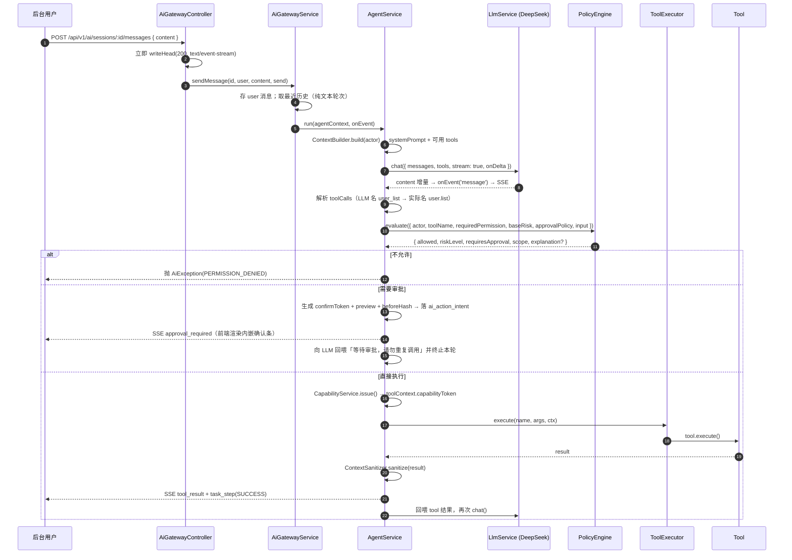

# AI 操作助手

后台管理界面的自然语言操作助手。核心原则写在 `src/ai/ai.types.ts` 顶部：

> **LLM ≠ 权限系统、LLM ≠ 数据库、LLM ≠ 业务逻辑、LLM ≠ 安全边界。真正的安全边界必须由后端代码控制。**

实现目录：`src/ai/`。

::: warning 这一块与设计 spec 无关
`project-design/superpowers/specs/2026-09-11-nail-salon-booking-design.md` **全文没有 AI / LLM / 操作助手 / ActionIntent 的任何内容**，32 张表的清单里也没有一张 `ai_*` 表。`src/ai/` 是后台基座自带的子系统（与若依风格基座一致），全部 66 个 Tool 都作用于 `system:*` / `monitor:*` / 任务 / 文件 / 首页统计。
:::

## 一、模块职责表

| 目录 / 文件 | 导出的类 | 职责 |
| --- | --- | --- |
| `ai.module.ts` | `AiModule` | 装配全部 provider，`onModuleInit()` 把 **66 个 Tool** 注册进 `ToolRegistry` |
| `agent/agent.service.ts` | `AgentService` | **主循环**：LLM → ToolCall → Policy → 审批/执行 → 回喂 LLM；`confirmAndExecute()`；`summarizeExecution()` |
| `gateway/ai.gateway.controller.ts` / `.service.ts` | `AiGatewayController` / `AiGatewayService` | HTTP 入口（`@Controller('ai')`）+ SSE 写流；会话与消息持久化、approve / reject / confirm 编排、任务查询与撤销 |
| `llm/llm.service.ts` | `LlmService` | Provider 选择：`AI_ENABLED && DEEPSEEK_API_KEY` → `DeepSeekProvider`，否则 `MockProvider` |
| `llm/providers/*.ts` | `DeepSeekProvider` / `MockProvider` | OpenAI 兼容 `chat/completions`，**含真流式 SSE 解析**与 `reasoning_content` 处理；未启用 AI 时的假实现 |
| `context/context.builder.ts` / `context.sanitizer.ts` | `ContextBuilder` / `ContextSanitizer` | 生成 Trusted 系统提示词 + 按权限过滤的 Tool 定义 + `toolNameMap`；Tool 返回值脱敏 |
| `tools/tool.registry.ts` / `tool.executor.ts` / `base/base-crud.tool.ts` | `ToolRegistry` / `ToolExecutor` / `BaseCrudTool` | Tool 注册与权限过滤；执行前验证 Capability Token 与批量上限；CRUD Tool 基类 |
| `policy/*.ts` | `PolicyEngine` / `PermissionService` | RBAC → 动态风险 → 审批策略，任一失败即阻止；`policy.explain.ts` 生成人类可读解释 |
| `risk/risk.engine.ts` | `RiskEngine` | 动态风险 = 基础风险 + 批量/数量/生产环境加成 |
| `capability/capability.service.ts` | `CapabilityService` | 能力令牌（HMAC 签名，5 分钟） |
| `approval/action-intent.service.ts` / `approval.service.ts` | `ActionIntentService` / `ApprovalService` | **ActionIntent 一次性 token + 前后快照 hash（TOCTOU 防护）**；写 `ai_approval`、翻转 intent 状态 |
| `task/task.service.ts` | `TaskService` | 任务时间线、Saga 补偿、`rollbackTask()` |
| `audit/audit.service.ts` | `AuditService` | 写 `ai_audit_log`（`tool_evaluate` / `tool_execute`） |

## 二、请求流与主循环



主循环最多 **5 轮**（`for (let round = 0; round < 5; round++)`）。进入等待审批时把 `round` 强制设为 5 并 `break`，**终止本轮的后续工具调用**。

### Tool 注册表与命名

- Tool 的 `name` 是**点号命名**：`user.list` / `user.update` / `job.run` / `online.forceLogout` / `dict-data.list`。
- 交给 LLM 时点号换成下划线（`toLlmToolName`），返回时经 `aiContext.toolNameMap` 还原。
- 权限过滤发生在 `ContextBuilder.build()`：`ToolRegistry.getAvailableTools(actor)` 只把**该用户有权限的 Tool** 给 LLM。

```ts
getAvailableTools(actor: { permissions: string[] }): AiTool[] {
  return this.getAll().filter((tool) =>
    actor.permissions.includes('*:*:*') || actor.permissions.includes(tool.permission),
  );
}
```

Tool 的权限字符串**就是后台 RBAC 的权限点**（例如 `UserUpdateTool.permission = 'system:user:update'`）。

### 已注册的 Tool（66 个）

按风险等级分布：**只读 32 个**（全 `L0` + `ApprovalPolicy.NONE`），**写操作 34 个**（全 `CONFIRM`：`L1×9` 的 `*.create`，`L2×14` 的 `*.update` + `file.remove` + `job.run` + `online.forceLogout`，`L3×11` 的 `*.remove` + `job.clearLogs` + `login-log.clear` + `operation-log.clear`）。**没有 `user.remove` 工具**。

| 领域 | Tool 名 |
| --- | --- |
| 用户 | `user.list` / `user.get` / `user.create` / `user.update` |
| 角色 / 部门 / 菜单 / 岗位 | `{role,dept,menu,post}` 各 5 个：`list` / `get` / `create` / `update` / `remove` |
| 参数配置 | `config.list` / `config.get` / `config.create` / `config.update` / `config.remove` |
| 字典 | `dict-type.*`（5 个）、`dict-data.*`（5 个） |
| 登录日志 / 操作日志 | `login-log.{list,get,remove,clear}`、`operation-log.{list,get,remove,clear}` |
| 在线用户 / 缓存 | `online.list` / `online.forceLogout` / `cache.info` |
| 定时任务 | `job.list` / `job.get` / `job.create` / `job.update` / `job.remove` / `job.run` / `job.logs` / `job.clearLogs` |
| 文件 / 首页统计 | `file.{list,get,remove}`、`dashboard.{users,depts,roles,menus,posts}` |

::: warning AI 目前只操作「系统管理」域
`user` / `role` / `dept` / `menu` / `post` / `config` / `dict` / `job` / `file` / 监控 / 首页统计。**没有任何 `biz.*`（预约 / 会员 / 收银）Tool** —— 想让 AI 改预约要先新增 Tool 并注册。
:::

## 三、策略与安全

### 风险分级（`RiskLevel`）

| 等级 | 含义 | 典型 Tool |
| --- | --- | --- |
| `L0` | 只读查询 | 所有 `*.list` / `*.get` / `cache.info` / `dashboard.*` |
| `L1` | 低风险写 | `*.create` |
| `L2` | 中风险写 | `*.update` / `online.forceLogout` / `job.run` |
| `L3` | 高风险写 | `*.remove` / `login-log.clear` / `operation-log.clear` / `job.clearLogs` |

**动态风险**（`RiskEngine.evaluate()`）在基础风险上加分：

```ts
let score = this.riskScore(context.baseRisk);          // L0=0, L1=1, L2=2, L3=3
if (this.isBatch(context.input)) score += 1;           // ids 或 userId 是数组
const count = this.affectedCount(context.input);
if (count > 1000) score += 1; else if (count > 100) score += 0.5;
if (process.env.NODE_ENV === 'production') score += 1;  // 生产环境整体提级
return this.toRiskLevel(score);                        // >=3 L3, >=2 L2, >=1 L1, else L0
```

::: warning 本机开发与生产的行为不同
`NODE_ENV=production` 会给**所有**操作 +1 分。同一个 `config.create`（L1）在开发环境自动执行，在生产环境会变成 L2 → **需要用户确认**。排查「为什么本地能自动执行、线上要确认」看这里。
:::

### 审批策略（`ApprovalPolicy`）

| 值 | 语义 |
| --- | --- |
| `NONE` | 无需审批，自动执行 |
| `CONFIRM` | 需要用户确认（前端内嵌确认条） |
| `APPROVAL` | 需要管理员审批 |
| `DISABLED` | 默认禁用，不注册给 AI |

`PolicyEngine.evaluate()` 的判定顺序：

1. **RBAC 权限判断**（不能相信 LLM 的自我声明）：不满足 → `{ allowed: false, reason: '缺少权限 X', scope: SELF }`；
2. **禁用策略**：`approvalPolicy === DISABLED` → `{ allowed: false, reason: '该操作被禁用' }`；
3. **审批判断**：

```ts
const requiresApproval =
  dynamicRisk === RiskLevel.L2 || dynamicRisk === RiskLevel.L3 ||
  context.approvalPolicy === ApprovalPolicy.CONFIRM ||
  context.approvalPolicy === ApprovalPolicy.APPROVAL;
```

`decision.explanation`（`policy.explain.ts`）会被写进审计 `metadata`，方便事后解释「为什么这次要审批」。注意通过分支里 **`scope` 硬编码为 `DataScope.ALL`**，`limits` 只是回填不强制。

### Capability Token

`PolicyEngine` 通过后，`AgentService` 签发能力令牌（`capability.service.ts` 的 `issue()`）：`base64url(JSON payload)` + `.` + `HMAC-SHA256` 签名，密钥是 `${JWT_ACCESS_SECRET}:capability`，payload 含 `tool` / `user` / `scope` / `maxItems` / `riskLevel` / `exp`（**5 分钟**）/ `nonce`。`ToolExecutor.execute()` 在执行前调 `authorize(token, name, actor)`：验签名 + 验 `exp` + 验 `tool` 匹配 + 验 `user.id` 匹配，再 `assertItemCount(payload, ids.length)`。

::: warning 能力令牌不是「一次性」
名字叫 Capability Token，但**没有 nonce 消费记录**，同一 token 在 5 分钟内可重复使用。防重放靠的是 Tool 自身的幂等。「一次性」是 `confirmToken`（ActionIntent）的语义，两者别混。
:::

### 工具限流

`AiErrorCode` 里有 `RATE_LIMIT`，但**从未被抛出** —— **工具级限流没有实现**。当前唯一的限流是 `src/main.ts` 注册的全局 `@fastify/rate-limit`（`max: 100 / 1 minute`，按 IP）。要加 AI 专用限流需要自己写。

批量限制是真有的，三层：

| 层 | 位置 | 上限 |
| --- | --- | --- |
| Capability | `tool.executor.ts` 的 `assertItemCount()` | `limits.maxItems ?? 100` |
| Task | `task.service.ts` 的 `assertLimits()` | 同上 |
| Tool 基类 | `base-crud.tool.ts` 的 `resolveTargetIds()` | `this.maxItems`（默认 100） |

超限抛 `AiException(RISK_DENIED, '批量操作超过限制（最大 N 条）')`。

### Tool 返回统一脱敏

Agent 在**任何** Tool 结果进入 SSE、进任务步骤、回喂 LLM 之前都过一遍 `ContextSanitizer.sanitize()`：递归遍历对象与数组，命中 `SENSITIVE_FIELDS` 的 key **整键丢弃**（不是打码）；`agent.service.ts` 的 `:417`（首次执行）与 `:586`（审批后确认执行）两处调用。

`SENSITIVE_FIELDS`（`context.types.ts`）精确 7 个：`password` / `passwordHash` / `refreshToken` / `accessToken` / `secret` / `privateKey` / `token`。

::: danger 脱敏是「按 key 名精确匹配」
`passwordHash` 会被删，但 `pwd` / `userPassword` / `credential` 不会。新增 Tool 返回值时不要用变体名承载敏感数据。
:::

### ActionIntent 一次性 token + 预览快照 TOCTOU 校验

**它防的是什么攻击**：`TOCTOU = Time-Of-Check to Time-Of-Use`。用户看到预览（「将删除用户 张三」）→ 点确认，这中间可能有几秒到几分钟。攻击/事故场景有三类：

1. **参数被换掉**：确认请求里的参数与预览时不一致（前端被篡改、或有人拿 intentId 重放成别的参数）→ **`inputHash` 比对**拦住。
2. **数据变了**：预览时「张三」还是普通用户，确认时已经是超管；或预览时余额 100 元，确认时已 0 元 → **`beforeHash` 快照比对**拦住。
3. **token 被抢/重放**：别人的 token、过期的 token、已处理的 token → **`confirmToken` 明文比对 + `PENDING` 状态 + `expiresAt` + `userId` 比对**拦住。

实现（`src/ai/approval/action-intent.service.ts`）：

- `generateToken()`：`randomBytes(32).toString('hex')`（64 位 hex，**无唯一索引**）；
- `hashValue(v)`：`sha256(JSON.stringify(stableSort(v)))`，`stableSort` 递归按 key 排序 —— **键顺序无关**（有单测），这是最容易踩的坑；
- `create()`：`expiresAt = now + 5 分钟`，落 `ai_action_intent(status='PENDING', beforeHash: hashValue(preview.before))`；
- `validate()` 逐项校验：不存在 → `ACTION_EXPIRED`；`status !== 'PENDING'` → `ACTION_EXPIRED`『操作意图已处理』；`expiresAt` 已过 → 『操作已过期』；`confirmToken` 不等 → `ACTION_STALE`『确认令牌无效』；`userId` 不等 → `PERMISSION_DENIED`『操作人不匹配』；`toolName` 不等 → `ACTION_STALE`；**重算 `inputHash` 不等 → `ACTION_STALE`『操作参数已变化』**。

**快照 TOCTOU 校验在 `confirmAndExecute()` 里重放一次 preview**：

```ts
// agent.service.ts
if (intent.beforeHash && tool.preview) {
  const currentPreview = await tool.preview(intent.input, toolContextForPreview);
  const currentHash = currentPreview.before
    ? ActionIntentService.hashValue(currentPreview.before)
    : ActionIntentService.hashValue(undefined);
  if (intent.beforeHash !== currentHash)
    throw new AiException(AiErrorCode.ACTION_STALE, '数据已变化，请重新预览后再执行');
}
```

::: danger 四条必须知道的性质与缺口
1. **`beforeHash` 只有在 Tool 实现了 `preview()` 时才存在**。没实现 preview 的 Tool，TOCTOU 校验**直接被跳过**。新增高风险 Tool 必须实现 `doPreview`。
2. **确认时重新走一遍 Policy**（防确认期间权限被收回）：`confirmAndExecute()` 里第二次 `policy.evaluate()`。
3. **「一次性」不是靠删 token，而是靠状态闸门**：`validate()` 要求 `status === 'PENDING'`，执行后置 `EXECUTED`。
4. **但 `updateStatus()` 是无条件 `UPDATE ... WHERE id = ?`，不是 CAS**，且与 `validate()` 的读分离、无事务。`confirm_token` 在 `ai_action_intent` 上只是**普通索引**（非唯一）。因此**并发的两次 `/confirm` 有可能都通过 validate 而双次执行**。缓解手段只有 Tool 自身的幂等；若要彻底封堵，应把状态更新改成 `WHERE id=? AND status='PENDING'` 并检查 `affectedRows`。
:::

另外两处设计未落地：`ActionIntentService.assertUnchanged()` **没有任何调用点**（实际用的是 `confirmAndExecute()` 里内联的快照比对）；`EXPIRED` / `CANCELLED` 两个状态**没有代码写入**（过期靠 `expiresAt` 现算，取消走 `REJECTED`）。

## 四、审批闭环

### 会话消息内嵌确认条

需要审批时不抛错、不返回 409，而是通过 SSE 推一个 `approval_required` 事件（data 含 `intentId` / `confirmToken` / `toolName` / `input` / `riskLevel` / 可选 `preview`）。Agent 同时把这次调用记为 `{ status: 'waiting_approval', intentId }` 写进 `toolCalls`，回喂 LLM 一条 `role: 'tool'` 的消息「已提交审批，等待用户确认，请勿重复调用」，然后 `round = 5; break;` **终止本轮**。

前端（`web/src/views/ai/`）在消息流里渲染 `components/ApprovalPanel.vue`：显示 `riskLevel` 徽章、`toolName`、`preview.summary` / `preview.affectedCount`，两个按钮 → `confirm` / `cancel`。判定逻辑在 `ToolStepCard.vue` / `useAiChat.ts`：toolCall 的 `result.status === 'waiting_approval'` 即渲染确认条。

### 去重：同一意图只创建一条

LLM 可能重复调用同一工具。Agent 先按 `(sessionId, toolName, inputHash, status='PENDING')` 查已有 intent（`findPendingByHash()`），命中就复用其 `confirmToken`，不再新建、也不再生成 preview。

### 审批结果元数据持久化

| 表 | 记录 |
| --- | --- |
| `ai_action_intent` | 意图本体：`tool_name` / `input` / `input_hash` / `before_hash` / `confirm_token` / `risk_level` / `status`(PENDING,APPROVED,REJECTED,EXPIRED,EXECUTED,CANCELLED) / `task_id` / `task_step_id` / `expires_at` / `executed_at` |
| `ai_approval` | 审批流水：`action_intent_id` / `approver_id` / `status`(APPROVED,REJECTED) / `reason` |
| `ai_message.toolCalls` | 该意图在消息里的原始调用记录（含 `{ status: 'waiting_approval', intentId }`） |
| `ai_message.toolResults` | **审批结果元数据**：`[{ type: 'approval_result', outcome: 'success' \| 'cancelled', toolName }]` |

确认执行后两条动作：

1. `updateApprovalMessageStatus()` 把历史 assistant 消息里该 `intentId` 的 toolCall 结果从 `waiting_approval` 改写成实际结果 → **刷新会话后状态一致**；
2. 新插一条 assistant 消息，`content` 是 LLM 生成的总结（失败时回退 `操作「X」已执行完成。`），`toolResults` 带 `approval_result`。

取消（`rejectAction`）同理，`outcome: 'cancelled'`，并把关联任务步骤置 `SKIPPED`、任务置 `CANCELLED`。

### 接口

| 方法 | 路径（前缀 `/api/v1`） | 权限 |
| --- | --- | --- |
| `POST` | `/ai/sessions` | `ai:chat` |
| `GET` | `/ai/sessions`、`/ai/sessions/:id` | `ai:chat` |
| `PATCH` | `/ai/sessions/:id` | `ai:chat`（改标题） |
| `GET` | `/ai/sessions/:id/messages` | `ai:chat` |
| `POST` | `/ai/sessions/:id/messages` | `ai:chat`（**SSE 流**） |
| `POST` | `/ai/action-intents/:id/approve`、`/:id/reject` | `ai:chat` |
| `POST` | `/ai/action-intents/confirm` | `ai:chat`（body: `intentId` + `confirmToken`） |
| `GET` | `/ai/tasks`、`/ai/tasks/:id` | `ai:chat` |
| `POST` | `/ai/tasks/:id/rollback` | `ai:chat`（**没有 cancel 端点**，前端取消走 `reject`） |

::: danger 审批是「自助确认」，不是双人复核
`approve` / `confirm` / `reject` 用的都是 `ai:chat` 权限（`@RequirePermissions('ai:chat')`），`ai_approval` 表里记了 `approver_id`，但：

- `ActionIntentService.validate()` 只校验 `userId === input.userId` —— 能执行的只有**发起人自己**；
- `/confirm` **不写 `ai_approval`**，只把 intent 置 `EXECUTED`；写 `ai_approval` 的是 `/approve` 与 `/reject`；
- `ApprovalService.approve/reject()` 只检查「intent 存在且 `PENDING`」，**没有「审批人 ≠ 申请人」校验**，也没有独立的审批权限点；
- 前端（`web/src/api/ai.ts`）实际只调 `/confirm` 与 `/reject`，**`/approve` 没有调用方**。

所以 `ApprovalPolicy.APPROVAL` 与 `CONFIRM` 在代码里的效果完全相同；真正的双人复核尚未实现。
:::

## 五、真流式回复（SSE）

**不是模拟打字机**：DeepSeek 的 `stream: true` 响应被逐块解析，`delta.content` 一到就通过回调推到 HTTP 流。

### 服务端

Controller 直接拿 Fastify 原生 reply 手写 SSE（`reply.raw.writeHead(200, { 'Content-Type': 'text/event-stream', 'Cache-Control': 'no-cache', Connection: 'keep-alive' })`），事件格式固定为 `event: ${type}\ndata: ${JSON.stringify(data)}\n\n`。`sendMessage` 正常返回后补写 `event: task_complete`（data = `AgentResult`），catch 分支写 `event: error`（只带 `{ message }`，**丢掉 error code**），`finally` 里 `raw.end()`。

### 事件类型（`AgentEvent`）

| `event:` 名 | data 要点 |
| --- | --- |
| `thinking` | `{ message: '正在分析你的请求...' }` |
| `message` | `{ content: <增量文本> }` —— **真流式，会推很多次** |
| `tool_call` / `tool_result` | `{ name, arguments }` / `{ name, result }`（已脱敏） |
| `approval_required` | `{ intentId, confirmToken, toolName, input, riskLevel, preview? }` |
| `task_created` / `task_step` / `task_completed` | 任务时间线：`task_step` 的 `status` ∈ `RUNNING`/`SUCCESS`/`FAILED` |
| `task_complete` | Controller 收尾事件，data = `AgentResult` |
| `error` | `{ message }` |

::: warning `task_completed` 与 `task_complete` 只差一个字母
前者是 `AgentEvent`（任务终态），后者是 Controller 在 `sendMessage` 正常返回后补写的收尾事件。前端（`web/src/api/ai.ts`）只认 `task_complete`，两者都要处理。

另外该端点用 `@Res()` 手写响应，**绕过了 Nest 的拦截器管线** —— `OperationLogInterceptor` 对它不生效；也没有心跳帧，长思考期间中间代理可能断开（生产部署注意 nginx 的 `proxy_buffering off`）。
:::

### 真流式增量与 DeepSeek thinking 模式

`DeepSeekProvider.streamChat()` 用 `response.body.getReader()` + `TextDecoder` 逐块读，按 `\n` 切行，跳过非 `data:` 行与 `[DONE]`，`JSON.parse` 出 `choices[0].delta`：

- `delta.content` → 累加进 `content` 并 **立即** `request.onDelta?.(delta.content)`（Agent 侧就是 `onDelta: (delta) => onEvent?.({ type: 'message', data: { content: delta } })`）；
- `delta.reasoning_content` → 只累加进 `reasoningContent`，**不外推**；
- `delta.tool_calls` → 按 `index` 累加（`name` / `arguments` 会分片到达），结束后 `safeParse` 成对象，解析失败返回 `{}`。

**thinking 模式有两处必须处理，否则真实环境直接 400**：

1. **`reasoning_content` 要原样回传**。多轮对话中 assistant 消息带 `reasoning_content` 时，请求体里也必须带同名同值（流式与非流式两处都有）：

```ts
...(message.role === 'assistant' && message.reasoningContent
  ? { reasoning_content: message.reasoningContent }
  : {}),
```

Agent 把 assistant 消息压进 `messages` 时也一并带上：

```ts
messages.push({ role: 'assistant', content: response.content, toolCalls: [toolCall],
  ...(response.reasoningContent ? { reasoningContent: response.reasoningContent } : {}) });
```

2. **`reasoning_content` 不推给前端**，只累积后随最终结果返回。前端看到的是纯 `content` 增量。

::: tip 用 `tool_choice: 'none'` 收尾
确认执行后的总结回复（`summarizeExecution()`）用 `toolChoice: 'none'` + 单轮非流式调用，**禁止再触发工具**（避免「确认一次却引发新操作」）。
:::

## 六、多步任务与 Saga 撤销

### 任务时间线

| 表 | 说明 |
| --- | --- |
| `ai_task` | `session_id` / `user_id` / `status`(PENDING,RUNNING,SUCCESS,FAILED,CANCELLED) / `risk_level` / `goal`(≤500) / `error` / `created_at` / `started_at` / `completed_at` |
| `ai_task_step` | `task_id` / `step_index` / `tool_name` / `input` / `output` / `status`(PENDING,RUNNING,SUCCESS,FAILED,SKIPPED,**WAITING_APPROVAL**) / `risk_level` / `error` / `started_at` / `completed_at` |

Agent 在**第一次要执行或要审批的工具调用**时惰性创建任务，并把每一步写进 `ai_task_step`。审批中的步骤状态是 `WAITING_APPROVAL`。

### 成功步骤如何撤销

`TaskService.rollbackTask(taskId, context)` —— 取全部步骤，筛 `status='SUCCESS'`，**逆序**逐个调 `tool.rollback()`：

- `const tool = this.registry.get(step.toolName); if (!tool?.rollback) continue;` —— 没实现 `rollback` 就跳过；
- 传给 `rollback` 的 `input` 是 `{ ...step.input, ...(output.undo ? { undo: output.undo } : {}), ...(output.before !== undefined ? { before: output.before } : {}) }`，**前置快照来自 `step.output`**，所以 Tool 必须在返回值里带上 `undo`（或 `before`）；
- 成功一步就 `updateStep(step.id, 'SKIPPED', undefined, '已撤销')` 并 `rolledBack++`；
- 单步失败被 `catch` 吞掉，不阻塞其他步骤；`rolledBack > 0` 才把任务置 `CANCELLED`。

### 哪些步骤不可撤销

**只有 `user.update` 实现了 `rollback()`**（`src/ai/tools/user/user.update.tool.ts`）：从 before 快照逐个 `users.update()` 恢复 `displayName` / `email` / `phone` / `status`；没有快照时抛 `AiException(ACTION_STALE, '缺少修改前快照，无法撤销')`。

**其余 64 个 Tool 都没有 `rollback`**，包括所有 `*.remove`（删除用户 / 角色 / 菜单 / 日志清理等）。所以：

::: danger Undo 的实际覆盖面极小
UI 上的「撤销任务」只有对 `user.update` 的步骤真正有效。删除类操作**设计上就不可撤销**（`user.update.tool.ts` 的注释：「高危不可逆操作不支持 Undo（如删除）」），也是 L3 必须审批的原因。做「撤销」交互时不要把按钮当成万能回滚。
:::

### Saga 补偿（执行中失败时）

`TaskService.executeTask()`（按步骤数组批量执行的路径）在某步失败时会逆序 `compensate(executed, context)`，然后 `complete(taskId, 'FAILED', message)` 并抛出 `AiException(BUSINESS_ERROR, message)`。`compensate()` 与 `rollbackTask()` 一样，只对实现了 `rollback` 的 Tool 生效，失败静默。

::: danger `executeTask()` 全仓没有任何调用点
真实的多步执行发生在 `AgentService.run()` 的循环里（逐步 `addStep` / `updateStep`），某步失败时只 `updateStep('FAILED')` + `complete(taskId, 'FAILED')` + 抛错，**不会自动补偿**。所以「Saga 自动补偿」目前是**未被接线的能力**；真正可用的只有用户手动点「撤销任务」（`POST /ai/tasks/:id/rollback`）。`TaskService.cancel()` 同样零调用，也没有取消任务的路由。
:::

## 七、配置

| 环境变量 | 默认值 | 说明 |
| --- | --- | --- |
| `AI_ENABLED` | **`false`** | 总开关 |
| `DEEPSEEK_API_KEY` | 无（optional） | 缺失则用 Mock |
| `DEEPSEEK_BASE_URL` | `https://api.deepseek.com` | |
| `DEEPSEEK_MODEL` | `deepseek-chat` | |

Provider 选择（`src/ai/llm/llm.service.ts`）：

```ts
constructor(config: AppConfigService) {
  if (config.ai.AI_ENABLED && config.ai.DEEPSEEK_API_KEY) {
    this.provider = new DeepSeekProvider(config);
  } else {
    this.provider = new MockProvider();
  }
}
```

::: warning 未启用 AI 时的真实表现
**「未启用」不等于「接口 404 / 403」**：
- `AiModule` 仍然加载，`/api/v1/ai/**` 全部可访问（只要用户有 `ai:chat` 权限）；
- 只是 `LlmService` 注入的是 `MockProvider` —— 对话会走假回复，**不会真的调用任何工具**；
- 前端入口：顶栏悬浮球（`v-permission="'ai:chat'"`）。菜单 seed 里 AI 整页入口已从侧边栏移除（`web/src/layouts/default.vue` 过滤了 `/ai`），改由悬浮球承载。

要让 AI 真的可用，必须同时配 `AI_ENABLED=true` 与 `DEEPSEEK_API_KEY`。
:::

## 八、审计留痕

表 `ai_audit_log`（drizzle 变量 `aiAuditLogs`）：

| 列 | 说明 |
| --- | --- |
| `user_id` | 操作人 |
| `session_id` | 会话 |
| `action` | `tool_evaluate` / `tool_execute` |
| `tool_name` | 工具名 |
| `risk_level` | 决策后的动态风险等级 |
| `permission` | Tool 声明的权限点 |
| `scope` | 决策的数据范围 |
| `result` | `allowed` / `denied` / `error` |
| `metadata` | json：`{ input, reason?, explanation? }`（`tool_execute` 时含 `intentId`） |
| `created_at` | 时间 |

Agent 在**两个时机**写审计：

1. **Policy 评估后**（`action: 'tool_evaluate'`）——无论允许还是拒绝都写，`result: decision.allowed ? 'allowed' : 'denied'`，`metadata` 里带 `reason` 与 `explanation`；
2. **Tool 执行成功后**（`action: 'tool_execute'`）——`result: 'allowed'`，`metadata: { input, intentId? }`。

::: warning 审计覆盖的缺口
- **三个写入点都没有传 `sessionId`** → `ai_audit_log.session_id` 实际恒为 `NULL`；定位某次对话只能靠 `user_id` + 时间。
- **Tool 执行失败不写 `ai_audit_log`**（`result: 'error'` 这个枚举值从未被写入）；失败信息只落在 `ai_task_step.error` 与 SSE 的 `error` 事件里。
- **审批动作本身（approve / reject）、会话创建、LLM 调用都不写 `ai_audit_log`**；审批记录在 `ai_approval`，对话正文在 `ai_message`。
- `scope` 恒为 `ALL`（`PolicyEngine.buildDecision()` 里通过分支硬编码 `DataScope.ALL`），审计里的 scope 字段暂时没有区分度。
:::

`ai_*` 表全集（7 张，`src/database/schema/index.ts`）：`ai_session` / `ai_message` / `ai_audit_log` / `ai_action_intent` / `ai_approval` / `ai_task` / `ai_task_step`。

## 延伸阅读

- [鉴权 · RBAC · 数据权限](/backend/auth-rbac) —— `ai:chat` 权限点与菜单 seed
- [后端分层与请求链路](/backend/) —— `AiException` 如何经全局过滤器透传
- [数据模型总览](/data/) · [系统 · 监控 · AI · 小程序身份表](/data/system-tables) —— `ai_*` 表索引
