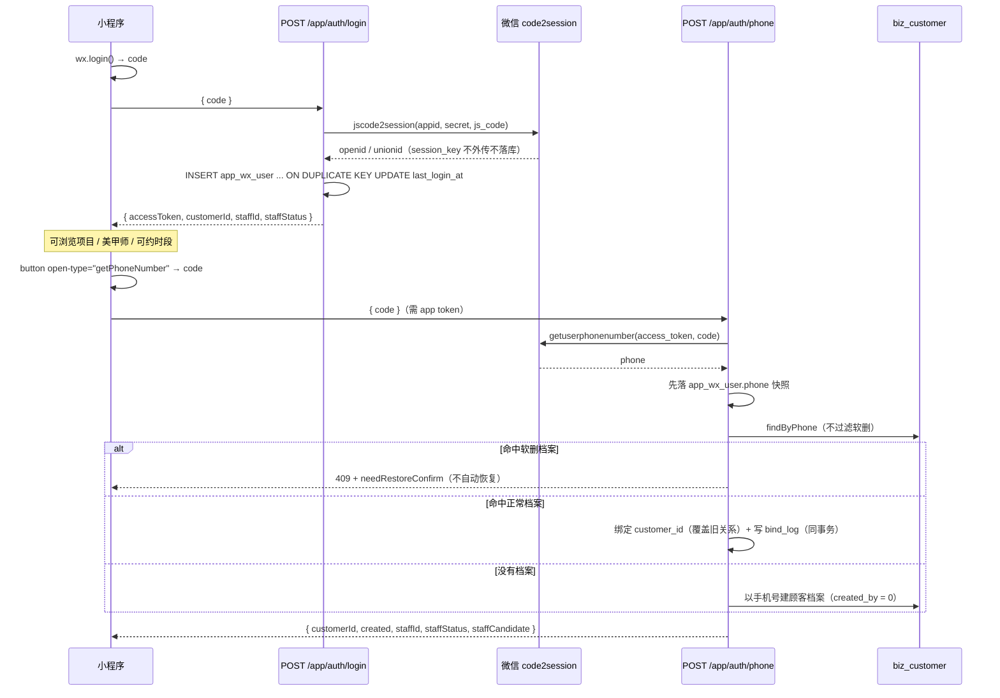

# 小程序 app 域实现

本页覆盖 `/api/v1/app/**` 的**独立认证域、登录与手机号绑定、全部接口清单（含真实实现状态）、美甲师工作台授权模型与订阅消息台账**。

- 代码位置：`src/modules/app/`
  - `auth/`（`app-auth.controller.ts`、`app-auth.service.ts`、`app-access-token.guard.ts`、`wx-miniapp.provider.ts`）
  - `catalog/`、`member/`、`payments/`、`staff/`（含 `app-staff-scope.guard.ts`、`app-staff-grants.*`、`app-staff-workbench.*`）
  - DTO / VO：`dto/app-vo.ts`、`dto/app-staff-workbench.vo.ts`
- 表：`app_wx_user`（`schema/index.ts:1225`）、`app_wx_subscribe_grant`（1290）、`app_wx_user_bind_log`（1321）
- 配置：`src/config/app-config.service.ts` 的 `wxMiniapp` / `wxMiniappFake`

## 独立认证域

### `/api/v1/app/**` + `AppAccessTokenGuard`

app 域 controller **全部标 `@Public()`**，跳过根模块注册的全局后台守卫 `AccessTokenGuard`，再由 `AppAccessTokenGuard` 做真正的鉴权：

```ts
// src/modules/app/auth/app-auth.controller.ts:38
@ApiTags('小程序端')
@Public()
@Controller('app/auth')
export class AppAuthController { ... }
```

```ts
// src/modules/app/auth/app-access-token.guard.ts:65
// 独立 token 域：只接受 scope=app 的令牌（后台令牌一律 401）
if (payload.scope !== 'app') throw new UnauthorizedException();
const id = Number(payload.sub);
if (!Number.isSafeInteger(id) || typeof payload.openid !== 'string')
  throw new UnauthorizedException();
request.appUser = { id, openid: payload.openid };
```

::: tip 为什么必须有 `@Public()`
全局 `AccessTokenGuard` **先于**路由级守卫执行。app controller 若不标 `@Public()`，会被后台守卫先拦掉（因为 app token 没有 `username`）。
:::

### 与后台 token 双向拒绝

两个守卫**共用** `JWT_ACCESS_SECRET` / `issuer` / `audience`，靠 **payload 形态**区分，**不需要改 `AccessTokenGuard`**：

| token 种类 | 签发处                        | payload 特征                                                            |
| ---------- | ----------------------------- | ----------------------------------------------------------------------- |
| 后台 token | `AuthService.issueTokens`     | 含 `username` / `permissions` / `roles`，**不含** `scope`               |
| app token  | `AppAuthService.signAppToken` | 含 `scope: 'app'` + `openid`，**故意不含 `username`**、**故意不含角色** |

```ts
// src/modules/app/auth/app-auth.service.ts:225
private async signAppToken(appUserId: number, openid: string): Promise<string> {
  return new SignJWT({ scope: 'app', openid })
    .setProtectedHeader({ alg: 'HS256' })
    .setSubject(String(appUserId))
    .setIssuedAt()
    .setIssuer(this.config.jwt.JWT_ISSUER)
    .setAudience(this.config.jwt.JWT_AUDIENCE)
    .setExpirationTime(this.config.jwt.JWT_ACCESS_TTL)
    .sign(new TextEncoder().encode(this.config.jwt.JWT_ACCESS_SECRET));
}
```

于是：

- **app token 打 `/api/v1/biz/**`** → 后台 `AccessTokenGuard` 要求 `typeof payload.username === 'string'`，不自成立 → **401**；
- **后台 token 打 `/api/v1/app/**`** → `AppAccessTokenGuard` 要求 `payload.scope === 'app'` → **401**。

::: danger 不要把角色 / 权限放进 app token
注释写明了原因：美甲师权限**每请求从库校验**（停用 / 撤权**立即失效**），放进 token 会有一段「已撤权但 token 仍有效」的窗口。
:::

### 不接 RBAC，只有「本人数据」

app 域**没有权限点、没有 `@RequirePermissions`**。所有查询强制 `customer_id = 当前绑定顾客`：

- `GET /app/bookings` / `GET /app/bookings/:id` / `POST /app/bookings/:id/cancel` / `POST /app/reviews` 都只从 **token 对应的绑定身份**取 `customerId`，**不接受客户端传值**；
- `GET /app/bookings/:id` 的归属校验刻意把「他人的单」与「不存在的单」统一返回 **404**，不区分 403 —— 否则会泄露「这个 id 存在、只是不属于你」；
- 美甲师工作台由 `AppStaffScopeGuard` 硬限定 `staff_id = 本人`；
- 未绑定手机号的访客只能访问项目 / 美甲师 / 可约时段。

### 不复用后台 DTO

单独写 `AppXxxVo`（`dto/app-vo.ts`），**禁止返回成本、`createdBy`、其他顾客信息、后台备注**。列表字段白名单在 controller 的 `@ApiOperation.description` 里逐条写明，例如：

- `GET /app/service-items`：只有 `id/name/category/durationMinutes/price/description/image`，**不含成本与备注**；
- `GET /app/staffs`：只有 `id/nickname/avatar/bio`；
- `POST /app/staff/bookings`：顾客手机号一律**脱敏**，真号要单独点拨号接口取；
- `GET /app/coupons`：响应**不含** `templateId`、模板备注与审计字段。

### 限流

基线在 `src/main.ts` 注册全局 `@fastify/rate-limit`（`max: 100 / 1 minute`）；app 域登录单独收紧到 **10 次/分钟/IP**：

```ts
// src/modules/app/auth/app-auth.controller.ts:45
@Post('login')
@RouteConfig({ rateLimit: { max: 10, timeWindow: '1 minute' } })
```

## 登录与手机号绑定

### 流程



### 建 / 绑身份

```ts
// src/modules/app/auth/app-auth.service.ts:60
async login(input: AppLoginRequest): Promise<AppLoginVo> {
  const session = await this.wx.code2Session(input.code);
  // upsert：openid 唯一索引 + ON DUPLICATE KEY UPDATE，并发登录也不会产生第二条身份记录（幂等）
  await this.database.db.insert(appWxUsers).values({ openid: session.openid, unionid: session.unionid, ... })
    .onDuplicateKeyUpdate({ set: { lastLoginAt: now, deletedAt: null, ... } });
  const identity = await this.requireIdentityByOpenid(session.openid);
  return { accessToken: await this.signAppToken(identity.id, session.openid), ... };
}
```

`openid` 有唯一索引 `uq_wx_openid`；软删的身份重新登录会 `deletedAt: null` 恢复（**同一 openid 永远只有一行**）。

### 绑定锚点

| 关系              | 落在哪里                                                                                                  |
| ----------------- | --------------------------------------------------------------------------------------------------------- |
| 微信身份          | `app_wx_user.openid`（唯一）                                                                              |
| 微信身份 ↔ 顾客   | `app_wx_user.customer_id`（**一个 openid 同时只绑一个**，换绑**覆盖**）                                   |
| 微信身份 ↔ 美甲师 | `app_wx_user.staff_id` + `staff_status`                                                                   |
| 绑定留痕          | `app_wx_user_bind_log`（只追加，记 `customer_id_before` / `customer_id_after` / `phone` / `openid` 快照） |
| 顾客 ↔ 会员       | 同一个 `biz_customer.id`（顾客即会员，见 [会员 · 储值 · 次卡 · 积分](/backend/membership)）               |

::: warning 换绑的「覆盖 + 留痕」必须在同一事务里

```ts
// src/modules/app/auth/app-auth.service.ts:153
// 换绑覆盖旧关系：一个 openid 同时只绑定一个 customer_id。
// 覆盖与留痕**必须在同一事务里**：留痕落不下去的换绑比不换绑更危险。
await this.database.db.transaction(async (tx) => {
  await tx
    .update(appWxUsers)
    .set({ customerId })
    .where(eq(appWxUsers.id, appUserId));
  await tx
    .insert(appWxUserBindLogs)
    .values({
      appWxUserId: appUserId,
      openid: identity.openid,
      phone,
      customerIdBefore: identity.customerId,
      customerIdAfter: customerId,
      source: 'bind_phone',
      createdBy: APP_ACTOR_ID,
    });
});
```

:::

### 手机号命中软删档案 → 409

```ts
// src/modules/app/auth/app-auth.service.ts:105
// 2. 按手机号匹配顾客档案（`findByPhone` **不过滤软删**）。
// 3. 命中**软删**档案 → 抛 409 并带回 `needRestoreConfirm`，**不自动恢复**：
//    恢复会带回余额/积分/次卡历史，属于数据完整性动作，交门店在后台确认。
```

响应体形如 `{ message, needRestoreConfirm: true, customerId }`；门店侧用 `POST /biz/customers/:id/restore`（权限 `biz:customer:update`）恢复后再绑定。

::: tip 为什么要先落手机号快照

```ts
// app-auth.service.ts:102
// 1. **先落手机号快照**（`app_wx_user.phone`）——与「绑定顾客」解耦。
//    这样即使命中软删档案需要用户确认，也不必再弹一次微信授权
//    （`getPhoneNumber` 的 code 是一次性的，无法复用）。
```

:::

### 微信能力端口与降级

微信能力全部走 `WxMiniappProvider` 抽象（`auth/wx-miniapp.provider.ts`）：

| 实现                    | 何时启用                            | 行为                                                                                                                                       |
| ----------------------- | ----------------------------------- | ------------------------------------------------------------------------------------------------------------------------------------------ |
| `HttpWxMiniappProvider` | 默认                                | 真连 `api.weixin.qq.com`；`code2Session` 用 `sns/jscode2session`，`getPhoneNumber` 用 `wxa/business/getuserphonenumber`；`fetch` 超时 5 秒 |
| `FakeWxMiniappProvider` | `WX_MINIAPP_FAKE=true` **且非生产** | 零网络：`openid = 'fake-openid-' + code`；`getPhoneNumber` 接受 11 位手机号或 `phone-<手机号>`                                             |

**未配置凭据**：

```ts
// src/modules/app/auth/wx-miniapp.provider.ts:77
private requireCredentials(): { appId: string; secret: string } {
  const miniapp = this.config.wxMiniapp;
  if (!miniapp.configured || !miniapp.appId || !miniapp.secret)
    throw new ServiceUnavailableException('小程序端未启用');   // 503
  return { appId: miniapp.appId, secret: miniapp.secret };
}
```

`wxMiniapp.configured` 由 `WX_MINIAPP_APPID` + `WX_MINIAPP_SECRET` **两项齐全**决定。未配置时登录返回 **503「小程序端未启用」**，但**进程正常启动**（spec §16.1 的既定降级）。

### `WX_MINIAPP_FAKE` 的生产强制失效

```ts
// src/config/app-config.service.ts:187
/**
 * 假微信实现开关：**生产环境一律返回 false**。
 * 这不是「方便开关」而是安全底线——假实现下任意手机号都能登录成任意顾客/美甲师。
 */
get wxMiniappFake(): boolean {
  if (this.environment === 'production') return false;
  return this.values.WX_MINIAPP_FAKE === 'true';
}
```

::: danger 双保险
`FakeWxMiniappProvider` 的构造函数里还有第二道：

```ts
// src/modules/app/auth/wx-miniapp.provider.ts:174
if (process.env.NODE_ENV === 'production') {
  throw new Error(
    'FakeWxMiniappProvider 不允许在生产环境使用：它会让任意手机号登录成任意顾客/美甲师',
  );
}
```

**风险提示**：假实现下 `getPhoneNumber('13800000001')` 直接返回该号，登录成该手机号对应的任何顾客 / 美甲师。因此 `NODE_ENV=production` 之外的环境**也必须当成生产对待**（不要用真实手机号做演示数据）。
:::

### access_token 的进程内缓存

`getAccessToken()` 缓存微信 `access_token`（有效期 2 小时，提前 60 秒过期）。注释写明这是**进程内缓存**：

> 当前部署是单实例（pm2 单进程）没问题；若将来多实例/多副本，需换成共享缓存（Redis），否则每个实例各拉一份 token，量大时会触发微信的频率限制。

## 接口清单

::: warning 与早期技能文档的差异（重要）
技能文档 `miniapp-reserved` 说「4 个只读接口真实现 + 其余 501 契约骨架」。**现状已大幅推进**：除小程序内 JSAPI 支付外，**列表里的所有接口都已实现**（`src/modules/app/member/app-member.controller.ts` 已从 501 骨架改为真实实现）。唯一仍是 501 的是 `POST /app/payments/wxpay/jsapi`。

下面的「实现状态」列逐条核实于 controller 与 service 源码。
:::

### 认证（`@Controller('app/auth')`）

| 方法 | 路径              | 作用                                     | 实现状态                                                       |
| ---- | ----------------- | ---------------------------------------- | -------------------------------------------------------------- |
| POST | `/app/auth/login` | `code` 换 openid + 签发 app token        | ✅ 真实现；限流 10/分/IP；未配置凭据 → 503                     |
| POST | `/app/auth/phone` | `getPhoneNumber` code 换手机号并绑定顾客 | ✅ 真实现；需 app token；软删档案 → 409 + `needRestoreConfirm` |

### 目录（`@Controller('app')`，`app-catalog.controller.ts`）

| 方法 | 路径                   | 作用                                                   | 实现状态                              |
| ---- | ---------------------- | ------------------------------------------------------ | ------------------------------------- |
| GET  | `/app/service-items`   | 启用中的服务项目列表                                   | ✅ 真实现                             |
| GET  | `/app/staffs`          | 启用中的美甲师列表                                     | ✅ 真实现                             |
| GET  | `/app/available-slots` | 可约时段（必填 `staffId` / `date` / `serviceItemIds`） | ✅ 真实现，**复用后台同一个 service** |

`available-slots` 的契约细节：

- `serviceItemIds` 支持逗号分隔（`1,2`）或重复 query，**去重后 1~3 个**；
- 与后台复用同一算法（班次 − 已有预约 − 缓冲 gap、美甲师可做项目过滤、店内本地日界）；
- 小程序渠道额外应用 `biz.booking.minLeadMinutes`（默认 60 分钟）；
- 无可约时段时 `slots` 为空数组并附 `reason`。

### 会员（`app-member.controller.ts`）

| 方法 | 路径                  | 作用                                   | 需绑定手机号 | 实现状态                                   |
| ---- | --------------------- | -------------------------------------- | ------------ | ------------------------------------------ |
| GET  | `/app/member/me`      | 等级 / 折扣率 / 积分 / 余额 / 次卡     | ✅           | ✅ 真实现；未绑定 → 401 + `needBind: true` |
| GET  | `/app/member/cards`   | 我的次卡列表（状态**现算**）           | ✅           | ✅ 真实现                                  |
| GET  | `/app/recharge-plans` | 上架中的充值档位                       | ❌           | ✅ 真实现                                  |
| GET  | `/app/points-goods`   | 积分兑换品目录（仅 `status=active`）   | ❌           | ✅ 真实现                                  |
| POST | `/app/points/redeem`  | 兑换（扣积分 + 发次卡，同事务）        | ✅           | ✅ 真实现                                  |
| GET  | `/app/coupon-offers`  | 可领取的券模板（已持有可用券的不出现） | ✅           | ✅ 真实现                                  |
| POST | `/app/coupons/claim`  | 领券（并发安全在服务端）               | ✅           | ✅ 真实现                                  |
| GET  | `/app/coupons`        | 我的券（状态现算，不含 `templateId`）  | ✅           | ✅ 真实现                                  |

「需绑定手机号」的判定口径就是 `app_wx_user.customer_id` 是否为空 —— 空的返回 `401` 且响应体带 `needBind: true`。

::: tip 目录类接口故意不要求绑定手机号
`/app/points-goods` 与 `/app/recharge-plans` 的注释写得很清楚：这是**非个人的目录信息**，未绑定用户也能先看到「能换什么 / 能充什么」，到兑换那一步才需要身份。这与 `/app/service-items` 同为可匿名浏览的目录。
:::

### 预约与支付

| 方法 | 路径                         | 作用                                                | 实现状态                                       |
| ---- | ---------------------------- | --------------------------------------------------- | ---------------------------------------------- |
| GET  | `/app/bookings`              | 我的预约列表（`{items,page,pageSize}`，无 `total`） | ✅ 真实现                                      |
| GET  | `/app/bookings/:id`          | 预约详情（本人）；他人的单 → 404                    | ✅ 真实现                                      |
| POST | `/app/bookings`              | 自助下单                                            | ✅ 真实现                                      |
| POST | `/app/bookings/:id/cancel`   | 自助取消（`reason` 必填）                           | ✅ 真实现                                      |
| POST | `/app/reviews`               | 提交服务评价（一单一评）                            | ✅ 真实现                                      |
| POST | `/app/subscribe`             | 订阅消息授权上报                                    | ✅ 真实现                                      |
| POST | `/app/payments/wxpay/jsapi`  | 小程序内 JSAPI 支付                                 | ⛔ **501 契约位**（不落库）                    |
| POST | `/app/payments/wxpay/notify` | 微信支付**回调**（公开，无 token）                  | ✅ 真实现，复用后台 `PaymentPort.handleNotify` |

`POST /app/bookings` 与后台创建的差异（controller 的 description 逐条写明）：

> 复用后台创建九步（预约 - 锁定 - 冲突复检 - 建单 - 交易），仅两处差异：
> **落 `channel=miniapp` + `status=pending`**（与店员代录的 `confirmed` 区分，待门店确认）；
> **不收款**（JSAPI 支付在 P2），如传 `memberCardId` 则整单次卡当场核销（`payable=0`，选 1 个项目）。
> 无改价 / 无强制覆盖；顾客时段与已有预约重叠 → 409。

`POST /app/bookings/:id/cancel`：

> 仅本人可取消（他人单 403）；`pending` / `confirmed` 均可；`reason` 必填。**已有实收时不自动退款**，响应带 `warning` 提示走退款审批。

`POST /app/reviews` 的三道约束全在服务端：**仅本人**（按预约事实校验归属）→ **仅已完成**（未完成 400）→ **一单一评**（二次提交 409）。`customer_id` / `staff_id` 由预约事实带出，客户端只能决定打分与文字。

### 工作台（`/app/staff/**`）

| 方法 | 路径                               | 作用                            | 守卫                  | 实现状态  |
| ---- | ---------------------------------- | ------------------------------- | --------------------- | --------- |
| POST | `/app/staff/apply`                 | 申请开通工作台                  | `AppAccessTokenGuard` | ✅ 真实现 |
| GET  | `/app/staff/me`                    | 我的美甲师档案 + 可做项目白名单 | `APP_STAFF_GUARDS`    | ✅ 真实现 |
| GET  | `/app/staff/bookings`              | 我的预约（顾客手机号脱敏）      | 同上                  | ✅ 真实现 |
| GET  | `/app/staff/schedule`              | 我的排班（必填 `date`）         | 同上                  | ✅ 真实现 |
| GET  | `/app/staff/performance`           | 我的业绩（`period` 默认当月）   | 同上                  | ✅ 真实现 |
| GET  | `/app/staff/reviews`               | 我的评价（只出已公开的）        | 同上                  | ✅ 真实现 |
| GET  | `/app/staff/bookings/:id/phone`    | 取顾客真号（仅供拨号）          | 同上                  | ✅ 真实现 |
| POST | `/app/staff/bookings/:id/arrived`  | 标记顾客已到店（幂等）          | 同上                  | ✅ 真实现 |
| POST | `/app/staff/bookings/:id/complete` | 标记服务完成                    | 同上                  | ✅ 真实现 |

后台侧的授权管理接口（走 RBAC，权限点 `biz:staff:grant`）：

| 方法 | 路径                                | 作用                                                                           |
| ---- | ----------------------------------- | ------------------------------------------------------------------------------ |
| GET  | `/biz/app-staff-grants`             | 申请列表（`status` 过滤 `pending/active/rejected`；不传=全部，**不含未申请**） |
| POST | `/biz/app-staff-grants/:id/approve` | 通过（置 `staff_status=active`）                                               |
| POST | `/biz/app-staff-grants/:id/reject`  | 驳回（**必填原因**，小程序端可见）                                             |

::: tip 真号为什么要点一次取一次
`GET /app/staff/bookings/:id/phone` 的注释：「列表里只给脱敏值（D11），真号**点一次取一次**且限本人单 —— 抓包/截图拿不到批量号码，只有真要打电话的那一瞬间才取。」
:::

## 美甲师工作台授权模型

### 三态与决策链

```
POST /app/staff/apply          →  staff_status = 'pending'（须手机号命中在职美甲师档案）
POST /biz/app-staff-grants/:id/approve  →  'active'（店长在后台确认）
POST /biz/app-staff-grants/:id/reject   →  'rejected' + staffRejectReason
```

```ts
// src/modules/app/staff/app-staff.service.ts:34
if (!identity.phone)
  throw new BadRequestException('请先完成手机号授权，再申请美甲师工作台');
const staff = await this.staffs.findByPhone(identity.phone);
if (!staff || staff.deletedAt || staff.status !== 'active')
  throw new BadRequestException(
    '该手机号未匹配到在职美甲师档案，请联系门店处理',
  );
```

::: danger 为什么申请后必须店长确认
`app_wx_user` 的表注释写得很直白：

> 手机号命中 `biz_staff.phone` 后置 `pending`，**必须店长在后台确认**才变 `active`——仅凭手机号自动开通等于提权漏洞：spec §16.2 允许「手机号属于他人 openid 也允许绑定」，号码被复用即可看该美甲师的预约与业绩。
> :::

申请接口的请求体 `@Body()` **只为保持契约与 Swagger 完整**，身份字段全部丢弃：

```ts
// src/modules/app/staff/app-staff.controller.ts:58
// body 只为保持请求契约与 Swagger 完整；身份字段全部丢弃，不能靠请求体提权。
appStaffApplyRequestSchema.parse(body);
return this.staff.apply(appUser.id);
```

### 服务端怎么表达授权

授权状态**不放在 token 里**，而是**每请求从库复查**：

```ts
// src/modules/app/staff/app-staff-scope.guard.ts:28
/**
 * 不读 token 里的角色，也不相信 `app_wx_user.staff_status` 单列：每次请求都重新查
 * `app_wx_user + biz_staff`，同时要求身份 active、档案 active、档案未软删。
 * 店长撤权 / 停用 / 删除后，下一次请求立即失效。
 */
// 实现：select staffId, staffStatus from app_wx_user innerJoin biz_staff
//   where app_wx_user.id = appUser.id and app_wx_user.deleted_at is null
//     and app_wx_user.staff_status = 'active'
//     and biz_staff.status = 'active' and biz_staff.deleted_at is null
// 命中不到 / staffStatus !== 'active' → ForbiddenException('美甲师工作台未开通或已失效')
```

组合守卫：

```ts
export const APP_STAFF_GUARDS = [
  AppAccessTokenGuard,
  AppStaffScopeGuard,
] as const;
```

**撤权的实现方式 = 停用美甲师档案**（`biz_staff.status = 'disabled'`）：

```ts
// src/modules/app/staff/app-staff-grants.service.ts:121
if (grant.staffStatus === 'active')
  throw new ConflictException(
    '已开通的授权不能驳回；如需撤权请停用对应的美甲师档案',
  );
```

### 前端如何消费

小程序侧只看两个值：`staffStatus`（登录 / 绑定手机号响应里带回）与 `GET /app/staff/me` 的复查结果。详见 [小程序架构与主题系统](/frontend/miniapp) 的「双模式 TabBar」。

## 订阅消息台账

`app_wx_subscribe_grant`（**故意不建外键**，注释说明了原因）：

| 字段                             | 说明                                                   |
| -------------------------------- | ------------------------------------------------------ |
| `app_wx_user_id` + `template_id` | **唯一键** `uq_wx_subscribe_grant`                     |
| `customer_id`                    | 顾客 ID **快照**（授权后绑定关系可能被换绑，这里留证） |
| `granted_count`                  | **累计授权次数**（微信一次性订阅可累积）               |
| `last_booking_id`                | 最近一次授权的关联预约（仅上下文，可空）               |
| `granted_at`                     |                                                        |

::: tip 为什么是计数行而不是 append-only 流水
表注释：「微信订阅消息的真实语义是**额度**：用户在客户端点一次『允许』，开发者就获得该模板的一次下发权限，且可累积。所以按 `(用户, 模板)` 聚合成一行计数，而不是记成 append-only 流水——后者做不了『还能发几次』的查询。」
:::

### 上报流程

`POST /app/subscribe`（需绑定手机号）：

> 客户端在 `wx.requestSubscribeMessage` 回调里**只上报用户点了「允许」的模板**，用户拒绝时不要调用本接口。服务端按 `(用户, 模板)` 累加微信下发额度，**未授权不报错、不阻塞业务**——订阅消息是增强而非前置条件。`bookingId` 为可选上下文，传了就必须是本人的预约。

```ts
// src/modules/app/member/app-member.service.ts:392
async subscribe(appUserId: number, input: { templateIds: string[]; bookingId?: number }) {
  const { accepted } = await this.notices.recordSubscribeGrant({ ..., templateIds: input.templateIds, ... });
  return { accepted: accepted.length > 0, templateIds: accepted };
}
```

响应体 `{ accepted, templateIds }`：`accepted = false` 表示没有可记录的模板（不是错误）。

::: warning 未配置模板时怎么降级
**额度的消费（真正下发服务通知）本期不做**，依赖模板 ID 申请：

> 额度的消费（真正下发服务通知）依赖 H10 的模板 ID 申请，见交接文档 D12。

所以当前状态是「台账能记、发不出去」。降级路径是既有的通知模块：站内消息照常写，短信按 `biz.notice.smsEnabled` 与模板白名单决定是否真发（见 [通知与定时任务](/backend/notification-jobs)）。
:::

## 相关页面

- 小程序端页面与接口映射：[小程序页面与接口映射](/frontend/miniapp-pages)
- 小程序请求层与 token 管理：[小程序架构与主题系统](/frontend/miniapp)
- 后端鉴权与 RBAC 对比：[鉴权 · RBAC · 数据权限](/backend/auth-rbac)
- 支付回调细节：[收银与支付通道接入](/backend/payment)
