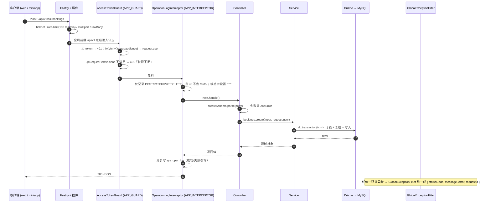

# 后端分层与请求链路

后端是 **NestJS 12 + Fastify 适配器 + Zod 4 + Drizzle ORM（MySQL 方言）**，运行时是 **Bun 1.4**（`bun dev` → `bun --watch src/main.ts`）。

本页讲清三件事：**目录怎么分层**、**一个请求从进来到出去经历了什么**、**错误与分页的统一约定**。

> 全站只把 `src/` 下的实现当事实来源。`project-design/superpowers/specs/2026-09-11-nail-salon-booking-design.md` 是早期设计意图，与现状不一致时（例如表数量）一律以代码为准。

## 一、目录分层

| 路径 | 职责 | 关键文件 |
| --- | --- | --- |
| `src/main.ts` | 进程启动、插件注册、Swagger、全局前缀、优雅关停 | `src/main.ts` |
| `src/app.module.ts` | 根模块：装配全部子模块 + 注册**全局守卫 / 全局拦截器** | `src/app.module.ts` |
| `src/config/` | 环境变量 Zod 校验与类型化读取 | `app-config.service.ts` / `app-config.module.ts` |
| `src/common/` | 跨模块横切能力：鉴权、异常过滤、审计、数据权限、缓存、工具 | `auth/` `filters/` `logging/` `data-scope/` |
| `src/database/` | 连接、唯一 schema 文件、迁移、seed | `database.service.ts` / `schema/index.ts` / `seed/` |
| `src/modules/biz/` | 美甲业务域（B1~B7） | `base-data/` `scheduling/` `booking/` … |
| `src/modules/app/` | 小程序 `app_` 域（独立 token 域，不接 RBAC） | `auth/` `catalog/` `member/` `payments/` `staff/` |
| `src/modules/` 其余 | 系统管理 / 监控 / 定时任务 / 文件 / 代码生成 / 兼容层 | `system/` `monitor/` `jobs/` `files/` |
| `src/ai/` | AI 操作助手（Agent / Tool / Policy / Approval / Task） | 见 [AI 操作助手](/backend/ai-agent) |

### `src/main.ts` 做了什么（顺序即语义）

```ts
// src/main.ts（精简）
z.config(zhCN());                                    // 全局中文 Zod 提示，必须在任何 parse 之前
const app = await NestFactory.create<NestFastifyApplication>(
  AppModule,
  new FastifyAdapter({ logger: true, trustProxy: true }),
  { rawBody: true },                                 // 微信支付 V3 回调验签必须用原样报文
);
app.useGlobalFilters(new GlobalExceptionFilter());
await app.register(helmet);
await app.register(rateLimit, { max: 100, timeWindow: '1 minute' });
await app.register(multipart, { limits: { files: 1, fileSize: 10 * 1024 * 1024 } });
app.enableCors({ origin: config.corsOrigins, credentials: true });
app.setGlobalPrefix(config.apiPrefix);               // 默认 api/v1
app.enableShutdownHooks();                           // 配合 DatabaseService.onApplicationShutdown 关连接池
```

三个容易被忽略的点：

- **`rawBody: true`**：微信支付/支付宝回调验签依赖原始字节，`JSON.stringify(req.body)` 在真实环境会验签失败。
- **`trustProxy: true`**：让 `request.ip` 从 `x-forwarded-for` 解析，否则登录日志与限流按 nginx 的 IP 统计。
- **Swagger 里有两套 Bearer**：`access-token`（后台）与 `app-token`（小程序，payload 含 `scope=app`）。Zod schema 通过 `registerComponent()` 注入 `components.schemas`，见 `src/common/swagger/zod-schema.helper.ts`。

### 根模块的全局装配

```ts
// src/app.module.ts
providers: [
  { provide: APP_GUARD, useClass: AccessTokenGuard },          // 默认「全部路由都要登录」
  { provide: APP_INTERCEPTOR, useClass: OperationLogInterceptor },
],
```

**默认拒绝**是全站安全基线：新写的 Controller 不标 `@Public()` 就必须带后台 access token。

## 二、一个模块的标准结构

全站**没有 Repository 层**——Service 直接用 Drizzle。以真实模块 `src/modules/biz/base-data/service-items/` 为样板：

| 层 | 文件 | 说明 |
| --- | --- | --- |
| 路由 + 校验 | `service-items.controller.ts` | `@Controller('biz/service-items')`；**DTO 就是文件顶部的 Zod schema**（`createSchema` / `updateSchema`），并 `registerComponent()` 给 Swagger 用 |
| 业务 | `service-items.service.ts` | `extends ServiceItemPort`，构造注入 `DatabaseService`，所有 DB 操作走 `this.database.db` |
| 契约 | `src/modules/biz/common/ports.ts` | `ServiceItemPort` 抽象类，既是 DI token 也是**跨模块唯一允许的依赖面** |
| 装配 | `base-data.module.ts` | `imports: [BizCommonModule]`，导出 Service；**端口到实现的绑定在根 `BizModule` 统一做** |

Controller 的真实形态：

```ts
// src/modules/biz/base-data/service-items/service-items.controller.ts（精简）
const createSchema = z.object({
  name: z.string().min(1).max(50),
  durationMinutes: z.number().int().min(1).max(1440),   // 决定占用时段
  bufferMinutes: z.number().int().min(0).max(240).optional(), // 参与冲突判定
  price: z.number().int().min(0).optional(),            // 单位「分」
  images: z.array(z.string().max(500)).max(9).nullish(),
});
registerComponent('CreateServiceItemRequest', createSchema);

@ApiTags('服务项目')
@ApiBearerAuth('access-token')
@Controller('biz/service-items')
export class ServiceItemsController {
  constructor(private readonly serviceItems: ServiceItemsService) {}

  @Post()
  @RequirePermissions('biz:serviceitem:create')
  create(@Body() body: unknown, @Req() request: AuthRequest) {
    return this.serviceItems.create(createSchema.parse(body), request.user.id);
  }
}
```

三条写法约定，新模块照抄即可：

1. **入参类型用 `@Body() body: unknown`**，在方法体里 `schema.parse(body)` —— 解析失败抛 `ZodError`，由全局过滤器转 400（见下）。
2. **权限点用 `@RequirePermissions('biz:xxx:yyy')`** 逐方法声明；各段**全小写不用驼峰**（`biz:serviceitem:list`）。
3. **返回值不做包装**：Service 直接返回领域对象 / `{ items, page, pageSize }`，没有统一的 `{ code, data, msg }` 外壳。

## 三、请求链路（时序图）



要点：

- **守卫是全局的、拦截器是全局的**，不要在业务模块里重复注册。
- **审计拦截器只覆盖写操作**（`MUTATING = POST/PATCH/PUT/DELETE`），并且**跳过 `/auth/` 路径**（登录/刷新/登出自己写 `sys_login_log`）。
- **审计写入是 best-effort**：`write()` 内部 `try/catch` 吞异常，审计落库失败绝不影响业务响应。
- 响应里的 `requestId` 来自 Fastify 的 `request.id`（默认读 `request-id` 请求头，没有就自己生成），客服排障时前后端说的是同一个号。

## 四、校验：Zod 失败如何变成 400

**没有使用 Nest 的 `ValidationPipe`，也没有 422**。Zod 在每个 Controller 里显式 `parse()`，抛出的 `ZodError` 由 `src/common/filters/global-exception.filter.ts` 统一处理：

```ts
// src/common/filters/global-exception.filter.ts（精简）
if (exception instanceof ZodError) {
  const messages = exception.issues.map(
    (issue) => `${fieldLabel(issue)}：${friendlyIssue(issue)}`,
  );
  reply.status(HttpStatus.BAD_REQUEST).send(
    withRequestId({ statusCode: 400, message: messages, error: 'Bad Request' }),
  );
  return;
}
```

于是 `{ "pageSize": 0 }` 会得到：

```json
{
  "statusCode": 400,
  "message": ["每页条数：不能小于 1"],
  "error": "Bad Request",
  "requestId": "…"
}
```

`message` **是数组**，前端按行展示。字段中文名来自文件顶部的 `FIELD_LABELS` 映射，未命中时回退原始 key。

## 五、错误处理约定

### 怎么抛业务异常

直接抛 Nest 内置异常，**不使用自定义业务异常基类、不使用错误码枚举**：

```ts
throw new BadRequestException('服务项目需选择 1~3 个');          // 400
throw new UnauthorizedException('权限不足');                    // 401
throw new ForbiddenException('无手动改价权限（biz:booking:adjust）'); // 403
throw new NotFoundException('预约不存在');                      // 404
throw new ConflictException('该时段已被占用，请重新选择');        // 409
throw new ConflictException({ message: '…', conflicts: [...] }); // 409 + 结构化清单
```

### HTTP 状态码映射（真实例子）

| 场景 | 状态码 | 真实出处 |
| --- | --- | --- |
| `startAt` 不在 `stepMinutes` 网格 / 超出班次 | **400** | `src/modules/biz/booking/slots.service.ts` 的 `assertGridAligned()` / `assertWithinShift()` |
| 排班变更会让既有预约越界 | **409 + `conflicts` 清单** | `src/modules/biz/scheduling/scheduling.service.ts` 的 `conflictException()` |
| 收款金额超过下单应收 / 超过待收尾款 | **400** | `bookings.service.ts` 的「收款金额超过下单应收金额」 |
| 储值余额不足 / 积分不足 / 应收超额销账 | **409** | `member-accounts.service.ts` 的 `affectedRows=0 → ConflictException('储值余额不足')` |
| 服务项目被未完成预约引用时删除 | **409** | `service-items.service.ts`（Controller 上 `@ApiResponse({ status: 409 })`） |
| 限流超限 | **429** | `@fastify/rate-limit` 抛的带 `statusCode` 的普通 Error，过滤器专门识别 4xx 透传 |

::: tip 两个刻意的设计
- **权限不足返回 401 而不是 403**：`AccessTokenGuard` 里 `throw new UnauthorizedException('权限不足')`。前端看到 401 会走「刷新 token → 重试 → 仍失败则跳登录」的通用流程。
- **第三方插件的 `statusCode` 只放行 4xx**：`fastifyClientErrorStatus()` 明确拒绝让 5xx 由插件状态码决定语义，避免限流被静默降级成 500。
:::

### 兜底 500

未知异常统一变成 `{ statusCode: 500, message: '服务器内部错误，请稍后重试' }` 并打 ERROR 堆栈；**绝不把英文 `Internal server error` 抛给前端**。

## 六、分页 / 排序 / 过滤的通用约定

统一工具在 `src/modules/biz/common/query.ts`：

```ts
export const DEFAULT_PAGE_SIZE = 20;
export const MAX_PAGE_SIZE = 100;

/** 列表分页统一口径：返回 { items, page, pageSize }，没有 total */
export function parsePagination(rawPage?, rawPageSize?) {
  const page = Math.max(Math.trunc(Number(rawPage)) || 1, 1);
  const pageSize = Math.min(
    Math.max(Math.trunc(Number(rawPageSize)) || DEFAULT_PAGE_SIZE, 1),
    MAX_PAGE_SIZE,
  );
  return { page, pageSize, offset: (page - 1) * pageSize };
}
```

- **分页响应固定 `{ items, page, pageSize }`，没有 `total`**。前端多取一条判断 `hasMore`（见 `web/src/composables/useTable.ts`）。
- **模糊查询**用 `keywordLike(column, keyword)`，空关键字返回 `undefined`，交给 `andConditions()` 过滤。
- **日期筛选**用 `localDateRange(column, from, to, timeZone)`：入参是**店内本地日**（含两端），内部走 `shopDayRange()` 转成 UTC 半开区间。**永远不要写 `DATE(start_at) = :date`**，索引会失效。
- 排序没有统一 DSL，各 Service 自己 `orderBy`（列表普遍是 `desc(主时间列), desc(id)`）。

## 七、日志：三本账

| 账本 | 写入者 | 表 | 时机 |
| --- | --- | --- | --- |
| 应用日志 | Fastify 内置 logger（`pino`，`new FastifyAdapter({ logger: true })`） | stdout | 每请求 |
| 操作审计 | `OperationLogInterceptor` | `sys_oper_log` | 写操作**响应后**异步落库（成功/失败都写） |
| 登录日志 | `AuthService.recordLogin()` | `sys_login_log` | 登录成功/失败时 |

审计字段（`operation-log.interceptor.ts`）：`userId` / `title = Controller.handler` / `businessType`（`insert|update|delete|other`）/ `requestMethod` / `url`（截断 500）/ `ip` / `requestBody` / `responseBody` / `status` / `errorMessage`（截断 2000）/ `durationMs`。

::: warning 脱敏是浅层的
`SENSITIVE = /password|secret|token|authorization/i`，命中即置 `'***'`，递归到对象/数组。**只按 key 名匹配**——如果新增字段把敏感值放在非敏感名字下（例如 `payload`），审计里就会明文落库。
:::

## 八、数据库连接的时区约定

`src/database/database.service.ts` 建连时：

- `mysql.createPool({ uri, timezone: 'Z' })`
- 每条连接执行 `SET time_zone = '+00:00'`

配合 drizzle 的 `Date.toISOString()` 写库、`defaultNow()` 返回 UTC 墙钟、读回按 UTC 解析，三者对齐才不会有 8 小时偏差。**「店内本地日 → 绝对时刻区间」唯一允许的入口是 `shopDayRange(date)`**（`src/modules/biz/common/shop-time.ts`），详见 [排班与可约时段算法](/backend/scheduling)。

## 延伸阅读

- [鉴权 · RBAC · 数据权限](/backend/auth-rbac)
- [预约主链路实现](/backend/booking)
- [通知与定时任务](/backend/notification-jobs)
- [小程序 app 域实现](/backend/app-domain)
- [接口契约索引](/appendix/api) · [权限点与菜单清单](/appendix/permissions)
