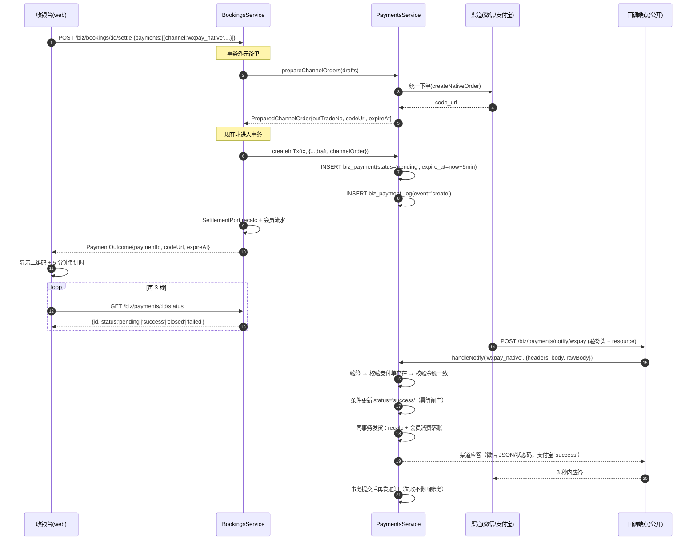

# 收银与支付通道接入

本页覆盖收银台与在线支付通道的**真实实现**：通道枚举、两步下单 + 回调幂等落地、渠道适配层、兜底定时任务与配置启用判定。

- 代码位置：`src/modules/biz/payment/`
  - `payments/payments.service.ts`（收银主逻辑，1027 行）
  - `payments/payments.controller.ts`（`/biz/payments`）
  - `channels/channel.interface.ts`（渠道抽象）
  - `channels/wxpay-native.provider.ts` / `channels/alipay-qr.provider.ts`
  - `diffs/payment-diffs.service.ts`（对账，见 [退款判责与对账](/backend/refund-reconcile)）
- 表结构：`src/database/schema/index.ts` 的 `bizPayments`（1346 行）、`bizPaymentLogs`（1419 行）
- 配置：`src/config/app-config.service.ts`、`src/modules/biz/common/biz-config.service.ts`

::: tip 阅读顺序
先看「通道矩阵」确定每种收款方式的性质，再看「在线支付两步 + 回调」的时序图，最后看「改动这里时最容易踩的坑」。
:::

## 通道矩阵

`biz_payment.channel` 是 MySQL 枚举，取值见 `src/database/schema/index.ts`：

```ts
// src/database/schema/index.ts（bizPayments.channel）
channel: mysqlEnum('channel', [
  'wxpay_native',
  'alipay_qr',
  // 小程序 JSAPI（C1）落预支付单用；本期无 provider，见 payments.service.ts 的 PaymentChannel 注释
  'wxpay_jsapi',
  'cash',
  'wechat_offline',
  'alipay_offline',
  'balance',
  'card',
  'credit',
]).notNull(),
```

`payments.service.ts` 里另有一个**显式收窄**的 `PaymentChannel` 类型，**故意不含 `wxpay_jsapi`**：

```ts
// src/modules/biz/payment/payments/payments.service.ts:62
export type PaymentChannel =
  | 'wxpay_native'
  | 'alipay_qr'
  // ⚠️ `biz_payment.channel` 列上还有 `wxpay_jsapi`（小程序支付预留），但**故意不进本类型**：
  // 这里没有 provider，加进来会被 `isOnlineChannel` 判成线下渠道从而直接置成功，更危险。
  | 'cash'
  | 'wechat_offline'
  | 'alipay_offline'
  | 'balance'
  | 'card'
  | 'credit';
```

| 通道             | 含义                                 | 需要通道对接                    | 产生真实资金   | 代码行为                                                    |
| ---------------- | ------------------------------------ | ------------------------------- | -------------- | ----------------------------------------------------------- |
| `wxpay_native`   | 微信 Native 扫码，顾客扫店家屏上的码 | ✅ 需商户号 / APIv3 密钥 / 证书 | ✅             | 落 `pending` + `code_url`，回调/查单落地                    |
| `alipay_qr`      | 支付宝当面付（预下单扫码）           | ✅ 需 appId / RSA2 密钥对       | ✅             | 同上                                                        |
| `cash`           | 现金，只记账                         | ❌                              | ✅（线下）     | 直接 `success`，**允许 `received_amount > amount`**（找零） |
| `wechat_offline` | 店家自己的微信收款码，只记账         | ❌                              | ✅（线下）     | 直接 `success`                                              |
| `alipay_offline` | 店家自己的支付宝收款码，只记账       | ❌                              | ✅（线下）     | 直接 `success`                                              |
| `balance`        | 储值余额支付                         | ❌                              | ❌（内部划转） | 先条件更新扣余额，再落 `success`                            |
| `card`           | 次卡核销                             | ❌                              | ❌             | `amount = received_amount = 0`，落 `success` 并核销一次     |
| `credit`         | 挂账                                 | ❌                              | ❌             | **本 service 拒绝**，由 `CreditPort` 生成应收单             |
| `wxpay_jsapi`    | 小程序内 JSAPI 支付                  | P2                              | —              | **本期只有契约位**，见下                                    |

### `wxpay_jsapi` 本期状态

- 数据库列上已预留该枚举值；
- `payments.service.ts` 的 `toPaymentChannel()` 会**显式抛 400**：

```ts
// src/modules/biz/payment/payments/payments.service.ts:995
if (channel === 'wxpay_jsapi')
  throw new BadRequestException('小程序 JSAPI 支付尚未接入（C1）');
```

- 小程序端接口 `POST /api/v1/app/payments/wxpay/jsapi` 抛 `501 NotImplementedException`（契约骨架，不落库）：见 `src/modules/app/member/app-member.controller.ts` 的 `wxpayJsapi()`；
- 但**回调方向的骨架是真的**：`POST /api/v1/app/payments/wxpay/notify`（`src/modules/app/payments/app-payments.controller.ts`）复用后台 `PaymentPort.handleNotify('wxpay_native', ...)`，与 Native 共用同一套验签 / 幂等 / 发货。

::: warning 不要把 `wxpay_jsapi` 当成"已支持的线下渠道"
`isOnlineChannel()` 只认 `wxpay_native` / `alipay_qr`。任何"顺手把 jsapi 加进枚举"的改动都会让它落到 `status: 'success'` 的离线分支 —— 钱没到账，本地已经核销。
:::

## 在线支付两步 + 回调

### 时序图



### 步骤 1：先在事务外下单

这是与早期设计**最重要的差异**：渠道下单**不在事务里**。

```ts
// src/modules/biz/payment/payments/payments.service.ts:223
async prepareChannelOrder(draft: PaymentDraft): Promise<PreparedChannelOrder | null> {
  const channel = toPaymentChannel(draft.channel);
  if (!isOnlineChannel(channel)) return null;
  const provider = this.providerFor(channel);
  const expireAt = new Date(Date.now() + (await this.bizConfig.payment()).qrExpireMinutes * 60_000);
  // 与主键无关的交易号：下单时还没有本地单（主键要 INSERT 之后才有）
  const outTradeNo = buildOutTradeNoByToken('P');
  const order = await provider.createNativeOrder({ outTradeNo, amount: Math.trunc(draft.amount), expireAt, ... });
  return { outTradeNo, codeUrl: order.codeUrl, expireAt, raw: order.raw };
}
```

调用方（`bookings.service.ts:561`、`bookings.service.ts:1350`、`receivables.service.ts:326`）都遵循同一顺序：

1. **事务外** `prepareChannelOrders(drafts)` 拿到 `outTradeNo` / `codeUrl` / `expireAt`；
2. 事务内 `createInTx(tx, { ...draft, channelOrder: prepared[index] })` 落库。

代价（代码注释里已确认可接受）：事务最终回滚时，渠道侧留下一张客户端从没见过的待支付单，5 分钟后自然过期，不影响对账。

::: danger 在线渠道不能直接走 `POST /biz/payments`
`PaymentsController.create()` 直接把 body 交给 `PaymentsService.create()`，后者自己开事务调 `createInTx`，**没有** `channelOrder`。因此在线渠道会命中：

```
BadRequestException: 在线渠道必须先调 prepareChannelOrder（渠道下单不能在事务里做）
```

线上收款的正门是 `POST /biz/bookings`（下单即收定金）与 `POST /biz/bookings/:id/settle`（补收尾款/混合支付），以及挂账销账 `POST /biz/receivables/:id/settle`。`POST /biz/payments` 仍可用于 `cash` / `wechat_offline` / `alipay_offline` / `balance` / `card`。
:::

### 步骤 2：落支付单（同一事务）

`createInTx` 的顺序被**锁顺序**约束（`biz_staff → biz_customer → biz_payment → biz_member_card`）：

```ts
// src/modules/biz/payment/payments/payments.service.ts:300
// 1) 储值扣减必须**先于**支付单 INSERT：全局锁顺序 biz_customer → biz_payment（§6.6）
if (channel === 'balance') {
  await this.members.applyBalancePayment(tx, { customerId: draft.customerId, amount, bookingId, ... });
}

// 2) 落单（pending / success），单号在主键回填前用一次性占位保证 UNIQUE 不冲突
const inserted = await tx.insert(bizPayments).values({ ... status: isOnline ? 'pending' : 'success', ... });
// 3) 次卡核销在支付单之后：锁顺序 biz_payment → biz_member_card
if (channel === 'card') { ... await this.memberCards.useCard(tx, {...}); }
```

金额口径：

- `card` 的 `amount` / `received_amount` 一律 **0**（核销不产生金额）；
- `cash` 允许 `receivedAmount > amount`（找零）；**其它渠道实收不得超过应收**（400）；
- 单号：`payment_no = P{yyyyMMdd}{id}`（`buildDocNo`），`out_trade_no` 全局唯一（`uq_payment_out_trade_no`）。

### 步骤 3：回调（公开端点）

真实路径（**不是** `notify/{channel}`）：

```ts
// src/modules/biz/payment/payments/payments.controller.ts:126
@Post('notify/wxpay')
@Public()
async notifyWxpay(@Req() request: NotifyRequest, @Res() reply: FastifyReply) { ... }

@Post('notify/alipay')
@Public()
async notifyAlipay(...) { ... }
```

即 `POST /api/v1/biz/payments/notify/wxpay` 与 `POST /api/v1/biz/payments/notify/alipay`，两者都带 `@Public()` **跳过全局 `AccessTokenGuard`**（渠道服务器不可能带 `Bearer`），报文真伪全靠验签。

`handleNotify()` 的处理顺序：

```ts
// src/modules/biz/payment/payments/payments.service.ts:445
// 通道未配置 → 返回失败应答，绝不放行
if (!provider.configured)
  return this.failureReplyOf(
    channel,
    `${provider.label}通道未启用`,
    'business',
  );

// 验签 + 解密
payload = await provider.verifyNotify({
  headers: raw.headers,
  body: raw.body,
  rawBody: raw.rawBody,
});

// 支付单必须存在
const [payment] = await this.database.db
  .select()
  .from(bizPayments)
  .where(eq(bizPayments.outTradeNo, payload.outTradeNo))
  .limit(1);
if (!payment) return provider.failureReply('支付单不存在', 'business');

// 金额不一致 → 写 callback_invalid 留证 + 拒绝
if (payload.amount !== payment.amount) {
  await this.insertLog(this.database.db, payment.id, 'callback_invalid', {
    reason: 'amount_mismatch',
    expected: payment.amount,
    actual: payload.amount,
    transactionId: payload.transactionId,
  });
  return provider.failureReply('回调金额与订单不一致', 'business');
}
```

### 幂等闸门（唯一的落地口）

`settlePayment()` 是**回调与主动查单共用的唯一落地实现**（禁止两份实现）：

```ts
// src/modules/biz/payment/payments/payments.service.ts:648
const affected = await tx
  .update(bizPayments)
  .set({
    status: 'success',
    transactionId: input.transactionId,
    paidAt: input.successTime,
    callbackAt: new Date(),
  })
  .where(
    and(
      eq(bizPayments.outTradeNo, payment.outTradeNo),
      inArray(bizPayments.status, SETTLE_FROM_STATUSES), // ['pending','closed','failed']
    ),
  );
if (!affected[0].affectedRows) return false; // 重复 / 并发回调 → 直接放弃
```

::: warning 允许落地的起始状态**不止 `pending`**
`SETTLE_FROM_STATUSES = ['pending', 'closed', 'failed']`（`payments.service.ts:150`）。本地关单只是**我们自己的超时判断**，顾客完全可能最后一刻付款成功；已验签的回调是资金事实，比本地超时状态更权威。只认 `pending` 会把这些钱记丢。

**但不含** `success` / `refunded` / `partial_refunded` —— 那些状态已经落过账，不能被重新落成 `success`（会把退款单的账冲坏）。
:::

落地成功后的「发货」在同一事务内完成（`deliver()`，`payments.service.ts:686`）：

```ts
if (payment.bookingId !== null) await this.settlement.recalc(tx, payment.bookingId);
if (payment.receivedAmount > 0 && payment.channel !== 'card') {
  await this.members.recordConsumption(tx, { customerId, paidAmount: payment.receivedAmount, ... });
}
// 通知只在**事务提交后**发送（sendPaidNotice），失败回滚不了账务也不阻塞回调应答
```

### 3 秒应答与「同步落账」的取舍

```ts
// src/modules/biz/payment/payments/payments.service.ts:155
// 微信要求 **5 秒内应答**。我们**刻意选择同步落账**（先落账再应答）——
// 文档推荐「先应答再异步处理」，但异步一旦失败就会「应答了却没落账」，
// 对资金链路是更糟的失败模式。超时的后果也是良性的：微信会重投，
// 而重投命中幂等闸门后直接答 SUCCESS。
const CALLBACK_SLOW_SETTLE_MS = 3000;
```

超过 3 秒只打一条 `logger.warn`（**只观测、不改行为**）。

### 渠道应答的两套规则

`ChannelFailureKind`（`channel.interface.ts:24`）决定 HTTP 状态码，**两个渠道要求完全不同**：

| 渠道    | 成功应答                                         | 失败应答                                                                   | 依据                                                         |
| ------- | ------------------------------------------------ | -------------------------------------------------------------------------- | ------------------------------------------------------------ |
| 微信 V3 | HTTP 200 + `{"code":"SUCCESS","message":"成功"}` | `verify` → **401**；`business` → **400**（`wxpay-native.provider.ts:294`） | HTTP 状态码表达受理结果；回 200 会被当成「接收成功」不再重投 |
| 支付宝  | HTTP 200 + 文本 `success`                        | HTTP 200 + 文本 `failure`                                                  | 固定 200，用**响应体文本**表达                               |

::: danger 微信回调失败绝不能回 200
注释里列了两个真实后果：① 「平台证书尚未缓存好 / 时钟偏差」这类**重投就能成功**的情形被我们自己关掉，这笔支付再也落不了账；② 微信会下发签名值带 `WECHATPAY/SIGNTEST/` 前缀的**探测流量**检验商户是否真的验签，回 200 等于告诉微信「我验签失败也当成功」。
:::

## 通道适配层

### 抽象接口

`src/modules/biz/payment/channels/channel.interface.ts` 定义了 `PaymentChannelProvider` 抽象类，方法集：

| 方法                                             | 作用                                                  |
| ------------------------------------------------ | ----------------------------------------------------- |
| `configured`                                     | 密钥 / 证书是否齐全；`false` 时业务侧抛「通道未启用」 |
| `createNativeOrder(input)`                       | 统一下单，返回 `codeUrl`                              |
| `queryOrder(outTradeNo)`                         | 主动查单（回调丢失兜底）                              |
| `refund(input)`                                  | 原路退款                                              |
| `verifyNotify(input)`                            | 回调验签 + 解密/解析，返回 `NotifyPayload`            |
| `downloadBill(billDate)`                         | 下载渠道账单（**不抛错**，不可得返回 `[]`）           |
| `successReply()` / `failureReply(message, kind)` | 渠道要求的应答体                                      |

::: tip 只有两个在线渠道有 Provider
线下收款（`cash` / `wechat_offline` / `alipay_offline`）、储值（`balance`）、次卡（`card`）**只记账不走渠道**，因此**没有** Provider。`providerFor()` 只认 `wxpay_native` / `alipay_qr`，其余抛 `BadRequestException`。
:::

### 微信：APIv3 签名 + 平台证书

`channels/wxpay-native.provider.ts` 的关键实现点：

- **签名串**：`方法\nURL\n时间戳\n随机串\n报文\n`，头 `Authorization: WECHATPAY2-SHA256-RSA2048 mchid="...",nonce_str="...",signature="...",timestamp="...",serial_no="..."`；
- **报文解密**：AES-256-GCM，key = `WXPAY_API_V3_KEY`（`Buffer.byteLength(apiV3Key,'utf8') !== 32` 时直接抛「APIv3 密钥必须为 32 位」）；`ciphertext` 末 16 字节是 authTag；
- **回调验签**：`Wechatpay-Signature` / `-Timestamp` / `-Nonce` / `-Serial` 四个头；时间戳容差 `NOTIFY_CLOCK_SKEW_SECONDS = 300` 秒防重放；签名串是 `timestamp\nnonce\nrawBody\n`，**必须原样报文**；
- **平台证书**：`/v3/certificates` 下载并解密，缓存 `PLATFORM_CERT_TTL_MS = 12h`；本地注入优先 —— 配了 `WXPAY_PLATFORM_PUBLIC_KEY` 就**完全不走网络**（内容可以是 SPKI 公钥 PEM 或 X509 证书 PEM）；
- **有界重试**：`REQUEST_MAX_ATTEMPTS = 3`，退避 `n × 200ms`；**只重试网络异常 / 5xx / 429，4xx 不重试**。敢重试是因为写操作都以商户单号为幂等键（下单 `out_trade_no`、退款 `out_refund_no`）；
- **`Request-Id` 留痕**：失败时把渠道应答头里的 `Request-Id` 拼进报错文案，微信侧凭它直接定位那一次调用；
- 单次 `fetch` 超时 `REQUEST_TIMEOUT_MS = 5000`。

::: warning `rawBody` 的退化路径
`NotifyVerifyInput.rawBody` 是可选字段，注释写明：Nest 默认不保留 rawBody 时退化为 `JSON.stringify(body)`。`src/main.ts` 已为 Fastify 打开 `rawBody: true`，但**任何绕过 Fastify rawBody 的调用（例如自己包一层 proxy）都会让微信回调验签失败**。
:::

### 支付宝：RSA2 + 参数排序

`channels/alipay-qr.provider.ts` 的关键实现点：

- **签名原串**：去掉 `sign` / `sign_type`，剔除 `undefined` / `null`，按 key 升序拼 `k=v&k=v`，`RSA-SHA256` 签 base64；
- **接口**：`alipay.trade.precreate`（拿 `qr_code`）、`alipay.trade.query`、`alipay.trade.refund`、`alipay.data.dataservice.bill.downloadurl.query`（账单）；
- **响应节点**：方法名里的 `.` 换成 `_` 再拼 `_response`（如 `alipay_trade_precreate_response`），`code !== '10000'` 即失败；
- **查单特例**：`code === 'ACQ.TRADE_NOT_EXIST'` 返回 `pending`（交由关单任务兜底），不抛错 —— 靠 `call(..., tolerateBusinessError = true)`；
- **回调验签**：`sign_type` 必须是 `RSA2`，验签后再校验 `app_id` 匹配，`trade_status` 只接受 `TRADE_SUCCESS` / `TRADE_FINISHED`；
- **退款幂等**：以 `out_request_no`（= `biz_refund.refund_no`）为幂等键，响应里没有独立退款单号，因此 `channelRefundId` 直接回填 `input.outRefundNo`；
- **金额单位**：支付宝用「元」字符串，代码里用 `centsToYuan` / `yuanToCents` 转换（`yuanToCents` 用 `Math.round`）；
- **账单**：官方是 ZIP（内含 GBK CSV），代码手写中央目录解析 + `inflateRawSync`，再 `TextDecoder('gbk')` 解码；汇总行以 `#` 开头。

### 未配置通道时的行为

| 场景                               | 行为                                                                                                                                                          |
| ---------------------------------- | ------------------------------------------------------------------------------------------------------------------------------------------------------------- |
| `prepareChannelOrder` 时通道未配置 | `providerFor()`（`payments.service.ts:858`）抛 `ConflictException('微信支付通道未启用' / '支付宝通道未启用')`；**在写任何本地数据之前**抛出 → 不留 pending 单 |
| 回调时通道未配置                   | `failureReplyOf(channel, 'xx通道未启用', 'business')` —— **返回失败应答，绝不放行**                                                                           |
| 对账时通道未配置                   | 记 `logger.warn` 并 `continue`，返回 `{ diffs: 0 }`，**不抛错**                                                                                               |
| 其它收款方式                       | 完全不受影响：现金 / 线下码 / 储值 / 次卡 / 挂账照常可用                                                                                                      |

## 兜底：主动查单与关单

两个任务都**只改状态、不碰钱**（money-invariants 不变量 5），handler 注册在 `src/modules/jobs/jobs.service.ts`，cron 在 `src/database/seed/biz.ts`：

| handler                | cron（6 段式）                   | 说明                                                                                                           |
| ---------------------- | -------------------------------- | -------------------------------------------------------------------------------------------------------------- |
| `closeExpiredPayments` | `0 * * * * *`（**每分钟**）      | `pending` 且 `expire_at < now` → `closed`；单批上限 **500**（`closeExpired()`，`payments.service.ts:718`）     |
| `queryPendingPayments` | `0 */2 * * * *`（**每 2 分钟**） | 对未过期（或过期 24h 内）的在线支付单主动查单；单批上限 **200**（`queryPending()`，`payments.service.ts:530`） |

**关单**：逐笔条件更新 `WHERE id=? AND status='pending'`，与回调竞争时谁先改谁生效（`affectedRows = 0` 就跳过），每次写 `close` 日志（`reason: 'expired'`）。

**主动查单**的筛选条件：

```ts
// payments.service.ts:536
.where(and(
  inArray(bizPayments.status, SETTLE_FROM_STATUSES),   // pending / closed / failed
  inArray(bizPayments.channel, ONLINE_CHANNELS),       // wxpay_native / alipay_qr
  gt(bizPayments.expireAt, lookbackFrom),              // lookbackFrom = now − 24h
  isNull(bizPayments.transactionId),                   // 已拿到渠道交易号的不再查
))
.orderBy(desc(bizPayments.expireAt))                   // 最近过期的先查
.limit(200);
```

单笔 `queryChannel(id, actorId)`：只对 `SETTLE_FROM_STATUSES` 内的单发查单请求；渠道 `success` 且金额一致 → 走 `settlePayment(..., 'query')`，与回调**同一条幂等落地**；金额不一致 → 写 `callback_invalid`（`reason: 'query_amount_mismatch'`）并抛 `ConflictException`，**不改账**；渠道 `failed` / `closed` → 条件更新 + 写 `query` 日志。

### 重新收款前先关旧单

`closePendingOfBooking(tx, bookingId, actorId)`（`payments.service.ts:400`）逐笔条件更新 `pending → closed` 并写 `close` 日志（`reason: 'recollect'`）。同一预约重新收款**必须新建支付单**（`out_trade_no` 全局唯一，不能复用旧号）。

## 配置项与启用判定

### 渠道启用判定

`src/config/app-config.service.ts` 用 `complete()` 辅助函数：**所有字段都是非空 string 才 `configured = true`**。

```ts
function complete<T extends Record<string, string | undefined>>(
  values: T,
): T & { configured: boolean } {
  return {
    ...values,
    configured: Object.values(values).every(
      (value) => typeof value === 'string' && value.length > 0,
    ),
  };
}
```

| 渠道     | 参与 `configured` 判定的环境变量                                                                             | 数量               |
| -------- | ------------------------------------------------------------------------------------------------------------ | ------------------ |
| 微信支付 | `WXPAY_APPID`、`WXPAY_MCHID`、`WXPAY_SERIAL_NO`、`WXPAY_PRIVATE_KEY`、`WXPAY_API_V3_KEY`、`WXPAY_NOTIFY_URL` | **6 项齐全才启用** |
| 支付宝   | `ALIPAY_APP_ID`、`ALIPAY_PRIVATE_KEY`、`ALIPAY_PUBLIC_KEY`、`ALIPAY_NOTIFY_URL`                              | **4 项齐全才启用** |

::: tip `WXPAY_PLATFORM_PUBLIC_KEY` 不参与判定
它被**故意放在 `complete()` 之外**：

```ts
const base = complete({
  appId,
  mchId,
  serialNo,
  privateKey,
  apiV3Key,
  notifyUrl,
});
// 放在 complete() 之外：配不配它都不该让通道「未启用」
return { ...base, platformPublicKey: this.values.WXPAY_PLATFORM_PUBLIC_KEY };
```

配它只是「免联网下载平台证书」，配不配都不影响通道能否启用。
:::

### 业务配置（`sys_config`）

`src/modules/biz/common/biz-config.service.ts` 的 `BIZ_CONFIG_DEFAULTS` 中与支付相关的：

| key                           | 默认值 | 含义                                                                                     |
| ----------------------------- | ------ | ---------------------------------------------------------------------------------------- |
| `biz.payment.qrExpireMinutes` | `5`    | 二维码有效期（分钟），→ `expire_at = now + N`                                            |
| `biz.payment.reconcileHour`   | `6`    | 每日对账触发小时（**注意**：实际 cron 由 `sys_job.cron` 决定，seed 里是 `0 30 6 * * *`） |

## 相关表

### `biz_payment`（`src/database/schema/index.ts:1346`）

| 字段                                    | 类型                                   | 说明                                                                          |
| --------------------------------------- | -------------------------------------- | ----------------------------------------------------------------------------- |
| `payment_no`                            | varchar(32)，`uq_payment_no`           | `P{yyyyMMdd}{id}`                                                             |
| `out_trade_no`                          | varchar(64)，`uq_payment_out_trade_no` | 提交渠道的商户订单号，回调按它匹配                                            |
| `booking_id` / `customer_id`            | int unsigned（前者 NULL）              | 充值 / 购卡类 `booking_id` 为空                                               |
| `purpose`                               | enum                                   | `deposit` / `final` / `recharge` / `card_buy` / `credit_settle`               |
| `channel`                               | enum                                   | 见通道矩阵                                                                    |
| `amount` / `received_amount`            | int unsigned                           | **应收** / **实收**（分）；现金可大于 `amount`                                |
| `status`                                | enum default `pending`                 | `pending` / `success` / `failed` / `closed` / `refunded` / `partial_refunded` |
| `code_url`                              | varchar(512) NULL                      | Native 二维码内容                                                             |
| `transaction_id`                        | varchar(64) NULL                       | 渠道交易号                                                                    |
| `paid_at` / `expire_at` / `callback_at` | datetime NULL                          |                                                                               |
| `refunded_amount`                       | int unsigned default 0                 | 已退金额（**打渠道前先预留**，见退款页）                                      |
| `remark` + `...auditColumns`            |                                        | `created_by` / `updated_by` / `created_at` / `updated_at` / `deleted_at`      |

索引：`idx_payment_booking(booking_id)`、`idx_payment_customer(customer_id, id)`、`idx_payment_status(status, created_at)`、`idx_payment_txn(transaction_id)`。

### `biz_payment_log`（`src/database/schema/index.ts:1419`）

**只追加，不更新不删除**，用于排障举证：`payment_id`（FK → `biz_payment.id`，`ON DELETE cascade`）、`event`（`create` / `callback` / `query` / `close` / `refund` / `callback_invalid`）、`http_status`、`raw`（json）、`created_at`。`callback_invalid` 会写入 `{ reason, expected, actual, transactionId }`；迟到落地会带 `reopenedFrom`。

### 出参脱敏

`findOne()` 对 `logs[].raw` 调用 `redactChannelRaw()`，敏感键正则（`payments.service.ts:107`）：

```ts
const SENSITIVE_RAW_KEY =
  /openid|buyer|payer|phone|mobile|tel|id_?card|identity|real_?name/i;
```

微信 `payer.openid`、支付宝 `buyer_id` / `buyer_logon_id` 会被替换成 `'[已脱敏]'`（**按 key 名递归掩码，保留报文结构**，深度上限 6）。**库里保持原样**（留证），只对接口出参脱敏。

## 改动这里时最容易踩的坑

1. **把前端传来的金额落库**。前端传的 `amount` / `receivedAmount` 只用于展示与二次确认；服务端一律 `Math.trunc(draft.amount)` 重算，且非现金渠道 `received_amount > amount` 直接 400。
2. **把回调当可信输入**。必须先 `verifyNotify()` 验签，再校验 `payload.amount === payment.amount`，**绝不按回调金额改账**；不一致写 `callback_invalid` 留证。
3. **在事务里下单 / 打渠道**。渠道下单是 5 秒超时的网络 IO，持事务等回包会放大锁等待。所有渠道调用都在事务外（`prepareChannelOrder`），事务里只落库。
4. **重复落地**。落地口只有 `settlePayment()` 一处，闸门是条件更新 + `SETTLE_FROM_STATUSES`。任何"再写一份回调落地逻辑"都会绕过幂等。
5. **重复收款不关旧单**。重新收款要新建支付单（`out_trade_no` 唯一），旧 `pending` 先用 `closePendingOfBooking()` 关掉，否则收银台会同时挂两张二维码。
6. **回调里做重活**（发短信、跑报表）。通知放在**事务提交后**（`sendPaidNotice`），失败只 warn 不回滚；`deliver()` 里**不再**额外 `enqueueInTx`（否则会留一条永不 flush 的 pending 通知）。
7. **给 `wxpay_jsapi` 加枚举就以为支持了**。它没有 provider，会被 `isOnlineChannel()` 判成线下渠道直接置成功。
8. **改动 `SETTLE_FROM_STATUSES`**。加 `success` / `refunded` 会让退款单的账被冲坏；删掉 `closed` / `failed` 会丢「最后一刻付款成功」的钱。
9. **忘了 `raw` 脱敏或过度脱敏**。脱敏只作用于**出参**；库里必须留原文，否则对账和渠道排障都没有依据。
