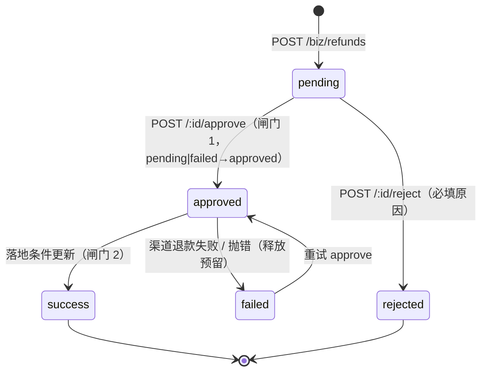

# 退款判责与对账

本页覆盖**退款阶段分流（服务开始前无理由全退 / 服务中店长手动）、判责规则（已降级为参考建议）、执行期幂等与同事务回写**，以及**渠道对账差异**的落库与人工处理。

- 代码位置：
  - `src/modules/biz/payment/refunds/refunds.service.ts`（880 行）/ `refunds.controller.ts`
  - `src/modules/biz/payment/diffs/payment-diffs.service.ts` / `payment-diffs.controller.ts`
- 表：`biz_refund`、`biz_refund_policy`、`biz_payment_diff`（`src/database/schema/index.ts`）
- 定时任务：`reconcilePayments`（每日 6:30）、`markOverdueReceivables`（见 [挂账与应收](/backend/credit)）

## 退款阶段：按「当前时间 vs 预约开始时间」分流

退款**不再是「申请 → 待审批 → 审批执行」两段式**：`POST /biz/refunds` 建单后**当场执行**。

| 阶段                      | 判定                              | 退款金额                                                                        | 谁能发起                            |
| ------------------------- | --------------------------------- | ------------------------------------------------------------------------------- | ----------------------------------- |
| `before_start` 服务开始前 | `now < biz_booking.start_at`      | **无理由全额退**：锁定为该支付单剩余可退（忽略前端传值），`liable` 强制 `store` | 任何有 `biz:refund:apply` 的人      |
| `in_service` 服务中       | `now >= start_at`（**含已完成**） | **店长手动填写** `actualAmount`，上限 = 该支付单剩余可退                        | 需要 `biz:refund:approve`，否则 403 |

```ts
// src/modules/biz/payment/refunds/refunds.service.ts
export function resolveRefundStage(
  startAt: Date | null,
  at: Date,
): RefundStage {
  if (!startAt) return 'before_start'; // 只有 paymentId（无预约）→ 按开始前处理
  return at.getTime() < startAt.getTime() ? 'before_start' : 'in_service';
}
```

- **只看时间，不看预约状态**：`pending` 但已过开始时间也算 `in_service`。
- 阶段落库到 `biz_refund.refund_stage`（历史数据为 `NULL`：加列之前按 `hours_before` 判责）。
- 新流程下 `deduct_amount` 恒 `0`、`policy_id` 恒 `NULL` —— 判责规则**不再参与金额计算**，
  只在 `preview.policySuggestAmount` 里作为参考出现。
- 服务中退款被 403 / 400 挡下的三种情况：无 `biz:refund:approve`、未填 `actualAmount`、金额 > 剩余可退。
- `POST /:id/approve` 与 `POST /:id/reject` **保留**，现在用于 `failed` 单重试与历史 `pending` 单收尾。

## 判责规则（已降级为参考建议）

::: warning 规则不再决定退款额
服务开始前 = 全额退；服务中 = 店长定多少退多少。`biz_refund_policy` 的存在意义只剩
「给店长一个参考数字」（`preview.policySuggestAmount`）与历史数据的可解释性。
:::

### 表结构

```ts
// src/database/schema/index.ts:1540
export const bizRefundPolicies = mysqlTable(
  'biz_refund_policy',
  {
    id: int('id', { unsigned: true }).autoincrement().primaryKey(),
    name: varchar('name', { length: 50 }).notNull(),
    hoursBefore: int('hours_before', { unsigned: true }).notNull(),
    refundPermille: int('refund_permille', { unsigned: true }).notNull(),
    minAmount: int('min_amount', { unsigned: true }).default(0).notNull(),
    status: mysqlEnum('status', ['active', 'disabled'])
      .default('active')
      .notNull(),
    sort: int('sort').default(0).notNull(),
    remark: varchar('remark', { length: 200 }),
    ...auditColumns,
  },
  (table) => [
    uniqueIndex('uq_refund_policy_name').on(table.name),
    index('idx_refund_policy_status_sort').on(table.status, table.sort),
  ],
);
```

### 默认档位（seed）

`src/database/seed/biz.ts` 的 `REFUND_POLICY_SEEDS`（按 `name` 幂等，**已存在的行一律跳过，不覆盖运营改过的值**）：

| name              | hours_before | refund_permille | min_amount | sort |
| ----------------- | ------------ | --------------- | ---------- | ---- |
| `24 小时以上全退` | 24           | 1000            | 0          | 1    |
| `2-24 小时退一半` | 2            | 500             | 0          | 2    |
| `2 小时内不退`    | 0            | 0               | 0          | 3    |

::: tip 爽约不退靠的是 `hours_before = 0` 这一档
提前小时数取 `Math.max(hoursBetween(startAt, cancelAt), 0)` —— **负值（已过开始时间）被夹到 0**，于是必然命中 `hours_before = 0` 的「不退」档。
:::

### 命中逻辑

规则只给**建议**，真正的判责评估在 `RefundsService.assess()`：

```ts
// src/modules/biz/payment/refunds/refunds.service.ts:700
const policy =
  input.liable === 'customer' && input.startAt
    ? await this.matchPolicy(input.cancelAt, input.startAt, input.policyId)
    : null;
const refundPermille =
  input.liable === 'customer' ? (policy?.refundPermille ?? 1000) : 1000;
const revalue = (base: number): number => {
  if (base <= 0) return 0;
  const amount = Math.min(permilleOf(base, refundPermille), base);
  const floor = policy?.minAmount ?? 0;
  return Math.max(Math.min(Math.max(amount, floor), base), 0);
};
```

读法：

- `liable = 'customer'` → 命中规则 → `refundPermille` = 规则的 `refund_permille`；**都不命中 → 1000‰（全退）**；
- `liable = 'store'` / `'force_majeure'` → 一律 1000‰（全退），**根本不查规则**；
- 金额夹取：`min(permilleOf(base, permille), base)`，再夹 `min_amount` 下限，最后夹 `[0, base]`。

命中规则：

```ts
// src/modules/biz/payment/refunds/refunds.service.ts:721
private async matchPolicy(cancelAt: Date, startAt: Date, policyId: number | undefined) {
  if (policyId) { /* 显式指定规则：按 id 直取（仍要求未软删） */ }
  const hours = Math.max(hoursBetween(startAt, cancelAt), 0);
  const [policy] = await this.database.db.select().from(bizRefundPolicies)
    .where(and(
      eq(bizRefundPolicies.status, 'active'),
      isNull(bizRefundPolicies.deletedAt),
      lte(bizRefundPolicies.hoursBefore, Math.floor(hours)),   // hours_before ≤ 实际提前小时数
    ))
    .orderBy(desc(bizRefundPolicies.hoursBefore), asc(bizRefundPolicies.sort), asc(bizRefundPolicies.id))
    .limit(1);
  return policy ?? null;
}
```

即「`hours_before ≤ 实际提前小时数` 中**最大**的那条」；并列时按 `sort` 升序、再按 `id` 升序。`hours` **先 `Math.floor` 再比较** —— 提前 23.9 小时按 23 小时算，命中 `hours_before = 2` 那一档（退 50%），不是 24 小时档。

### 试算接口

`POST /api/v1/biz/refunds/preview`（权限 `biz:refund:apply`），入参 `{ bookingId, cancelAt?, liable? }`。返回体（`RefundPreview`）：

| 字段                                      | 口径                                                                                                         |
| ----------------------------------------- | ------------------------------------------------------------------------------------------------------------ |
| `startAt` / `cancelAt` / `hoursToStart`   | 时间基准；`hoursToStart` 保留 2 位小数，**可为负**                                                           |
| `policyId` / `policyName` / `hoursBefore` | 命中的规则（都不命中为 `null`）                                                                              |
| `refundPermille`                          | 可退比例（千分比）                                                                                           |
| `paidAmount`                              | 预约毛实收 = Σ 成功支付单 `received_amount`                                                                  |
| `refundedAmount`                          | Σ 成功退款单 `actual_amount`                                                                                 |
| `refundableAmount`                        | `paidAmount − refundedAmount`                                                                                |
| `stage` / `stageLabel`                    | 退款阶段：`before_start` 服务开始前 / `in_service` 服务中（含已完成）                                        |
| `suggestAmount`                           | **本次实际建议退款额**：服务开始前 = 剩余可退全额；服务中 = `0`（等店长手动填）                              |
| `lockedAmount`                            | `true` = 金额由服务端锁定，前端应只读                                                                        |
| `policySuggestAmount`                     | 按老判责规则算出的**参考值**，不参与写账                                                                     |
| `deductAmount`                            | `refundableAmount − policySuggestAmount`（夹到 ≥ 0），同属参考口径                                           |
| `payments[]`                              | **逐笔可退明细**（`paymentId` / `paymentNo` / `channel` / `amount` / `refundedAmount` / `refundableAmount`） |

::: warning 退款单必须挂在**具体支付单**上
`biz_refund.payment_id` 是 NOT NULL。所以混合支付的预约要退完，需要**按支付单分别申请 / 审批** —— `preview` 的 `payments[]` 就是给前端逐笔操作用的。
:::

## 申请即执行

| 步骤           | 接口                            | 权限点                                                         | 说明                                    |
| -------------- | ------------------------------- | -------------------------------------------------------------- | --------------------------------------- |
| 试算           | `POST /biz/refunds/preview`     | `biz:refund:apply`                                             | 只读，不改账                            |
| **申请并执行** | `POST /biz/refunds`             | 服务开始前 `biz:refund:apply`；服务中 **`biz:refund:approve`** | **建单后当场执行，不落 `pending`**      |
| 列表           | `GET /biz/refunds`              | `biz:refund:list`                                              | 可按 `stage` 过滤（店长只看本店）       |
| 重试执行       | `POST /biz/refunds/:id/approve` | **`biz:refund:approve`**                                       | 主要给 `failed` 单重试                  |
| 驳回           | `POST /biz/refunds/:id/reject`  | **`biz:refund:approve`**                                       | **必填原因**，只对历史 `pending` 单有效 |

权限点字符串核实于 `src/database/seed/menus.ts` 的 `BIZ_PAGES`：`biz_refunds` 页面 `permission: 'biz:refund:list'`、按钮 `biz:refund:approve`；收银台页面挂 `biz:refund:apply`。

预约侧还有两个便捷入口（`src/modules/biz/booking/bookings.controller.ts`）：`GET /biz/bookings/:id/refund-preview`、`POST /biz/bookings/:id/refund`，权限同为 `biz:refund:apply`。

### 申请（`apply`）

金额**完全由阶段决定**，不再走判责计算：

```ts
// src/modules/biz/payment/refunds/refunds.service.ts
const remaining = payment.amount - payment.refundedAmount;
if (remaining <= 0) throw new ConflictException('该支付单已无可退金额');

const stage = resolveRefundStage(booking?.startAt ?? null, new Date());
if (stage === 'before_start') {
  amount = remaining; // 服务开始前：无理由全额退，**忽略前端传值**（防止用旧参数绕过锁定）
  liable = 'store'; // 无理由退 → 不判顾客责
} else {
  if (!hasPermission(actor, 'biz:refund:approve'))
    throw new ForbiddenException(
      '预约已开始，退款需店长处理（权限 biz:refund:approve）',
    );
  const manual = input.actualAmount ?? input.amount;
  if (manual === undefined || manual === null)
    throw new BadRequestException('服务开始后退款必须手动填写退款金额');
  amount = Math.trunc(manual);
  if (amount <= 0) throw new BadRequestException('退款金额必须大于 0');
  if (amount > remaining)
    throw new BadRequestException(
      `退款金额不得超过该支付单剩余可退金额 ${remaining} 分`,
    );
  liable = input.liable ?? 'store';
}
```

落库口径：

```
biz_refund.amount        = actual_amount = 实退额
biz_refund.deduct_amount = 0（新流程无判责扣减）
biz_refund.policy_id     = NULL（不依据任何规则）
biz_refund.refund_stage  = before_start | in_service
```

- `resolvePayment()`：显式 `paymentId` 优先（只接受 `success` / `partial_refunded`），否则按 `bookingId` 取「最近一笔仍可退」的支付单；
- `reason` 必填且至少 2 个字符；
- 建单后写 `biz_payment_log(raw.action='apply')`（raw 里带 `stage`），紧接着调 `this.approve(id, actor.id)` 执行
  —— **没有复制第二份执行链路，资金顺序只有一份**（money-invariants 第 1 条）；
- 返回体比退款单多两个字段：`refundStage` 与 `executed`（`executed = status === 'success'`）。

### 去向 `mode`

| mode       | 含义         | 约束                                                                    |
| ---------- | ------------ | ----------------------------------------------------------------------- |
| `original` | 原路退回     | **只有在线支付（`wxpay_native` / `alipay_qr`）可用**；渠道调用是网络 IO |
| `cash`     | 现金退       | 无渠道调用                                                              |
| `balance`  | 退入储值余额 | 无渠道调用；**只回补实付本金 `principal`**，赠送不退                    |

::: tip 三条硬约束的位置
服务开始前锁定全额（`lockedAmount=true`）、服务中必须店长手动填且夹到剩余可退以内、原因必填 ——
分别落实在 `apply()` 的阶段分支、`apply()` 的 `reason` 校验与 `amount > remaining` 判断上。
`assess()` 与 `biz_refund_policy` 现在**只出现在 `preview` 的参考字段里**，没有任何地方用规则值直接改账。
:::

## 执行期安全：只退一次

### 两道闸门 + 一次预留

`approve()` 的顺序**刻意与直觉相反**：

```ts
// src/modules/biz/payment/refunds/refunds.service.ts:315
// 闸门 1：抢占执行权（failed 允许重试）
const grabbed = await this.database.db.update(bizRefunds)
  .set({ status: 'approved', approveBy: actorId, approveAt: new Date() })
  .where(and(eq(bizRefunds.id, id), inArray(bizRefunds.status, ['pending', 'failed'])));

// 闸门 2：**先占额度，再打渠道**
await this.reserveRefundAmount(refund, actorId);

// 渠道退款：事务外网络 IO；商户退款单号 = refund_no，渠道侧天然幂等
if (refund.mode === 'original') { const result = await provider.refund({...}); }

// 落地：条件更新 approved → success
const current = await this.database.db.transaction((tx) => this.executeRefund(tx, refund, payment, {...}));
```

```ts
// src/modules/biz/payment/refunds/refunds.service.ts:412
const affected = await tx.update(bizRefunds)
  .set({ status: 'success', channelRefundId: ..., refundedAt: new Date(), updatedBy: actorId })
  .where(and(eq(bizRefunds.id, refund.id), eq(bizRefunds.status, 'approved')));
if (!affected[0].affectedRows) throw new AlreadyHandledError();
```

::: danger 为什么必须「先占额度、再打渠道」
`reserveRefundAmount()` 的注释给了完整理由：渠道退款是**已经发生的资金事实**。如果「已退金额不得超过支付单总额」的条件更新在渠道退款**成功之后**才失败，就会变成「钱已经退出去了、本地账上没记」—— 顾客收到了钱，我们却只能在对账里发现，且 `biz_refund` 还停在中间态。

```ts
// src/modules/biz/payment/refunds/refunds.service.ts:784
const reserved = await this.database.db
  .update(bizPayments)
  .set({
    refundedAmount: sql`${bizPayments.refundedAmount} + ${refund.actualAmount}`,
    updatedBy: actorId,
  })
  .where(
    and(
      eq(bizPayments.id, refund.paymentId),
      sql`${bizPayments.refundedAmount} + ${refund.actualAmount} <= ${bizPayments.amount}`,
    ),
  );
if (!reserved[0].affectedRows)
  throw new ConflictException('退款金额超出该支付单可退余额');
```

于是任何时刻「渠道已退的钱」都不会超过「本地已占的额度」。
:::

**释放预留的规则**（`releaseRefundAmount()`，`refunds.service.ts:810`）：

| 场景                                                | 是否释放                                              |
| --------------------------------------------------- | ----------------------------------------------------- |
| 渠道退款返回 `failed`                               | ✅ 释放 + `markFailed()`                              |
| 渠道调用抛异常（含 `providerFor` 抛「通道未启用」） | ✅ 释放 + `markFailed()`                              |
| 非原路退款（`cash` / `balance`）落地失败            | ✅ 释放                                               |
| **原路退款且渠道已成功**、但本地落地失败            | ❌ **不释放**，`logger.error` 留线索，等人工/对账跟进 |

```ts
// src/modules/biz/payment/refunds/refunds.service.ts:390
} else {
  // 原路退款：渠道的钱**已经出去了**，额度必须占着（释放会导致重试再退一次）。
  this.logger.error(`退款单 ${refund.refundNo} 渠道已退款成功但本地落地失败，需人工核对（支付单 ${payment.paymentNo}）`);
}
```

`releaseRefundAmount()` 自身也是条件更新（`refunded_amount >= amount`），不会把 `refunded_amount` 减成负数。

### 落地：同事务回写

`executeRefund()`（`refunds.service.ts:402`）在**一个事务**里做完：

1. `biz_refund` 条件更新 `approved → success`（唯一闸门）；
2. 读回 `biz_payment.refunded_amount`，把支付单状态置 `refunded` 或 `partial_refunded`：

```ts
const fullyRefunded = (after?.refundedAmount ?? 0) >= (after?.amount ?? 0);
await tx
  .update(bizPayments)
  .set({ status: fullyRefunded ? 'refunded' : 'partial_refunded' })
  .where(eq(bizPayments.id, payment.id));
```

3. 写 `biz_payment_log(event='refund', raw.action='success')`；
4. `settlement.recalc(tx, refund.bookingId)` → 回写预约 `refund_amount` / `paid_amount` / `due_amount`（**唯一写入方**，任何接口都不准直接 UPDATE 这些字段）；
5. `commission.reverseForBooking(tx, bookingId, ..., actorId)` → 冲销提成（见 [报表与提成核算](/backend/reports)）；
6. `members.reverseConsumption(tx, {...})` → 按比例回减 `total_spent` 与积分；
7. `mode === 'balance'` 时 `members.creditBalance(tx, { principal: refund.actualAmount, ... })` —— **只回补实付本金**。

::: tip 已退金额在闸门 2 已经预留，落地时不再累加
`executeRefund()` 里**没有** `refunded_amount + x` 这一句，注释写得很清楚：「累加必须在打渠道之前完成，否则会出现『钱已退出、本地闸门失败』的窗口」。
:::

### 驳回

```ts
// src/modules/biz/payment/refunds/refunds.service.ts:485
async reject(id: number, reason: string, actorId: number): Promise<void> {
  const trimmed = reason?.trim();
  if (!trimmed) throw new BadRequestException('驳回原因必填');
  ...
  .set({ status: 'rejected', rejectReason: trimmed.slice(0, 200), approveBy: actorId, approveAt: new Date(), updatedBy: actorId })
  .where(and(eq(bizRefunds.id, id), eq(bizRefunds.status, 'pending')));   // 只有 pending 可驳回
  if (!affected[0].affectedRows) throw new ConflictException('只有待审批的退款单可以驳回');
}
```

### 状态机



### 储值退款

储值（`balance`）退款**走同一套退款单 + 审批流程**，只是：

- 退款单挂在充值那笔 `purpose='recharge'` 的支付单上；
- `mode` 取 `original`（在线充值时）或 `cash` / `balance`；
- 退入余额时**只回补本金**：

```ts
if (refund.mode === 'balance') {
  // 退入储值：只回补实付本金，赠送不退、不可提现（§15.4）
  await this.members.creditBalance(tx, { customerId: refund.customerId, principal: refund.actualAmount, ... });
}
```

赠送余额 `balance_bonus` 在任何路径下都**不会因退款而回补**。会员侧的独立冲正入口见 [会员 · 储值 · 次卡 · 积分](/backend/membership)。

## 对账

### 拉账单与比对

`PaymentDiffsService.reconcile(billDate?)`：

- `billDate` 缺省 = **前一天**（`addLocalDays(shopToday(timezone), -1)`），格式必须 `YYYY-MM-DD`；
- 逐个渠道：`provider.configured === false` → `logger.warn` 后 `continue`（**不抛错**，定时任务不该被配置问题打成 failure）；
- 账单为空（`records.length === 0`）→ 记 warning 并**跳过该渠道**，注释写明「避免误报系统缺单」；
- 系统侧只取：`channel` 匹配、`status IN ('success','partial_refunded','refunded')`、未软删、`paid_at` 落在该营业日区间内（`shopDayRange(billDate, timezone)`）。

比对键：先按 `transaction_id` 匹配，回落到 `out_trade_no`。

```ts
// src/modules/biz/payment/diffs/payment-diffs.service.ts:138
for (const record of records) {
  const system =
    byTransaction.get(record.transactionId) ??
    byOutTradeNo.get(record.outTradeNo);
  if (!system) {
    /* missing_in_system */ continue;
  }
  matched.add(system.id);
  if (system.amount !== record.amount) {
    /* amount_mismatch */ continue;
  }
  if (record.status === 'failed' || record.status === 'closed') {
    /* status_mismatch */
  }
}
for (const payment of systemPayments) {
  if (matched.has(payment.id)) continue;
  /* missing_in_channel：transactionId 用 payment.transactionId ?? payment.outTradeNo 兜底 */
}
```

### 四类差异

| `diff_type`          | 含义       | 触发条件                                                          |
| -------------------- | ---------- | ----------------------------------------------------------------- |
| `missing_in_system`  | 系统缺单   | 渠道账单有、`biz_payment` 里按两个键都找不到；`system_amount = 0` |
| `missing_in_channel` | 渠道缺单   | 系统有成功支付单、渠道账单里没匹配上；`channel_amount = 0`        |
| `amount_mismatch`    | 金额不一致 | 匹配上了但 `system.amount !== record.amount`                      |
| `status_mismatch`    | 状态不一致 | 匹配上了且金额相同，但渠道状态是 `failed` / `closed`              |

### 可重入（唯一键 + upsert）

表定义：

```ts
// src/database/schema/index.ts:1474
uniqueIndex('uq_payment_diff').on(
  table.billDate, table.channel, table.transactionId, table.diffType,
),
index('idx_payment_diff_status').on(table.status, table.billDate),
```

```ts
// src/modules/biz/payment/diffs/payment-diffs.service.ts:201
await this.database.db
  .insert(bizPaymentDiffs)
  .values({ ...input, status: 'pending' })
  .onDuplicateKeyUpdate({
    set: {
      outTradeNo: input.outTradeNo,
      systemAmount: input.systemAmount,
      channelAmount: input.channelAmount,
    },
  });
```

::: warning 冲突时**只刷新金额与系统单号**
`status` / `handle_by` / `remark` **一个字都不动** —— 否则重跑对账会把人工填的处理结果覆盖掉。改这里时不要在 `set` 里加 `status`。
:::

`missing_in_system` 时 `transactionId` 可能为空，会让唯一键失去意义，所以 `missing_in_channel` 分支用 `payment.transactionId ?? payment.outTradeNo` 兜底。

### 人工处理

`PATCH /api/v1/biz/payment-diffs/:id`（权限 `biz:payment:reconcile`）：

```ts
// src/modules/biz/payment/diffs/payment-diffs.service.ts:224
const remark = input.remark?.trim();
if (!remark) throw new BadRequestException('必须填写处理备注，不允许静默忽略差异');
...
.set({ status: input.status, remark: remark.slice(0, 200), handleBy: actorId, handledAt: new Date(), updatedBy: actorId })
.where(and(
  eq(bizPaymentDiffs.id, id),
  eq(bizPaymentDiffs.status, 'pending'),    // 只能处理 pending
  isNull(bizPaymentDiffs.deletedAt),
));
if (!affected[0].affectedRows) throw new ConflictException('该差异已处理或不存在');
```

- `status` 只接受 `resolved` / `ignored`；
- **备注必填**，`ignored` 也必须写理由 —— 「不允许静默忽略差异」在代码层面就是这样落地的；
- **不自动改账**：`PaymentDiffsService` 全文没有任何 `biz_payment` / `biz_refund` 的写入，只有读取与 `biz_payment_diff` 写。

对账接口与权限：

| 接口                                                    | 权限点                  |
| ------------------------------------------------------- | ----------------------- |
| `GET /biz/payment-diffs`                                | `biz:payment:reconcile` |
| `POST /biz/payment-diffs/reconcile`（手动触发某日对账） | `biz:payment:reconcile` |
| `PATCH /biz/payment-diffs/:id`                          | `biz:payment:reconcile` |

### 定时任务

`src/database/seed/biz.ts` 的 `JOB_SEEDS`：

| name         | handler             | cron                         |
| ------------ | ------------------- | ---------------------------- |
| 支付渠道对账 | `reconcilePayments` | `0 30 6 * * *`（每日 06:30） |

handler 实现（`src/modules/jobs/jobs.service.ts`）直接调 `payments.reconcile()`。注意 `BIZ_CONFIG_DEFAULTS` 里还有一个 `biz.payment.reconcileHour = 6`，**那只是配置展示项**，实际调度由 `sys_job.cron` 决定。

## 「改动这里时最容易踩的坑」清单

1. **用前端传值落库**。退款金额必须服务端按「支付单 `amount − refunded_amount`」夹取；前端传的 `amount` / `actualAmount` 只是意图，越界一律 400。
2. **把回调 / 账单当可信输入**。支付回调查询与账单下载都不改账；账单只落差异表。金额不一致写 `callback_invalid`（支付侧）或 `amount_mismatch`（对账侧）留证。
3. **重复退款**。唯一闸门是 `biz_refund` 的条件更新（`approved → success`）+ 执行权抢占（`pending|failed → approved`）。**不要**改成「先 `SELECT` 判断状态再 `UPDATE`」。
4. **先打渠道再占额度**。顺序必须是「占额度 → 打渠道 → 落地」；反过来就会出现「钱出去了、本地闸门失败」。
5. **渠道成功后释放预留**。原路退款一旦渠道成功，额度必须占着 —— 释放等于允许下一次重试再退一次。
6. **在事务里做重活**。渠道 `refund()` 是网络 IO，**必须在事务外**；`providerFor()` 也放在 `try` 里，否则它抛错时额度会被白占。
7. **重跑对账覆盖人工处理结果**。`onDuplicateKeyUpdate` 的 `set` 里不能有 `status` / `handleBy` / `remark`。
8. **允许无备注处理差异**。`handle()` 的备注校验是「不允许静默忽略」的唯一实现点，删掉它这条规则就只剩文档。
9. **`recalc` 之外直接写预约金额字段**。`paid_amount` / `refund_amount` / `due_amount` / `pay_status` 的唯一写入方是 `BookingSettlementService.recalc()`。
10. **忘记冲销提成与回减积分**。`executeRefund()` 里 `commission.reverseForBooking` 与 `members.reverseConsumption` 缺一个，报表就会多算工资或多算积分。

## 相关页面

- 通道与回调细节：[收银与支付通道接入](/backend/payment)
- 会员侧冲正 / 退卡：[会员 · 储值 · 次卡 · 积分](/backend/membership)
- 报表里退款怎么算：[报表与提成核算](/backend/reports)
- 后台退款审批页与对账页：[后台页面与权限点清单](/frontend/pages)
