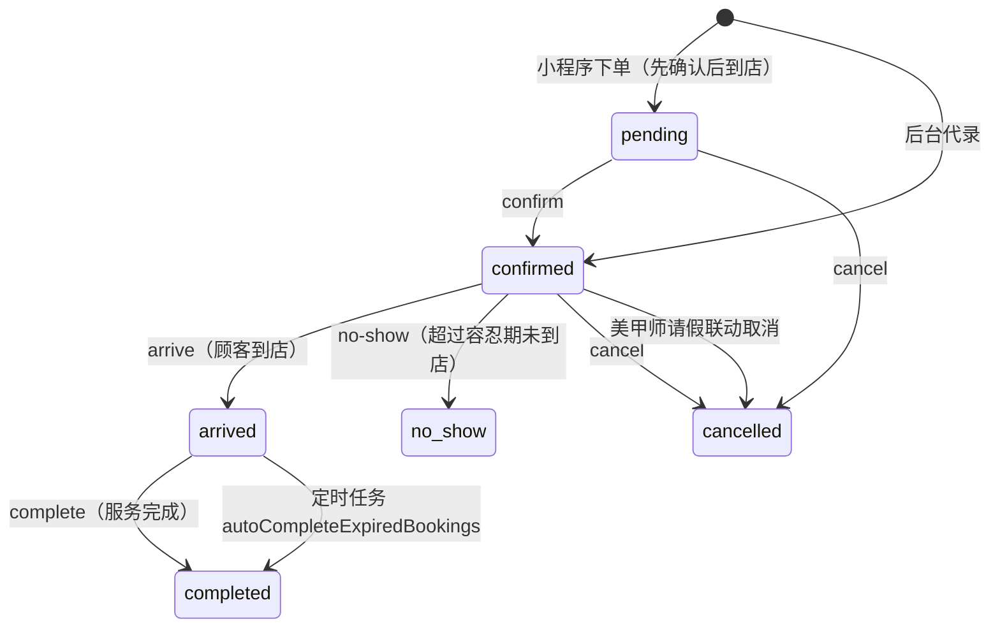

# 业务表详解

本页逐张讲清 **33 张 `biz_*` 表**：字段口径、索引与约束、状态机、真实代码位置。

- 表结构唯一权威：`src/database/schema/index.ts`
- 所有金额单位**分**（`int unsigned`），所有时刻**UTC**；「店内本地日」是 `date` 字符串
- 「相关代码」列出的路径都是仓库内真实文件

::: tip 统一审计列
除特别说明外，本节所有表都展开 `auditColumns`：
`created_at` / `updated_at` / `deleted_at` / `created_by` / `updated_by`。
下文字段表**不再重复列出这 5 列**，出现「不套审计列」或「只追加」时会显式标注。
:::

## 一、基础数据

### biz_service_item —— 服务项目

服务的原子单元。**时长决定占用时段、缓冲参与冲突判定**，价格是算价的起点。
运营在「服务项目」页维护。

| 字段 | 类型 | 必填/默认 | 说明 | 口径与坑 |
| --- | --- | --- | --- | --- |
| `id` | `int unsigned` | PK 自增 | 主键 | — |
| `name` | `varchar(50)` | 必填 | 项目名 | **无唯一索引**，seed 幂等靠按名字比对 |
| `category` | `varchar(30)` | 可空 | 分类（提成规则的 `category` 按这个值匹配） | 改名会让既有提成规则匹配不上 |
| `duration_minutes` | `int unsigned` | 必填 | 服务时长（分钟） | 不含缓冲；多项目合计 = 预约时长 |
| `buffer_minutes` | `int unsigned` | 默认 `0` | 缓冲时长 | 多项目取**最大值**（`maxBuffer()`），不是求和 |
| `price` | `int unsigned` | 默认 `0` | 原价（分） | 算价起点，不随等级折扣变化 |
| `description` | `varchar(500)` | 可空 | 描述 | — |
| `images` | `json` | 可空 | 图集，顺序即展示顺序 | **唯一事实来源**，`$type<string[]>()` |
| `image` | `varchar(500)` | 可空 | 封面（派生） | 恒等于 `images[0] ?? null`，写入接口**不接受** |
| `status` | `enum('active','disabled')` | 默认 `active` | 启停 | 停用后不可被新预约选中 |
| `sort` | `int` | 默认 `0` | 排序 | — |
| `remark` | `varchar(500)` | 可空 | 备注 | — |

**索引与约束**：`idx_service_item_status(status, sort)`；无唯一索引。
**相关代码**：`src/modules/biz/base-data/service-items/service-items.service.ts`（`imagesPatch()` 统一回写封面）。

::: warning 图集与封面必须同进同退
`images === undefined` 表示「本次不改图集」；`images: null` 或 `[]` 表示清空，
此时 `image` 一并置 `NULL`。controller 的 zod 会把调用方传来的 `image` **直接丢掉**，
避免出现「封面与首图不一致」的脏数据。
:::

### biz_staff —— 美甲师档案

排班与预约的承载者。**未必有后台账号**，因此 `user_id` 可空。

| 字段 | 类型 | 必填/默认 | 说明 | 口径与坑 |
| --- | --- | --- | --- | --- |
| `id` | `int unsigned` | PK 自增 | 主键 | — |
| `user_id` | `int unsigned` | 可空 | 关联 `sys_user.id` | 有值才能登录后台/看自己的业绩 |
| `nickname` | `varchar(50)` | 必填 | 对外名称 | **无唯一索引**；seed 按名字幂等 |
| `avatar` | `varchar(500)` | 可空 | 头像 | — |
| `phone` | `varchar(20)` | 可空 | 手机号 | 小程序工作台开通申请按它命中（不唯一！） |
| `bio` | `varchar(500)` | 可空 | 简介 | — |
| `status` | `enum('active','disabled')` | 默认 `active` | 启停 | 停用后小程序工作台**下一次请求立即失效** |
| `sort` | `int` | 默认 `0` | 排序 | — |
| `remark` | `varchar(500)` | 可空 | 备注 | — |

**索引与约束**：`idx_staff_user(user_id)`、`idx_staff_status(status, sort)`；
外键 `fk_staff_user` → `sys_user.id` `ON DELETE SET NULL`。无唯一索引。
**相关代码**：`src/modules/biz/base-data/staffs/staffs.service.ts`。

### biz_staff_service_item —— 美甲师可做项目

「谁能做哪些项目」的关联表。排班与可约时段按它过滤。

| 字段 | 类型 | 必填/默认 | 说明 | 口径与坑 |
| --- | --- | --- | --- | --- |
| `id` | `int unsigned` | PK 自增 | 主键 | — |
| `staff_id` | `int unsigned` | 必填 | 美甲师 | — |
| `service_item_id` | `int unsigned` | 必填 | 服务项目 | — |
| `sort` | `int` | 默认 `0` | 排序 | — |

**索引与约束**：`uq_staff_service_item(staff_id, service_item_id)`；
外键 `fk_staff_service_staff` `ON DELETE CASCADE`、`fk_staff_service_item` `ON DELETE RESTRICT`。
**不套审计列** —— 物理删。
**状态字段**：无。
**相关代码**：`src/modules/biz/base-data/staffs/staffs.service.ts`（配置接口整体替换）。

::: danger 空集合 = 可做全部
`biz_staff_service_item` 里**没有任何行**表示「该美甲师可做全部项目」，
不是「什么都做不了」。过滤逻辑必须先判断集合是否为空。
:::

### biz_customer —— 顾客档案（兼会员档案）

**顾客即会员**：一张表同时装身份档案与资产结存。资产字段全部由账务流水驱动。

| 字段 | 类型 | 必填/默认 | 说明 | 口径与坑 |
| --- | --- | --- | --- | --- |
| `id` | `int unsigned` | PK 自增 | 主键 | 会员号 = `M{yyyyMMdd}{id 补零 6 位}` |
| `name` | `varchar(50)` | 必填 | 姓名 | 小程序自建时用昵称或「微信顾客XXXX」 |
| `phone` | `varchar(20)` | 可空 | 手机号 | **唯一索引，但可空**（散客）；查重**不过滤软删** |
| `gender` | `enum('unknown','male','female')` | 默认 `unknown` | 性别 | — |
| `birthday` | `date` | 可空 | 生日（本地日，不是时刻） | 用 `mode: 'string'` |
| `remark` | `varchar(500)` | 可空 | 备注 | — |
| `visit_count` | `int unsigned` | 默认 `0` | 到店次数 | 预约 `completed` 时 +1，或跑 `recount` 修复 |
| `last_visit_at` | `datetime` | 可空 | 最后到店时刻 | 同上 |
| `level_id` | `int unsigned` | 可空 | 会员等级 | 由累计消费重算（定时任务 `recountMemberLevels`） |
| `member_no` | `varchar(32)` | 可空 | 会员号 | **唯一**，主键回填生成；`ensureMembership()` 写入 |
| `member_since` | `datetime` | 可空 | 入会时刻 | 与 `member_no` 同进同退 |
| `total_spent` | `int unsigned` | 默认 `0` | 累计消费（分） | 收款累加、退款**按比例回减**；派生字段 |
| `points` | `int unsigned` | 默认 `0` | 可用积分 | 对账等式 `SUM(points_delta) = points` |
| `points_total` | `int unsigned` | 默认 `0` | 历史累计积分 | 只增不减，用于等级与画像 |
| `balance_principal` | `int unsigned` | 默认 `0` | 储值**本金**（分） | 可退；与赠送**分列** |
| `balance_bonus` | `int unsigned` | 默认 `0` | 储值**赠送**（分） | **不可退**，扣减顺序受 `biz.member.bonusDeductMode` 控制 |

**索引与约束**：`uq_customer_phone(phone)`、`uq_customer_member_no(member_no)`、
`idx_customer_level(level_id)`、`idx_customer_name(name)`；外键 `fk_customer_level` `ON DELETE SET NULL`。
**状态字段**：无独立状态列，**软删即停用**（`deleted_at`）。
**相关代码**：`src/modules/biz/base-data/customers/customers.service.ts`；
小程序侧 `src/modules/app/auth/app-auth.service.ts`。

::: warning 本金与赠送必须分列
`balance_principal` 与 `balance_bonus` 是两笔独立的钱：退款只退本金、
扣减顺序可配置。任何把它们相加后只记一个数的写法都是错的
（见 [/backend/membership](/backend/membership)）。
:::

### biz_staff_weekly_shift —— 周模板班次

「每周几上什么班」的模板。求值时先取模板，再由 `biz_staff_schedule_override` 覆盖。

| 字段 | 类型 | 必填/默认 | 说明 | 口径与坑 |
| --- | --- | --- | --- | --- |
| `id` | `int unsigned` | PK 自增 | 主键 | — |
| `staff_id` | `int unsigned` | 必填 | 美甲师 | — |
| `weekday` | `tinyint unsigned` | 必填 | ISO 星期：1=周一 … 7=周日 | **不是 0=周日** |
| `start_time` | `time` | 必填 | 班次开始（墙钟） | 无时区，按店内时区解释 |
| `end_time` | `time` | 必填 | 班次结束（墙钟） | 必须 > `start_time`（不支持跨天班） |

**索引与约束**：`idx_shift_staff_weekday(staff_id, weekday)`；
外键 `fk_shift_staff` `ON DELETE CASCADE`。**无唯一索引**，物理删。
**相关代码**：`src/modules/biz/scheduling/scheduling.service.ts`。

::: danger 无唯一索引是设计选择
周模板的 `PUT` 是**整体替换**（先删后插），重叠校验在应用层做；
所以**不能**靠数据库防重复班次。绕过接口直写库会出现重叠班次，
可约时段会把同一时段算两次。
:::

### biz_staff_schedule_override —— 日期例外

某一天的例外：`off` 整天休息 / `custom` 自定义时段。求值优先级高于周模板。

| 字段 | 类型 | 必填/默认 | 说明 | 口径与坑 |
| --- | --- | --- | --- | --- |
| `id` | `int unsigned` | PK 自增 | 主键 | — |
| `staff_id` | `int unsigned` | 必填 | 美甲师 | — |
| `date` | `date` | 必填 | 例外日期（店内本地日） | 字符串 `YYYY-MM-DD` |
| `type` | `enum('off','custom')` | 必填 | 例外类型 | `custom` 时下面两列才有效 |
| `start_time` | `time` | 可空 | 自定义开始 | `off` 时必须为空 |
| `end_time` | `time` | 可空 | 自定义结束 | `off` 时必须为空 |
| `reason` | `varchar(200)` | 可空 | 原因（请假事由） | 会带进「受影响预约」提示 |

**索引与约束**：`idx_override_staff_date(staff_id, date)`；外键 `fk_override_staff` `ON DELETE CASCADE`。
**无唯一索引**，物理删（`DELETE` 接口）。
**相关代码**：`src/modules/biz/scheduling/scheduling.service.ts`。

## 二、预约

### biz_booking —— 预约主表

预约单头。承载**服务状态机**与**资金状态机**两套互相独立的状态。

| 字段 | 类型 | 必填/默认 | 说明 | 口径与坑 |
| --- | --- | --- | --- | --- |
| `id` | `int unsigned` | PK 自增 | 主键 | — |
| `booking_no` | `varchar(32)` | 必填 | 预约单号 `B{yyyyMMdd}{id 补零 6 位}` | 插入时先用 `tempDocNo()` 占位再回填 |
| `customer_id` | `int unsigned` | 必填 | 顾客 | 外键 `RESTRICT`：有单的顾客删不掉 |
| `staff_id` | `int unsigned` | 必填 | 美甲师 | 外键 `RESTRICT` |
| `start_at` | `datetime` | 必填 | 开始时刻（UTC） | 冲突检测与索引的主列 |
| `end_at` | `datetime` | 必填 | 结束时刻（UTC） | `= start_at + duration_minutes` |
| `duration_minutes` | `int unsigned` | 必填 | 服务时长合计 | 明细 `duration_minutes` 之和 |
| `buffer_minutes` | `int unsigned` | 默认 `0` | 本单缓冲 | 明细缓冲的**最大值** |
| `original_price` | `int unsigned` | 默认 `0` | 原价合计（分） | 明细 `price` 之和 |
| `level_discount_permille` | `int unsigned` | 默认 `1000` | 下单时的等级折扣率快照 | 1000 = 不打折 |
| `level_discount_amount` | `int unsigned` | 默认 `0` | 等级折扣额（分） | 向下取整 |
| `coupon_id` | `int unsigned` | 可空 | 使用的券 | 与积分**同一单二选一** |
| `coupon_discount_amount` | `int unsigned` | 默认 `0` | 券抵扣额（分） | 夹到折后金额以内，不会抵成负数 |
| `points_discount_amount` | `int unsigned` | 默认 `0` | 积分抵扣额（分） | 不超过折后金额 × `maxPointsPermille` |
| `adjust_amount` | `int`（**有符号**） | 默认 `0` | 手动改价差额（分） | 可正可负 |
| `adjust_reason` | `varchar(200)` | 可空 | 改价原因 | 有改价就必填（业务约束） |
| `payable_amount` | `int unsigned` | 默认 `0` | 应付（分） | `original − level − coupon − points + adjust`，下限 0 |
| `deposit_amount` | `int unsigned` | 默认 `0` | 定金应收（分） | `min(定金值, 应付)`；全款时 = 应付 |
| `paid_amount` | `int unsigned` | 默认 `0` | **已收（毛收入，分）** | 派生，只由 `recalc()` 写 |
| `due_amount` | `int unsigned` | 默认 `0` | 待收（分） | `max(payable − paid, 0)`，派生 |
| `pay_status` | `enum` | 默认 `unpaid` | 资金状态机 | 见下方状态表 |
| `pay_channel_summary` | `varchar(64)` | 可空 | 渠道去重汇总（如 `balance,cash`） | **不是**单一渠道，见下方说明 |
| `settled_at` | `datetime` | 可空 | 结清时刻 | `pay_status='refunded'` 或 `paid=0` 时清空 |
| `credit_account_id` | `int unsigned` | 可空 | 挂账主体 | 有值且未收满 → `pay_status='credit'` |
| `recurrence_id` | `int unsigned` | 可空 | 来源周期规则 | 参与 `uq_booking_recurrence_start` |
| `member_card_id` | `int unsigned` | 可空 | 核销的次卡 | `ON DELETE SET NULL` |
| `refund_amount` | `int unsigned` | 默认 `0` | 已退（分） | Σ 成功退款单 `actual_amount`，派生 |
| `refunded_at` | `datetime` | 可空 | 最近退款时刻 | — |
| `status` | `enum` | 默认 `confirmed` | 服务状态机 | 见下方状态表 |
| `channel` | `enum('admin','miniapp')` | 默认 `admin` | 下单渠道 | 报表可按渠道切分 |
| `customer_name` | `varchar(50)` | 必填 | 顾客姓名**快照** | 顾客改名不影响历史单 |
| `customer_phone` | `varchar(20)` | 可空 | 顾客手机号快照 | 同上 |
| `remark` | `varchar(500)` | 可空 | 备注 | — |
| `cancel_reason` | `varchar(200)` | 可空 | 取消原因 | `cancel` / 请假联动取消时写入 |
| `confirmed_at` / `arrived_at` / `finished_at` / `cancelled_at` | `datetime` | 可空 | 各状态流转时刻 | 由状态机写入，不由调用方直接给 |

**索引与约束**：

- `uq_booking_no(booking_no)`
- `uq_booking_recurrence_start(recurrence_id, start_at)` —— **周期生成的幂等闸门**
- `idx_booking_staff_time(staff_id, start_at, end_at)` —— 冲突检测主索引
- `idx_booking_customer(customer_id, start_at)`
- `idx_booking_status_start(status, start_at)` / `idx_booking_status_end(status, end_at)` —— 列表与「自动完成/爽约」任务
- `idx_booking_pay(pay_status, start_at)` —— 收银台与挂账队列
- `idx_booking_credit(credit_account_id, pay_status)`
- `idx_booking_recurrence(recurrence_id)`
- 外键：`fk_booking_customer` / `fk_booking_staff` / `fk_booking_credit_account` `RESTRICT`；
  `fk_booking_member_card` / `fk_booking_recurrence` `SET NULL`

**服务状态机（`status`）**



允许的起始状态集中在一张表（`bookings.service.ts` 的 `TRANSITIONS`），
**禁止散落在 controller**：`confirm: [pending]`、`arrive: [confirmed]`、
`complete: [arrived]`、`no-show: [confirmed]`、`cancel: [pending, confirmed]`。
状态流转一律走条件更新（`WHERE id = ? AND status = ?`），`affectedRows = 0` 即拒绝。

**资金状态机（`pay_status`）** —— 与上面那套**完全独立**：

| 取值 | 判定条件（`recalc()` 中的顺序） | 含义 |
| --- | --- | --- |
| `refunded` | `paid > 0` 且 `refund >= paid` | 收的钱全退回去了 |
| `paid` | `paid >= payable` | 收满（**应付为 0 的次卡核销也落这里**） |
| `credit` | 还有未收且 `credit_account_id IS NOT NULL` | 未收部分挂在账上，含「现金 + 挂账」混合 |
| `partial` | `paid > 0` | 只收了一部分 |
| `unpaid` | `paid = 0` | 一分没收 |

::: danger 两套状态不要混
`status='completed'` 的单子完全可以是 `pay_status='unpaid'`（做完没给钱 → 转挂账前）。
反过来 `pay_status='paid'` 的单子也可能被 `cancel`（退款后回到 `refunded`）。
报表按 `status` 统计「单量」、按 `pay_status` 统计「钱」，不要互相代替。
:::

**为什么预约上不存单一 `pay_channel`**

一张预约可以有多张支付单：定金 + 尾款（`purpose` 分别为 `deposit` / `final`），
混合支付（现金 + 余额、现金 + 挂账），次卡核销（`channel='card'`，实收 0）。
所以预约上只存**去重排序后拼接**的 `pay_channel_summary`（如 `balance,cash`），
**仅用于列表展示**；渠道维度的金额统计必须回到 `biz_payment.channel` 上算。

**相关代码**：
`src/modules/biz/booking/bookings.service.ts`（创建 / 改期 / 状态流转）、
`src/modules/biz/booking/booking-settlement.service.ts`（`recalc()`，唯一写资金字段的地方）、
`src/modules/biz/booking/slots.service.ts`（可约时段与冲突）。

### biz_booking_item —— 预约项目明细

预约包含的服务项目快照。**不套审计列**（从属子表，随主表 CASCADE）。

| 字段 | 类型 | 必填/默认 | 说明 | 口径与坑 |
| --- | --- | --- | --- | --- |
| `id` | `int unsigned` | PK 自增 | 主键 | — |
| `booking_id` | `int unsigned` | 必填 | 主表 | `ON DELETE CASCADE` |
| `service_item_id` | `int unsigned` | 必填 | 服务项目 | `ON DELETE RESTRICT`：被引用过就删不掉项目 |
| `name` | `varchar(50)` | 必填 | 项目名**快照** | 项目改名不影响历史单 |
| `duration_minutes` | `int unsigned` | 必填 | 时长**快照** | 改时长不影响已生成的单 |
| `price` | `int unsigned` | 默认 `0` | 价格**快照**（分） | 净营收按项目原价占比分摊到明细 |
| `sort` | `int` | 默认 `0` | 展示顺序 | — |

**索引与约束**：`idx_booking_item_booking(booking_id)`、`idx_booking_item_service(service_item_id)`。
**相关代码**：随 `bookings.service.ts` 写入；提成按明细计提（`biz_commission_record.booking_item_id`）。

### biz_booking_recurrence —— 周期预约规则

「每周几、几点、做哪些项目」的滚动生成规则。`generated_until` 是**幂等游标**。

| 字段 | 类型 | 必填/默认 | 说明 | 口径与坑 |
| --- | --- | --- | --- | --- |
| `id` | `int unsigned` | PK 自增 | 主键 | — |
| `name` | `varchar(50)` | 可空 | 规则名 | — |
| `customer_id` | `int unsigned` | 必填 | 顾客 | `RESTRICT` |
| `staff_id` | `int unsigned` | 必填 | 美甲师 | `RESTRICT` |
| `service_item_ids` | `json` | 必填 | 项目 id 数组 | 生成时逐项读时长与价格 |
| `weekday` | `tinyint unsigned` | 必填 | ISO 星期 1~7 | — |
| `start_time` | `time` | 必填 | 开始墙钟时间 | 按店内时区换算成绝对时刻 |
| `duration_minutes` | `int unsigned` | 必填 | 时长（分钟） | 规则级，不逐项求和 |
| `start_date` | `date` | 必填 | 生效起（本地日） | — |
| `end_date` | `date` | 可空 | 生效止（本地日） | 空 = 不限 |
| `generate_days` | `int unsigned` | 默认 `30` | 滚动窗口长度（天） | 每次只生成到「今天 + N 天」 |
| `generated_until` | `date` | 可空 | **已生成到的本地日** | 幂等游标；撤销窗口时**回退** |
| `status` | `enum('active','paused','stopped')` | 默认 `active` | 规则状态 | 只有 `active` 会被任务扫到 |
| `last_run_at` | `datetime` | 可空 | 上次生成时刻 | 排障用 |
| `conflict_policy` | `enum('skip','notify')` | 默认 `notify` | 撞单策略 | `skip` 跳过、`notify` 生成站内告警给店员 |
| `remark` | `varchar(200)` | 可空 | 备注 | — |

**索引与约束**：`idx_recurrence_status(status, generated_until)`、
`idx_recurrence_customer(customer_id)`；外键均 `RESTRICT`。无唯一索引。
**状态字段**：`active` / `paused` / `stopped`。
**相关代码**：`src/modules/biz/operations/recurrences/recurrences.service.ts`；
定时任务 `generateRecurringBookings`（每天 03:15）。

::: tip 幂等靠两层
1. **游标**：只生成 `generated_until + 1` 到「今天 + `generate_days`」的日期，命中冲突策略后推进游标；
2. **唯一约束**：`biz_booking.uq_booking_recurrence_start(recurrence_id, start_at)` 兜底 ——
   即使任务被并发跑两次，重复的那次会撞唯一键而不是插出两单。

生成的单**不收款**（`pay_status='unpaid'`）；`revokeWindow` 只能撤销
「未来 + 未收款」的单，撤销时软删并把 `recurrence_id` 置空以释放唯一约束。
:::

## 三、会员与资产

### biz_member_level —— 会员等级

折扣率与升级门槛。`discount_permille` 是**千分比**。

| 字段 | 类型 | 必填/默认 | 说明 | 口径与坑 |
| --- | --- | --- | --- | --- |
| `id` | `int unsigned` | PK 自增 | 主键 | — |
| `name` | `varchar(30)` | 必填 | 等级名 | 唯一 |
| `discount_permille` | `int unsigned` | 默认 `1000` | 折扣率（‰） | 1000 = 不打折；950 = 95 折 |
| `upgrade_amount` | `int unsigned` | 默认 `0` | 升级门槛（分） | 按 `biz_customer.total_spent` 比较 |
| `sort` | `int` | 默认 `0` | 排序 | — |
| `status` | `enum('active','disabled')` | 默认 `active` | 启停 | 停用后重算会跳过它 |
| `remark` | `varchar(200)` | 可空 | 备注 | — |

**索引与约束**：`uq_level_name(name)`、`idx_level_status_sort(status, sort)`。
**相关代码**：`src/modules/biz/membership/member-levels/member-levels.service.ts`；
seed 默认三档：银卡 1000‰ / 金卡 950‰（满 ¥500）/ 钻卡 880‰（满 ¥2000）。

### biz_recharge_plan —— 充值方案

「实付多少、送多少」的套餐。赠送比例受配置上限约束。

| 字段 | 类型 | 必填/默认 | 说明 | 口径与坑 |
| --- | --- | --- | --- | --- |
| `id` | `int unsigned` | PK 自增 | 主键 | — |
| `name` | `varchar(30)` | 必填 | 方案名 | 唯一 |
| `pay_amount` | `int unsigned` | 必填 | 实付（分） | 记入 `balance_principal` |
| `bonus_amount` | `int unsigned` | 默认 `0` | 赠送（分） | 记入 `balance_bonus`，**不可退** |
| `status` | `enum('active','disabled')` | 默认 `active` | 启停 | — |
| `sort` | `int` | 默认 `0` | 排序 | — |
| `remark` | `varchar(200)` | 可空 | 备注 | — |

**索引与约束**：`uq_recharge_plan_name(name)`。
**相关代码**：`src/modules/biz/membership/recharge-plans/recharge-plans.service.ts`；
充值落账在 `member-accounts.service.ts`。

::: warning 赠送比例上限
`bonus / pay ≤ biz.member.maxBonusPermille`（默认 200‰ = 2 折以内），
且单次充值不得低于 `biz.member.minRechargeAmount`（默认 10000 分 = ¥100）。
方案维护与充值执行**两处都要夹取**。
:::

### biz_member_card_type —— 次卡卡种

可售的次卡模板：总次数、有效期、适用项目。

| 字段 | 类型 | 必填/默认 | 说明 | 口径与坑 |
| --- | --- | --- | --- | --- |
| `id` | `int unsigned` | PK 自增 | 主键 | — |
| `name` | `varchar(50)` | 必填 | 卡种名 | 唯一 |
| `price` | `int unsigned` | 必填 | 售价（分） | — |
| `total_times` | `int unsigned` | 必填 | 总次数 | 购买实例时**快照** |
| `valid_days` | `int unsigned` | 默认 `0` | 有效天数 | `0` = 永不过期 |
| `status` | `enum('active','disabled')` | 默认 `active` | 启停 | 停用后不可再售 |
| `sort` | `int` | 默认 `0` | 排序 | — |
| `remark` | `varchar(200)` | 可空 | 备注 | — |

**索引与约束**：`uq_card_type_name(name)`、`idx_card_type_status_sort(status, sort)`。
**相关代码**：`src/modules/biz/membership/card-types/card-types.service.ts`。

### biz_member_card_type_item —— 卡种适用项目

卡种能核销哪些服务项目。**不套审计列**（随卡种整体替换，物理删）。

| 字段 | 类型 | 必填/默认 | 说明 | 口径与坑 |
| --- | --- | --- | --- | --- |
| `id` | `int unsigned` | PK 自增 | 主键 | — |
| `card_type_id` | `int unsigned` | 必填 | 卡种 | `ON DELETE CASCADE` |
| `service_item_id` | `int unsigned` | 必填 | 服务项目 | `ON DELETE RESTRICT` |
| `sort` | `int` | 默认 `0` | 排序 | — |

**索引与约束**：`uq_card_type_item(card_type_id, service_item_id)`。
**相关代码**：`src/modules/biz/membership/card-types/card-types.service.ts`。

### biz_member_card —— 会员次卡实例

顾客买到手的卡。`used_times` / `status` **只能由核销 service 条件更新**。

| 字段 | 类型 | 必填/默认 | 说明 | 口径与坑 |
| --- | --- | --- | --- | --- |
| `id` | `int unsigned` | PK 自增 | 主键 | — |
| `card_no` | `varchar(32)` | 必填 | 卡号 `C{yyyyMMdd}{id}` | 唯一 |
| `customer_id` | `int unsigned` | 必填 | 持卡顾客 | `RESTRICT` |
| `card_type_id` | `int unsigned` | 必填 | 卡种 | `RESTRICT` |
| `card_name` | `varchar(50)` | 必填 | 卡种名**快照** | — |
| `total_times` | `int unsigned` | 必填 | 总次数**快照** | 卡种改次数不影响已售卡 |
| `used_times` | `int unsigned` | 默认 `0` | 已核销次数 | **派生**，条件更新 |
| `price` | `int unsigned` | 默认 `0` | 售价**快照**（分） | — |
| `pay_channel` | `enum('cash','wechat','alipay','balance')` | 必填 | 购卡渠道 | 与 `biz_payment.channel` 的取值集合不同 |
| `purchased_at` | `datetime` | 必填 | 购买时刻 | `valid_days` 从这里起算 |
| `expire_at` | `datetime` | 可空 | 到期时刻 | `valid_days=0` 时为 `NULL`（永不过期） |
| `status` | `enum('active','used_up','expired','refunded')` | 默认 `active` | 卡状态 | `expireMemberCards` 任务负责 `expired` |
| `remark` | `varchar(200)` | 可空 | 备注 | — |

**索引与约束**：`uq_member_card_no(card_no)`、`idx_card_customer(customer_id, status)`、
`idx_card_expire(status, expire_at)`；外键均 `RESTRICT`。

**核销的唯一正确写法**（`member-cards.service.ts`）：

```sql
UPDATE biz_member_card
   SET status = IF(used_times + 1 >= total_times, 'used_up', 'active'),
       used_times = used_times + 1
 WHERE id = ? AND deleted_at IS NULL AND status = 'active'
   AND used_times < total_times
   AND (expire_at IS NULL OR expire_at > NOW());
```

::: danger `status` 必须先于 `used_times` 赋值
MySQL 的 `UPDATE` **从左到右**赋值，后置表达式会读到前面刚写的新值。
drizzle 的 `.set()` 会按表列顺序重排、做不到这个顺序，所以这里用的是**原生 SQL**。
写反了会让 `used_up` 永远算不出来（少一次）。
:::

**相关代码**：`src/modules/biz/membership/member-cards/member-cards.service.ts`
（`use` / `revertUse` / `expire`），定时任务 `expireMemberCards`（每天 00:05）。

### biz_member_card_log —— 次卡核销流水

只追加。`type='use'` 核销、`type='revert'` 撤销核销。

| 字段 | 类型 | 必填/默认 | 说明 | 口径与坑 |
| --- | --- | --- | --- | --- |
| `id` | `int unsigned` | PK 自增 | 主键 | — |
| `card_id` | `int unsigned` | 必填 | 次卡 | `ON DELETE CASCADE` |
| `booking_id` | `int unsigned` | 可空 | 关联预约 | `SET NULL`；散客核销为空 |
| `service_item_id` | `int unsigned` | 必填 | 核销项目 | **无外键** |
| `type` | `enum('use','revert')` | 必填 | 方向 | 撤销写 `revert`，**不删原行** |
| `times` | `int unsigned` | 默认 `1` | 次数 | 报表按 `use` 减 `revert` 净算 |
| `remark` | `varchar(200)` | 可空 | 备注 | — |
| `created_by` | `int unsigned` | 可空 | 操作者 | — |
| `created_at` | `timestamp` | 默认当前 | 发生时刻 | — |

**索引与约束**：`idx_card_log_card(card_id, id)`、`idx_card_log_booking(booking_id)`。
**只追加**：无 `updated_at` / `deleted_at`。
**相关代码**：`src/modules/biz/membership/member-cards/member-cards.service.ts`；
报表净核销次数 `netCardTimes()` 在 `reports.service.ts`。

### biz_member_transaction —— 会员账务流水

**只追加的对账基准**。储值、积分、次卡的每一次变动都在这里留痕。

| 字段 | 类型 | 必填/默认 | 说明 | 口径与坑 |
| --- | --- | --- | --- | --- |
| `id` | `int unsigned` | PK 自增 | 主键 | — |
| `customer_id` | `int unsigned` | 必填 | 顾客 | `RESTRICT` |
| `type` | `enum` | 必填 | 11 种流水类型 | 见下 |
| `amount` | `int`（有符号） | 默认 `0` | 业务金额（分） | — |
| `balance_delta_principal` | `int` | 默认 `0` | 本金变动（分） | 对账等式主列 |
| `balance_delta_bonus` | `int` | 默认 `0` | 赠送变动（分） | 对账等式主列 |
| `balance_principal_after` | `int unsigned` | 默认 `0` | 变动后本金 | 便于对账核查 |
| `balance_bonus_after` | `int unsigned` | 默认 `0` | 变动后赠送 | 同上 |
| `points_delta` | `int` | 默认 `0` | 积分变动 | 对账等式主列 |
| `points_after` | `int unsigned` | 默认 `0` | 变动后积分 | — |
| `pay_channel` | `enum('cash','wechat','alipay','balance','card')` | 可空 | 渠道 | 比 `biz_payment.channel` 取值集合小 |
| `booking_id` | `int unsigned` | 可空 | 关联预约 | `SET NULL` |
| `card_id` | `int unsigned` | 可空 | 关联次卡 | `SET NULL` |
| `plan_id` | `int unsigned` | 可空 | 关联充值方案 | `SET NULL` |
| `reversal_of` | `int unsigned` | 可空 | **冲正指向的原流水** | 纠错唯一手段 |
| `remark` | `varchar(200)` | 可空 | 备注 | 冲正必须写原因 |
| `created_by` | `int unsigned` | 可空 | 操作者 | — |
| `created_at` | `timestamp` | 默认当前 | 发生时刻 | — |

`type` 取值：`recharge`、`consume`、`refund`、`card_buy`、`card_use`、`card_revert`、
`points_earn`、`points_spend`、`points_redeem`、`level_change`、`adjust`。

**索引与约束**：`idx_txn_customer(customer_id, id)`、`idx_txn_booking(booking_id)`、
`idx_txn_type_created(type, created_at)`。**只追加**，无 `updated_at` / `deleted_at`。

**对账等式（必须随时成立）**：

```
SUM(balance_delta_principal) = biz_customer.balance_principal
SUM(balance_delta_bonus)     = biz_customer.balance_bonus
SUM(points_delta)            = biz_customer.points
```

**相关代码**：`src/modules/biz/membership/member-accounts/member-accounts.service.ts`；
修复入口是 `recount` 接口，**禁止手改字段**。

### biz_points_goods —— 积分兑换品

兑换即发一张次卡（复用卡种，不引入第二套券体系）。

| 字段 | 类型 | 必填/默认 | 说明 | 口径与坑 |
| --- | --- | --- | --- | --- |
| `id` | `int unsigned` | PK 自增 | 主键 | — |
| `name` | `varchar(50)` | 必填 | 兑换品名 | 唯一 |
| `card_type_id` | `int unsigned` | 必填 | 兑换出的卡种 | `RESTRICT` |
| `points` | `int unsigned` | 必填 | 所需积分 | — |
| `stock` | `int`（有符号） | 默认 `-1` | 库存 | **`-1` = 不限量** |
| `per_limit` | `int unsigned` | 默认 `0` | 每人限兑 | `0` = 不限 |
| `status` | `enum('active','disabled')` | 默认 `active` | 启停 | — |
| `sort` | `int` | 默认 `0` | 排序 | — |
| `remark` | `varchar(200)` | 可空 | 备注 | — |

**索引与约束**：`uq_points_goods_name(name)`、`idx_points_goods_status(status, sort)`；
`fk_points_goods_card_type` `RESTRICT`。
**相关代码**：`src/modules/biz/membership/points-goods/points-goods.service.ts`。

### biz_points_redeem —— 积分兑换记录

只追加，可撤销（`status='reverted'`，同样不删原行）。

| 字段 | 类型 | 必填/默认 | 说明 | 口径与坑 |
| --- | --- | --- | --- | --- |
| `id` | `int unsigned` | PK 自增 | 主键 | — |
| `redeem_no` | `varchar(32)` | 必填 | 兑换单号 `X{yyyyMMdd}{id}` | 唯一 |
| `customer_id` | `int unsigned` | 必填 | 顾客 | `RESTRICT` |
| `goods_id` | `int unsigned` | 必填 | 兑换品 | `RESTRICT` |
| `points` | `int unsigned` | 必填 | 消耗积分 | 兑换时条件扣减 `WHERE points >= ?` |
| `member_card_id` | `int unsigned` | 可空 | 发出的次卡 | `SET NULL` |
| `status` | `enum('success','reverted')` | 默认 `success` | 状态 | 撤销不回删卡，由次卡侧处理 |
| `remark` | `varchar(200)` | 可空 | 备注 | — |
| `created_by` | `int unsigned` | 可空 | 操作者 | — |
| `created_at` | `timestamp` | 默认当前 | 发生时刻 | — |

**索引与约束**：`uq_points_redeem_no(redeem_no)`、`idx_points_redeem_customer(customer_id, id)`。
**只追加**。
**相关代码**：`src/modules/biz/membership/points/points.controller.ts`（接口）+
`member-accounts.service.ts`（积分条件扣减与发卡）。

### biz_coupon_template —— 优惠券模板

首期只做「满 X 减 Y」固定面额券。

| 字段 | 类型 | 必填/默认 | 说明 | 口径与坑 |
| --- | --- | --- | --- | --- |
| `id` | `int unsigned` | PK 自增 | 主键 | — |
| `name` | `varchar(50)` | 必填 | 模板名 | 唯一 |
| `threshold_amount` | `int unsigned` | 默认 `0` | 使用门槛（分） | `0` = 无门槛 |
| `discount_amount` | `int unsigned` | 必填 | 面额（分） | 固定减 |
| `valid_days` | `int unsigned` | 默认 `0` | 领取后有效天数 | `0` = 用 `valid_from` / `valid_to` 绝对区间 |
| `valid_from` | `timestamp` | 可空 | 绝对生效时刻 | 仅 `valid_days=0` 时有意义 |
| `valid_to` | `timestamp` | 可空 | 绝对失效时刻 | 同上 |
| `status` | `enum('active','disabled')` | 默认 `active` | 启停 | — |
| `sort` | `int` | 默认 `0` | 排序 | — |
| `remark` | `varchar(200)` | 可空 | 备注 | — |

**索引与约束**：`uq_coupon_template_name(name)`、`idx_coupon_template_status(status, sort)`。
**相关代码**：`src/modules/biz/membership/coupons/coupons.service.ts`。

### biz_customer_coupon —— 顾客持有券

发放 → 使用 → 过期。面额与门槛在**下发时快照**，模板改价不影响已发出的券。

| 字段 | 类型 | 必填/默认 | 说明 | 口径与坑 |
| --- | --- | --- | --- | --- |
| `id` | `int unsigned` | PK 自增 | 主键 | — |
| `coupon_no` | `varchar(32)` | 必填 | 券号 | 唯一 |
| `customer_id` | `int unsigned` | 必填 | 持有人 | `RESTRICT` |
| `template_id` | `int unsigned` | 必填 | 模板 | `RESTRICT` |
| `discount_amount` | `int unsigned` | 必填 | 面额**快照**（分） | 改模板不影响 |
| `threshold_amount` | `int unsigned` | 默认 `0` | 门槛**快照**（分） | 改模板不影响 |
| `status` | `enum('usable','used','expired','void')` | 默认 `usable` | 状态 | 核销/过期/作废 |
| `expire_at` | `timestamp` | 可空 | 失效时刻 | `NULL` = 不失效 |
| `used_booking_id` | `int unsigned` | 可空 | 核销到哪一单 | **唯一索引**，`ON DELETE SET NULL` |
| `used_at` | `timestamp` | 可空 | 核销时刻 | — |
| `source` | `varchar(30)` | 默认 `manual` | 发放来源 | — |
| `remark` | `varchar(200)` | 可空 | 备注 | — |

**索引与约束**：`uq_customer_coupon_no(coupon_no)`、
`uq_customer_coupon_booking(used_booking_id)`、`idx_customer_coupon_owner(customer_id, status, expire_at)`。

**核销闸门**（`coupons.service.ts`）：

```sql
UPDATE biz_customer_coupon
   SET status='used', used_booking_id=?, used_at=NOW()
 WHERE id=? AND status='usable' AND used_booking_id IS NULL;
-- affectedRows = 0 → 409
```

::: tip 为什么唯一索引是必须的
`uq_customer_coupon_booking` 同时保证「一张券只核销一单」与「一单只用一张券」。
未核销的券 `used_booking_id` 为 `NULL`，MySQL 允许多个 NULL，互不冲突。
算价位置：**等级折扣之后、积分抵扣之前**，且**与积分同一单二选一**。
:::

**相关代码**：`src/modules/biz/membership/coupons/coupons.service.ts`；
算价见 `src/modules/biz/common/money.ts` 的 `quoteBooking()`。

## 四、收银与资金

### biz_payment —— 支付单

**金额事实的唯一来源之一**。一笔预约可以有多张支付单。

| 字段 | 类型 | 必填/默认 | 说明 | 口径与坑 |
| --- | --- | --- | --- | --- |
| `id` | `int unsigned` | PK 自增 | 主键 | — |
| `payment_no` | `varchar(32)` | 必填 | 支付单号 `P{yyyyMMdd}{id}` | 唯一 |
| `out_trade_no` | `varchar(64)` | 必填 | 渠道商户订单号 | **唯一**，回调按它找单 |
| `booking_id` | `int unsigned` | 可空 | 关联预约 | 充值 / 买卡无预约；`ON DELETE RESTRICT` |
| `customer_id` | `int unsigned` | 必填 | 付款顾客 | `RESTRICT` |
| `purpose` | `enum` | 必填 | 用途 | `deposit` / `final` / `recharge` / `card_buy` / `credit_settle` |
| `channel` | `enum` | 必填 | 渠道 | 9 种，见下 |
| `amount` | `int unsigned` | 必填 | 应收（分） | 服务端算，不信前端 |
| `received_amount` | `int unsigned` | 默认 `0` | **实收（分）** | 营收按它累加 |
| `status` | `enum` | 默认 `pending` | 支付状态 | 见下 |
| `code_url` | `varchar(512)` | 可空 | 二维码链接 | 仅 Native / 当面付 |
| `transaction_id` | `varchar(64)` | 可空 | 渠道交易号 | 有索引，对账用 |
| `paid_at` | `datetime` | 可空 | 渠道支付时刻 | 报表按它归日 |
| `expire_at` | `datetime` | 可空 | 二维码失效时刻 | `closeExpiredPayments` 按它关单 |
| `refunded_amount` | `int unsigned` | 默认 `0` | 已退（分） | 累计退款 |
| `callback_at` | `datetime` | 可空 | 收到回调时刻 | 排障用 |
| `remark` | `varchar(200)` | 可空 | 备注 | — |

`channel` 取值：`wxpay_native`、`alipay_qr`、`wxpay_jsapi`、`cash`、`wechat_offline`、
`alipay_offline`、`balance`、`card`、`credit`。
`status` 取值：`pending` / `success` / `failed` / `closed` / `refunded` / `partial_refunded`。

**索引与约束**：`uq_payment_no`、`uq_payment_out_trade_no`、`idx_payment_booking`、
`idx_payment_customer(customer_id, id)`、`idx_payment_status(status, created_at)`、
`idx_payment_txn(transaction_id)`。

::: danger 计入营收的状态集合
`success` / `partial_refunded` / `refunded` **都算毛收入**，因为 `paid_amount` 是毛额，
退款单独体现在 `refund_amount` 上。只认 `success` 会让退款后 `paid_amount` 归零、
`due_amount` 变回全额 —— 列表、收银台、报表三处口径全错。
常量定义见 `booking-settlement.service.ts` 与 `reports.service.ts`。
:::

**相关代码**：`src/modules/biz/payment/payments/payments.service.ts`
（下单 / 回调验签 / 条件更新 / 主动查单 / 关单）、
`src/modules/biz/payment/channels/`（渠道适配）。

::: warning 挂账不写支付单
下单挂账时**不创建** `purpose='credit'` 的支付单（`pay_status` 直接落 `credit`）；
直到销账时才写一张 `purpose='credit_settle'` 的支付单 —— 于是「挂账不计营收、
销账才计入」是**天然成立**的，不需要报表特判。
:::

### biz_payment_log —— 支付过程日志

只追加的排障举证。每个渠道交互节点都留一行。

| 字段 | 类型 | 必填/默认 | 说明 | 口径与坑 |
| --- | --- | --- | --- | --- |
| `id` | `int unsigned` | PK 自增 | 主键 | — |
| `payment_id` | `int unsigned` | 必填 | 支付单 | `ON DELETE CASCADE` |
| `event` | `enum` | 必填 | 事件 | `create` / `callback` / `query` / `close` / `refund` / **`callback_invalid`** |
| `http_status` | `int` | 可空 | HTTP 状态码 | — |
| `raw` | `json` | 可空 | 报文原文 | **可能含敏感字段**，不要直接回传前端 |
| `created_at` | `timestamp` | 默认当前 | 发生时刻 | — |

**索引与约束**：`idx_payment_log_payment(payment_id, id)`。**只追加**。
**相关代码**：`src/modules/biz/payment/payments/payments.service.ts`。

::: danger 回调校验失败必须留证
验签失败或金额不一致时，写一行 `event='callback_invalid'` 并**拒绝**，
绝不允许「按回调金额改账」。这一行是事后追责的唯一依据。
:::

### biz_payment_diff —— 渠道对账差异

对账任务的落库结果。唯一键保证任务可重入。

| 字段 | 类型 | 必填/默认 | 说明 | 口径与坑 |
| --- | --- | --- | --- | --- |
| `id` | `int unsigned` | PK 自增 | 主键 | — |
| `bill_date` | `date` | 必填 | 账单日（本地日） | — |
| `channel` | `enum('wxpay_native','alipay_qr')` | 必填 | 渠道 | 只对在线渠道 |
| `out_trade_no` | `varchar(64)` | 可空 | 系统侧商户单号 | — |
| `transaction_id` | `varchar(64)` | 可空 | 渠道交易号 | 参与唯一键 |
| `system_amount` | `int unsigned` | 默认 `0` | 系统金额（分） | — |
| `channel_amount` | `int unsigned` | 默认 `0` | 渠道金额（分） | — |
| `diff_type` | `enum` | 必填 | 差异类型 | `missing_in_system` / `missing_in_channel` / `amount_mismatch` / `status_mismatch` |
| `status` | `enum('pending','resolved','ignored')` | 默认 `pending` | 处理状态 | — |
| `handle_by` | `int unsigned` | 可空 | 处理人 | — |
| `handled_at` | `datetime` | 可空 | 处理时刻 | — |
| `remark` | `varchar(200)` | 可空 | 处理备注 | — |

**索引与约束**：`uq_payment_diff(bill_date, channel, transaction_id, diff_type)`、
`idx_payment_diff_status(status, bill_date)`。
**相关代码**：`src/modules/biz/payment/diffs/payment-diffs.service.ts`；
定时任务 `reconcilePayments`（每天 06:30）。

### biz_refund —— 退款单

判责金额 + **申请 / 审批分离**。执行时机在审批通过之后。

| 字段 | 类型 | 必填/默认 | 说明 | 口径与坑 |
| --- | --- | --- | --- | --- |
| `id` | `int unsigned` | PK 自增 | 主键 | — |
| `refund_no` | `varchar(32)` | 必填 | 退款单号 `R{yyyyMMdd}{id}` | 唯一 |
| `payment_id` | `int unsigned` | 必填 | 原支付单 | `RESTRICT` |
| `booking_id` | `int unsigned` | 可空 | 关联预约 | `SET NULL` |
| `customer_id` | `int unsigned` | 必填 | 顾客 | — |
| `amount` | `int unsigned` | 必填 | 申请退款额（分） | 上限 = 支付单已收 − 已退 |
| `actual_amount` | `int unsigned` | 默认 `0` | **实退额（分）** | 净营收按它扣减 |
| `deduct_amount` | `int unsigned` | 默认 `0` | 判责扣款（分） | `amount − actual_amount` |
| `mode` | `enum('original','cash','balance')` | 必填 | 退款方式 | 原路 / 现金 / 退到余额 |
| `policy_id` | `int unsigned` | 可空 | 依据的判责规则 | 只给建议，店长可改 |
| `liable` | `enum('store','customer','force_majeure')` | 默认 `store` | 判责方 | 影响扣款比例 |
| `reason` | `varchar(200)` | 必填 | 退款原因 | 受 `biz.member.refundNeedReason` 约束 |
| `status` | `enum` | 默认 `pending` | 状态机 | `pending` → `approved` / `rejected` → `success` / `failed` |
| `apply_by` | `int unsigned` | 必填 | 申请人 | 与审批人**必须不同**（分离） |
| `apply_at` | `datetime` | 必填 | 申请时刻 | — |
| `approve_by` | `int unsigned` | 可空 | 审批人 | — |
| `approve_at` | `datetime` | 可空 | 审批时刻 | — |
| `reject_reason` | `varchar(200)` | 可空 | 驳回原因 | — |
| `channel_refund_id` | `varchar(64)` | 可空 | 渠道退款单号 | — |
| `refunded_at` | `datetime` | 可空 | 退款成功时刻 | 报表按它归日 |
| `remark` | `varchar(200)` | 可空 | 备注 | — |

**索引与约束**：`uq_refund_no`、`idx_refund_payment`、`idx_refund_status(status, created_at)`、
`idx_refund_booking`；`fk_refund_payment` `RESTRICT`、`fk_refund_booking` `SET NULL`。

**状态机与幂等**：执行退款用条件更新
`UPDATE biz_refund SET status='success', channel_refund_id=?, refunded_at=? WHERE id=? AND status='approved'`，
`affectedRows = 0` 表示已被处理。成功后**同事务**回写预约 `refund_amount`、
按比例回减 `total_spent` 与积分、冲销提成。

**相关代码**：`src/modules/biz/payment/refunds/refunds.service.ts`。

### biz_refund_policy —— 退款判责规则

「提前 X 小时 → 退 Y‰」的档位表。

| 字段 | 类型 | 必填/默认 | 说明 | 口径与坑 |
| --- | --- | --- | --- | --- |
| `id` | `int unsigned` | PK 自增 | 主键 | — |
| `name` | `varchar(50)` | 必填 | 规则名 | 唯一 |
| `hours_before` | `int unsigned` | 必填 | 提前小时数 | 匹配「距开始时间 ≥ N 小时」的最大档 |
| `refund_permille` | `int unsigned` | 必填 | 退款比例（‰） | 1000 = 全退 |
| `min_amount` | `int unsigned` | 默认 `0` | 最低退款额（分） | — |
| `status` | `enum('active','disabled')` | 默认 `active` | 启停 | — |
| `sort` | `int` | 默认 `0` | 排序 | — |
| `remark` | `varchar(200)` | 可空 | 备注 | — |

**索引与约束**：`uq_refund_policy_name(name)`、`idx_refund_policy_status_sort(status, sort)`。
**相关代码**：`refunds.service.ts`；seed 默认三档：≥24h 全退 / 2~24h 退 50% / <2h 不退。

### biz_credit_account —— 挂账主体

可挂账的顾客 / 公司 / 员工。额度与账期在这里配置。

| 字段 | 类型 | 必填/默认 | 说明 | 口径与坑 |
| --- | --- | --- | --- | --- |
| `id` | `int unsigned` | PK 自增 | 主键 | — |
| `name` | `varchar(50)` | 必填 | 主体名 | 唯一 |
| `type` | `enum('customer','company','staff')` | 必填 | 类型 | 影响展示与账期语义 |
| `customer_id` | `int unsigned` | 可空 | 关联顾客档案 | `SET NULL` |
| `contact` | `varchar(50)` | 可空 | 联系人 | — |
| `phone` | `varchar(20)` | 可空 | 联系电话 | — |
| `credit_limit` | `int unsigned` | 默认 `0` | 额度（分） | **`0` = 不限** |
| `used_amount` | `int unsigned` | 默认 `0` | 已占用（分） | **派生**，挂账 / 销账 service 条件更新 |
| `settle_day` | `tinyint unsigned` | 默认 `0` | 月结日 | **`0` = 不定期** |
| `status` | `enum('active','disabled')` | 默认 `active` | 启停 | — |
| `remark` | `varchar(500)` | 可空 | 备注 | — |

**索引与约束**：`uq_credit_account_name(name)`、`idx_credit_account_type(type, status)`；
`fk_credit_account_customer` `SET NULL`。

**额度占用**是条件更新，超限直接 `affectedRows = 0`：

```sql
UPDATE biz_credit_account
   SET used_amount = used_amount + :amount
 WHERE id = :id AND deleted_at IS NULL
   AND (credit_limit = 0 OR used_amount + :amount <= credit_limit);
```

**相关代码**：`src/modules/biz/credit/credit-accounts/credit-accounts.service.ts`。

### biz_receivable —— 应收单

挂账消费产生的应收。销账时**条件更新防超额**。

| 字段 | 类型 | 必填/默认 | 说明 | 口径与坑 |
| --- | --- | --- | --- | --- |
| `id` | `int unsigned` | PK 自增 | 主键 | — |
| `receivable_no` | `varchar(32)` | 必填 | 应收单号 `A{yyyyMMdd}{id}` | 唯一 |
| `credit_account_id` | `int unsigned` | 必填 | 挂账主体 | `RESTRICT` |
| `booking_id` | `int unsigned` | 可空 | 关联预约 | `SET NULL` |
| `customer_id` | `int unsigned` | 可空 | 关联顾客 | — |
| `amount` | `int unsigned` | 必填 | 应收金额（分） | — |
| `settled_amount` | `int unsigned` | 默认 `0` | **已销账（分）** | **绝不超 `amount`** |
| `due_date` | `date` | 可空 | 到期日（本地日） | 逾期标记按它 + `status` |
| `status` | `enum` | 默认 `open` | 状态 | `open` / `partial` / `settled` / `overdue` / `cancelled` |
| `settled_at` | `datetime` | 可空 | 结清时刻 | — |
| `remark` | `varchar(200)` | 可空 | 备注 | — |

**索引与约束**：`uq_receivable_no`、`idx_receivable_account(credit_account_id, status)`、
`idx_receivable_due(status, due_date)`。

**销账不得超额**（`receivables.service.ts`）：

```sql
UPDATE biz_receivable
   SET settled_amount = settled_amount + :x,
       status = IF(settled_amount + :x >= amount, 'settled', 'partial'),
       settled_at = IF(settled_amount + :x >= amount, NOW(), settled_at)
 WHERE id = :id AND settled_amount + :x <= amount;
```

`affectedRows = 0` → 409（超额或状态已变）。挂账主体 `used_amount` 在同事务内回减。

::: danger 挂账不计营收、销账才计入
挂账下单不写支付单 → 报表天然不计；销账时写 `purpose='credit_settle'` 的支付单 → 此时计入。
因此**不要在报表里对挂账做特判**，两处口径会自动一致。
:::

**相关代码**：`src/modules/biz/credit/receivables/receivables.service.ts`；
定时任务 `markOverdueReceivables`（每天 01:10）。

### biz_receivable_payment —— 销账记录

只追加。一笔应收可以多次还款。

| 字段 | 类型 | 必填/默认 | 说明 | 口径与坑 |
| --- | --- | --- | --- | --- |
| `id` | `int unsigned` | PK 自增 | 主键 | — |
| `receivable_id` | `int unsigned` | 必填 | 应收单 | `ON DELETE CASCADE` |
| `amount` | `int unsigned` | 必填 | 本次销账（分） | 正数 |
| `pay_channel` | `enum` | 必填 | 渠道 | `cash` / `wechat_offline` / `alipay_offline` / `balance` / `wxpay_native` / `alipay_qr` |
| `payment_id` | `int unsigned` | 可空 | 在线销账生成的支付单 | — |
| `paid_at` | `datetime` | 必填 | 到账时刻 | — |
| `remark` | `varchar(200)` | 可空 | 备注 | — |
| `created_by` | `int unsigned` | 可空 | 操作者 | — |
| `created_at` | `timestamp` | 默认当前 | 写入时刻 | — |

**索引与约束**：`idx_recv_pay_receivable(receivable_id, id)`。**只追加**。
**相关代码**：`src/modules/biz/credit/receivables/receivables.service.ts`。

## 五、运营

### biz_review —— 服务评价

**一单一评**（`uq_review_booking` 兜底）。支持回复与隐藏。

| 字段 | 类型 | 必填/默认 | 说明 | 口径与坑 |
| --- | --- | --- | --- | --- |
| `id` | `int unsigned` | PK 自增 | 主键 | — |
| `booking_id` | `int unsigned` | 必填 | 预约（唯一） | `RESTRICT`：有评价的单不能删 |
| `customer_id` | `int unsigned` | 必填 | 评价人 | — |
| `staff_id` | `int unsigned` | 必填 | 被评美甲师 | `RESTRICT` |
| `score` | `tinyint unsigned` | 必填 | 评分 1~5 | — |
| `content` | `varchar(1000)` | 可空 | 评价内容 | — |
| `images` | `json` | 可空 | 图片数组 | 与 `biz_service_item.images` 同范式，不建关联表 |
| `is_public` | `boolean` | 默认 `true` | 是否公开展示 | — |
| `reply` | `varchar(500)` | 可空 | 门店回复 | 与 `replied_at` 同进同退 |
| `replied_at` | `datetime` | 可空 | 回复时刻 | — |
| `status` | `enum('published','hidden')` | 默认 `published` | 展示状态 | 隐藏不删数据 |

**索引与约束**：`uq_review_booking(booking_id)`、
`idx_review_staff(staff_id, status, id)`、`idx_review_customer(customer_id, id)`。
**相关代码**：`src/modules/biz/operations/reviews/reviews.service.ts`。

### biz_commission_rule —— 提成规则

优先级 `service_item` > `category` > `staff`，同级按 `sort` 升序取第一条。

| 字段 | 类型 | 必填/默认 | 说明 | 口径与坑 |
| --- | --- | --- | --- | --- |
| `id` | `int unsigned` | PK 自增 | 主键 | — |
| `name` | `varchar(50)` | 必填 | 规则名 | **无唯一索引**，seed 按名字幂等 |
| `scope` | `enum('staff','category','service_item')` | 必填 | 作用域 | 决定 `target_id` 的含义 |
| `target_id` | `int unsigned` | 可空 | 作用域目标 id | `staff` / `service_item` 时用 |
| `staff_id` | `int unsigned` | 可空 | 指定美甲师 | — |
| `category` | `varchar(30)` | 可空 | 指定项目分类 | 与 `biz_service_item.category` 字面匹配 |
| `permille` | `int unsigned` | 默认 `0` | 比例（‰） | 与 `fixed_amount` **可同时生效** |
| `fixed_amount` | `int unsigned` | 默认 `0` | 固定额（分） | 计提 = `permilleOf(base, permille) + fixed` |
| `base` | `enum('payable','paid','original')` | 默认 `paid` | 计提基数 | 默认按实收，避免挂账先提成 |
| `effective_from` | `date` | 必填 | 生效起（本地日） | — |
| `effective_to` | `date` | 可空 | 生效止（本地日） | 空 = 长期 |
| `status` | `enum('active','disabled')` | 默认 `active` | 启停 | — |
| `sort` | `int` | 默认 `0` | 优先级排序 | 数字小的先命中 |
| `remark` | `varchar(200)` | 可空 | 备注 | — |

**索引与约束**：`idx_commission_rule_scope(scope, status, sort)`、`idx_commission_rule_staff(staff_id)`。
**相关代码**：`src/modules/biz/reports/commission/commission.service.ts`。

### biz_commission_record —— 提成计提记录

只追加。按**预约明细**计提，可结算（`settled`）/ 冲销（`reversed`）。

| 字段 | 类型 | 必填/默认 | 说明 | 口径与坑 |
| --- | --- | --- | --- | --- |
| `id` | `int unsigned` | PK 自增 | 主键 | — |
| `booking_id` | `int unsigned` | 必填 | 预约 | `ON DELETE CASCADE` |
| `booking_item_id` | `int unsigned` | 必填 | 预约明细 | `ON DELETE CASCADE` |
| `staff_id` | `int unsigned` | 必填 | 美甲师 | `RESTRICT` |
| `rule_id` | `int unsigned` | 可空 | 命中的规则 | `SET NULL`：规则删了记录仍在 |
| `base_amount` | `int unsigned` | 必填 | 计提基数（分） | 按 `rule.base` 取值 |
| `amount` | `int unsigned` | 必填 | 提成额（分） | 向下取整 |
| `period` | `char(6)` | 必填 | 结算期 `yyyyMM` | 与 `settle_batch` 配合 |
| `status` | `enum('accrued','settled','reversed')` | 默认 `accrued` | 状态 | 退款时冲销 |
| `settled_at` | `datetime` | 可空 | 结算时刻 | — |
| `settle_batch` | `varchar(32)` | 可空 | 结算批次 `S{yyyyMM}{seq}` | 冻结后不再变动 |
| `remark` | `varchar(200)` | 可空 | 备注 | — |
| `created_by` | `int unsigned` | 可空 | 操作者 | — |
| `created_at` | `timestamp` | 默认当前 | 计提时刻 | — |

**索引与约束**：`idx_comm_record_staff_period(staff_id, period, status)`、
`idx_comm_record_booking(booking_id)`。**只追加**（状态列可变，但不物理删）。
**相关代码**：`src/modules/biz/reports/commission/commission.service.ts`。

## 顾客自助数据

### biz_customer_address —— 收货地址

顾客在小程序「我的地址」里自维护的地址簿（batch4 设计稿）。**到店服务本来不需要地址**，
这张表是给门店卖「周边好物」做邮寄用的。

| 字段 | 类型 | 说明 |
| --- | --- | --- |
| `customer_id` | int unsigned | 归属顾客；接口层强制来自 token，入参里没有它 |
| `contact_name` / `contact_phone` | varchar(30) / varchar(20) | 收货人，**可以不是顾客本人**（家人 / 公司前台），所以独立存 |
| `province` / `city` / `district` | varchar(30) | 拆开存：微信 `chooseAddress` / `picker mode="region"` 原生就是三段 |
| `detail` | varchar(200) | 街道、楼栋、门牌号 |
| `is_default` | boolean | 默认地址 |

**索引与约束**：`idx_customer_address(customer_id, is_default, id)`（列表：默认优先 + 新的在前）；
外键 `fk_customer_address_customer` → `biz_customer`（**CASCADE**：顾客物理删时地址跟着走）。

::: warning 「同一顾客最多一个默认」由代码保证，不能靠索引
MySQL 没有`WHERE is_default = 1`这种**部分唯一索引**；而 `(customer_id, is_default)` 组合唯一会把
「两个非默认地址」也判重。所以规则落在 `AppCustomerDataService` 的事务里：切默认先清旧的、
删默认把剩下最新的顶上（「有地址但没有默认」是下游没人能处理的状态）。
:::

**相关代码**：`src/modules/app/member/app-customer-data.service.ts`。

### biz_customer_favorite —— 款式收藏

顾客收藏的服务项目（`customer_id` + `service_item_id`）。软删即「取消收藏」，
重新收藏**复用同一行**（把 `deleted_at` 置回 null）。

| 字段 | 类型 | 说明 |
| --- | --- | --- |
| `customer_id` | int unsigned | 归属顾客 |
| `service_item_id` | int unsigned | 被收藏的款式 |

**索引与约束**：`uq_customer_favorite(customer_id, service_item_id)` 唯一；
`idx_customer_favorite_item(service_item_id)`（款式详情的「多少人收藏」）；
外键指向 `biz_customer` / `biz_service_item`，均 **CASCADE**。

::: warning 唯一索引 + 软删的经典坑
软删行**仍然占着** `uq_customer_favorite`，直接 INSERT 会撞 1062。
新增收藏前查重时**不要过滤 `deletedAt`**：命中软删行就走「恢复」，而不是插新行。
:::

**相关代码**：`src/database/schema/index.ts`（表定义）。

## 通知模板与日志

`sys_notice_template` / `sys_notice_log` 是通知模块的持久化，表名前缀是 `sys_`，
详解见 [/data/system-tables](/data/system-tables)。

## 相关章节

- 表的整体约定与清单：[/data/](/data/)
- 系统 / AI / 小程序身份表：[/data/system-tables](/data/system-tables)
- 迁移、种子与派生口径：[/data/migrations-seeds](/data/migrations-seeds)
- 预约状态机与时段算法：[/backend/booking](/backend/booking)、[/backend/scheduling](/backend/scheduling)
- 收银、退款、对账：[/backend/payment](/backend/payment)、[/backend/refund-reconcile](/backend/refund-reconcile)
- 会员资产与算价：[/backend/membership](/backend/membership)
- 挂账与应收：[/backend/credit](/backend/credit)
