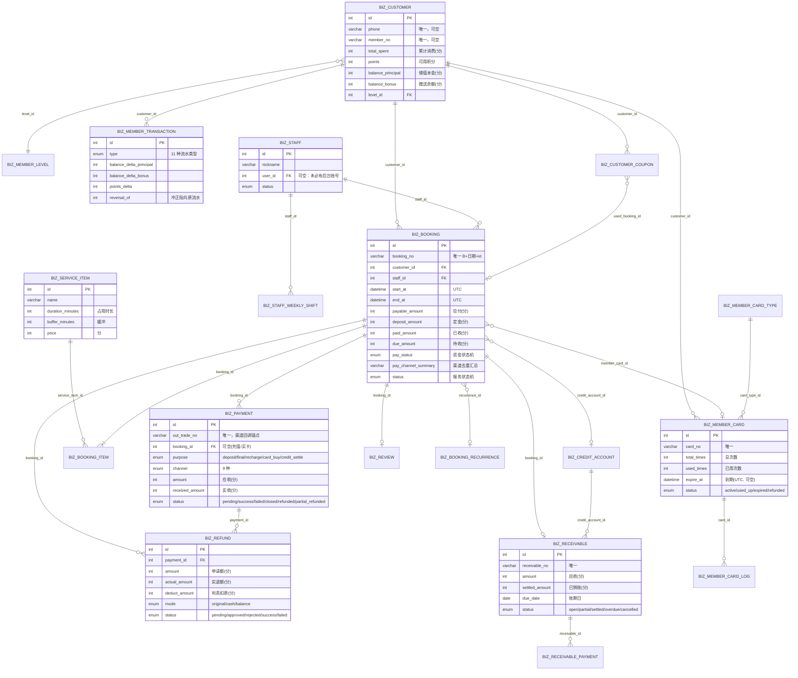

# 数据模型总览

本页是「数据模型」章节的入口：表清单、命名与索引约定、软删策略、核心实体关系图，以及**加新表时的设计清单**。

## 唯一事实来源

| 项目               | 位置                                                                  |
| ------------------ | --------------------------------------------------------------------- |
| 表结构（唯一权威） | `src/database/schema/index.ts`（单文件，61 张表 + `defineRelations`） |
| 迁移文件           | `src/database/migrations/<时间戳>_<随机名>/migration.sql`             |
| drizzle-kit 配置   | `drizzle.config.ts`                                                   |
| 种子数据           | `src/database/seed/{index,menus,biz,nail,demo}.ts`                    |
| 金额与算价口径     | `src/modules/biz/common/money.ts`                                     |
| 店内时间口径       | `src/modules/biz/common/shop-time.ts`                                 |
| 单号生成口径       | `src/modules/biz/common/doc-no.ts`                                    |

::: danger 不要以设计文档为准
`project-design/superpowers/specs/2026-09-11-nail-salon-booking-design.md` 与
`.agents/skills/data-model/SKILL.md` 都写着「32 张表」，那是早期设计意图，
**与现状不符**。当前 schema 实际是 **61 张表**。任何字段、类型、索引的口径冲突，
一律以 `src/database/schema/index.ts` 的实际代码为准。
:::

## 表分组总览

| 前缀   | 含义                      | 表数 | 说明                                                               |
| ------ | ------------------------- | ---- | ------------------------------------------------------------------ |
| `sys_` | 系统 / 权限 / 审计 / 通知 | 20   | 后台账号体系、RBAC、字典参数、日志、定时任务、文件、通知模板与日志 |
| `biz_` | 美甲业务                  | 31   | 基础数据、预约、会员资产、收银资金、挂账应收、运营                 |
| `ai_`  | AI 助手                   | 7    | 会话、消息、任务、任务步骤、审批意图、审批记录、审计日志           |
| `app_` | 小程序身份                | 3    | 微信身份、订阅消息授权台账、绑定留痕                               |

**共 61 张表（业务 31 / 系统 20 / AI 7 / 小程序身份 3）。**

> 通知模板与通知日志虽然服务于「运营」（评价、提成、通知三件套），但表名是 `sys_notice_template`
> / `sys_notice_log`，因此按前缀归入系统组，详解见 [/data/system-tables](/data/system-tables)。

## 全部表清单

| 表名                          | 代码变量名                  | 中文含义                         | 所属模块    | 关键唯一约束                                                                        |
| ----------------------------- | --------------------------- | -------------------------------- | ----------- | ----------------------------------------------------------------------------------- |
| `sys_dept`                    | `departments`               | 部门                             | 系统 / 权限 | —（仅 `idx_dept_parent`）                                                           |
| `sys_user`                    | `users`                     | 后台用户                         | 系统 / 权限 | `uq_user_username(username)`                                                        |
| `sys_role`                    | `roles`                     | 角色                             | 系统 / 权限 | `uq_role_key(role_key)`                                                             |
| `sys_menu`                    | `menus`                     | 菜单与权限点（M/C/F）            | 系统 / 权限 | `uq_menu_permission(permission)`                                                    |
| `sys_user_role`               | `userRoles`                 | 用户 ↔ 角色                      | 系统 / 权限 | `uq_user_role(user_id, role_id)`                                                    |
| `sys_role_menu`               | `roleMenus`                 | 角色 ↔ 菜单                      | 系统 / 权限 | `uq_role_menu(role_id, menu_id)`                                                    |
| `sys_role_dept`               | `roleDepts`                 | 角色 ↔ 部门（自定义数据范围）    | 系统 / 权限 | `uq_role_dept(role_id, dept_id)`                                                    |
| `sys_post`                    | `posts`                     | 岗位                             | 系统 / 权限 | `uq_post_key(post_key)`                                                             |
| `sys_user_post`               | `userPosts`                 | 用户 ↔ 岗位                      | 系统 / 权限 | `uq_user_post(user_id, post_id)`                                                    |
| `sys_refresh_token`           | `refreshTokens`             | 刷新令牌                         | 系统 / 权限 | `uq_refresh_token_hash(token_hash)`                                                 |
| `sys_dict_type`               | `dictTypes`                 | 字典类型                         | 系统 / 配置 | `uq_dict_type(type)`                                                                |
| `sys_dict_data`               | `dictionaries`              | 字典数据                         | 系统 / 配置 | `uq_dict_type_value(dict_type, value)`                                              |
| `sys_config`                  | `configs`                   | 参数配置                         | 系统 / 配置 | `uq_config_key(config_key)`                                                         |
| `sys_login_log`               | `loginLogs`                 | 登录日志                         | 审计        | —                                                                                   |
| `sys_operation_log`           | `operationLogs`             | 操作日志                         | 审计        | —                                                                                   |
| `sys_job`                     | `jobs`                      | 定时任务                         | 任务        | `uq_job_handler(handler)`                                                           |
| `sys_job_log`                 | `jobLogs`                   | 任务执行日志                     | 任务        | —                                                                                   |
| `sys_file`                    | `files`                     | 上传文件                         | 系统        | —                                                                                   |
| `sys_notice_template`         | `sysNoticeTemplates`        | 通知模板                         | 通知        | `uq_notice_template_code(code)`                                                     |
| `sys_notice_log`              | `sysNoticeLogs`             | 通知发送日志（含站内信）         | 通知        | —                                                                                   |
| `biz_service_item`            | `bizServiceItems`           | 服务项目                         | 基础数据    | —（仅 `idx_service_item_status`）                                                   |
| `biz_staff`                   | `bizStaffs`                 | 美甲师档案                       | 基础数据    | —（仅 `idx_staff_user` / `idx_staff_status`）                                       |
| `biz_staff_service_item`      | `bizStaffServiceItems`      | 美甲师可做项目                   | 基础数据    | `uq_staff_service_item(staff_id, service_item_id)`                                  |
| `biz_customer`                | `bizCustomers`              | 顾客档案（兼会员档案）           | 基础数据    | `uq_customer_phone(phone)`、`uq_customer_member_no(member_no)`                      |
| `biz_staff_weekly_shift`      | `bizStaffWeeklyShifts`      | 周模板班次                       | 排班        | —（仅 `idx_shift_staff_weekday`）                                                   |
| `biz_staff_schedule_override` | `bizStaffScheduleOverrides` | 日期例外（请假 / 自定义）        | 排班        | —（仅 `idx_override_staff_date`）                                                   |
| `biz_booking`                 | `bizBookings`               | 预约单                           | 预约        | `uq_booking_no(booking_no)`、`uq_booking_recurrence_start(recurrence_id, start_at)` |
| `biz_booking_item`            | `bizBookingItems`           | 预约项目明细                     | 预约        | —                                                                                   |
| `biz_booking_recurrence`      | `bizBookingRecurrences`     | 周期预约规则                     | 预约        | —（幂等靠 `generated_until` 游标 + 上表唯一键）                                     |
| `biz_member_level`            | `bizMemberLevels`           | 会员等级                         | 会员        | `uq_level_name(name)`                                                               |
| `biz_recharge_plan`           | `bizRechargePlans`          | 充值方案                         | 会员        | `uq_recharge_plan_name(name)`                                                       |
| `biz_member_card_type`        | `bizMemberCardTypes`        | 次卡卡种                         | 会员        | `uq_card_type_name(name)`                                                           |
| `biz_member_card_type_item`   | `bizMemberCardTypeItems`    | 卡种适用项目                     | 会员        | `uq_card_type_item(card_type_id, service_item_id)`                                  |
| `biz_member_card`             | `bizMemberCards`            | 会员次卡实例                     | 会员        | `uq_member_card_no(card_no)`                                                        |
| `biz_member_card_log`         | `bizMemberCardLogs`         | 次卡核销流水                     | 会员        | —                                                                                   |
| `biz_member_transaction`      | `bizMemberTransactions`     | 会员账务流水（储值 / 积分 / 卡） | 会员        | —                                                                                   |
| `biz_points_goods`            | `bizPointsGoods`            | 积分兑换品                       | 会员        | `uq_points_goods_name(name)`                                                        |
| `biz_points_redeem`           | `bizPointsRedeems`          | 积分兑换记录                     | 会员        | `uq_points_redeem_no(redeem_no)`                                                    |
| `biz_coupon_template`         | `bizCouponTemplates`        | 优惠券模板                       | 会员        | `uq_coupon_template_name(name)`                                                     |
| `biz_customer_coupon`         | `bizCustomerCoupons`        | 顾客持有券                       | 会员        | `uq_customer_coupon_no(coupon_no)`、`uq_customer_coupon_booking(used_booking_id)`   |
| `biz_payment`                 | `bizPayments`               | 支付单                           | 收银        | `uq_payment_no(payment_no)`、`uq_payment_out_trade_no(out_trade_no)`                |
| `biz_payment_log`             | `bizPaymentLogs`            | 支付过程日志                     | 收银        | —                                                                                   |
| `biz_payment_diff`            | `bizPaymentDiffs`           | 渠道对账差异                     | 收银        | `uq_payment_diff(bill_date, channel, transaction_id, diff_type)`                    |
| `biz_refund`                  | `bizRefunds`                | 退款单                           | 收银        | `uq_refund_no(refund_no)`                                                           |
| `biz_refund_policy`           | `bizRefundPolicies`         | 退款判责规则                     | 收银        | `uq_refund_policy_name(name)`                                                       |
| `biz_credit_account`          | `bizCreditAccounts`         | 挂账主体                         | 应收        | `uq_credit_account_name(name)`                                                      |
| `biz_receivable`              | `bizReceivables`            | 应收单                           | 应收        | `uq_receivable_no(receivable_no)`                                                   |
| `biz_receivable_payment`      | `bizReceivablePayments`     | 销账记录                         | 应收        | —                                                                                   |
| `biz_review`                  | `bizReviews`                | 服务评价                         | 运营        | `uq_review_booking(booking_id)`（一单一评）                                         |
| `biz_commission_rule`         | `bizCommissionRules`        | 提成规则                         | 运营        | —（优先级靠 `scope` + `sort` 应用层裁决）                                           |
| `biz_commission_record`       | `bizCommissionRecords`      | 提成计提记录                     | 运营        | —                                                                                   |
| `ai_session`                  | `aiSessions`                | AI 会话                          | AI          | —                                                                                   |
| `ai_message`                  | `aiMessages`                | AI 消息（含 tool 调用与结果）    | AI          | —                                                                                   |
| `ai_task`                     | `aiTasks`                   | AI 多步任务                      | AI          | —                                                                                   |
| `ai_task_step`                | `aiTaskSteps`               | AI 任务步骤（含 undo 快照）      | AI          | —                                                                                   |
| `ai_action_intent`            | `aiActionIntents`           | 待审批操作意图                   | AI          | —（`confirm_token` 只有普通索引）                                                   |
| `ai_approval`                 | `aiApprovals`               | 审批记录                         | AI          | —                                                                                   |
| `ai_audit_log`                | `aiAuditLogs`               | AI 操作审计日志                  | AI          | —                                                                                   |
| `app_wx_user`                 | `appWxUsers`                | 小程序微信身份                   | 小程序身份  | `uq_wx_openid(openid)`                                                              |
| `app_wx_subscribe_grant`      | `appWxSubscribeGrants`      | 订阅消息授权台账                 | 小程序身份  | `uq_wx_subscribe_grant(app_wx_user_id, template_id)`                                |
| `app_wx_user_bind_log`        | `appWxUserBindLogs`         | 身份 ↔ 顾客绑定留痕              | 小程序身份  | —（只追加）                                                                         |

## 命名与设计约定

### 前缀含义

| 前缀   | 归属                                                 | 判断标准                                            |
| ------ | ---------------------------------------------------- | --------------------------------------------------- |
| `sys_` | 平台能力（账号、权限、日志、任务、通知、文件、配置） | 「把美甲业务整体删掉，这张表还要不要？」要 → `sys_` |
| `biz_` | 美甲业务事实                                         | 只有美甲门店的业务语义                              |
| `ai_`  | AI 助手运行时                                        | 会话、任务、审批、审计                              |
| `app_` | 小程序身份域                                         | 与微信 / 顾客绑定相关，**不复用** `sys_user`        |

- 表名 `snake_case`；Drizzle 导出变量 `camelCase`（`biz_staff` → `bizStaffs`，**复数**）。
- 索引 `idx_*`；唯一索引 `uq_*`；外键 `fk_<来源简称>_<目标简称>`，如 `fk_booking_item_booking`。
- 关系注册集中在同文件的 `defineRelations`，`db.query.*` 只能用注册过的关系。

### 统一字段（审计列）

`biz_*` / `sys_*` 中的「主数据表」一律展开 `auditColumns`（schema 第 28~39 行）：

| 列           | 类型                                                                       | 说明                                          |
| ------------ | -------------------------------------------------------------------------- | --------------------------------------------- |
| `created_at` | `timestamp NOT NULL DEFAULT CURRENT_TIMESTAMP`                             | 创建时刻（UTC）                               |
| `updated_at` | `timestamp NOT NULL DEFAULT CURRENT_TIMESTAMP ON UPDATE CURRENT_TIMESTAMP` | 最后修改时刻（UTC）                           |
| `deleted_at` | `datetime NULL`                                                            | **软删标记**，非空即视为已删除                |
| `created_by` | `int unsigned NULL`                                                        | 操作者 `sys_user.id`；小程序 / 系统代建写 `0` |
| `updated_by` | `int unsigned NULL`                                                        | 同上                                          |

::: warning `created_by` 不是 bigint
schema 里有个 helper 叫 `bigintId()`，但它实际返回 `int(name, { unsigned: true })`。
名字是历史遗留，**列类型是 `int unsigned`**，对应 `sys_user.id`。
:::

只有主键 `id`（`int unsigned AUTO_INCREMENT`）是硬性统一；join 表与只追加流水表**故意不套**
`auditColumns`：它们要么可以被整体替换（物理删），要么天生只 INSERT。

### 金额字段：一律整数分

- 金额列一律 `int unsigned`，后缀语义化成 `_amount` / `_price`（列名里**不带** `_fen`，单位靠约定）：
  `price`、`original_price`、`payable_amount`、`deposit_amount`、`paid_amount`、`due_amount`、
  `refund_amount`、`received_amount`、`pay_amount`、`bonus_amount`、`balance_principal`、
  `balance_bonus`、`settled_amount`、`used_amount`、`credit_limit`、`discount_amount`、`threshold_amount`。
- **例外**：`biz_booking.adjust_amount` / `biz_member_transaction.amount|balance_delta_*|points_delta`
  是 `int`（**有符号**），因为它们可以为负（改价差额、冲正流水）。
- 比例一律**千分比整数**，后缀 `_permille`：`discount_permille`（1000 = 不打折）、
  `level_discount_permille`、`refund_permille`、`permille`、`maxPointsPermille`（配置项）。
- 取整方向**一律向下**（少收不多少），唯一实现是 `money.ts` 的 `permilleOf()` / `quoteBooking()`。
  细节见 [/data/migrations-seeds](/data/migrations-seeds)。

### 时间字段：一律 UTC

- `created_at` / `updated_at` / `start_at` / `end_at` / `paid_at` / `expire_at` / `sent_at` 等
  都是 `datetime` / `timestamp`，**存 UTC 绝对时刻**。
- 「店内本地日」只用 `date` + `{ mode: 'string' }`：`biz_staff_schedule_override.date`、
  `biz_booking_recurrence.start_date|end_date|generated_until`、`biz_receivable.due_date`、
  `biz_payment_diff.bill_date`。这些列**不是时刻**，不要当 `Date` 用。
- 班次与规则的墙钟时间用 `time`：`biz_staff_weekly_shift.start_time|end_time`、
  `biz_staff_schedule_override.start_time|end_time`、`biz_booking_recurrence.start_time`。
- 唯一的换算入口是 `shopDayRange()`（`src/modules/biz/common/shop-time.ts`）。

::: danger 禁止 `new Date('2026-09-11')`
它按 **UTC 零点**解析，整体偏 8 小时，报表与可约时段会一起错。要用
`shopDayRange('2026-09-11', tz)` 拿 `[start, end)`。
:::

### 小数与小坑

- `sys_file.size` 是字节数；`biz_review.score` 是 `tinyint unsigned`（1~5）；
  `biz_points_goods.stock` 是有符号 `int`，`-1` 表示**不限量**。
- `biz_coupon_template.valid_from|valid_to` 与 `biz_customer_coupon.expire_at|used_at`
  用的是 `timestamp`，而其它业务时间列是 `datetime`。功能等价，但类型不齐，
  新增代码不要照抄这个例外。

## 索引与唯一约束约定

### 建了唯一索引的业务键

| 业务键                                         | 表 / 索引                                                                                                                                 | 为什么必须唯一                                             |
| ---------------------------------------------- | ----------------------------------------------------------------------------------------------------------------------------------------- | ---------------------------------------------------------- |
| 顾客手机号                                     | `biz_customer.uq_customer_phone`                                                                                                          | 手机号是「顾客 ↔ 微信」的绑定锚点，重号会导致随机命中      |
| 会员号                                         | `biz_customer.uq_customer_member_no`                                                                                                      | 对外展示的会员标识                                         |
| 预约 / 支付 / 退款 / 应收 / 卡 / 兑换 / 券单号 | `uq_booking_no`、`uq_payment_no`、`uq_refund_no`、`uq_receivable_no`、`uq_member_card_no`、`uq_points_redeem_no`、`uq_customer_coupon_no` | 主键回填生成，唯一索引是并发的最后一道闸门                 |
| 渠道交易号                                     | `biz_payment.uq_payment_out_trade_no`                                                                                                     | 渠道回调按它找回支付单，重号 = 串单                        |
| 周期预约生成的幂等游标                         | `biz_booking.uq_booking_recurrence_start(recurrence_id, start_at)`                                                                        | 同一条规则的同一起始时刻只能有一单，重复跑生成任务不会插重 |
| 一单一评                                       | `biz_review.uq_review_booking`                                                                                                            | 评价只能有一条                                             |
| 一券一单                                       | `biz_customer_coupon.uq_customer_coupon_booking(used_booking_id)`                                                                         | 「一张券只核销一单、一单只用一张券」的兜底                 |
| 对账可重入                                     | `biz_payment_diff.uq_payment_diff(bill_date, channel, transaction_id, diff_type)`                                                         | 对账任务可重复执行而不产生重复差异行                       |
| 微信身份                                       | `app_wx_user.uq_wx_openid`                                                                                                                | 同一微信号只能有一行身份                                   |
| 订阅授权台账                                   | `app_wx_subscribe_grant.uq_wx_subscribe_grant(app_wx_user_id, template_id)`                                                               | 按 `(用户, 模板)` 聚合计数，而不是 append-only             |

### 唯一索引允许 NULL 重复（有意利用）

`uq_customer_phone`、`uq_customer_member_no`、`uq_customer_coupon_booking`、
`uq_booking_recurrence_start` 依赖 MySQL「多个 NULL 互不相同」的特性：

- 散客可以没有手机号（`phone = NULL`），多行不冲突；
- 非周期预约 `recurrence_id = NULL`，任意多条不冲突；
- 未核销的券 `used_booking_id = NULL`，一个顾客可以持有多张。

::: warning 别用 `(phone, deleted_at)` 组合唯一索引绕开软删
MySQL 把多个 NULL 视为互不相同，加了 `deleted_at` 的组合索引等于**没有约束**
（未删行的 `deleted_at` 也是 NULL）。这是这个项目明确踩过并放弃的方案。
:::

### 派生字段（冗余缓存）

金额与资产类字段在业务表上冗余了一份，是为了列表页与报表**不必每次聚合流水**：

| 派生字段                                                                                                                                      | 唯一写入方                                                             |
| --------------------------------------------------------------------------------------------------------------------------------------------- | ---------------------------------------------------------------------- |
| `biz_booking.paid_amount` / `refund_amount` / `due_amount` / `pay_status` / `pay_channel_summary` / `settled_at`                              | `BookingSettlementService.recalc()`                                    |
| `biz_customer.total_spent` / `points` / `points_total` / `balance_principal` / `balance_bonus` / `level_id` / `visit_count` / `last_visit_at` | 会员账务与到店统计 service（同事务写流水）                             |
| `biz_member_card.used_times` / `status`                                                                                                       | 次卡核销 service（条件更新）                                           |
| `biz_credit_account.used_amount`                                                                                                              | 挂账 / 销账 service                                                    |
| `biz_receivable.settled_amount` / `status`                                                                                                    | 销账 service（条件更新）                                               |
| `biz_service_item.image`                                                                                                                      | `ServiceItemsService` 的 `imagesPatch()`（恒等于 `images[0] ?? null`） |
| `ai_action_intent.status`                                                                                                                     | `ActionIntentService.updateStatus()`                                   |

代码评审红线：**任何 controller / 定时任务都不准直接 UPDATE 这些列**，
对账修复走 `recount` 接口。详见 [/backend/reports](/backend/reports) 与
[/quality/pitfalls](/quality/pitfalls)。

## 软删与物理删豁免

`deleted_at IS NULL` 是**默认查询条件**，几乎每个 service 的 `where` 都带 `isNull(deletedAt)`。

### 物理删（或从属子表）豁免清单

| 表                                                                    | 行为                                   | 理由                                            |
| --------------------------------------------------------------------- | -------------------------------------- | ----------------------------------------------- |
| `biz_staff_weekly_shift`                                              | 物理删                                 | 周模板 `PUT` 是**整体替换**：先删后插           |
| `biz_staff_schedule_override`                                         | 物理删                                 | 单条日期例外 `DELETE` 语义明确                  |
| `biz_member_card_type_item`                                           | 物理删                                 | 随卡种适用项目整体替换                          |
| `biz_staff_service_item`                                              | 物理删                                 | 随「可做项目」整体替换                          |
| `biz_booking_item`                                                    | 不套 `auditColumns`                    | 从属子表：随主表 CASCADE 删除，生命周期等于主表 |
| `sys_user_role` / `sys_role_menu` / `sys_role_dept` / `sys_user_post` | 不套 `auditColumns`                    | 纯关联行，外键 `ON DELETE CASCADE`              |
| `sys_login_log` / `sys_operation_log` / `sys_job_log` / `sys_file`    | 只追加，无 `updated_at` / `deleted_at` | 日志与文件不做软删                              |

### 只追加表（只有 `created_at` / `created_by`）

`biz_payment_log`、`biz_member_card_log`、`biz_member_transaction`、`biz_receivable_payment`、
`biz_commission_record`、`biz_points_redeem`、`sys_notice_log`、`app_wx_user_bind_log`。

接口层**不允许**出现更新或删除这些表的写入；纠错一律写**反向流水**（`reversal_of` 指向原行）。

### 「软删 + 唯一索引」这个坑的真实做法

软删行**仍然占着唯一键**。项目里对 `biz_customer.phone` 的处理是：

1. **查重时不过滤 `deletedAt`**（`CustomersService.assertPhoneAvailable` → `findByPhone` 走全表），
   所以同一个手机号在整个表里最多只有一行；命中软删行时**明确告知**（返回 409 语义）
   而不是让 INSERT 撞 1062。
2. **提供 `restore` 恢复路径**：`CustomersService.restore()` 清空 `deleted_at`（幂等：
   已启用则直接返回）。小程序端遇到软删档案同样**不自动恢复**，而是抛 409 +
   `needRestoreConfirm`，交门店在后台确认 —— 恢复会带回余额 / 积分 / 次卡历史。
3. **恢复时再兜一道**：`assertPhoneFreeForRestore()` 防有人绕过服务直改库造成的双行同号。

::: tip 结论
唯一索引 + 软删的正确组合是「**查重不过滤软删 + 显式恢复**」，
而不是「组合唯一索引」或「删了就把手机号改脏」。
:::

## 核心实体关系图

只画主链路实体与主要字段，完整字段见 [/data/business-tables](/data/business-tables)。

## 加新表时的设计清单

1. **定前缀**：平台能力 `sys_`、美甲业务 `biz_`、AI `ai_`、小程序身份 `app_`。
2. **主键**：`int('id', { unsigned: true }).autoincrement().primaryKey()`，不要用 uuid。
3. **审计列**：主数据表展开 `...auditColumns`；只追加流水表只写 `createdAt` + `createdBy`；
   纯关联 / 从属子表可不套（但要在评审里说明理由）。
4. **金额**：`int unsigned`，单位分，后缀语义化；可为负的差额与流水用有符号 `int`；
   比例用千分比整数 + `_permille` 后缀。
5. **时间**：绝对时刻用 `datetime` / `timestamp`（UTC）；店内本地日用 `date({ mode: 'string' })`；
   墙钟用 `time`。禁止把本地日当 `Date` 存。
6. **json 列必须带 `$type<T>()`**，例如 `json('images').$type<string[]>()`，否则读出来是 `unknown`。
7. **外键**：显式命名 `fk_*`，并按语义选 `ON DELETE`：
   主数据被引用 → `restrict`；从属子表 → `cascade`；可选关联 → `set null`。
8. **业务键唯一索引**：单号、外部交易号、幂等游标、（父, 子）关联对，一律建 `uq_*`。
9. **查询索引**：按真实 `WHERE` + `ORDER BY` 建复合索引（参考
   `(staff_id, start_at, end_at)`、`(pay_status, start_at)`、`(status, expire_at)`）。
10. **软删**：加 `deletedAt` 的表，所有查询都要带 `isNull(deletedAt)`；查重**不过滤**软删。
11. **注册关系**：新表要在 `defineRelations` 里注册，否则 `db.query.*` 用不了。
12. **生成迁移**：`bun run db:generate` → 检查 `migration.sql` → `bun run db:migrate`。
    加列一律可空或带默认值。流程见 [/data/migrations-seeds](/data/migrations-seeds)。

## 相关章节

- 业务表逐张详解：[/data/business-tables](/data/business-tables)
- 系统 / 监控 / AI / 小程序身份表：[/data/system-tables](/data/system-tables)
- 迁移、种子与派生口径：[/data/migrations-seeds](/data/migrations-seeds)
- 资金红线与对账等式：[/backend/payment](/backend/payment)、[/backend/refund-reconcile](/backend/refund-reconcile)
