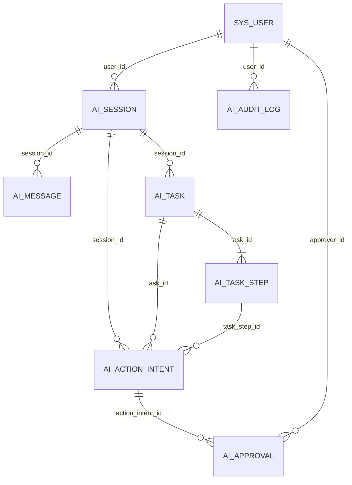

# 系统 · 监控 · AI · 小程序身份表

本页覆盖 **22 张 `sys_*` + 7 张 `ai_*` + 3 张 `app_*`，共 32 张表**。
`biz_*` 的 31 张表见 [/data/business-tables](/data/business-tables)。

阅读约定：除特别标注外，表都展开 `auditColumns`
（`created_at` / `updated_at` / `deleted_at` / `created_by` / `updated_by`），
下文字段表不再重复列出这 5 列。

## 一、系统与权限（15 张）

### sys_user —— 后台用户

后台账号。密码只存哈希，登录态由 `sys_refresh_token` 维护。

| 字段 | 类型 | 必填/默认 | 说明 | 口径与坑 |
| --- | --- | --- | --- | --- |
| `id` | `int unsigned` | PK 自增 | 主键 | 就是全库 `created_by` / `updated_by` 的含义 |
| `dept_id` | `int unsigned` | 可空 | 所属部门 | `ON DELETE SET NULL` |
| `username` | `varchar(64)` | 必填 | 登录名 | **唯一**；查重时不过滤软删 |
| `display_name` | `varchar(64)` | 必填 | 显示名 | — |
| `password_hash` | `varchar(255)` | 必填 | 密码哈希 | 永不出现在响应里 |
| `email` | `varchar(100)` | 可空 | 邮箱 | — |
| `phone` | `varchar(20)` | 可空 | 手机号 | 非唯一 |
| `avatar` | `varchar(500)` | 可空 | 头像 | — |
| `status` | `enum('active','disabled')` | 默认 `active` | 启停 | 停用后 token 校验失败 |
| `login_at` | `datetime` | 可空 | 最后登录时刻 | — |
| `login_ip` | `varchar(45)` | 可空 | 最后登录 IP | 兼容 IPv6 长度 |
| `password_changed_at` | `datetime` | 可空 | 改密时刻 | 用于强制作废旧会话 |

**索引与约束**：`uq_user_username(username)`、`idx_user_dept(dept_id)`；
外键 `fk_user_dept` `SET NULL`。
**相关代码**：`src/modules/system/users/users.service.ts`、`src/modules/auth/auth.service.ts`。

### sys_role —— 角色

RBAC 的角色。`role_key` 是权限判定用的稳定标识（`admin` / `user` / 自定义）。

| 字段 | 类型 | 必填/默认 | 说明 | 口径与坑 |
| --- | --- | --- | --- | --- |
| `id` | `int unsigned` | PK 自增 | 主键 | — |
| `name` | `varchar(50)` | 必填 | 角色名 | 展示用，不唯一 |
| `role_key` | `varchar(100)` | 必填 | 角色标识 | **唯一**；代码里按它判断 |
| `sort` | `int` | 默认 `0` | 排序 | — |
| `data_scope` | `enum` | 默认 `all` | 数据范围 | `all` / `custom` / `dept` / `dept_and_children` / `self` |
| `status` | `enum('active','disabled')` | 默认 `active` | 启停 | — |
| `is_system` | `boolean` | 默认 `false` | 系统内置 | 内置角色不允许删除 |
| `remark` | `varchar(500)` | 可空 | 备注 | — |

**索引与约束**：`uq_role_key(role_key)`。
**相关代码**：`src/modules/system/roles/roles.service.ts`；
seed 内置两个角色：`admin`（超级管理员，`is_system=true`）、`user`（普通用户）。

### sys_menu —— 菜单与权限点

一张表同时装菜单树与权限点，靠 `type` 区分：`M` 目录 / `C` 菜单页 / `F` 按钮。

| 字段 | 类型 | 必填/默认 | 说明 | 口径与坑 |
| --- | --- | --- | --- | --- |
| `id` | `int unsigned` | PK 自增 | 主键 | — |
| `parent_id` | `int unsigned` | 默认 `0` | 父菜单 | `0` 表示根 |
| `name` | `varchar(100)` | 必填 | 菜单唯一 name | seed 幂等键；子菜单与按钮的 `parentKey` 都指向它 |
| `title` | `varchar(100)` | 必填 | 中文标题 | — |
| `type` | `enum('M','C','F')` | 必填 | 类型 | 目录 / 页面 / 权限点 |
| `path` | `varchar(255)` | 可空 | 路由路径 | `C` 必填 |
| `component` | `varchar(255)` | 可空 | 组件路径 | `C` 必填，与 `web/src/views/**` 对应 |
| `permission` | `varchar(255)` | 可空 | 权限点字符串 | **唯一**（多行 NULL 不冲突）；`F` 必填 |
| `icon` | `varchar(100)` | 可空 | 图标 | — |
| `sort` | `int` | 默认 `0` | 排序 | — |
| `visible` | `boolean` | 默认 `true` | 是否可见 | — |
| `cacheable` | `boolean` | 默认 `false` | 是否 keep-alive | — |
| `external` | `boolean` | 默认 `false` | 是否外链 | — |
| `status` | `enum('active','disabled')` | 默认 `active` | 启停 | — |

**索引与约束**：`uq_menu_permission(permission)`、`idx_menu_parent(parent_id)`。

::: warning 权限点命名规范
`<域>:<资源>:<动作>`，全小写、不用驼峰，例如 `biz:booking:list`、`biz:staff:grant`。
`biz:app-staff-grants` 页面整页只用一个权限点 `biz:staff:grant`（列表 + 通过 + 驳回），
因为这三件事只能同一个人做。完整清单见 [/appendix/permissions](/appendix/permissions)。
:::

**相关代码**：`src/modules/system/menus/menus.service.ts`；
seed 驱动文件 `src/database/seed/menus.ts`（幂等：按 `name` 查 → 逐字段比对，值没变不发 UPDATE）。

### sys_store —— 门店档案（连锁直营）

经营主体。**阶段 0** 引入：门店信息原本散在 `sys_config` 的 `biz.shop.*` 一堆键里（单店假设，
一个 `config_key` 只能存一份值），现在收敛成一条实体记录。业务表将来会带 `store_id`，
资产（余额/积分/次卡/券）在「全店通兑」口径下不带。

| 字段 | 类型 | 必填/默认 | 说明 | 口径与坑 |
| --- | --- | --- | --- | --- |
| `id` | `int unsigned` | PK 自增 | 主键 | — |
| `code` | `varchar(32)` | 必填 | 门店编码 | `uq_store_code` 唯一；**软删也占位**（与用户名同口径） |
| `name` / `name_en` | `varchar(50)` | 必填 / 可空 | 门店名与英文副标题 | 通知模板 `{shopName}` 取它 |
| `phone` / `address` / `hours` | `varchar(20/200/50)` | 可空 | 电话 / 地址 / 营业时间文案 | 门店页展示口径 |
| `latitude` / `longitude` | `double` | 可空 | 坐标（地图导航） | 迁移从配置回填时用 `value + 0` 转数值 |
| `notice` | `varchar(500)` | 可空 | 公告 / 到店须知 | 空串在接口层统一成 `null` |
| `timezone` | `varchar(64)` | 可空 | 门店时区 | **现在留空**：有效时区仍走全局 `biz.booking.timezone`（跨时区连锁才需要） |
| `status` | `enum('active','disabled')` | 默认 `active` | 启停 | 停用门店不参与默认门店回落 |
| `sort` | `int` | 默认 `0` | 排序 | — |
| `is_default` | `boolean` | 默认 `false` | 默认门店 | 单店期就是唯一那家；多店期是「未指定门店时的兜底」。**同刻最多一个**（MySQL 没有部分唯一索引，规则在 service 事务里） |

**相关代码**：`src/modules/biz/base-data/stores/stores.service.ts`（CRUD + 默认唯一 + 默认门店不可删）；
seed 补空字段 `src/database/seed/stores.ts`；小程序 `GET /app/shop` 以门店表为准、`biz.shop.*` 兜底。

### sys_user_store —— 账号 ↔ 可见门店（连锁直营）

**阶段 1** 引入：决定「这个后台账号能看到哪几家门店的数据」。

| 字段 | 类型 | 必填/默认 | 说明 | 口径与坑 |
| --- | --- | --- | --- | --- |
| `user_id` | `int unsigned` | 必填 | 后台账号 | `fk_user_store_user` **ON DELETE CASCADE** |
| `store_id` | `int unsigned` | 必填 | 可见门店 | `fk_user_store_store` **ON DELETE CASCADE**；`uq_user_store(user_id, store_id)` 唯一 |

**范围规则**（`src/common/data-scope/store-scope.ts`）：

- 超级管理员（`*:*:*`）或拥有 `system:store:all` → **全部门店**，且列表可按 `storeId` 筛选；
- 普通账号 → **只看分给它的门店**（`IN` 过滤）；筛选别的门店直接 403；
- **一个门店都没分到**且不是超管 → 403 + 「未分配门店」提示（**不返回空列表** ——
  静默空列表会被误读成「真的没数据」）。

迁移会把**现存所有后台账号绑到默认门店**（改造前本来就都在同一家店），升级后行为不变。

### sys_dept —— 部门

组织树。`ancestors` 是物化的祖先路径，便于「包含下级」查询。

| 字段 | 类型 | 必填/默认 | 说明 | 口径与坑 |
| --- | --- | --- | --- | --- |
| `id` | `int unsigned` | PK 自增 | 主键 | — |
| `parent_id` | `int unsigned` | 默认 `0` | 上级部门 | `0` = 根 |
| `ancestors` | `varchar(500)` | 默认 `'0'` | 祖先前缀（如 `0,1,3`） | 改父节点时要**级联修**整棵子树 |
| `name` | `varchar(50)` | 必填 | 部门名 | 无唯一索引 |
| `sort` | `int` | 默认 `0` | 排序 | — |
| `phone` | `varchar(20)` | 可空 | 联系电话 | — |
| `email` | `varchar(100)` | 可空 | 邮箱 | — |
| `status` | `enum('active','disabled')` | 默认 `active` | 启停 | — |

**索引与约束**：`idx_dept_parent(parent_id)`。**无唯一索引**。
**历史演进**：`leader_user_id` 列已被迁移 `20260910135835_remove_dept_leader_user_id` 删除，
设计文档里若还写着「部门负责人」字段，以 schema 为准。
**相关代码**：`src/modules/system/depts/depts.service.ts`。

### sys_post —— 岗位

岗位字典（与部门正交的职务标签）。

| 字段 | 类型 | 必填/默认 | 说明 | 口径与坑 |
| --- | --- | --- | --- | --- |
| `id` | `int unsigned` | PK 自增 | 主键 | — |
| `name` | `varchar(50)` | 必填 | 岗位名 | 不唯一 |
| `post_key` | `varchar(100)` | 必填 | 岗位标识 | **唯一** |
| `sort` | `int` | 默认 `0` | 排序 | — |
| `status` | `enum('active','disabled')` | 默认 `active` | 启停 | — |
| `remark` | `varchar(500)` | 可空 | 备注 | — |

**索引与约束**：`uq_post_key(post_key)`。
**相关代码**：`src/modules/system/posts/posts.service.ts`。

### 关联表：sys_user_role / sys_role_menu / sys_role_dept / sys_user_post

四张纯关联表，**不套审计列**，外键一律 `ON DELETE CASCADE`。

| 表 | 代码变量 | 列 | 唯一索引 | 作用 |
| --- | --- | --- | --- | --- |
| `sys_user_role` | `userRoles` | `user_id`, `role_id` | `uq_user_role(user_id, role_id)` | 用户授权角色（**一个用户可多角色，权限取并集**） |
| `sys_role_menu` | `roleMenus` | `role_id`, `menu_id` | `uq_role_menu(role_id, menu_id)` | 角色可访问的菜单与权限点 |
| `sys_role_dept` | `roleDepts` | `role_id`, `dept_id` | `uq_role_dept(role_id, dept_id)` | `data_scope='custom'` 时可见的部门 |
| `sys_user_post` | `userPosts` | `user_id`, `post_id` | `uq_user_post(user_id, post_id)` | 用户兼任岗位 |

每组关联表的第二条索引都建在**反向列**上（`idx_user_role_role`、`idx_role_menu_menu`、
`idx_role_dept_dept`、`idx_user_post_post`），保证两个方向的查询都有索引。
**相关代码**：`src/modules/system/roles/roles.service.ts`、`src/modules/system/users/users.service.ts`、
`src/common/data-scope/data-scope.ts`。
权限体系细节见 [/backend/auth-rbac](/backend/auth-rbac)。

### sys_refresh_token —— 刷新令牌

刷新令牌白名单。**只存哈希**，撤销靠 `revoked_at`。

| 字段 | 类型 | 必填/默认 | 说明 | 口径与坑 |
| --- | --- | --- | --- | --- |
| `id` | `int unsigned` | PK 自增 | 主键 | — |
| `user_id` | `int unsigned` | 必填 | 用户 | `ON DELETE CASCADE` |
| `token_hash` | `varchar(255)` | 必填 | 令牌哈希 | **唯一**；原文不落库 |
| `expires_at` | `datetime` | 必填 | 过期时刻 | — |
| `revoked_at` | `datetime` | 可空 | 撤销时刻 | 非空即失效 |
| `device` | `varchar(255)` | 可空 | 设备信息 | 在线用户列表展示 |
| `ip` | `varchar(45)` | 可空 | 签发 IP | — |
| `created_at` | `timestamp` | 默认当前 | 签发时刻 | 该表**只有 `created_at`**，无 `updated_at` / `deleted_at` |

**索引与约束**：`uq_refresh_token_hash(token_hash)`、`idx_refresh_user(user_id)`。
**相关代码**：`src/modules/auth/auth.service.ts`；在线用户见 `src/modules/monitor/online/online.service.ts`。

### sys_dict_type / sys_dict_data —— 字典类型与字典数据

键值字典，供前端下拉与后端枚举展示。

**sys_dict_type**

| 字段 | 类型 | 必填/默认 | 说明 | 口径与坑 |
| --- | --- | --- | --- | --- |
| `id` | `int unsigned` | PK 自增 | 主键 | — |
| `name` | `varchar(100)` | 必填 | 类型名 | — |
| `type` | `varchar(100)` | 必填 | 类型编码 | **唯一** |
| `status` | `enum('active','disabled')` | 默认 `active` | 启停 | — |
| `remark` | `varchar(500)` | 可空 | 备注 | — |

**sys_dict_data**

| 字段 | 类型 | 必填/默认 | 说明 | 口径与坑 |
| --- | --- | --- | --- | --- |
| `id` | `int unsigned` | PK 自增 | 主键 | — |
| `dict_type` | `varchar(100)` | 必填 | 所属类型编码 | 与 `sys_dict_type.type` 字面关联（**无外键**） |
| `label` | `varchar(100)` | 必填 | 显示文本 | — |
| `value` | `varchar(100)` | 必填 | 值 | 与 `dict_type` 组成唯一键 |
| `sort` | `int` | 默认 `0` | 排序 | — |
| `status` | `enum('active','disabled')` | 默认 `active` | 启停 | — |
| `css_class` / `list_class` | `varchar(100)` | 可空 | 前端样式类 | 兼容旧前端的 tag 配色 |

**索引与约束**：`uq_dict_type(type)`、`uq_dict_type_value(dict_type, value)`。
**相关代码**：`src/modules/system/dict-types/`、`src/modules/system/dict-data/`。

### sys_config —— 参数配置

运行时参数。**业务默认值的唯一事实来源在代码**（`BIZ_CONFIG_DEFAULTS`），
seed 只把缺失的 key 灌进来，已存在的**一律跳过**。

| 字段 | 类型 | 必填/默认 | 说明 | 口径与坑 |
| --- | --- | --- | --- | --- |
| `id` | `int unsigned` | PK 自增 | 主键 | — |
| `name` | `varchar(100)` | 必填 | 参数名（中文标签） | 非空；缺标签时回落 key 本身 |
| `config_key` | `varchar(100)` | 必填 | 参数键（如 `biz.booking.timezone`） | **唯一** |
| `value` | `varchar(500)` | 必填 | 参数值（**一律字符串**） | 数字要显式转换，布尔用 `'true'` / `'false'` |
| `builtin` | `boolean` | 默认 `false` | 是否内置 | 内置项不允许删除 |
| `remark` | `varchar(500)` | 可空 | 备注 | — |

**索引与约束**：`uq_config_key(config_key)`。
**相关代码**：`src/modules/system/configs/configs.service.ts`；
业务侧读取封装 `src/modules/biz/common/biz-config.service.ts`。

::: tip 全部业务配置键
`biz.shop.name`、`biz.booking.timezone`、`biz.booking.stepMinutes`、`biz.booking.minLeadMinutes`、
`biz.booking.adminMinLeadMinutes`、`biz.booking.maxAdvanceDays`、`biz.booking.noShowGraceMinutes`、
`biz.booking.depositPermille`、`biz.member.pointsPerYuan`、`biz.member.pointsDiscountPerYuan`、
`biz.member.maxPointsPermille`、`biz.member.maxBonusPermille`、`biz.member.bonusDeductMode`、
`biz.member.minRechargeAmount`、`biz.member.refundNeedReason`、`biz.payment.qrExpireMinutes`、
`biz.payment.reconcileHour`、`biz.notice.smsEnabled`、`biz.notice.smsTemplates`、
`biz.notice.retryLimit`、`biz.credit.defaultLimit`、`biz.credit.defaultSettleDay`、
`biz.commission.periodCloseDay`。金额类单位为**分**，比例类为**千分比**。
:::

## 二、审计与任务（5 张）

### sys_login_log —— 登录日志

只追加。**失败尝试也记**，这是排查撞库的第一手证据。

| 字段 | 类型 | 必填/默认 | 说明 | 口径与坑 |
| --- | --- | --- | --- | --- |
| `id` | `int unsigned` | PK 自增 | 主键 | — |
| `user_id` | `int unsigned` | 可空 | 用户 | `SET NULL`：用户删了日志要留住 |
| `username` | `varchar(64)` | 必填 | 尝试的用户名 | **快照**，不依赖 `user_id` |
| `ip` | `varchar(45)` | 可空 | 来源 IP | — |
| `user_agent` | `varchar(500)` | 可空 | UA | — |
| `status` | `enum('success','failure')` | 必填 | 结果 | — |
| `message` | `varchar(500)` | 可空 | 失败原因 | 不要写密码等敏感信息 |
| `created_at` | `timestamp` | 默认当前 | 发生时刻 | 该表**只追加** |

**索引与约束**：`idx_login_log_user(user_id)`、`idx_login_log_time(created_at)`。
**相关代码**：`src/modules/monitor/login-logs/login-logs.service.ts`。

### sys_operation_log —— 操作日志

由拦截器自动写入。记录谁、什么时候、调了哪个接口、结果如何。

| 字段 | 类型 | 必填/默认 | 说明 | 口径与坑 |
| --- | --- | --- | --- | --- |
| `id` | `int unsigned` | PK 自增 | 主键 | — |
| `user_id` | `int unsigned` | 可空 | 操作者 | `SET NULL` |
| `title` | `varchar(100)` | 必填 | 操作标题 | 由 `@OperationLog()` 装饰器给 |
| `business_type` | `varchar(50)` | 必填 | 业务类型 | 新增 / 修改 / 删除 / 导出… |
| `method` | `varchar(255)` | 必填 | 控制器方法签名 | — |
| `request_method` | `varchar(10)` | 必填 | HTTP 方法 | — |
| `url` | `varchar(500)` | 必填 | 请求路径 | — |
| `ip` | `varchar(45)` | 可空 | 来源 IP | — |
| `request_body` | `json` | 可空 | 请求体 | **可能含敏感字段**，读权限要收紧 |
| `response_body` | `json` | 可空 | 响应体 | — |
| `status` | `enum('success','failure')` | 必填 | 结果 | — |
| `error_message` | `varchar(2000)` | 可空 | 异常信息 | — |
| `duration_ms` | `int unsigned` | 必填 | 耗时（毫秒） | 慢接口排查用 |
| `created_at` | `timestamp` | 默认当前 | 发生时刻 | **只追加** |

**索引与约束**：`idx_operation_log_user_time(user_id, created_at)`。
**相关代码**：`src/common/logging/operation-log.interceptor.ts`、
`src/modules/monitor/operation-logs/operation-logs.service.ts`。

### sys_job —— 定时任务

任务注册表。`handler` 是代码里的任务名，**必须与实现逐字一致**。

| 字段 | 类型 | 必填/默认 | 说明 | 口径与坑 |
| --- | --- | --- | --- | --- |
| `id` | `int unsigned` | PK 自增 | 主键 | — |
| `name` | `varchar(100)` | 必填 | 任务名 | — |
| `handler` | `varchar(255)` | 必填 | 处理器标识 | **唯一** |
| `cron` | `varchar(100)` | 必填 | **6 段式** cron（秒 分 时 日 月 周） | 不是 5 段，也不用 Quartz 的 `?` |
| `status` | `enum('active','disabled')` | 默认 `active` | 启停 | — |
| `concurrent` | `boolean` | 默认 `true` | 是否允许并发 | seed 一律灌 `false`（防重入） |
| `remark` | `varchar(500)` | 可空 | 说明 | seed 里写清了每个任务的口径 |

**索引与约束**：`uq_job_handler(handler)`。
**相关代码**：`src/modules/jobs/jobs.service.ts`；任务 seed 在 `src/database/seed/biz.ts`。

seed 内置任务（handler 逐字）：

| handler | cron | 职责 |
| --- | --- | --- |
| `autoCompleteExpiredBookings` | `0 */10 * * * *` | `arrived` 且 `end_at < now` → `completed` |
| `autoNoShowBookings` | `0 */10 * * * *` | `confirmed` 且超过容忍期 → `no_show` |
| `expireMemberCards` | `0 5 0 * * *` | `active` 且 `expire_at < now` → `expired` |
| `recountMemberLevels` | `0 30 3 * * *` | 按 `total_spent` 重算等级（幂等修复） |
| `closeExpiredPayments` | `0 * * * * *` | `pending` 且 `expire_at < now` → `closed` |
| `queryPendingPayments` | `0 */2 * * * *` | 主动查单，回调丢失时兜底 |
| `reconcilePayments` | `0 30 6 * * *` | 渠道对账，写 `biz_payment_diff` |
| `markOverdueReceivables` | `0 10 1 * * *` | 应收逾期标记 |
| `sendBookingReminders` | `0 0 18 * * *` | 次日预约到店提醒 |
| `retryFailedNotices` | `0 */5 * * * *` | 通知失败重试（`retry_count < biz.notice.retryLimit`） |
| `generateRecurringBookings` | `0 15 3 * * *` | 周期预约滚动生成 |

::: danger 定时任务不碰钱
任务只改**状态与等级**。任何改余额 / 积分 / 金额的任务都是设计错误 ——
资金变更只能由业务请求触发，否则对账等式迟早被破坏。详见 [/backend/notification-jobs](/backend/notification-jobs)。
:::

### sys_job_log —— 任务执行日志

只追加。每次执行一行，含耗时。

| 字段 | 类型 | 必填/默认 | 说明 | 口径与坑 |
| --- | --- | --- | --- | --- |
| `id` | `int unsigned` | PK 自增 | 主键 | — |
| `job_id` | `int unsigned` | 必填 | 任务 | `ON DELETE CASCADE` |
| `job_name` | `varchar(100)` | 必填 | 任务名快照 | — |
| `handler` | `varchar(255)` | 必填 | 处理器快照 | — |
| `status` | `enum('success','failure')` | 必填 | 结果 | — |
| `message` | `varchar(2000)` | 可空 | 输出 / 异常 | 幂等跳过也写这里 |
| `started_at` / `finished_at` | `timestamp` | 必填 | 起止时刻 | 两个都 NOT NULL |
| `duration_ms` | `int unsigned` | 必填 | 耗时（毫秒） | — |

**索引与约束**：`idx_job_log_job(job_id)`。**只追加**。
**相关代码**：`src/modules/jobs/jobs.service.ts`。

### sys_file —— 上传文件

上传台账。物理文件落在 `uploads/`，库里只存元信息。
**该表没有 `updated_at` / `deleted_at`**，只有 `created_at` / `created_by`。

| 字段 | 类型 | 必填/默认 | 说明 | 口径与坑 |
| --- | --- | --- | --- | --- |
| `id` | `int unsigned` | PK 自增 | 主键 | — |
| `name` | `varchar(255)` | 必填 | 存储文件名 | 服务端生成，避免路径穿越 |
| `original_name` | `varchar(255)` | 必填 | 原始文件名 | 仅用于展示与下载命名 |
| `path` | `varchar(500)` | 必填 | 相对路径 / URL | 业务表里存的就是它 |
| `mime` | `varchar(100)` | 必填 | MIME 类型 | 上传时要白名单校验 |
| `ext` | `varchar(20)` | 必填 | 扩展名 | — |
| `size` | `int unsigned` | 必填 | 字节数 | — |
| `created_by` | `int unsigned` | 可空 | 上传者 | `SET NULL` |
| `created_at` | `timestamp` | 默认当前 | 上传时刻 | — |

**索引与约束**：`idx_file_created_by(created_by)`；外键 `fk_file_created_by` `SET NULL`。
**相关代码**：`src/modules/files/files.service.ts`。

## 三、通知（2 张）

### sys_notice_template —— 通知模板

`code` 是业务触发的稳定锚点；`content` 里的 `{变量}` 必须在 `variables` 中声明。

| 字段 | 类型 | 必填/默认 | 说明 | 口径与坑 |
| --- | --- | --- | --- | --- |
| `id` | `int unsigned` | PK 自增 | 主键 | — |
| `code` | `varchar(50)` | 必填 | 模板编码 | **唯一**，代码里按它触发 |
| `name` | `varchar(50)` | 必填 | 模板名 | — |
| `channel` | `enum('sms','site','both')` | 默认 `both` | 默认渠道 | 实际是否走短信还受 `biz.notice.smsEnabled` 与白名单约束 |
| `title` | `varchar(100)` | 可空 | 站内信标题 | 短信不用标题 |
| `content` | `varchar(1000)` | 必填 | 模板正文 | `{name}` 占位替换 |
| `variables` | `json` | 可空 | 变量声明 `[{name,label}]` | 未声明的变量视为配置错误 |
| `status` | `enum('active','disabled')` | 默认 `active` | 启停 | 停用后发送记 `skipped` |
| `remark` | `varchar(200)` | 可空 | 备注 | — |

**索引与约束**：`uq_notice_template_code(code)`。
**相关代码**：`src/modules/biz/operations/notices/notices.service.ts`；
seed 在 `src/database/seed/biz.ts`。

seed 内置 8 个模板 code：`booking_created`（预约成功）、`booking_remind`（到店提醒）、
`booking_cancelled`（取消通知）、`booking_completed`（完成致谢 + 评价邀请）、
`member_recharged`（充值成功）、`tail_payment_remind`（尾款提醒，仅短信）、
`recurrence_conflict`（周期冲突告警，仅站内）、`recurrence_failed`（周期生成失败，仅站内）。

### sys_notice_log —— 通知发送日志

**站内信也存在这里**（`channel='site'`）。只追加。

| 字段 | 类型 | 必填/默认 | 说明 | 口径与坑 |
| --- | --- | --- | --- | --- |
| `id` | `int unsigned` | PK 自增 | 主键 | — |
| `template_code` | `varchar(50)` | 必填 | 模板编码 | **无外键**：模板改名/删除不影响历史 |
| `channel` | `enum('sms','site')` | 必填 | 实际渠道 | 模板是 `both` 时这里会落成具体一个 |
| `recipient_type` | `enum('customer','user')` | 必填 | 收件人类型 | 决定 `recipient_id` 指向哪张表 |
| `recipient_id` | `int unsigned` | 必填 | 收件人 | 无外键（多态） |
| `phone` | `varchar(20)` | 可空 | 发送手机号 | — |
| `title` | `varchar(100)` | 可空 | 标题 | — |
| `content` | `varchar(1000)` | 必填 | **渲染后的**正文 | 模板改版不改变历史记录 |
| `status` | `enum('pending','success','failed','skipped')` | 默认 `pending` | 状态 | `skipped` = 未启用或未授权，不算失败 |
| `provider` | `varchar(30)` | 可空 | 短信供应商 | 未配置时为 `NULL` |
| `provider_msg_id` | `varchar(64)` | 可空 | 供应商回执 id | — |
| `error` | `varchar(500)` | 可空 | 失败原因 | — |
| `retry_count` | `tinyint unsigned` | 默认 `0` | 已重试次数 | 上限 `biz.notice.retryLimit`（默认 3） |
| `sent_at` | `datetime` | 可空 | 发送成功时刻 | — |
| `read_at` | `datetime` | 可空 | 站内信已读时刻 | 短信恒为 `NULL` |
| `booking_id` | `int unsigned` | 可空 | 关联预约 | 无外键 |
| `created_at` | `timestamp` | 默认当前 | 写入时刻 | — |

**索引与约束**：`idx_notice_log_status(status, retry_count, id)`（重试任务扫描）、
`idx_notice_log_recipient(recipient_type, recipient_id, id)`（站内信收件箱）、
`idx_notice_log_booking(booking_id)`。**只追加**。
**相关代码**：`src/modules/biz/operations/notices/notices.service.ts`、
`src/modules/biz/operations/notices/sms/`（供应商抽象）。

::: tip 发送失败不回滚业务
通知在**事务提交之后**发送；失败只更新 `sys_notice_log.status`，
不回滚预约 / 收款。这是有意为之：钱和单不能因为短信通道挂掉而失败。
:::

## 四、小程序身份（3 张）

::: danger 为什么小程序身份独立建表，不复用 sys_user
1. **认证域不同**：小程序走 `/api/v1/app/**` + `AppAccessTokenGuard`，与后台 token **双向拒绝**；
   app 域**不接 RBAC**（不查 `sys_user_role` / `sys_role_menu`），复用 `sys_user` 会把两套鉴权搅在一起。
2. **生命周期不同**：后台账号由店长人工创建、可停用；小程序身份由用户扫码自动产生，量大且天然自注册。
3. **一个人可能同时是顾客和美甲师**：同一个微信号既要买东西又要进工作台看自己的预约，
   用 `sys_user` 表达会逼出一个「既是顾客又是员工」的畸形账号。
4. **不复用后台 DTO**：app 域有独立的 VO（`src/modules/app/dto/app-vo.ts`），字段白名单更窄。
:::

### app_wx_user —— 小程序微信身份

先有 `openid` 才能浏览；授权手机号后才绑定顾客档案。
**同一行里并存两组身份列，互不影响**：顾客身份 `customer_id`，美甲师工作台 `staff_id` + `staff_status`。

| 字段 | 类型 | 必填/默认 | 说明 | 口径与坑 |
| --- | --- | --- | --- | --- |
| `id` | `int unsigned` | PK 自增 | 主键 | app token 里带的就是它 |
| `openid` | `varchar(64)` | 必填 | 微信 openid | **唯一**：并发登录不会产生第二条身份 |
| `unionid` | `varchar(64)` | 可空 | 微信 unionid | 有索引，不唯一 |
| `customer_id` | `int unsigned` | 可空 | 绑定的顾客档案 | 绑定锚点，`ON DELETE SET NULL` |
| `staff_id` | `int unsigned` | 可空 | 命中的美甲师档案 | `SET NULL` |
| `staff_status` | `enum('none','pending','active','rejected')` | 默认 `none` | 工作台开通状态 | 见下 |
| `staff_requested_at` | `datetime` | 可空 | 提交开通申请时刻 | — |
| `staff_decided_at` | `datetime` | 可空 | 店长决策时刻 | — |
| `staff_decided_by` | `int unsigned` | 可空 | 决策人 `sys_user.id` | 事后追溯 |
| `staff_reject_reason` | `varchar(200)` | 可空 | 驳回原因 | 小程序端展示「为什么没通过」 |
| `nickname` | `varchar(50)` | 可空 | 微信昵称 | 用于自建顾客档案的默认名 |
| `avatar` | `varchar(500)` | 可空 | 微信头像 | — |
| `phone` | `varchar(20)` | 可空 | **手机号快照** | 与「绑定顾客」解耦（微信的 code 是一次性的） |
| `last_login_at` | `datetime` | 可空 | 最后登录时刻 | 每次登录更新 |

**索引与约束**：`uq_wx_openid(openid)`、`idx_wx_unionid(unionid)`、`idx_wx_customer(customer_id)`、
`idx_wx_staff(staff_id, staff_status)`；`fk_wx_user_customer` / `fk_wx_user_staff` 均 `SET NULL`。

**绑定锚点：手机号**。链路是「`getPhoneNumber` 的 code → 手机号 →
`CustomersService.findByPhone()`（**不过滤软删**）→ 命中即绑、未命中则创建 `biz_customer`」。
手机号是 `biz_customer.uq_customer_phone` 唯一键，也是 `biz_staff.phone` 的匹配依据。

`staff_status` 状态机：

| 取值 | 含义 | 进入条件 |
| --- | --- | --- |
| `none` | 未申请 | 初始值 |
| `pending` | 待店长确认 | 手机号命中 `biz_staff.phone` 且该美甲师 `status='active'` 时提交申请 |
| `active` | 工作台已开通 | **只能由店长在后台确认** |
| `rejected` | 已驳回 | 店长驳回，必须填 `staff_reject_reason` |

::: danger 绝不因手机号命中而自动开通工作台
仅凭手机号自动开通等于提权漏洞（号码被复用即可看到该美甲师的预约与业绩）。
`staff_status` 存在这里而不是 token 里，是为了让「停用美甲师」或「店长撤权」
**下一次请求立即失效**，而 token 里的角色要等过期才失效。
:::

**相关代码**：`src/modules/app/auth/app-auth.service.ts`（login / bindPhone）、
`src/modules/app/auth/app-access-token.guard.ts`、`src/modules/app/staff/app-staff-grants.service.ts`
（店长确认 / 驳回）、`src/modules/app/staff/app-staff-scope.guard.ts`（工作台数据范围）。
详见 [/backend/app-domain](/backend/app-domain)。

### app_wx_subscribe_grant —— 订阅消息授权台账

微信订阅消息的真实语义是**额度**：用户点一次「允许」就获得一次下发权限且可累积，
所以按 `(用户, 模板)` 聚合成一行**计数**，而不是记成 append-only 流水
（后者做不了「还能发几次」的查询）。

| 字段 | 类型 | 必填/默认 | 说明 | 口径与坑 |
| --- | --- | --- | --- | --- |
| `id` | `int unsigned` | PK 自增 | 主键 | — |
| `app_wx_user_id` | `int unsigned` | 必填 | 身份 | **故意不建外键** |
| `customer_id` | `int unsigned` | 可空 | **顾客 id 快照** | 换绑后仍留证 |
| `template_id` | `varchar(64)` | 必填 | 微信模板 id | 与身份组成唯一键 |
| `granted_count` | `int unsigned` | 默认 `0` | 累计授权次数 | 一次性订阅可累积 |
| `last_booking_id` | `int unsigned` | 可空 | 最近一次授权关联的预约 | 仅上下文 |
| `granted_at` | `datetime` | 必填 | 最近授权时刻 | — |

**索引与约束**：`uq_wx_subscribe_grant(app_wx_user_id, template_id)`、
`idx_wx_subscribe_customer(customer_id)`。**无外键**。

::: warning 两条刻意的约束
1. **只记客户端上报为已授权**的模板；用户拒绝时客户端不上报，也就不落库 ——
   这就是「未授权不报错、不阻塞业务」。
2. **不建外键**：台账行本身就是要留证的，`app_wx_user` 是软删，真删时孤儿行比「删不掉」更有用；
   而且 drizzle-kit 内联生成的外键会丢掉 `ON DELETE`，留着会变成「看起来级联、实际不级联」的坑。
:::

额度消费（发送段）依赖微信模板 id 申请，属于后续工作。
**相关代码**：`src/modules/app/auth/app-auth.controller.ts`（上报入口）。

### app_wx_user_bind_log —— 身份 ↔ 顾客绑定留痕

一个 openid 同时只绑一个 `customer_id`，**换绑就是覆盖**，旧关系当场消失。
没有这张表就回答不了「这个 openid 昨天绑的是谁」。

| 字段 | 类型 | 必填/默认 | 说明 | 口径与坑 |
| --- | --- | --- | --- | --- |
| `id` | `int unsigned` | PK 自增 | 主键 | — |
| `app_wx_user_id` | `int unsigned` | 必填 | 身份 | 无外键 |
| `openid` | `varchar(64)` | 必填 | **openid 快照** | 身份行被软删/换绑后仍可追溯 |
| `phone` | `varchar(20)` | 可空 | 手机号**原值** | 不脱敏：脱敏了就查不出「这个号被谁绑过」 |
| `customer_id_before` | `int unsigned` | 可空 | 换绑前顾客 | 首次绑定为 `NULL` |
| `customer_id_after` | `int unsigned` | 可空 | 换绑后顾客 | — |
| `source` | `enum('bind_phone')` | 必填 | 绑定来源 | 目前只有手机号绑定 |

**索引与约束**：`idx_wx_bind_user(app_wx_user_id, id)`、`idx_wx_bind_customer(customer_id_after)`。
**无外键**；只追加不删。
**写入时机**：`AppAuthService.bindPhone()` 中，**覆盖绑定与写留痕在同一事务内** ——
留痕落不下去的换绑比不换绑更危险。
**相关代码**：`src/modules/app/auth/app-auth.service.ts`。

## 五、AI 助手（7 张）

AI 助手的持久化模型分三层：**会话（对话上下文）** → **任务（多步执行时间线）** →
**意图与审批（危险操作的闸门）**，外加一张横切的审计日志。

::: warning `ai_*` 七张表没有任何唯一约束
全部只有普通索引，连 `ai_action_intent.confirm_token` 也只是 `idx_*`。
幂等靠**应用层**（`findPendingByHash` 复用同参数的待审批意图、
`updateStatus` 先判 `status === 'PENDING'`）。改这块代码时不要指望数据库兜底。
:::

### ai_session —— AI 会话

| 字段 | 类型 | 必填/默认 | 说明 | 口径与坑 |
| --- | --- | --- | --- | --- |
| `id` | `int unsigned` | PK 自增 | 主键 | — |
| `user_id` | `int unsigned` | 必填 | 归属用户 | `ON DELETE CASCADE` |
| `title` | `varchar(200)` | 必填 | 会话标题 | 取自首条消息 |
| `status` | `enum('active','closed')` | 默认 `active` | 状态 | — |
| `created_at` / `updated_at` | `timestamp` | 必填 | 起止时刻 | 按 `updated_at` 倒序就是会话列表 |

**索引与约束**：`idx_ai_session_user(user_id)`；外键 `fk_ai_session_user` `CASCADE`。
**相关代码**：`src/ai/ai.module.ts`、`src/ai/agent/agent.service.ts`、`src/ai/gateway/ai.gateway.service.ts`。

### ai_message —— AI 消息

一次对话中的每条消息，含 tool 调用与结果。

| 字段 | 类型 | 必填/默认 | 说明 | 口径与坑 |
| --- | --- | --- | --- | --- |
| `id` | `int unsigned` | PK 自增 | 主键 | — |
| `session_id` | `int unsigned` | 必填 | 会话 | `CASCADE` |
| `role` | `enum('user','assistant','tool','system')` | 必填 | 角色 | `tool` 存工具回填结果 |
| `content` | `text` | 可空 | 正文 | tool 消息可能只有结构化字段 |
| `tool_calls` | `json` | 可空 | 模型请求的工具调用 | — |
| `tool_results` | `json` | 可空 | 工具执行结果 | **已过脱敏**（`context.sanitizer`） |
| `created_at` | `timestamp` | 默认当前 | 时刻 | 该表**只追加** |

**索引与约束**：`idx_ai_message_session(session_id)`。
**相关代码**：`src/ai/context/context.builder.ts`、`src/ai/context/context.sanitizer.ts`。

### ai_task —— AI 多步任务

一个完整的多步任务（含被审批中断的那种）。

| 字段 | 类型 | 必填/默认 | 说明 | 口径与坑 |
| --- | --- | --- | --- | --- |
| `id` | `int unsigned` | PK 自增 | 主键 | — |
| `session_id` | `int unsigned` | 可空 | 会话 | `SET NULL` |
| `user_id` | `int unsigned` | 必填 | 发起人 | `CASCADE` |
| `status` | `enum` | 默认 `PENDING` | 任务状态 | `PENDING` / `RUNNING` / `SUCCESS` / `FAILED` / `CANCELLED` |
| `risk_level` | `varchar(10)` | 必填 | 最高风险等级 | 由 `RiskEngine` 判定 |
| `goal` | `varchar(500)` | 必填 | 目标（截断的用户消息） | — |
| `error` | `varchar(1000)` | 可空 | 失败原因 | — |
| `created_at` | `timestamp` | 默认当前 | 创建时刻 | `.defaultNow()` |
| `started_at` / `completed_at` | `timestamp` | 可空 | 起止时刻 | — |

**索引与约束**：`idx_ai_task_session(session_id)`、`idx_ai_task_user(user_id)`。
**相关代码**：`src/ai/task/task.service.ts`、`src/ai/risk/risk.engine.ts`。

### ai_task_step —— AI 任务步骤

任务中的每一步，**也是 undo 快照的存放处**。

| 字段 | 类型 | 必填/默认 | 说明 | 口径与坑 |
| --- | --- | --- | --- | --- |
| `id` | `int unsigned` | PK 自增 | 主键 | — |
| `task_id` | `int unsigned` | 必填 | 任务 | `CASCADE` |
| `step_index` | `int` | 必填 | 步骤序号 | 由调用方给出（有符号 `int`） |
| `tool_name` | `varchar(100)` | 必填 | 工具名 | — |
| `input` | `json` | 可空 | 工具入参 | — |
| `output` | `json` | 可空 | 工具输出 | **含 `undo` 快照**，供 `rollbackTask` 回滚 |
| `status` | `enum` | 默认 `PENDING` | 步骤状态 | 含 `WAITING_APPROVAL`、`SKIPPED` |
| `risk_level` | `varchar(10)` | 必填 | 风险等级 | — |
| `error` | `varchar(1000)` | 可空 | 失败原因 | — |
| `started_at` / `completed_at` | `timestamp` | 可空 | 起止时刻 | — |

**索引与约束**：`idx_ai_task_step_task(task_id)`。
**相关代码**：`src/ai/task/task.service.ts`（`addStep` / `updateStep` / `rollbackTask`，从
`output.undo` 提取 before 快照）。

### ai_action_intent —— 待审批操作意图

危险操作在执行**之前**落一行，拿到 `confirm_token` 交给用户确认。

| 字段 | 类型 | 必填/默认 | 说明 | 口径与坑 |
| --- | --- | --- | --- | --- |
| `id` | `int unsigned` | PK 自增 | 主键 | — |
| `session_id` | `int unsigned` | 可空 | 会话 | `SET NULL` |
| `user_id` | `int unsigned` | 必填 | 发起人 | `CASCADE`，校验时必须相等 |
| `tool_name` | `varchar(100)` | 必填 | 工具名 | 校验时必须相等 |
| `input` | `json` | 可空 | 工具入参 | — |
| `input_hash` | `varchar(64)` | 必填 | 入参的稳定 sha256 | 防「确认的参数 ≠ 执行的参数」 |
| `before_hash` | `varchar(64)` | 可空 | 预览时数据快照的 sha256 | **TOCTOU 防护**：数据变了就拒绝执行 |
| `confirm_token` | `varchar(128)` | 可空 | 一次性确认令牌 | 32 字节随机 hex；只有普通索引 |
| `risk_level` | `varchar(10)` | 必填 | 风险等级 | — |
| `status` | `enum` | 默认 `PENDING` | 状态 | `PENDING` / `APPROVED` / `REJECTED` / `EXPIRED` / `EXECUTED` / `CANCELLED` |
| `task_id` | `int unsigned` | 可空 | 关联任务 | `SET NULL`，审批也纳入任务时间线 |
| `task_step_id` | `int unsigned` | 可空 | 关联任务步骤 | `SET NULL`，确认执行后更新步骤状态与 undo 快照 |
| `expires_at` | `datetime` | 必填 | 失效时刻 | 创建时 **+5 分钟** |
| `executed_at` | `datetime` | 可空 | 执行时刻 | `EXECUTED` 时写入 |
| `created_at` | `timestamp` | 默认当前 | 创建时刻 | — |

**索引与约束**：`idx_ai_action_intent_user`、`idx_ai_action_intent_status`、
`idx_ai_action_intent_token(confirm_token)`（注意：**不是唯一索引**，同一 token 理论上可重复）。
外键：`session` / `task` / `task_step` `SET NULL`，`user` `CASCADE`。

**校验链**（`ActionIntentService.validate()`，任一不符即拒绝）：
`status === 'PENDING'` → `expires_at > now` → `confirm_token` 相等 → `user_id` 相等 →
`tool_name` 相等 → **重算 `input_hash` 必须相等** → `assertUnchanged(before_hash, 当前数据)`。

**相关代码**：`src/ai/approval/action-intent.service.ts`、`src/ai/agent/agent.service.ts`。

### ai_approval —— 审批记录

一次审批一行。**审批结果元数据持久化**就落在这里 + `ai_action_intent` 的状态列。

| 字段 | 类型 | 必填/默认 | 说明 | 口径与坑 |
| --- | --- | --- | --- | --- |
| `id` | `int unsigned` | PK 自增 | 主键 | — |
| `action_intent_id` | `int unsigned` | 必填 | 被审批的意图 | `ON DELETE CASCADE` |
| `approver_id` | `int unsigned` | 必填 | 审批人 | `CASCADE`，与发起**可以是同一人**（自助确认） |
| `status` | `enum('APPROVED','REJECTED')` | 必填 | 审批结论 | — |
| `reason` | `varchar(500)` | 可空 | 驳回原因 | — |
| `created_at` | `timestamp` | 默认当前 | 审批时刻 | — |

**索引与约束**：`idx_ai_approval_intent(action_intent_id)`。
**相关代码**：`src/ai/approval/approval.service.ts`。

::: tip 「审批结果元数据持久化」是怎么落表的
三个层次，缺一不可：

| 层次 | 落点 | 内容 |
| --- | --- | --- |
| 闸门状态 | `ai_action_intent.status` + `executed_at` | `PENDING → APPROVED/REJECTED → EXECUTED`（含 `EXPIRED` / `CANCELLED`） |
| 审批明细 | `ai_approval` | 谁、什么时候、批还是驳、原因 |
| 执行与回滚 | `ai_task_step.output`（`status` 变 `SUCCESS`、`output.undo` 存 before 快照） | 执行结果 + 可回滚的数据快照 |
| 横切留痕 | `ai_audit_log.metadata` | `{ input, intentId }` / `{ input, reason, explanation }` |

所以一次「AI 改配置」的完整证据链是：
`ai_audit_log(tool_evaluate, denied/allowed)` → `ai_action_intent(PENDING, before_hash)` →
`ai_approval(APPROVED)` → `ai_action_intent(EXECUTED)` →
`ai_task_step(SUCCESS, output.undo)` → `ai_audit_log(tool_execute)`。
:::

### ai_audit_log —— AI 操作审计日志

横切审计。**权限判定的拒绝也要记**（`result='denied'`），否则「AI 试图做什么」无从追溯。

| 字段 | 类型 | 必填/默认 | 说明 | 口径与坑 |
| --- | --- | --- | --- | --- |
| `id` | `int unsigned` | PK 自增 | 主键 | — |
| `user_id` | `int unsigned` | 可空 | 操作人 | **无外键**（日志要留住） |
| `session_id` | `int unsigned` | 可空 | 会话 | 无外键 |
| `action` | `varchar(100)` | 必填 | 动作 | `tool_evaluate` / `tool_execute` 等 |
| `tool_name` | `varchar(100)` | 可空 | 工具名 | — |
| `risk_level` | `varchar(10)` | 可空 | 风险等级 | — |
| `permission` | `varchar(100)` | 可空 | 需要的权限点 | 与 RBAC 权限点同构 |
| `scope` | `varchar(100)` | 可空 | 数据范围 | — |
| `result` | `enum('allowed','denied','error')` | 必填 | 结果 | 拒绝也记 |
| `metadata` | `json` | 可空 | 上下文 | 入参、原因、解释 |
| `created_at` | `timestamp` | 默认当前 | 时刻 | **只追加** |

**索引与约束**：`idx_ai_audit_user(user_id)`、`idx_ai_audit_session(session_id)`、
`idx_ai_audit_time(created_at)`。
**相关代码**：`src/ai/audit/audit.service.ts`、`src/ai/policy/policy.engine.ts`、
`src/ai/risk/risk.engine.ts`。

## 相关章节

- 表清单与整体约定：[/data/](/data/)
- 业务表详解：[/data/business-tables](/data/business-tables)
- 迁移 · 种子 · 派生口径：[/data/migrations-seeds](/data/migrations-seeds)
- 鉴权与 RBAC：[/backend/auth-rbac](/backend/auth-rbac)
- 小程序 app 域：[/backend/app-domain](/backend/app-domain)
- AI 操作助手：[/backend/ai-agent](/backend/ai-agent)
- 通知与定时任务：[/backend/notification-jobs](/backend/notification-jobs)
