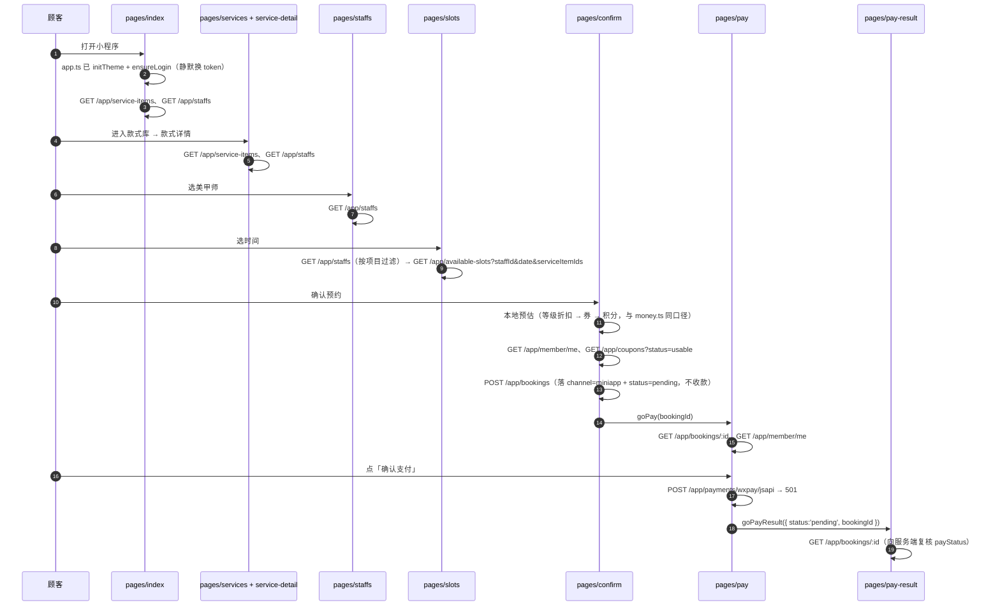
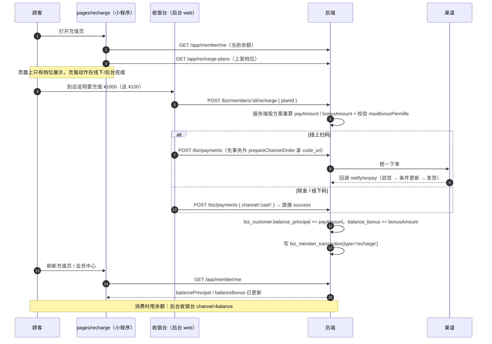
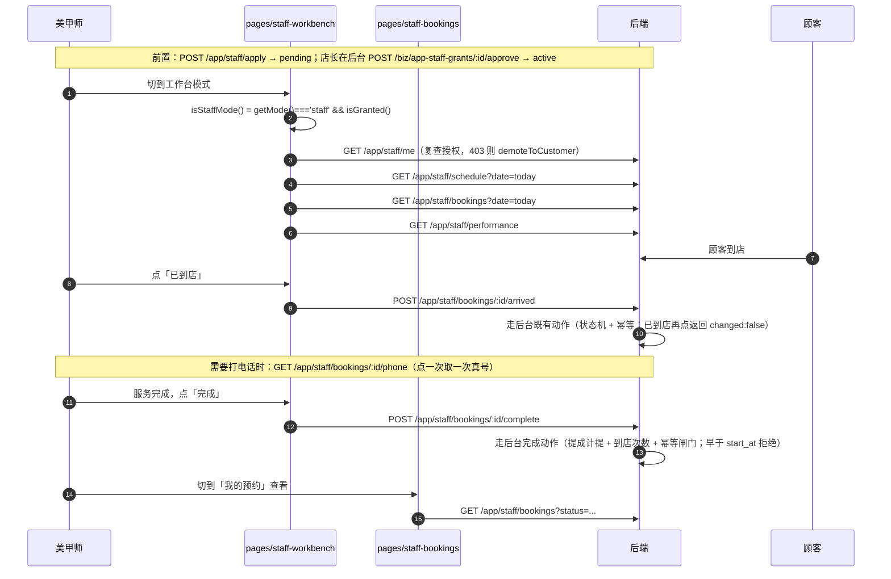

# 小程序页面与接口映射

本页是**29 个小程序页面的清单 + 每个页面调用的 app 域接口**，以及三条端到端链路的时序。

- 页面注册：`miniapp/miniprogram/app.json` 的 `pages` 数组（**顺序即注册顺序，第一项是启动页**）
- 接口调用层：`miniapp/miniprogram/api/index.ts`（**页面不直接碰 `request()`**）
- 后端实现：见 [小程序 app 域实现](/backend/app-domain)
- 架构与请求层：见 [小程序架构与主题系统](/frontend/miniapp)

## 页面清单（29）

「调用的 app 域接口」一列逐条核实于 `miniapp/miniprogram/pages/*/index.ts` 与 `api/index.ts`。标注「本地状态/无接口」的页面不发任何 `app` 域请求。

### 浏览与预约（12）

| #   | 页面路径                     | 中文名称 | 用途                                               | 调用的 app 域接口                                                                          |
| --- | ---------------------------- | -------- | -------------------------------------------------- | ------------------------------------------------------------------------------------------ |
| 1   | `pages/index/index`          | 首页     | 品牌头图、推荐款式、美甲师、快捷入口               | `GET /app/service-items`、`GET /app/staffs`                                                |
| 2   | `pages/services/index`       | 款式库   | 服务项目列表（分类筛选）                           | `GET /app/service-items`                                                                   |
| 3   | `pages/service-detail/index` | 款式详情 | 项目详情 + 时长价格 + 可做美甲师                   | `GET /app/service-items`、`GET /app/staffs`（含 `?id=` 直达）                              |
| 4   | `pages/staffs/index`         | 选美甲师 | 美甲师列表与简介                                   | `GET /app/staffs`                                                                          |
| 5   | `pages/slots/index`          | 选时间   | 日期 + 可约时段（按所选项目过滤美甲师）            | `GET /app/staffs`、`GET /app/available-slots`                                              |
| 6   | `pages/confirm/index`        | 确认预约 | 项目 / 美甲师 / 时段确认，积分或券二选一，提交建单 | `GET /app/member/me`、`GET /app/coupons`（`status=usable`）、`POST /app/bookings`          |
| 7   | `pages/pay/index`            | 支付     | 单据金额与支付方式，拉起微信支付                   | `GET /app/bookings/:id`、`GET /app/member/me`、`POST /app/payments/wxpay/jsapi`（**501**） |
| 8   | `pages/pay-result/index`     | 支付结果 | 结果页；**向服务端复核**而不是只信 query           | `GET /app/bookings/:id`                                                                    |
| 9   | `pages/bookings/index`       | 我的预约 | 预约列表（状态分组）                               | `GET /app/bookings`                                                                        |
| 10  | `pages/booking-detail/index` | 订单详情 | 单笔预约详情                                       | `GET /app/bookings`（列表内 find）                                                         |
| 11  | `pages/review/index`         | 服务评价 | 打分 + 文字 + 图片提交（一单一评）                 | `GET /app/bookings`、`POST /app/reviews`                                                   |
| 12  | `pages/cancel/index`         | 取消说明 | 取消前先看规则再确认                               | `GET /app/bookings`、`POST /app/bookings/:id/cancel`                                       |

::: warning 支付页的真实行为（JSAPI 尚未接通）
`pages/pay/index.ts` 的 `onConfirm()`：

```ts
if (activeMethod !== 'wechat') {
  toast('该支付方式暂未开放，先选微信支付吧');
  return;
}
// 后端 JSAPI 目前返回 501，请求层会转成「这个功能马上就来啦」；
// 这里保留完整调用位：拿到预支付参数 → 拉起微信支付 → **向服务端确认**。
const params = await bookingApi.createJsapiPayment({
  bookingId,
  purpose: 'final',
});
```

因为后端 `POST /app/payments/wxpay/jsapi` 抛 **501**，所以**当前实际行为是**：点确认后请求失败，走 `catch` 分支，toast 出「这个功能马上就来啦～」+ 请求号（如果有）。

`waitForPaid()` 的轮询逻辑已经写好但没有机会跑起来：

```ts
// 轮询等待服务端确认收款。
// 返回**已确认的预约**（`payStatus === 'paid'`）或 `null`（到上限仍未确认）。
// `null` 不是失败：回调可能还在路上，主动查单任务（每 2 分钟）也会兜底。
for (let i = 0; i < PAID_POLL_TRIES; i += 1) {
  await this.sleep(i === 0 ? 800 : PAID_POLL_INTERVAL_MS);
  const latest = await bookingApi.detail(bookingId);
  if (latest.payStatus === 'paid') return latest;
}
```

**已支付入口在收银台（后台 Native 扫码）**，小程序内支付是 P2。
:::

::: tip 「支付成功」永远是服务端事实
`pages/pay/index.ts` 的注释：「**关键**：不把 `requestPayment` 的成功当结果，向服务端要事实」。`GET /app/bookings/:id` 的 `payStatus` / `dueAmount` 才是权威值。
:::

### 会员与资产（7）

| #   | 页面路径                  | 中文名称   | 用途                                      | 调用的 app 域接口                                                         |
| --- | ------------------------- | ---------- | ----------------------------------------- | ------------------------------------------------------------------------- |
| 13  | `pages/member/index`      | 会员中心   | 等级 / 折扣 / 积分 / 余额 / 次卡 / 可领券 | `GET /app/member/me`、`GET /app/coupon-offers`、`POST /app/coupons/claim` |
| 14  | `pages/recharge/index`    | 充值       | 充值档位展示（档位来自后端配置）          | `GET /app/member/me`、`GET /app/recharge-plans`                           |
| 15  | `pages/card-detail/index` | 我的次卡   | 次卡列表与详情                            | `GET /app/member/cards`                                                   |
| 16  | `pages/points/index`      | 积分兑换   | 兑换品目录 + 兑换                         | `GET /app/points-goods`、`GET /app/member/me`、`POST /app/points/redeem`  |
| 17  | `pages/coupons/index`     | 我的优惠券 | 按状态分组的券列表                        | `GET /app/coupons`                                                        |
| 18  | `pages/favorites/index`   | 我的收藏   | 收藏的款式                                | **本地状态/无接口**                                                       |
| 19  | `pages/address/index`     | 收货地址   | 地址簿                                    | **本地状态/无接口**                                                       |

::: warning 收藏与收货地址没有后端
app 域**没有收藏与地址接口**，`project-design/HANDOVER-miniapp.md` §9.4 明确记录：「数据模型不存在或 app 域无接口。**视觉按稿完整还原，交互如实降级**，不塞假数据」。
:::

### 其它（6）

| #   | 页面路径               | 中文名称       | 用途                                           | 调用的 app 域接口                                                                                              |
| --- | ---------------------- | -------------- | ---------------------------------------------- | -------------------------------------------------------------------------------------------------------------- |
| 20  | `pages/shop/index`     | 门店信息       | 当前门店信息 + **多店切换** + 定位找最近的门店 | `GET /app/shop`（按当前门店头）、`GET /app/shops`（列表）；距离用 `wx.getLocation` + `utils/geo.ts` **本地**算 |
| 21  | `pages/notices/index`  | 消息中心       | 站内消息列表                                   | **本地状态/无接口**                                                                                            |
| 22  | `pages/feedback/index` | 意见反馈       | 反馈表单                                       | **本地状态/无接口**                                                                                            |
| 23  | `pages/login/index`    | 登录绑定手机号 | 静默登录 + 手机号授权绑定                      | `POST /app/auth/login`（经 `ensureLogin`）、`POST /app/auth/phone`（经 `bindPhone`）                           |
| 24  | `pages/mine/index`     | 我的           | 个人中心；工作台申请入口                       | `GET /app/member/me`、`GET /app/bookings`、`POST /app/staff/apply`                                             |
| 25  | `pages/theme/index`    | 主题设置       | 7 套预设 + 10 色自定义                         | **本地状态/无接口**（`theme/theme.ts` 的 `setPreset` / `setCustomPrimary`）                                    |

### 美甲师工作台（4）

| #   | 页面路径                        | 中文名称           | 用途                                 | 调用的 app 域接口                                                                                                                                                                                                             |
| --- | ------------------------------- | ------------------ | ------------------------------------ | ----------------------------------------------------------------------------------------------------------------------------------------------------------------------------------------------------------------------------- |
| 26  | `pages/staff-workbench/index`   | 工作台             | 今日日程 + 业绩卡 + 到店/完成 + 拨号 | `GET /app/staff/me`、`GET /app/staff/schedule`、`GET /app/staff/bookings`、`GET /app/staff/performance`、`POST /app/staff/bookings/:id/arrived`、`POST /app/staff/bookings/:id/complete`、`GET /app/staff/bookings/:id/phone` |
| 27  | `pages/staff-bookings/index`    | 我的预约（工作台） | 按日期/状态筛的预约列表 + 到店/完成  | `GET /app/staff/bookings`、`POST /app/staff/bookings/:id/arrived`、`POST /app/staff/bookings/:id/complete`                                                                                                                    |
| 28  | `pages/staff-performance/index` | 业绩明细           | 月份切换 + 逐单提成明细              | `GET /app/staff/performance`                                                                                                                                                                                                  |
| 29  | `pages/staff-reviews/index`     | 我的评价           | 只出已公开的评价                     | `GET /app/staff/reviews`                                                                                                                                                                                                      |

::: tip 工作台页面的 `staffId` 从不由前端传
`api/index.ts` 的注释：「全部走 `/app/staff/**`：后端按 `AppStaffScopeGuard` 硬限定本人，前端**不传 `staffId`**（传了也没用，服务端不认），只传分页与过滤条件。」
:::

::: danger 「取真号」是一个独立动作
`pages/staff-workbench` 通过 `utils/phone.ts` 的 `dialCustomer()` 间接调 `GET /app/staff/bookings/:id/phone`：

> 口径（D11）：**列表里只有脱敏值**（`138****0000`），真号在真的要拨号时才取一次。所以这里拨的不是列表里那串星号，而是临时取回的真号 —— 直接把 `138****0000` 喂给 `wx.makePhoneCall` 是拨不通的。

取号失败（403 / 404 / 网络）**只提示、不弹原生拨号框**（没拿到真号就弹框，用户会看到空号码或上一次的残留）。
:::

### 页面跳转工具

所有跳转集中在 `miniapp/miniprogram/utils/nav.ts`，不在页面里写死 `wx.navigateTo`：

```ts
/**
 * 存在的理由：`wx.switchTab` **只能**跳 `app.json` 里注册为 tabBar 的页面，
 * 而 tabBar 会在「个人中心那批页面」落地后才启用。与其在各页面里写死一种跳法，
 * 不如统一走这里：优先 `switchTab`（能清空页面栈），失败再降级 `navigateTo`。
 */
function switchOrNavigate(url: string): void {
  wx.switchTab({
    url,
    fail: () => {
      wx.navigateTo({ url });
    },
  });
}
```

| 函数                                                                                                                                                             | 目标                                 |
| ---------------------------------------------------------------------------------------------------------------------------------------------------------------- | ------------------------------------ |
| `goHome` / `goBookings` / `goMine`                                                                                                                               | 三个顾客 tab（`switchOrNavigate`）   |
| `goStaffWorkbench` / `goStaffBookings`                                                                                                                           | 两个工作台 tab（`switchOrNavigate`） |
| `goStaffPerformance` / `goStaffReviews`                                                                                                                          | 非 tab 工作台页（`navigateTo`）      |
| `goServices` / `goStaffs` / `goSlots` / `goConfirm`                                                                                                              | 预约链路                             |
| `goServiceDetail(id)` / `goStaffs()`                                                                                                                             |                                      |
| `goPay(bookingId)` / `goPayResult({...})` / `goBookingDetail(bookingId)` / `goReview(bookingId)` / `goCancel(bookingId)`                                         |                                      |
| `goMember` / `goRecharge` / `goCardDetail(cardId?)` / `goPoints` / `goFavorites` / `goCoupons` / `goAddress` / `goNotices` / `goFeedback` / `goTheme` / `goShop` |                                      |
| `goLogin({ reason })`                                                                                                                                            | 带 `reason` 的引导登录               |
| `goBack(delta = 1)`                                                                                                                                              | 无上一页时退化为 `goHome()`          |

### 下单草稿（跨页面传递）

`store/draft.ts`（**不落库、不持久化**）：

```ts
/**
 * 为什么不用 URL 参数传：一次预约要带「1~3 个项目 + 美甲师 + 日期 + 时段」，
 * 序列化进 query 又长又容易超限，而且中间页返回时要能复原，草稿更合适。
 *
 * **失效联动（容易被忽略但很关键）**：
 * - 改项目 → 时长/价格/适配的美甲师都变了 → 清掉美甲师与时段；
 * - 改美甲师 → 该美甲师的排班与冲突都变了 → 清掉时段。
 * 不做这个联动，就会出现「选好时段后回头改了项目，时段还是按旧时长算的」这类幽灵 bug。
 */
export function setDraftItems(next: ServiceItem[]) {
  items = [...next];
  staff = null;
  slot = null;
}
export function setDraftStaff(next) {
  staff = { ...next };
  slot = null;
}
export function setDraftSlot(next) {
  slot = { ...next };
}
```

## 三条端到端链路

### ① 浏览 → 选款式 → 选美甲师 → 选时段 → 确认预约 → 支付结果



关键实现位置：

| 步骤         | 文件                                                              |
| ------------ | ----------------------------------------------------------------- |
| 静默登录     | `miniapp/miniprogram/app.ts` + `store/auth.ts` 的 `ensureLogin()` |
| 可约时段     | `pages/slots/index.ts` → `catalogApi.getAvailableSlots()`         |
| 本地预估算价 | `pages/confirm/index.ts` 的 `recalc()`（228 行起）                |
| 建单         | `pages/confirm/index.ts` 的 `bookingApi.create({...})`（347 行）  |
| 支付         | `pages/pay/index.ts` 的 `onConfirm()`（159 行）                   |
| 结果复核     | `pages/pay-result/index.ts`（51 行）                              |

::: warning 预估算价与后端「同口径」是有代价的
`pages/confirm/index.ts` 里写死了两个常量（`POINTS_PER_YUAN = 100`、`FALLBACK_MAX_POINTS_PERMILLE = 300`），因为 **app 域没有「算价预览」接口**。注释记录了一个真实 bug：

> 真值来自服务端 `GET /app/member/me` 的 `maxPointsPermille` —— 这里曾经硬编码 500，比后端默认（300）大，导致**预估比服务端允许的多**，顾客按预估下单、服务端一夹取就对不上。

还有单位混用的前车之鉴：

> 这里曾经写成 `floor(points / 100)`（得到的是**元**）再与「分」的 `maxByRatio` 取 min —— 单位混用：显示出来的抵扣额小了 100 倍，而发给服务端的 `pointsToUse` 又是另一套算法，顾客会**少看抵扣、多花积分**。

**待补**：`GET /app/member/pricing-preview`（入参 `serviceItemIds` / `pointsToUse` / `memberCardId`）。
:::

### ② 充值 → 余额到账 → 用余额消费

::: warning 诚实说明：充值下单链路尚未打通
`pages/recharge/index.ts` **只做展示**（档位来自 `GET /app/recharge-plans`），**没有**「立即充值」的支付动作 —— app 域没有充值下单接口，小程序内 JSAPI 支付是 P2。

**当前真实的充值路径**是后台收银台：



充值口径见 [会员 · 储值 · 次卡 · 积分](/backend/membership)；支付与回调见 [收银与支付通道接入](/backend/payment)。
:::

### ③ 美甲师接单 → 到店 → 完成



关键实现位置：

| 步骤                   | 文件                                                                    |
| ---------------------- | ----------------------------------------------------------------------- |
| 授权复查与工作台数据   | `pages/staff-workbench/index.ts`（78–81 行并发拉 4 个接口）             |
| 到店 / 完成            | `staffApi.markArrived` / `staffApi.markCompleted`（`api/index.ts`）     |
| 拨号取真号             | `utils/phone.ts` 的 `dialCustomer()`                                    |
| 撤销授权后落回顾客模式 | `store/mode.ts` 的 `demoteToCustomer()`（工作台页拿到 403 时调用）      |
| 业绩明细               | `pages/staff-performance/index.ts`（`staffApi.getPerformance(period)`） |

::: tip 完成的语义在后端
`POST /app/staff/bookings/:id/complete` 的说明：「走既有完成动作（提成计提 + 到店次数 + 幂等闸门），**app 域不自己改状态**。早于 `start_at` 会被拒绝，防提前刷提成。」
:::

## 已知限制与 TODO

| 项                                    | 现状                                                                                                     | 出处                                 |
| ------------------------------------- | -------------------------------------------------------------------------------------------------------- | ------------------------------------ |
| 小程序内 JSAPI 支付                   | 后端 **501**；支付页保留完整调用位，点确认会提示「这个功能马上就来啦～」                                 | `api/index.ts`、`pages/pay/index.ts` |
| 充值下单                              | 小程序端**只展示档位**，充值动作在后台收银台                                                             | `pages/recharge/index.ts`            |
| 算价预览接口                          | 缺失（`GET /app/member/pricing-preview` 待补）；页面用本地常量预估                                       | `pages/confirm/index.ts` 的常量注释  |
| 收藏 / 收货地址 / 消息中心 / 意见反馈 | **无后端接口**，视觉按稿还原、交互如实降级，不塞假数据                                                   | `HANDOVER-miniapp.md` §9.4           |
| 核销二维码                            | 不伪造（动态码必须服务端签名）；现用卡号作凭据                                                           | `HANDOVER-miniapp.md` §9.4           |
| 取消扣费金额                          | app 域读不到判责规则，取消页只写原则、不给具体金额                                                       | `HANDOVER-miniapp.md` §9.4           |
| 优惠券建单接线                        | `CouponsService.redeemForBooking()` 与 `quoteBooking` 的券支持已实现，只差建单事务接线；**已勘察未实施** | `HANDOVER-miniapp.md` §10            |
| 用户协议 / 隐私政策正文               | 需门店主体信息与手机号用途声明，**提审前必须替换**                                                       | `HANDOVER-miniapp.md` §9.4           |
| 订阅消息下发                          | 台账能记（`app_wx_subscribe_grant`），模板未申请（H10），发不出去                                        | `HANDOVER-miniapp.md` §5             |
| 门店信息                              | 前端常量（`config.ts` 的 `SHOP`），门店名/电话/地址改动需发版                                            | `config.ts` 注释                     |
| 真机验证                              | 需人工扫码/操作；本轮以自动化为主                                                                        | `HANDOVER-miniapp.md` §9.4 / §13.5   |

## 相关页面

- 小程序工程结构 / 请求层 / 主题 / 双模式 TabBar：[小程序架构与主题系统](/frontend/miniapp)
- 后端 app 域接口与授权模型：[小程序 app 域实现](/backend/app-domain)
- 后端支付链路：[收银与支付通道接入](/backend/payment)
- 储值与积分口径：[会员 · 储值 · 次卡 · 积分](/backend/membership)
