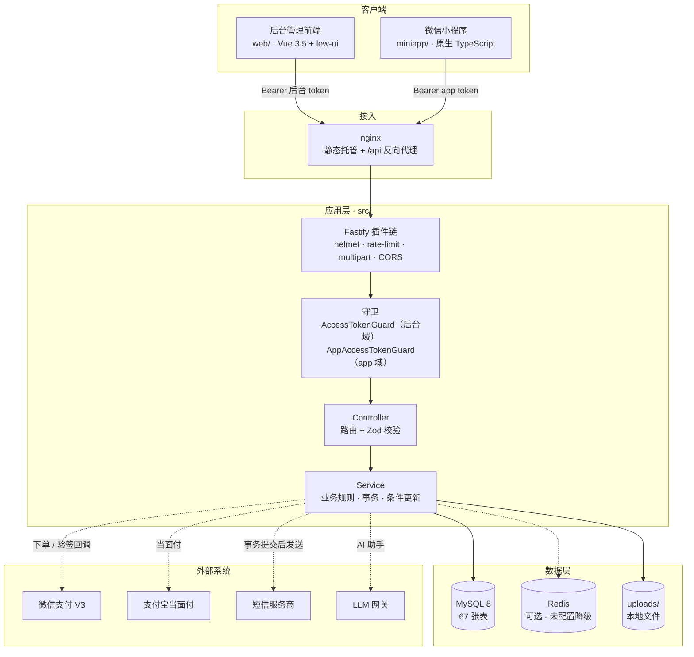
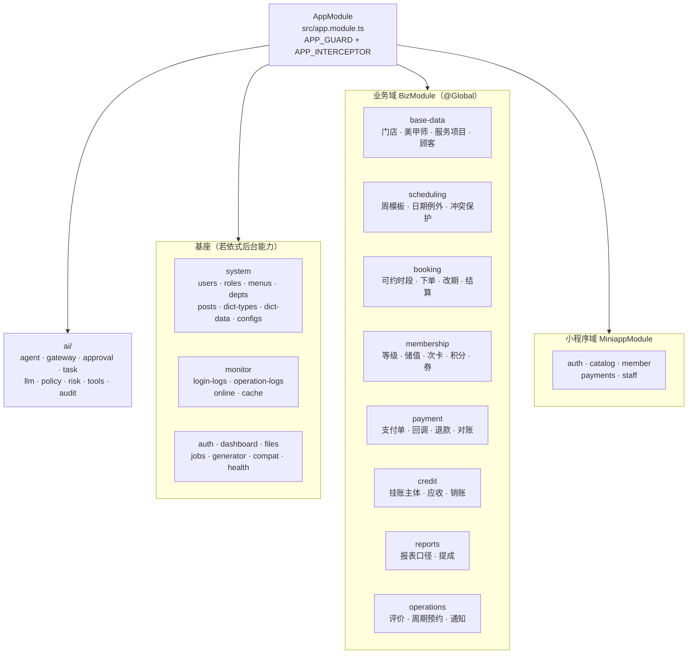
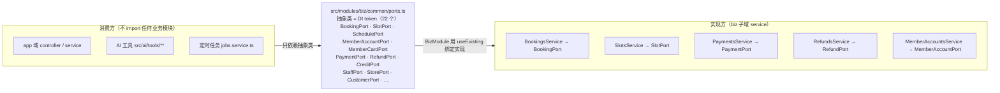
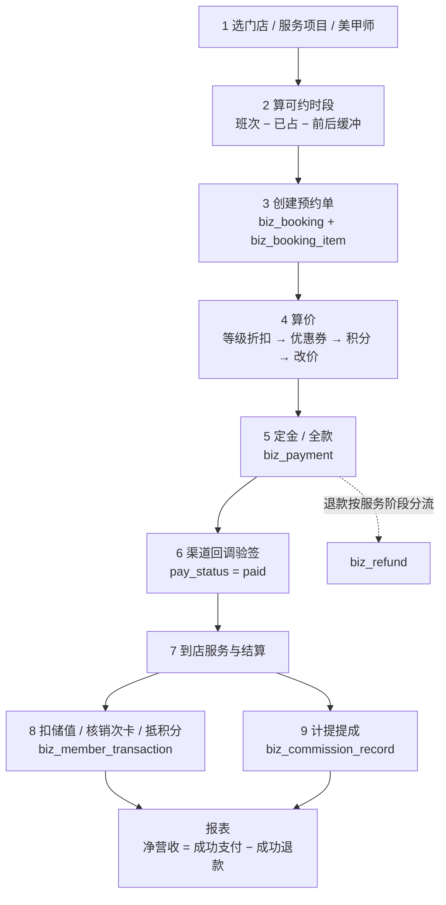
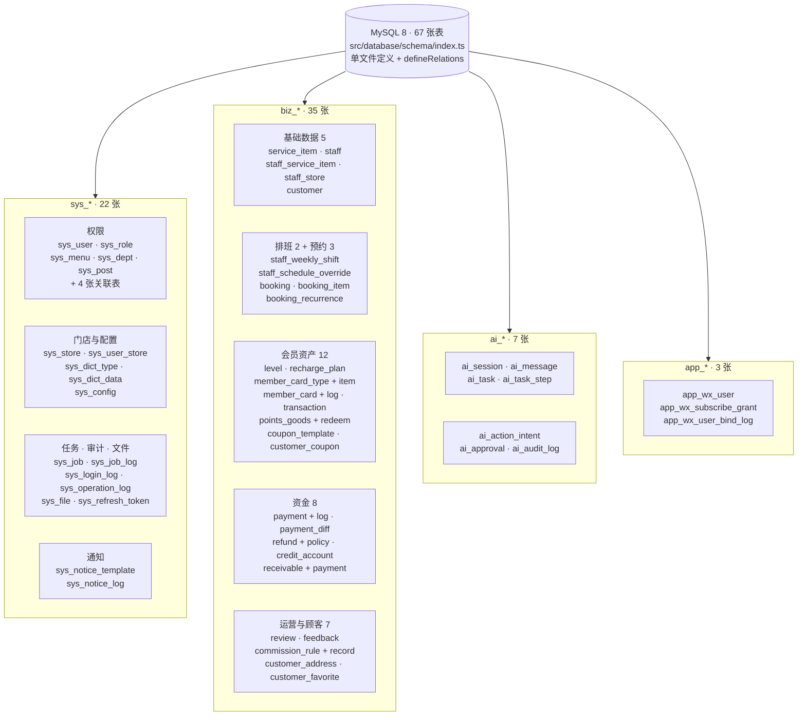
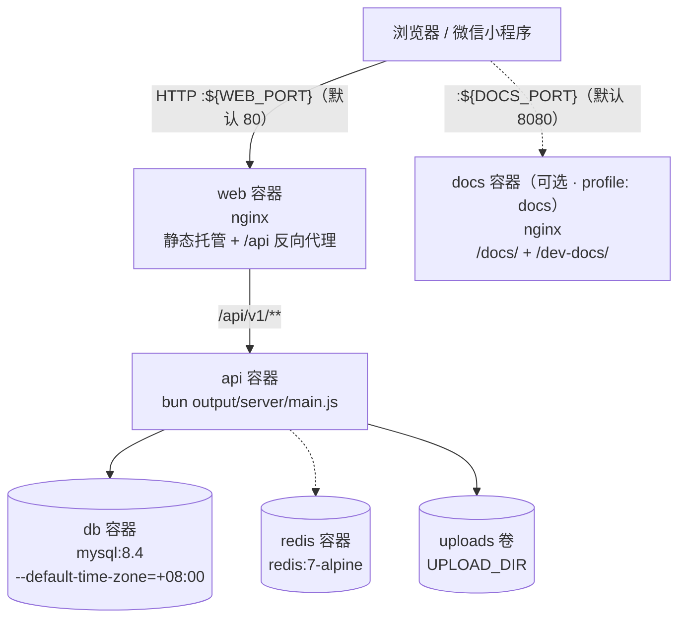
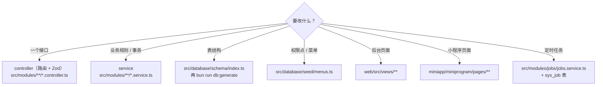

# 整体架构图

本页用六张图描述系统的**静态结构**：分几层、有哪些模块、谁依赖谁、钱与预约怎么流。

- 想看**运行时行为**（一个请求怎么走完一生、两个认证域如何互相拒绝）→ [三端架构与请求生命周期](/overview/architecture)；
- 想看**文件在哪**（每个目录放什么、命令怎么敲）→ [目录结构与代码地图](/overview/structure)。

::: tip 怎么读这几张图

- **实线** = 编译期或运行期的强依赖，断了就不工作；
- **虚线** = 可选依赖，没配置就自动降级（Redis、短信、LLM 都属此类）；
- 图里的模块名就是目录名，可以直接按名字去 `src/` 里找。
  :::

## 一、系统全景



这是**部署视角**的分层。注意两个客户端不共享任何代码，后端是唯一的业务真相来源 ——
算价、可约时段、状态机全部在服务端算，前端只负责展示与收集输入。

| 层       | 物理位置                                               | 说明                                                   |
| -------- | ------------------------------------------------------ | ------------------------------------------------------ |
| 客户端   | `web/` · `miniapp/`                                    | Vue 3 后台 + 原生小程序，各自独立构建                  |
| 接入     | nginx                                                  | 静态托管构建产物，`/api` 反代到后端                    |
| 应用     | `src/main.ts`（插件链）· `src/modules/**`（业务）      | 插件链顺序在 `main.ts` 里**硬编码**                    |
| 数据     | MySQL（唯一强依赖）· Redis（可选）· `uploads/`（文件） | Redis 未配置时所有缓存方法返回空值，不影响功能         |
| 外部系统 | 微信支付 / 支付宝 / 短信 / LLM                         | 全部通过抽象接口接入，未配置时降级而非崩溃（见第六节） |

## 二、后端模块地图

`src/app.module.ts` 是整个后端的装配点，它只做三件事：导入全部子模块、
注册全局守卫与全局拦截器。



| 区域     | 目录                                         | 判断标准                                      |
| -------- | -------------------------------------------- | --------------------------------------------- |
| 基座     | `src/modules/system` · `monitor` · `files` … | 「把美甲业务整个删掉，它还要不要？」要 → 基座 |
| 业务域   | `src/modules/biz/**`                         | 只有美甲门店才有语义的规则                    |
| 小程序域 | `src/modules/app/**`                         | 面向 C 端顾客与美甲师工作台，独立认证域       |
| AI 助手  | `src/ai/**`                                  | 工具调用、审批、审计，独立于业务模块          |

::: warning `BizModule` 是 `@Global` 的
它除了汇总子模块，还负责把各 service **绑定到抽象端口**上（见下一节）。
因为它被标记为 `@Global`，其它模块不必 import 就能注入这些端口。
:::

## 三、业务域内部：用端口解耦，而不是互相 import

业务子域之间存在大量交叉调用（下单要读排班、结算要扣会员余额、退款要动支付单）。
如果直接互相 `import` service，会立刻陷入循环依赖。项目的做法是**抽象端口**：



- 端口定义在 `src/modules/biz/common/ports.ts`（抽象类，同时充当 DI token）；
- 绑定写在 `src/modules/biz/biz.module.ts` 的 `providers`，形如
  `{ provide: BookingPort, useExisting: BookingsService }`；
- 结果是 **app 域与业务模块之间没有编译期耦合**，也不存在循环依赖。

::: danger 新增跨模块调用必须走端口
不要图省事直接 `import` 别人的 service。一旦某个子域被两个地方循环引用，
Nest 会在启动时报 `Cannot resolve dependencies`，而且这类错误往往在加完代码很久之后才炸。
:::

## 四、核心业务链路数据流

预约主链路是全系统最长的一条路径，也是 80% 的复杂度所在：它一次穿过了基础数据、
排班、预约、会员、收银、报表六个子域。



三个容易画错的地方，这里明确一下：

1. **步骤 2 的"缓冲"是对称的** —— 服务前后各留一段 gap，不只是结束时间；
2. **步骤 5 与 6 之间可能隔着几分钟到几小时** —— 下单只创建支付单，资金状态由回调推进，
   所以「预约已创建」不等于「已付款」；
3. **挂账不走这条链路的资金段** —— 挂账下单**不写支付单**，`pay_status = credit`，
   直到销账才计入营收（详见 [挂账与应收](/backend/credit)）。

## 五、数据模型分组



| 前缀   | 数量 | 归属                             | 删除策略                       |
| ------ | ---- | -------------------------------- | ------------------------------ |
| `sys_` | 22   | 平台能力（权限 / 配置 / 日志 …） | 软删（`auditColumns`）         |
| `biz_` | 35   | 美甲业务事实                     | 软删，个别关联表物理删（见下） |
| `ai_`  | 7    | AI 助手运行时                    | 随会话生命周期                 |
| `app_` | 3    | 小程序身份域                     | 只追加留痕，不复用 `sys_user`  |

::: tip 表数量的核实方式

```bash
grep -c "mysqlTable(" src/database/schema/index.ts   # 67
```

部分历史文档写的是「61 张」，那是 2026-09 上旬的数字；此后新增了
`sys_store`、`sys_user_store`、`biz_staff_store`、`biz_feedback`、
`biz_customer_address`、`biz_customer_favorite` 六张表。
**字段、表名的权威来源永远是 `src/database/schema/index.ts`**，
表清单与索引约定见 [数据模型总览](/data/)。
:::

## 六、部署拓扑（Docker 形态）



只有 `web` 与 `docs` 映射宿主端口，`api` / `db` / `redis` 都只在 compose 内网可达 ——
所以本机已占用 3000 / 3306 / 6379 不影响部署。

一键部署（脚本会把随机密码写进 `deploy/.env`）与文档站的启用方式见
[Docker 一键部署](/quality/docker)；传统 PM2 形态见
[三端架构与请求生命周期](/overview/architecture)。

## 七、横切能力都在哪

架构图里看不到、但每个模块都在用的东西，集中在这几个文件：

| 能力         | 唯一入口                                         | 一句话                                           |
| ------------ | ------------------------------------------------ | ------------------------------------------------ |
| 认证         | `src/common/auth/access-token.guard.ts`          | 后台域；**不要**在这里兼容 app token             |
| app 认证     | `src/modules/app/auth/app-access-token.guard.ts` | 靠 `scope: 'app'` 区分，与后台域双向拒绝         |
| 数据权限     | `src/common/data-scope/data-scope.ts`            | 只回答「能看到哪些部门的人」，与业务归属是两件事 |
| 缓存         | `src/common/cache/redis.service.ts`              | 未配置 `REDIS_URL` 时静默降级为无缓存            |
| 业务参数     | `src/modules/biz/common/biz-config.service.ts`   | `biz.*` 配置的唯一读取口，越界回落默认值         |
| 金额与算价   | `src/modules/biz/common/money.ts`                | 整数「分」，取整向下                             |
| 门店本地时间 | `src/modules/biz/common/shop-time.ts`            | 店内日 → 绝对时刻区间只能走 `shopDayRange()`     |
| 单号         | `src/modules/biz/common/doc-no.ts`               | 预约号 / 支付号 / 退款号统一生成                 |
| 门店上下文   | `src/modules/biz/common/store-scope.ts`          | 显式 `storeId` → `x-store-id` 头 → 默认门店      |
| 跨模块调用   | `src/modules/biz/common/ports.ts`                | 22 个抽象端口，见第三节                          |

## 八、改代码时的定位路径



各模块的实现细节、口子与坑，按 [项目总纲的技能索引](/overview/) 加载对应技能即可。
