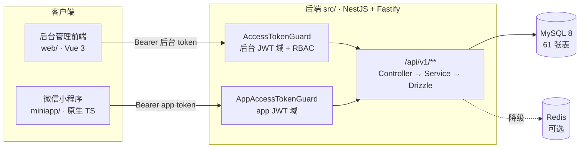
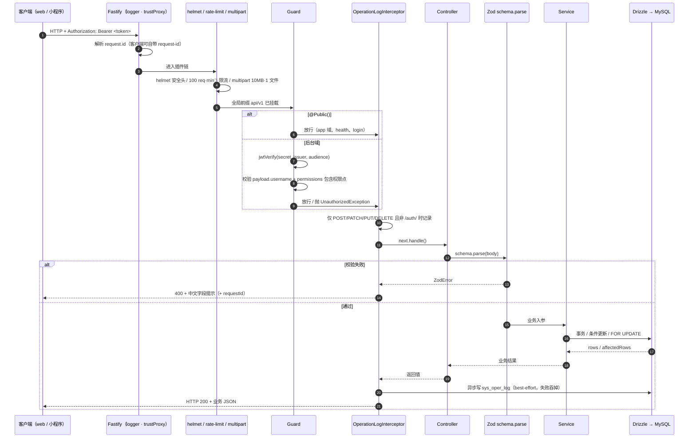
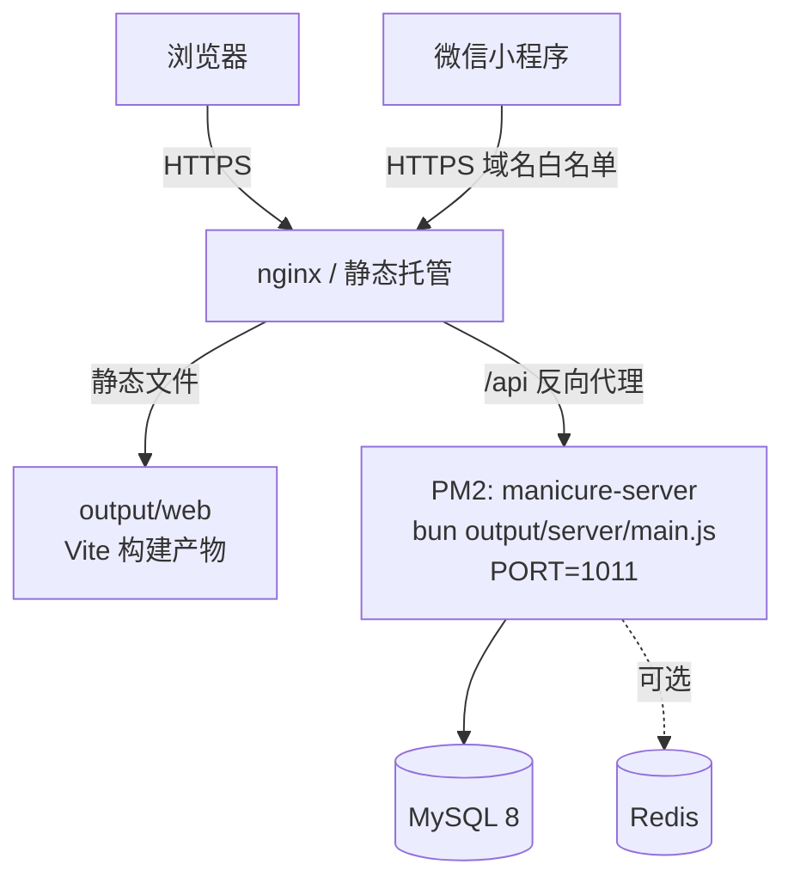

# 三端架构与请求生命周期

## 三端职责与边界



三端没有共享代码，后端是唯一的业务真相来源：算价、时段、状态机全部在服务端。

## 两个互不信任的认证域

后端不是"一套 JWT 管所有客户端"，而是**两个独立 token 域**：

| 维度 | 后台域 | app 域 |
| --- | --- | --- |
| 路由前缀 | `/api/v1/**`（`biz/` `system/` `monitor/` `ai/` …） | `/api/v1/app/**` |
| 守卫 | `src/common/auth/access-token.guard.ts` 的 `AccessTokenGuard` | `src/modules/app/auth/app-access-token.guard.ts` 的 `AppAccessTokenGuard` |
| payload 特征 | 含 `username` / `permissions` / `roles`，**不含 `scope`** | 含 `scope: 'app'` / `openid`，**故意不含 `username`** |
| 授权模型 | RBAC：`@RequirePermissions('biz:serviceitem:list')` | **不接 RBAC**，只有"本人数据"（强制 `customer_id = 当前绑定顾客`） |
| 额外守卫 | — | `AppStaffScopeGuard`（美甲师工作台作用域） |
| Swagger 方案 | `@ApiBearerAuth('access-token')` | `@ApiBearerAuth('app-token')` |

### 双向拒绝是怎么实现的

两个守卫**共用** `JWT_ACCESS_SECRET` / `JWT_ISSUER` / `JWT_AUDIENCE`，靠 **payload 形态**区分：

- `AppAccessTokenGuard` 要求 `payload.scope === 'app'` → 后台 token 打 app 接口 **401**；
- `AccessTokenGuard` 要求 `typeof payload.username === 'string'` → app token 打 `/api/v1/biz/**` **自然 401**。

也就是说：**改 `AccessTokenGuard` 去"兼容" app token 会直接打开越权口子**。`app-access-token.guard.ts` 的类注释里明确写了"不要改 `AccessTokenGuard`"。

### app 域为什么要标 `@Public()`

根模块用 `APP_GUARD` 注册了全局 `AccessTokenGuard`，它**先于**路由级守卫执行。所以 `src/modules/app/**` 的 controller 必须标 `@Public()` 跳过它，再由 `AppAccessTokenGuard` 做真正的鉴权：

```ts
// src/modules/app/auth/app-auth.controller.ts
@Public()
@Controller('app/auth')
export class AppAuthController {
  @Post('login')                     // 公开
  @RouteConfig({ rateLimit: { max: 10, timeWindow: '1 minute' } })
  login(...) { ... }

  @Post('phone')
  @UseGuards(AppAccessTokenGuard)    // 需要 app token
  phone(...) { ... }
}
```

::: warning 登录接口单独限流
全局限流是 100 次/分钟（`src/main.ts`），`POST /app/auth/login` 通过 `@RouteConfig({ rateLimit: { max: 10, timeWindow: '1 minute' } })` 收紧到 **10 次/分钟/IP**。这是 `@fastify/rate-limit` 的 route-level 覆盖，不需要改 `main.ts`。
:::

### app 域的接口地图（33 个端点）

| Controller | 文件 | 路由前缀 |
| --- | --- | --- |
| `AppAuthController` | `src/modules/app/auth/app-auth.controller.ts` | `app/auth` |
| `AppCatalogController` | `src/modules/app/catalog/app-catalog.controller.ts` | `app` |
| `AppMemberController` | `src/modules/app/member/app-member.controller.ts` | `app` |
| `AppPaymentsController` | `src/modules/app/payments/app-payments.controller.ts` | `app/payments/wxpay` |
| `AppStaffController` | `src/modules/app/staff/app-staff.controller.ts` | `app/staff` |
| `AppStaffWorkbenchController` | `src/modules/app/staff/app-staff-workbench.controller.ts` | `app/staff` |
| `AppStaffGrantsController` | `src/modules/app/staff/app-staff-grants.controller.ts` | **`biz/app-staff-grants`**（后台域，复用 RBAC） |

::: tip app 模块不 import 任何业务模块
`src/modules/app/app.module.ts` 只依赖 `src/modules/biz/common/ports.ts` 的抽象类（`ServiceItemPort` / `StaffPort` / `SlotPort` / `MemberAccountPort` …），由根模块的 `BizModule`（`@Global`）用 `useExisting` 绑定实现。这样 app 域与业务模块之间**没有编译期耦合**，也不会循环依赖。新增跨模块调用时请走 `ports.ts`，别直接 import 别人的 service。
:::

## 后端分层

实际分层是 **Controller → Service → Drizzle**，没有独立的 Repository 层：

| 层 | 位置 | 职责 |
| --- | --- | --- |
| Controller | `src/modules/**/*.controller.ts`（53 个） | 路由、`@RequirePermissions`、**Zod schema 定义 + `parse`**、`@ApiOperation` 文档 |
| Service | `src/modules/**/*.service.ts`（61 个） | 业务规则、事务、条件更新、锁顺序 |
| 数据访问 | 直接注入 `DatabaseService.db`（`src/database/database.service.ts`） | Drizzle 查询构建，`tx` 是本事务句柄 |
| 端口抽象 | `src/modules/biz/common/ports.ts`（1168 行） | 跨模块调用的冻结契约（抽象类） |
| 公共工具 | `src/modules/biz/common/` | `money.ts` · `shop-time.ts` · `query.ts` · `tx.ts` · `doc-no.ts` · `biz-config.service.ts` |

### 校验在哪一层做

Zod schema **定义在 controller 文件里**（模块级常量），在 handler 里手动 `parse`：

```ts
// src/modules/biz/base-data/service-items/service-items.controller.ts
const createSchema = z.object({ name: z.string().min(1).max(50), /* ... */ });
const updateSchema = createSchema.partial();
registerComponent('CreateServiceItemRequest', createSchema);   // 注册进 Swagger

@Post()
@RequirePermissions('biz:serviceitem:create')
create(@Body() body: unknown, @Req() request: AuthRequest) {
  return this.serviceItems.create(createSchema.parse(body), request.user.id);  // ← 这里抛 ZodError
}
```

::: warning 参数签名是 `unknown`，不是 DTO 类
`@Body() body: unknown` 是刻意的 —— 项目**不用** `class-validator` / `ValidationPipe`，DTO 校验全部由 Zod 承担。抛出的 `ZodError` 由全局异常过滤器转成 400。
:::

### DTO / VO 放在哪

- **请求体 schema**：controller 文件内（如上）；
- **app 域的 VO**：`src/modules/app/dto/app-vo.ts`、`src/modules/app/dto/app-staff-workbench.vo.ts`；
- **`src/common/common.dto.ts`** 只有一个遗留的 `SearchQuery` 类，实际未参与校验。

::: danger app 域不复用后台 DTO
app 域有自己的一套 VO（`app-vo.ts`）。原因：后台 DTO 暴露的是门店管理字段（成本、备注、软删标记、内部状态），C 端只该看到顾客视角的字段。复用等于把内部字段泄漏到小程序。
:::

## 请求生命周期

### 时序图



### 各环节的真实代码位置

| 环节 | 位置 | 关键细节 |
| --- | --- | --- |
| 应用创建 | `src/main.ts` | `NestFactory.create(AppModule, new FastifyAdapter({ logger: true, trustProxy: true }), { rawBody: true })` |
| `rawBody: true` | `src/main.ts` | **微信支付 V3 回调验签必须用原样报文**（键顺序敏感），退化到 `JSON.stringify(body)` 在真实环境会验签失败 |
| `trustProxy: true` | `src/main.ts` | 反向代理下让 `request.ip` 解析 `x-forwarded-for`，配合 nginx 的 `X-Forwarded-For` |
| 全局异常过滤器 | `src/main.ts` → `new GlobalExceptionFilter()` | 见下 |
| helmet | `src/main.ts` | `await app.register(helmet)` |
| 限流 | `src/main.ts` | `{ max: 100, timeWindow: '1 minute' }` |
| multipart | `src/main.ts` | `{ limits: { files: 1, fileSize: 10 * 1024 * 1024 } }` |
| CORS | `src/main.ts` | `config.corsOrigins`（`CORS_ORIGINS` 逗号分隔），`credentials: true` |
| 全局前缀 | `src/main.ts` | `app.setGlobalPrefix(config.apiPrefix)`，默认 `api/v1` |
| 优雅关停 | `src/main.ts` | `app.enableShutdownHooks()`（配合 PM2 的 `kill_timeout: 10000`） |
| 全局守卫 | `src/app.module.ts` | `{ provide: APP_GUARD, useClass: AccessTokenGuard }` |
| 全局拦截器 | `src/app.module.ts` | `{ provide: APP_INTERCEPTOR, useClass: OperationLogInterceptor }` |

### 异常与错误响应

`src/common/filters/global-exception.filter.ts` 按四种情况分派：

| 异常 | 状态码 | 响应 |
| --- | --- | --- |
| `ZodError` | 400 | `message` 是中文数组，如 `["项目名称：不能为空"]`，由 `FIELD_LABELS` 映射字段中文名 |
| `HttpException` | 原样 | 透传 `getStatus()` 与 `getResponse()` |
| **带 `statusCode` 的普通 `Error`**（Fastify 插件抛的） | 4xx 原样 | 只 `logger.warn`，不打堆栈 |
| 其它未知异常 | 500 | `服务器内部错误，请稍后重试`，并 `logger.error` 打堆栈 |

::: warning 为什么必须单列"带 statusCode 的普通 Error"
`@fastify/rate-limit` 超限时抛的是 `new Error()` 上挂 `statusCode = 429`，**不是** `HttpException`。不认这个约定，限流就会静默降级成 **500**：请求确实被拦了，但客户端以为服务器挂了，还会诱导重试 —— 正好是限流要防的。过滤器只放行 **4xx**，5xx 一律仍按未知异常处理，绝不让第三方插件的 `statusCode` 决定成败语义。
:::

所有异常响应都会带上 `requestId`（取自 Fastify 的 `request.id`）：

```json
{ "statusCode": 409, "message": "该时段已被占用", "requestId": "6f1c…" }
```

前端 `web/src/request.ts` 每个请求都自带 `request-id` 头，后端把它当 `reqId` 写日志 —— 用户报"付了钱但没到账"时，客服凭这一个号就能定位那次请求。

### 审计日志（`OperationLogInterceptor`）

`src/common/logging/operation-log.interceptor.ts`：

- **只记 `POST` / `PATCH` / `PUT` / `DELETE`**，且 url 含 `/auth/` 的直接跳过；
- 记录 `controller.handler`、method、url（截断 500 字符）、ip（`resolveClientIp() from src/common/utils/ip.ts`）、requestBody、responseBody、status、errorMessage（截断 2000 字符）、durationMs；
- 字段名匹配 `/password|secret|token|authorization/i` 的**一律替换成 `***`**（`sanitize()`，递归处理对象与数组）；
- 写入是 `void this.write(...)`，且 `write()` 内部 `try { } catch { }` —— **审计日志失败绝不回滚业务**。

## 横切能力

### Redis：可选依赖，未配置就静默降级

`src/common/cache/redis.service.ts` 基于 **Bun 内置的 `Bun.RedisClient`**（不是 ioredis）：

- `enabled` = `Boolean(config.redisUrl)`；`REDIS_URL` 未配置时所有方法返回空值（`get → null`、`keys → []`、`ping → false`、`dbsize → null`）；
- 连接参数 `{ maxRetries: 1, enableOfflineQueue: false }` —— 快速失败而非排队堆积；
- **连接错误的兜底**：`get/set/del/keys` 统一吞掉异常并 `warnOnce()` 只提示一次（`Redis 不可用，缓存能力已降级：…`）。注释里写明了历史故障：`OnlineService.track()` 曾把 `Connection is closed` 直接抛成 500 给前端；
- `onApplicationShutdown()` 关闭客户端。

::: tip 你改了缓存键
键名集中在 `src/common/cache/cache-keys.ts`。多个 service 共享前缀，改键名要同步 `src/modules/monitor/cache`（后台"缓存监控"页会按 pattern 列举）。
:::

### 数据权限（data-scope）

`src/common/data-scope/data-scope.ts` 的 `resolveDataScope(db, actor)` 返回 `{ kind: 'all' | 'self' | 'deptIds' }`，规则对齐若依：

| 条件 | 结果 |
| --- | --- |
| 权限含 `*:*:*`（超管）**或未分配任何角色** | `all` |
| 任一角色 `data_scope = 'all'` | `all` |
| 否则按角色**并集**（宽松优先）：`custom` 的角色勾选部门 ∪ 本人部门（`dept`）∪ 本人部门及以下（`dept_and_children`） | `deptIds` |
| 没有任何部门范围的角色 | `self` |

`dept_and_children` 靠 `sys_dept.ancestors` 祖先路径字符串匹配（`descendantIds()`），不是递归查询。

::: warning 数据权限和业务归属是两件事
data-scope 只回答"这个操作员能看到哪些**部门的人**"。业务上的"这个顾客归哪个美甲师"用的是 `biz_customer.staff_id` 之类的自有字段（app 域的工作台作用域同理，见 `AppStaffScopeGuard`）。别把两者混用。
:::

### 金额工具

**`src/modules/biz/common/money.ts`**（注意：不在 `src/common/`）：

| 函数 | 用途 |
| --- | --- |
| `permilleOf(amount, permille)` | 千分比取整（向下） |
| `quoteBooking(input)` | 完整算价：等级折扣 → 券 → 积分 → 改价 → 应付 |
| `calcDepositAmount(payable, payMode, depositAmount, depositPermille)` | 定金：`full` 全款 / `deposit` 取 `min(定金值, 应付)`，未传则按比例 |
| `splitBalanceDeduction(amount, principal, bonus, mode)` | 储值扣减拆分：`bonus_first` 先赠送后本金 / `proportional` 按比例 |
| `commissionOf(base, permille, fixedAmount)` | 提成 = 比例 + 固定额 |
| `pointsToCents` / `centsToPoints` | 积分 ↔ 金额（不足 1 元的零头不抵） |

`CENTS_PER_YUAN = 100`；折后金额永不为负（`Math.max(..., 0)`）。

### 业务参数（`sys_config` 驱动）

`src/modules/biz/common/biz-config.service.ts` 是 `biz.*` 配置的唯一读取入口：

- 键与默认值在 `BIZ_CONFIG_DEFAULTS`（门店名 / 时区 / 时段粒度 / 提前预约 / 定金比例 / 积分汇率 / 二维码有效期 / 短信开关 …）；
- `getInt(key, fallback, bounds)` 遇缺失 / 非法 / **越界**一律回落默认值 —— "绝不因为配置问题让核心链路不可用"；
- 缓存 10s（`CACHE_TTL_MS`），并用 `inflight` Promise 防缓存击穿；配置页保存后调用 `invalidate()`。

::: danger `BizConfigService` 必须带 `@Injectable()`
类注释写明：漏掉装饰器 Nest 拿不到构造参数元数据，会注入 `undefined`，表现为**运行时** `this.database` 不是对象，而 `tsc` 完全看不出问题。
:::

### Swagger

- 开关：`SWAGGER_ENABLED`；路径：`api/v1/<SWAGGER_PATH>`，默认 **`/api/v1/docs`**；
- 两套 Bearer 方案：`access-token`（后台）与 `app-token`（小程序），在 `src/main.ts` 用 `DocumentBuilder.addBearerAuth` 注册；
- Zod schema 通过 `src/common/swagger/zod-schema.helper.ts` 的 `registerComponent(name, schema)` 注册，再由 `getComponentSchemas()` 在 `main.ts` 里 merge 进 Nest 生成的 document。

::: warning 在 controller 里注册了 schema 但 Swagger 看不到
八成是忘了 `registerComponent('XxxRequest', schema)`，然后在 `@ApiBody({ schema: { $ref: '#/components/schemas/XxxRequest' } })` 里引用了它。
:::

## 部署形态



- 后端：`ecosystem.config.js` —— `exec_mode: 'fork'`、`instances: 1`、`interpreter: 'bun'`、`node_args: '--smol'`、`autorestart: true`、`kill_timeout: 10000`（给 `enableShutdownHooks` 留时间）、日志到 `/usr/apps/manicure-project/logs/{out,error}.log`；
- 端口 **1011** 由 PM2 的 `env.PORT` 注入，**PM2 的 env 优先级高于 `.env` 同名变量**；
- 前端：`output/web` 交给 nginx 静态托管，`/api` 反代到 1011。上线前必须完成的外部事项（小程序主体认证与备案、域名备案 + HTTPS、服务器域名白名单、正式 AppID/AppSecret、微信支付商户号与 APIv3 证书、订阅消息模板、隐私协议正文）与代码无关但决定上线日，`ecosystem.config.js` 顶部注释与 `project-design/HANDOVER-miniapp.md` 里有清单。

## 改动注意事项

::: danger 五条最容易踩的
1. **不要在 `AccessTokenGuard` 里兼容 app token** —— 那会打开后台越权口子（见上文双向拒绝）；
2. **不要在事务里用 `this.database.db`** —— 绕开行锁，防超订直接失效，一律用 `tx`；
3. **不要新增 `total` 字段** —— 列表口径是 `{ items, page, pageSize }`；
4. **不要在应用层"读-算-写"改钱** —— 条件更新 + `affectedRows` 是唯一闸门；
5. **不要在 app 域复用后台 DTO / 挂 RBAC** —— app 域只有"本人数据"。
:::

- 新增 controller 前先想清楚属于哪个域：后台域放 `src/modules/biz/**` 或 `src/modules/system/**`，app 域放 `src/modules/app/**`；
- app 域新增 controller 别忘了 `@Public()`（否则全局 `AccessTokenGuard` 先拦），再按需 `@UseGuards(AppAccessTokenGuard)`；
- 全局中间件顺序在 `src/main.ts` 里是**硬编码**的（helmet → rateLimit → multipart → CORS → prefix），加插件要留意与 `rawBody` 的相互影响。
