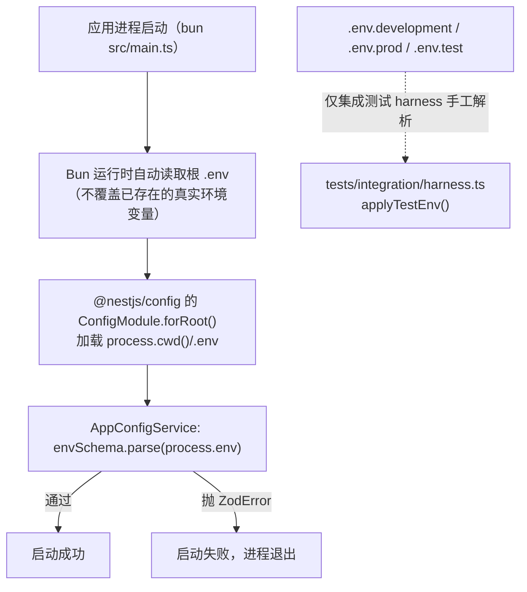

# 配置与环境变量

## 实现位置

| 文件 | 作用 |
| --- | --- |
| `src/config/app-config.service.ts` | **唯一的 env schema**（`envSchema`，Zod）+ `AppConfigService`（按组暴露 getter）+ 通道 `configured` 判定 |
| `src/config/app-config.module.ts` | `@Global()` 模块，只 provider / export `AppConfigService` |
| `src/app.module.ts` | `ConfigModule.forRoot({ isGlobal: true })` —— 负责把 `.env` 读进 `process.env` |
| `.env.example` | 模板（入库） |
| `.env.development` / `.env.prod` / `.env.test` | 分环境样本（**不入库**，见加载优先级一节） |

`AppConfigService` 的唯一构造逻辑就是一行：

```ts
private readonly values: AppEnvironment = envSchema.parse(process.env);
```

::: danger 配置校验失败 = 进程直接起不来
`envSchema.parse()` 在**依赖注入阶段**执行（`AppConfigService` 是 `@Global()` 的 provider）。校验失败抛 `ZodError`，Nest 无法完成依赖图 → 启动失败、进程退出，**没有降级**。

这是刻意的：`DATABASE_URL` / `JWT_*` 错了没有任何"安全默认值"可退。而**外部通道**（微信支付 / 支付宝 / 短信 / 小程序）全部是可选的 `z.string().optional()`，走 `configured` 判定降级 —— **"配错了"与"没配"在行为上是统一的：通道未启用**。
:::

## 加载优先级

以仓库实际代码为准（已核实 `@nestjs/config` 的实现：未传 `envFilePath` 时只加载 `resolve(process.cwd(), '.env')`）：



| 来源 | 优先级 | 谁读 |
| --- | --- | --- |
| 真实环境变量（PM2 `env` / shell `export` / CI secrets） | **最高**（Bun 不会覆盖已存在的变量；`ecosystem.config.js` 注释也写明"PM2 的 env 优先级高于 `.env` 中的同名变量"） | 所有人 |
| 根 `.env` | 中 | Bun 运行时 + `ConfigModule` |
| `.env.development` / `.env.prod` | **对应用无效** | 无人（只有 harness 读 `.env.test`） |

::: warning 「多环境文件」目前是名义上的
`ConfigModule.forRoot({ isGlobal: true })` 没有传 `envFilePath`，所以**不存在**"按 `NODE_ENV` 自动选 `.env.development` / `.env.prod`"的行为。

- 切环境请**改根 `.env`**；
- `.env.development` / `.env.prod` 在当前实现里是**留给人工参考的样本**（`.env.development` 的 `DATABASE_URL` 用 `root:123456`、`CORS_ORIGINS` 是 `5173`，而 `.env.example` 里是 `root:root` + `9527`，两者并不一致）；
- 集成测试是唯一会读分环境文件的地方：`tests/integration/harness.ts` 的 `applyTestEnv()` 按 **`.env` → `.env.test`（后者覆盖前者）** 的顺序手工铺一遍 `process.env`，然后强制若干测试开关。
:::

::: danger `.env` 是 gitignore 的
`.gitignore` 里有 `.env` 和 `.env.*`，只放行 `!.env.example`。所以：

- **`.env.example` 里少任何一个必需变量，就是全组新人都会踩的坑**（`SEED_ADMIN_PASSWORD` 就是这种情况，见 [本地开发与命令手册](/overview/getting-started)）；
- 新增环境变量时请**同时更新 `.env.example`**，否则功能只能靠口口相传。
:::

## 环境变量总表

### 基础

| 变量 | 必填 | 默认值 | 说明 | 缺失时的行为 |
| --- | :---: | --- | --- | --- |
| `NODE_ENV` | 否 | `development` | `development` / `test` / `production` | 用默认值。取值还影响 `wxMiniappFake`（生产强制 false） |
| `PORT` | 否 | `3000` | 监听端口，`z.coerce.number().int().min(1).max(65535)` | 3000。`app.listen({ port, host: '0.0.0.0' })` |
| `API_PREFIX` | 否 | `api/v1` | `app.setGlobalPrefix()` 的值 | `api/v1` |
| `DATABASE_URL` | **是** | — | `z.url()`；MySQL 连接串 | **启动失败** |
| `REDIS_URL` | 否 | — | `z.url().optional()` | 缓存 / 在线用户降级（`RedisService.enabled = false`）。**别写空字符串**，空串不是合法 URL，会启动失败 |
| `CORS_ORIGINS` | 否 | `http://localhost:5173` | 逗号分隔，`get corsOrigins()` 会 `split(',')` 并 trim | 只允许 5173 |
| `UPLOAD_DIR` | 否 | `uploads` | 文件上传落盘目录 | `uploads`（已 gitignore） |

### 日志与安全（JWT / Swagger）

| 变量 | 必填 | 默认值 | 说明 | 缺失时的行为 |
| --- | :---: | --- | --- | --- |
| `JWT_ISSUER` | **是** | — | `z.string().min(1)`，`jwtVerify` 的 `issuer` | **启动失败** |
| `JWT_AUDIENCE` | **是** | — | `z.string().min(1)`（模板里是 `manicure-web`） | **启动失败** |
| `JWT_ACCESS_SECRET` | **是** | — | `z.string().min(32)`。**后台域与 app 域共用** | **启动失败** |
| `JWT_REFRESH_SECRET` | **是** | — | `z.string().min(32)`，刷新令牌用 | **启动失败** |
| `JWT_ACCESS_TTL` | 否 | `15m` | access token 有效期 | `15m` |
| `JWT_REFRESH_TTL` | 否 | `7d` | refresh token 有效期 | `7d` |
| `SWAGGER_ENABLED` | 否 | `true` | `z.enum(['true','false'])` 再 transform 成 `boolean` | 开启 |
| `SWAGGER_PATH` | 否 | `docs` | 实际地址 `/api/v1/<path>` | `/api/v1/docs` |
| `SWAGGER_TITLE` | 否 | `美甲店管理系统 API` | 文档标题 | 默认值 |
| `SWAGGER_DESCRIPTION` | 否 | `美甲店到店预约、会员、收银与经营管理 API` | 文档描述 | 默认值 |
| `SWAGGER_VERSION` | 否 | `0.1.0` | 文档版本 | 默认值 |
| `SEED_ADMIN_PASSWORD` | 否（但有条件） | — | **不在 `envSchema` 里**，只有 `src/database/seed/index.ts` 读它 | `bun run db:seed` **抛错退出**；应用启动不受影响 |

::: warning JWT secret 只有 32 字符下限，没有强度检查
`z.string().min(32)` 就是全部约束。生产请用真随机值（例如 `openssl rand -base64 48`）。`ecosystem.config.js` 的注释提醒：`DATABASE_URL`、`REDIS_URL`、`JWT_*`、`CORS_ORIGINS` 放 `.env`，`PORT` 由 PM2 的 `env` 注入。
:::

### 微信小程序（app 域）

| 变量 | 必填 | 默认值 | 说明 | 缺失时的行为 |
| --- | :---: | --- | --- | --- |
| `WX_MINIAPP_APPID` | 否 | — | 小程序 AppID | 与 Secret 一起决定 `wxMiniapp.configured` |
| `WX_MINIAPP_SECRET` | 否 | — | 小程序 AppSecret | 同上 |
| `WX_MINIAPP_FAKE` | 否 | `false` | `true` 走假微信实现 | `wxMiniappFake` getter：**生产环境一律 false** |

`configured` 判定（`AppConfigService.wxMiniapp`）：

```ts
{
  ...complete({ appId: WX_MINIAPP_APPID, secret: WX_MINIAPP_SECRET }),
  fake: this.wxMiniappFake,   // fake 不参与 configured 计算
}
```

- `configured = false` → app 域登录接口返回 **503「小程序端未启用」**，进程照常运行；
- `fake` 单独计算，**不参与** `configured`（开了假实现也不需要真凭据）。

::: danger `WX_MINIAPP_FAKE` 是安全底线，不是便利开关
```ts
get wxMiniappFake(): boolean {
  if (this.environment === 'production') return false;   // 生产强制失效
  return this.values.WX_MINIAPP_FAKE === 'true';
}
```
假实现下**任意手机号都能登录成任意顾客 / 美甲师**。`FakeWxMiniappProvider` 的构造函数还有第二道拒绝。
:::

### 支付通道

#### 微信支付 Native 扫码（六项齐全才算启用）

| 变量 | 必填 | 参与 `configured` | 说明 |
| --- | :---: | :---: | --- |
| `WXPAY_APPID` | 否 | ✅ | 商户绑定的 AppID |
| `WXPAY_MCHID` | 否 | ✅ | 商户号 |
| `WXPAY_SERIAL_NO` | 否 | ✅ | 商户 API 证书序列号 |
| `WXPAY_PRIVATE_KEY` | 否 | ✅ | 商户私钥 PEM |
| `WXPAY_API_V3_KEY` | 否 | ✅ | APIv3 密钥（32 字节，回调报文解密用） |
| `WXPAY_NOTIFY_URL` | 否 | ✅ | 回调地址（生产是 `/api/v1/app/payments/wxpay/notify`） |
| `WXPAY_PLATFORM_PUBLIC_KEY` | 否 | ❌ **绝不参与** | 平台证书公钥，可选 |

#### 支付宝当面付（四项齐全才算启用）

| 变量 | 必填 | 参与 `configured` |
| --- | :---: | :---: |
| `ALIPAY_APP_ID` | 否 | ✅ |
| `ALIPAY_PRIVATE_KEY` | 否 | ✅ |
| `ALIPAY_PUBLIC_KEY` | 否 | ✅ |
| `ALIPAY_NOTIFY_URL` | 否 | ✅ |

#### 「配置齐全才算通道启用」的判定实现

判定全靠 `src/config/app-config.service.ts` 顶部的 `complete()` 辅助函数：

```ts
function complete<T extends Record<string, string | undefined>>(
  values: T,
): T & { configured: boolean } {
  return {
    ...values,
    configured: Object.values(values).every(
      (value) => typeof value === 'string' && value.length > 0,
    ),
  };
}
```

语义：**只要有一个字段是 `undefined` 或空串，`configured` 就是 `false`**。没有"部分启用"这种中间态。

微信支付的 getter 是关键的一处设计（注释明确写了原因）：

```ts
get wxpay() {
  const base = complete({
    appId: this.values.WXPAY_APPID,
    mchId: this.values.WXPAY_MCHID,
    serialNo: this.values.WXPAY_SERIAL_NO,
    privateKey: this.values.WXPAY_PRIVATE_KEY,
    apiV3Key: this.values.WXPAY_API_V3_KEY,
    notifyUrl: this.values.WXPAY_NOTIFY_URL,
  });
  // 放在 complete() 之外：配不配它都不该让通道「未启用」
  return { ...base, platformPublicKey: this.values.WXPAY_PLATFORM_PUBLIC_KEY };
}
```

::: danger `WXPAY_PLATFORM_PUBLIC_KEY` 为什么不参与启用判定
它是给**离线环境**（集成测试 / 内网）留的注入点 —— 配了就免联网走 `/v3/certificates` 下载平台证书。内容可以是 SPKI 公钥 PEM 或 X509 证书 PEM。

**它的存在与"通道能不能收钱"无关**。如果把它塞进 `complete()`，就会出现"商户六项齐全、只是没导平台公钥 → 整个通道被判定未启用"这种荒谬结果。

集成测试的 `harness.ts` 注释也专门重复了这一点。**改这个 getter 前请先想清楚。**
:::

::: tip 通道未启用时业务侧的行为
`src/modules/biz/payment/channels/*.provider.ts` 的 `configured` 为 false 时，调用方抛 `ConflictException('xx通道未启用')`，**不允许用假数据放行**；回调验签在未配置密钥时**必须返回失败应答**（`channel.interface.ts` 的约定）。
:::

### 通知（短信）

| 变量 | 必填 | 默认值 | 说明 | 缺失时的行为 |
| --- | :---: | --- | --- | --- |
| `SMS_PROVIDER` | 否 | `none` | `none` / `aliyun` / `tencent` / `mock` | `none` |
| `SMS_ACCESS_KEY_ID` | 否 | — | 短信凭据 | 凭据不全 → 降级 |
| `SMS_ACCESS_KEY_SECRET` | 否 | — | 短信凭据 | 同上 |
| `SMS_SIGN_NAME` | 否 | — | 短信签名 | 同上 |

`configured` 判定比其他通道多一个条件：

```ts
configured: this.values.SMS_PROVIDER !== 'none' && credentials.configured
```

`configured = false` 时：**只写站内消息 + failed 日志**，不阻塞业务。此外 `sys_config` 里还有两层开关：`biz.notice.smsEnabled`（短信总开关）与 `biz.notice.smsTemplates`（允许走短信的模板白名单），见 `BizConfigService.notice()`。

### AI

| 变量 | 必填 | 默认值 | 说明 | 缺失时的行为 |
| --- | :---: | --- | --- | --- |
| `AI_ENABLED` | 否 | `false` | `'true'` / `'false'` 转 boolean | 关闭 |
| `DEEPSEEK_API_KEY` | 否 | — | 启用 AI 时必填 | AI 不可用；其余功能不受影响 |
| `DEEPSEEK_BASE_URL` | 否 | `https://api.deepseek.com` | 接口地址 | 默认值 |
| `DEEPSEEK_MODEL` | 否 | `deepseek-chat` | 模型 | 默认值 |

## 不在 `envSchema` 里的配置

有两类配置**不走环境变量**，别在 `.env` 里找：

### 1. `biz.*` 业务参数（存在 `sys_config` 表）

`src/modules/biz/common/biz-config.service.ts` 是唯一读取入口，23 个键 + 默认值在 `BIZ_CONFIG_DEFAULTS`，中文名在 `BIZ_CONFIG_LABELS`（供 seed 写 `sys_config.name`）：

| 组 | 键 |
| --- | --- |
| 门店 / 预约 | `biz.shop.name` · `biz.booking.timezone`(默认 `Asia/Shanghai`) · `stepMinutes`(15) · `minLeadMinutes`(60) · `adminMinLeadMinutes`(0) · `maxAdvanceDays`(30) · `noShowGraceMinutes`(15) · `depositPermille`(300) |
| 会员 | `biz.member.pointsPerYuan`(1) · `pointsDiscountPerYuan`(100) · `maxPointsPermille`(300) · `maxBonusPermille`(200) · `bonusDeductMode`(`bonus_first`) · `minRechargeAmount`(10000) · `refundNeedReason`(true) |
| 支付 | `biz.payment.qrExpireMinutes`(5) · `reconcileHour`(6) |
| 通知 | `biz.notice.smsEnabled`(false) · `smsTemplates`('') · `retryLimit`(3) |
| 挂账 | `biz.credit.defaultLimit`(0) · `defaultSettleDay`(5) |
| 提成 | `biz.commission.periodCloseDay`(5) |

特点：

- **缓存 10s**（`CACHE_TTL_MS`），并用 `inflight` Promise 防缓存击穿；后台配置页保存后调 `invalidate()`；
- `getInt(key, fallback, bounds)` 遇缺失 / 非数字 / **越界**一律回落默认值 —— "绝不因为配置问题让核心链路不可用"；
- 改这些值**不需要重启**，但要注意 10s 的缓存窗口。

### 2. 小程序前端配置（硬编码在 `miniapp/miniprogram/config.ts`）

| 常量 | 说明 |
| --- | --- |
| `API_BASE` | `http://<局域网IP>:3000/api/v1`，真机不能用 `127.0.0.1` |
| `REQUEST_TIMEOUT` | 10000ms |
| `SHOP` | 门店名 / 英文副标题 / 标语 / 营业时间 / 电话 / 微信号 / 地址 / 经纬度 / 门店照 / LOGO |

`SHOP` 的注释写明了这是**临时方案**："app 域目前没有「门店档案」接口，所以先集中在这里 —— 改一处即可全局生效；等后端补了接口再换成请求"。

## 后台前端的环境变量

`web/` 走 Vite 的 `VITE_` 前缀机制，与后端完全独立：

| 文件 | 内容 |
| --- | --- |
| `web/.env.development` | `VITE_API_BASE_URL=/api/v1` |
| `web/.env.production` | `VITE_API_BASE_URL=/api/v1` |

`web/src/request.ts` 用它做 `axios.create({ baseURL: import.meta.env.VITE_API_BASE_URL })`。

::: tip 生产换域名
`web/.env.development` 的注释给了做法：构建时把 `VITE_API_BASE_URL` 换成实际后端地址，或**留空走同源 + 反向代理**（推荐，配合 nginx 的 `/api` 反代，部署形态见 [三端架构与请求生命周期](/overview/architecture)）。
:::

## 密钥安全

::: danger 三条硬规矩
1. **`.env*` 已在 `.gitignore`**（`.env` 与 `.env.*` 全部忽略，只放行 `!.env.example`）。**永远不要把真实密钥写进 `.env.example`**；
2. `project-design/superpowers/` 也被 gitignore —— 里面的 spec 可能含内部信息，别从那里复制粘贴到文档；
3. 操作审计日志（`sys_oper_log`）会对 `requestBody` / `responseBody` 递归脱敏，匹配 `/password|secret|token|authorization/i` 的字段替换为 `***`。**新增字段名请沿用这些关键词**，否则密钥会被明文写进审计表。
:::

密钥轮换时需要同步的地方：

| 密钥 | 需要同步 |
| --- | --- |
| `JWT_ACCESS_SECRET` / `JWT_REFRESH_SECRET` | 轮换即**全员强制重新登录**（旧 token 验签失败）。`sys_refresh_token` 表里的旧刷新令牌会失效 |
| 微信支付证书 / APIv3 密钥 | 商户平台重新下载 → 更新 `.env` → 重启进程（`AppConfigService` 只在启动时读一次） |
| `WXPAY_PLATFORM_PUBLIC_KEY` | 只影响"是否联网拉平台证书"，轮换不必急；从 `process.env` 读到即可 |
| `SMS_ACCESS_KEY_*` | 更新 `.env` 后重启 |
| `DEEPSEEK_API_KEY` | 更新 `.env` 后重启 |

::: warning `AppConfigService` 只在启动时读一次
`envSchema.parse(process.env)` 是字段初始化，`values` 之后不会再刷新。**改任何 `.env` 都必须重启进程**（`bun run dev` 的 `--watch` 也会因为 `.env` 不在 `src/` 下而不重启）。
:::

## 新增一个环境变量的正确姿势

1. 在 `src/config/app-config.service.ts` 的 `envSchema` 里加字段 —— **可选通道一律 `z.string().optional()`**，不要给通道类变量设 `default('')`（空串会让 `complete()` 判 false，但也会让 `z.url()` 之类失败）；
2. 如果它属于某个通道，加进对应的 `complete({...})` 调用里；
3. 如果它**不该**影响通道启用判定（像 `WXPAY_PLATFORM_PUBLIC_KEY`），**放在 `complete()` 外面**并写注释说明；
4. 在 `AppConfigService` 上加 getter（按组返回 `Pick<AppEnvironment, ...>`，跟 `swagger` / `jwt` / `ai` 的写法一致）；
5. **同步更新 `.env.example`**（这是唯一入库的样本）；
6. 如果积分测试要用，把它写进 `tests/integration/harness.ts` 的 `applyTestEnv()` —— 别写进 `.env.test`（不入库）；
7. 在 `src/config/app-config.service.spec.ts` 里补一条断言。

## 相关页面

- [项目总览与技术基线](/overview/) · [本地开发与命令手册](/overview/getting-started)
- [三端架构与请求生命周期](/overview/architecture) · [目录结构与代码地图](/overview/structure)
