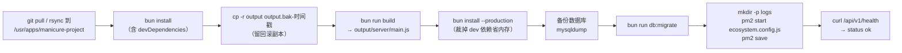
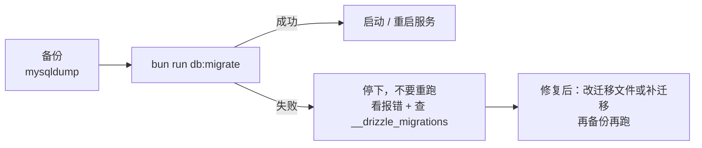

# 构建 · 部署 · 运维

本页是**上线与值守手册**：三端怎么构建、后端怎么托管、数据库怎么迁、文档站怎么发、
以及上线前那批**与代码无关但决定上线日**的人工门禁。

相关页：[测试策略与验收标准](/quality/) · [Docker 一键部署](/quality/docker) ·
[配置与环境变量](/overview/config) · [迁移 · 种子数据 · 派生口径](/data/migrations-seeds) ·
[相关文档与资料库](/appendix/related-docs)。

## 一、构建

### 1.1 三端产物

| 端           | 命令（在哪个目录）             | 内部做了什么                                      | 产物                                             |
| ------------ | ------------------------------ | ------------------------------------------------- | ------------------------------------------------ |
| 后端         | `bun run build`（仓库根）      | `nest build`（SWC builder + `typeCheck: true`）   | `output/server/`（入口 `output/server/main.js`） |
| 后台前端     | `bun run build`（`web/`）      | `vue-tsc --noEmit && vite build`                  | `output/web/`（`../output/web`）                 |
| 小程序       | 无 CLI 构建                    | 微信开发者工具「上传」，走它的 TS 插件 + 增强编译 | 微信后台版本                                     |
| 开发者文档站 | `bun run build`（`dev-docs/`） | `vitepress build .`                               | `dev-docs/.vitepress/dist/`                      |

关键配置出处：

| 事实                                                                     | 出处                                                                  |
| ------------------------------------------------------------------------ | --------------------------------------------------------------------- |
| 后端产物目录 `./output/server`，且**排除测试文件**（`**/*.spec.ts`）     | `tsconfig.build.json` 的 `outDir` / `exclude`                         |
| SWC 构建 + 类型检查 + **`deleteOutDir: true`**（每次构建先清空产物目录） | `nest-cli.json`                                                       |
| 前端产物 `../output/web`                                                 | `web/vite.config.ts` 的 `build.outDir`                                |
| 前端生产接口前缀 `/api/v1`（同源 + 反向代理）                            | `web/.env.production` 的 `VITE_API_BASE_URL`                          |
| 小程序 appid                                                             | `miniapp/project.config.json` 的 `appid`（当前 `wx3d640f2645cb5dea`） |

::: warning 后端产物目录会被整个删掉
`nest-cli.json` 里 `"deleteOutDir": true` —— 每次 `bun run build` 都会**先清空 `output/server`**。
发布前如果要留回滚副本，必须**在构建之前**手工复制一份：

```bash
cd /usr/apps/manicure-project
cp -r output "output.bak-$(date +%Y%m%d%H%M%S)"
```

:::

### 1.2 与 `.gitignore` 的关系

| 路径                                            | 是否入库 | 说明                                                                           |
| ----------------------------------------------- | -------- | ------------------------------------------------------------------------------ |
| `output/`                                       | ❌ 忽略  | 三端构建产物都在这里（后端 `output/server`、前端 `output/web`）                |
| `uploads/`                                      | ❌ 忽略  | 上传的物理文件目录（`UPLOAD_DIR` 默认 `uploads`）                              |
| `.env` / `.env.*`                               | ❌ 忽略  | **只保留 `.env.example`**（`!.env.example` 例外规则）；`web/.env.*` 同样被忽略 |
| `dev-docs/.vitepress/dist` / `.vitepress/cache` | ❌ 忽略  | 文档站产物与缓存                                                               |
| `src/modules/generated/`                        | ❌ 忽略  | 代码生成器输出                                                                 |
| `project-design/superpowers/`                   | ❌ 忽略  | 设计资料库不入库（本地保留）                                                   |

::: danger 结论
**构建产物不进仓库**，所以"回滚"必须靠重新构建或预先留副本，不能靠 `git checkout` 找回产物。
服务器上 `output/` 与 `uploads/` 是**运行时状态**，要单独纳入备份。
:::

### 1.3 构建期环境变量

前端是构建期注入（Vite 的 `import.meta.env`），**改前端接口地址必须重新构建**，重启 nginx 没用：

```bash
# web/.env.production（当前值：同源 + nginx 反代，推荐）
VITE_API_BASE_URL=/api/v1
# 或直连后端域名：VITE_API_BASE_URL=https://api.example.com/api/v1
```

## 二、后端部署（PM2）

### 2.1 发布流程图



::: danger 顺序不能改：**先备份再 migrate**
`db:migrate` 是 `bun src/database/migrate.ts`，它**只做一件事**：连库、跑
`migrate(db, { migrationsFolder: './src/database/migrations' })`。它**不备份、不校验、不回滚**，
失败时打印堆栈并 `process.exit(1)`。所以备份是发布脚本的责任，不是迁移脚本的责任。
:::

### 2.2 发布命令序列

```bash
cd /usr/apps/manicure-project

# 1) 取代码 + 装依赖（构建需要 devDependencies：@nestjs/cli / swc / typescript）
git pull
bun install

# 2) 留一份当前产物（nest build 会 deleteOutDir）
cp -r output "output.bak-$(date +%Y%m%d%H%M%S)"

# 3) 构建
bun run build

# 4) 裁成生产依赖（省内存；必须在 build 之后）
bun install --production

# 5) 备份数据库，再跑迁移
mysqldump --single-transaction --routines manicure > "backup-$(date +%Y%m%d).sql"
bun run db:migrate

# 6) 启动 / 重启
mkdir -p logs
pm2 start ecosystem.config.js
pm2 save          # 配合 pm2 startup 实现开机自启

# 7) 自检
curl -s http://127.0.0.1:1011/api/v1/health
```

后续发布（进程已在 PM2 托管）把第 6 步换成：

```bash
pm2 restart manicure-server && pm2 save
```

### 2.3 `ecosystem.config.js` 逐项解释

| 项                             | 值                                                           | 为什么                                                          |
| ------------------------------ | ------------------------------------------------------------ | --------------------------------------------------------------- |
| `name`                         | `manicure-server`                                            | `pm2 restart manicure-server` / `pm2 logs manicure-server` 用它 |
| `cwd`                          | `/usr/apps/manicure-project`                                 | 也是 `UPLOAD_DIR`（相对路径 `uploads`）的解析基准               |
| `script`                       | `output/server/main.js`                                      | 构建产物入口（不是 `src/main.ts`）                              |
| `exec_mode` / `instances`      | `fork` / `1`                                                 | 单机少占用，**不启用 cluster**                                  |
| `watch`                        | `false`                                                      | 生产不热重载                                                    |
| `interpreter`                  | `bun`                                                        | 唯一运行时；不引 tsx / Node 启动方式                            |
| `node_args`                    | `--smol`                                                     | 限制 V8 堆上限，防止无谓膨胀                                    |
| `autorestart`                  | `true`                                                       | 崩溃自动拉起                                                    |
| `restart_delay`                | `3000`                                                       | 延迟 3s 再重启，避免重启风暴                                    |
| `min_uptime`                   | `10s`                                                        | 存活不足 10s 视为启动失败，不按崩溃计数                         |
| `kill_signal` / `kill_timeout` | `SIGTERM` / `10000`                                          | 给 `app.enableShutdownHooks()` 留优雅关停时间                   |
| `time` / `merge_logs`          | `true` / `true`                                              | 日志带时间戳并合并输出                                          |
| `out_file` / `error_file`      | `/usr/apps/manicure-project/logs/out.log` / `logs/error.log` | 集中在部署目录，便于归档                                        |
| `env.NODE_ENV`                 | `production`                                                 | 决定 `WX_MINIAPP_FAKE` 强制失效等分支                           |
| `env.PORT`                     | `1011`                                                       | 由 `src/main.ts` 的 `app.listen({ port })` 读取                 |

其余变量（`DATABASE_URL` / `REDIS_URL` / `JWT_*` / `CORS_ORIGINS` / `UPLOAD_DIR` /
`WXPAY_*` / `WX_MINIAPP_*` 等）放 `.env`，由 `@nestjs/config` 加载。
**PM2 的 `env` 优先级高于 `.env` 中的同名变量** —— 两边都写 `PORT` 时以 PM2 为准。

::: warning `node_args: '--smol'` 与 `NODE_ENV`
两者都是"少占用/安全"取向：`--smol` 压堆上限，`NODE_ENV=production` 让
`AppConfigService.wxMiniappFake` **一律返回 `false`**（假微信实现下任意手机号都能登录成任意顾客，
这是安全底线而不是方便开关）。生产环境**绝不要**改这两项。
:::

### 2.4 服务端运行时行为（运维必须知道）

| 行为                                                            | 出处                                                                | 运维含义                                                                                      |
| --------------------------------------------------------------- | ------------------------------------------------------------------- | --------------------------------------------------------------------------------------------- |
| 监听 `0.0.0.0:1011`                                             | `src/main.ts` 的 `app.listen({ host: '0.0.0.0' })`                  | 防火墙 / 安全组要放行 TCP 1011（或只放 nginx 内网访问）                                       |
| `trustProxy: true`                                              | `FastifyAdapter({ logger: true, trustProxy: true })`                | 走 nginx 时必须带 `X-Forwarded-For`，否则登录日志/限流拿到的是代理 IP                         |
| 全局限流 `max: 100 / 1 minute`；登录接口按路由收紧到 10 次/分钟 | `app.register(rateLimit, ...)`                                      | 高并发压测会被 429；第 11 次登录返回 429 + `retry-after`                                      |
| multipart `files: 1` / `fileSize: 10MB`                         | `app.register(multipart, ...)`                                      | 单次只收 1 个文件；与 `MAX_FILE_SIZE` 一致                                                    |
| helmet 默认值                                                   | `app.register(helmet)`                                              | 全局 `Cross-Origin-Resource-Policy: same-origin`，**只有文件下载那一条**覆盖为 `cross-origin` |
| CORS                                                            | `app.enableCors({ origin: config.corsOrigins, credentials: true })` | `CORS_ORIGINS` 逗号分隔，逐项 `trim()`                                                        |
| 接口前缀                                                        | `app.setGlobalPrefix(config.apiPrefix)`                             | 默认 `api/v1`；健康检查因此是 `/api/v1/health`                                                |
| 优雅关停                                                        | `app.enableShutdownHooks()`                                         | 收到 `SIGTERM` 后先关 Nest，再由 PM2 在 `kill_timeout` 内收割                                 |

### 2.5 回滚

```bash
cd /usr/apps/manicure-project
git log --oneline -5                       # 找到目标 commit
git checkout <上一个 commit 或 tag>
bun install && bun run build && bun install --production   # 产物不入库，必须重建
# 或直接用发布前留的副本（更快）：rm -rf output/server && cp -r output.bak-<时间戳>/server output/server
pm2 restart manicure-server
```

::: danger 数据库迁移没有 `down`
Drizzle 迁移是**单向**的（`src/database/migrations/` 下只有 `migration.sql` + `snapshot.json`，
没有回滚脚本）。所以：

- 代码可以回滚，**已经执行过的迁移不会自动撤销**；
- 因此要么**新迁移向前兼容**（加列给默认值、不删列不改名），要么靠备份整体恢复；
- 迁移失败**不要反复重跑**：失败常常停在半应用状态（见下面「数据库」一节）。
  :::

## 三、前端托管（nginx）

`web/` 构建产物是纯静态文件（`output/web/`），交给 nginx 托管，并把 `/api` 反向代理到后端。
**仓库里没有随代码提供 nginx 配置文件**，下面是可直接改用的模板。

### 3.1 nginx 站点配置（示例）

```nginx
server {
    listen 443 ssl;
    server_name admin.example.com;                 # 必须已备案、已配 HTTPS
    ssl_certificate     /etc/nginx/ssl/admin.example.com.pem;
    ssl_certificate_key /etc/nginx/ssl/admin.example.com.key;

    root /usr/apps/manicure-project/output/web;    # 后台前端静态产物
    index index.html;

    location / {                                   # history 路由：找不到文件回落 index.html
        try_files $uri $uri/ /index.html;
    }

    location /api/ {                               # 接口反向代理
        proxy_pass http://127.0.0.1:1011;
        proxy_http_version 1.1;
        proxy_set_header Host              $host;
        proxy_set_header X-Real-IP         $remote_addr;
        proxy_set_header X-Forwarded-For   $proxy_add_x_forwarded_for;   # 配合 trustProxy
        proxy_set_header X-Forwarded-Proto $scheme;
        client_max_body_size 12m;                  # 略大于 10MB 上传上限
    }
}

server {
    listen 80;
    server_name admin.example.com;
    return 301 https://$host$request_uri;
}
```

```bash
nginx -t && systemctl reload nginx
```

### 3.2 CORS、HTTPS 与备案的关系

| 访问方                             | 路径                          | 是否走 CORS                  | 前提                                         |
| ---------------------------------- | ----------------------------- | ---------------------------- | -------------------------------------------- |
| 后台前端（同源 `/api`）            | nginx 反代到 `127.0.0.1:1011` | ❌ 不需要                    | 推荐做法                                     |
| 后台前端（另一个域名 / 本地 5173） | 跨源直连后端                  | ✅ 来源必须进 `CORS_ORIGINS` | 会产生预检请求                               |
| 小程序                             | 直连后端域名                  | ❌ 不走 CORS                 | 走微信**服务器域名白名单**，且只接受 `https` |
| 微信/支付宝回调                    | 渠道 → `NOTIFY_URL`           | ❌                           | `NOTIFY_URL` 必须是**公网 HTTPS**            |

| 变量           | 生产建议值                                              | 注意                                                                                           |
| -------------- | ------------------------------------------------------- | ---------------------------------------------------------------------------------------------- |
| `CORS_ORIGINS` | `https://admin.example.com`                             | 逗号分隔多来源；**不要写 `*`**（配了 `credentials: true`）；开发期才用 `http://localhost:5173` |
| `API_PREFIX`   | `api/v1`                                                | 改它要同步改 nginx 的 `location /api/` 与 `web/.env.production`                                |
| `UPLOAD_DIR`   | 绝对路径更稳（如 `/usr/apps/manicure-project/uploads`） | 默认 `uploads`，**相对 PM2 的 `cwd` 解析**                                                     |

::: tip 为什么生产不建议跨源
`web/.env.production` 用的是同源 `/api/v1` + nginx 反代：既不需要 CORS，也没有
预检请求，还顺手绕开了"前端域名没进 `CORS_ORIGINS` 就全站 401/跨源报错"的经典事故。
**只有前后端域名确实不同**时才配 `CORS_ORIGINS` 并承担预检。
:::

### 3.3 `uploads/` 的持久化与备份

| 事实                                                               | 出处 / 说明                                                               |
| ------------------------------------------------------------------ | ------------------------------------------------------------------------- |
| 文件按 `randomUUID() + 扩展名` 落盘到 `path.resolve(UPLOAD_DIR)`   | `src/modules/files/files.service.ts`                                      |
| 扩展名白名单（图片只有 jpg/jpeg/png/gif/webp/svg + 文档/压缩包等） | `ALLOWED_EXTENSIONS`                                                      |
| 单文件上限 **10MB**，空文件被拒                                    | `MAX_FILE_SIZE` / multipart 限制                                          |
| DB 里的 `url` 是 `/{apiPrefix}/files/{id}/download`（相对路径）    | 小程序端必须再拼绝对地址，否则图片空白（见[踩坑记录](/quality/pitfalls)） |
| **删除文件会同时删 DB 行和磁盘文件**                               | `FilesService.remove()` 里 `unlink()`                                     |
| `uploads/` 被 `.gitignore` 忽略                                    | 属于运行时状态，**必须**单独备份                                          |

```bash
# 每日备份（示例：保留 14 天）
tar czf "/backup/uploads-$(date +%Y%m%d).tar.gz" -C /usr/apps/manicure-project uploads
find /backup -name 'uploads-*.tar.gz' -mtime +14 -delete

# 定期看占用，防止磁盘被撑满
du -sh /usr/apps/manicure-project/uploads
```

## 四、数据库

### 4.1 迁移在发布流程中的位置



- 迁移目录：`src/database/migrations/`（当前 **15 个**迁移目录，每个含 `migration.sql` + `snapshot.json`）。
- **生成方式**：`bun run db:generate`（由 `src/database/schema/index.ts` 推导）。**禁止手写 SQL 迁移**。
- **执行方式**：`bun run db:migrate` → `bun src/database/migrate.ts`。
- 迁移执行记录在 MySQL 的 **`__drizzle_migrations`** 表里（按 hash 记账），所以「迁移成功过」与「表存在」是两件事。

::: danger 迁移失败最常见的形态：半应用状态
drizzle 1.0.0-rc 生成的 `auditColumns` 会把默认值渲染成 **`DEFAULT (CURRENT_TIMESTAMP)`（带括号）**。
MySQL 8 在 `CREATE TABLE` 时**接受**它，但随后任何**重建表**的语句（`CREATE INDEX` / `ALTER TABLE`）
会报 `Invalid default value for 'created_at'`；而 **DDL 不回滚** —— 结果是
**表建好了、索引没建、`__drizzle_migrations` 没记账**。重跑会直接 `already exists`，越跑越乱。

处置：新迁移生成后**肉眼扫一遍 SQL**，把 `DEFAULT (CURRENT_TIMESTAMP)` 改回
`DEFAULT CURRENT_TIMESTAMP`（**迁移尚未成功执行前**改文件是安全的，因为 drizzle 只在成功后才记 hash）。
:::

### 4.2 生产**禁止**执行的 seed

| 命令                    | 生产能不能跑    | 说明                                                                                      |
| ----------------------- | --------------- | ----------------------------------------------------------------------------------------- |
| `bun run db:seed`       | 首次部署跑一次  | 管理员账号（密码取 `SEED_ADMIN_PASSWORD`）                                                |
| `bun run db:seed:menus` | ✅ 可以（幂等） | 菜单与权限点；**新增页面后必须重跑**                                                      |
| `bun run db:seed:biz`   | ✅ 可以（幂等） | 业务默认值：会员等级 / 退款判责规则 / 通知模板 / **11 个定时任务** / 业务参数             |
| `bun run db:seed:nail`  | ✅ 可以         | 美甲店基础数据：项目 / 美甲师 / 排班 / 卡种 / 充值方案 / 积分兑换品 / 提成规则 / 挂账主体 |
| `bun run db:seed:demo`  | ❌ **禁止**     | 演示用顾客与会员数据，README 明确「生产不要跑」                                           |

::: warning seed 是幂等的，但不是"零副作用"
`db:seed:menus` / `db:seed:biz` 会按需补记录、按 handler 去重插入定时任务；它们**不会**删除你手工改过的业务数据，
也**不会**把你的手工修改改回来。生产上跑完记得回后台核对：菜单权限点、定时任务列表、退款判责规则。
:::

## 五、文档站部署

`dev-docs/` 是 VitePress 2 站点（`vitepress@2.0.0-alpha.20` + `vitepress-plugin-mermaid`）。

| 脚本              | 命令                              | 端口 |
| ----------------- | --------------------------------- | ---- |
| `bun run dev`     | `vitepress dev . --port 5180`     | 5180 |
| `bun run build`   | `vitepress build .`               | —    |
| `bun run preview` | `vitepress preview . --port 5181` | 5181 |

```bash
cd /d/project/myproject/manicure-project/dev-docs
bun install
bun run build            # 产物：dev-docs/.vitepress/dist
```

### 5.1 子路径部署：`DOCS_BASE`

`dev-docs/.vitepress/config.mts` 里：

```ts
const base = process.env.DOCS_BASE ?? '/';
```

所以**子路径由环境变量在构建时决定**，不要在配置文件里手改 `base`：

```bash
# 部署到 https://example.com/manicure/dev-docs/ 时
DOCS_BASE=/manicure/dev-docs/ bun run build
```

::: warning `base` 末尾要带斜杠
`DOCS_BASE=/manicure/dev-docs/`（**结尾必须有 `/`**）。构建时忘了设这个变量而部署到子路径，
页面里的 CSS / JS / 内部链接会全部 404。
:::

另外两条已开启的配置会影响部署：

- `cleanUrls: true` —— 生成 `foo.html` 而不是目录形式的路由，链接不带 `.html`；
- `ignoreDeadLinks: false` —— **内部死链会让构建直接失败**。这也是本页只链接[站点目录](/overview/)里已登记路径的原因。

### 5.2 nginx 示例（子路径）

```nginx
location /manicure/dev-docs/ {
    alias /usr/apps/manicure-project/dev-docs/.vitepress/dist/;
    index index.html;
    try_files $uri $uri/ $uri.html /manicure/dev-docs/index.html;   # 配合 cleanUrls
}
```

### 5.3 GitHub Pages 示例

```bash
# .github/workflows/docs.yml 的关键步骤（子路径 = /<仓库名>/dev-docs/）
cd dev-docs && bun install && DOCS_BASE=/manicure-project/dev-docs/ bun run build
# 上传产物目录：dev-docs/.vitepress/dist
```

::: tip GitHub Pages 的两个注意

1. Pages 的项目站点**天然在子路径**下，所以 `DOCS_BASE` 必须等于 `/<repo>/dev-docs/`；
2. 站点用的是**本地搜索**（`search.provider: 'local'`），没有跨域依赖，Pages 上可直接用。
   :::

### 5.4 Docker 一键部署（自建服务器推荐）

`docker-compose.yml` 里的 `docs` 服务把**两套站合并**构建成一个 nginx 静态镜像，
挂 `profiles: ['docs']`，默认不启动：

```bash
docker compose --env-file deploy/.env --profile docs up -d --build
# 门店操作手册  http://<host>:8080/docs/
# 开发者文档    http://<host>:8080/dev-docs/
```

与上面手工部署的几处不同，值得知道：

- **`DOCS_BASE` 由镜像在构建时注入**（`/docs/` 与 `/dev-docs/`），不用你手动设；
- 产物落在与 URL **同名**的目录（`/usr/share/nginx/html/{docs,dev-docs}`），
  所以 nginx 用 `root` + `try_files` 就够了，**不必用 `alias`**
  —— `alias` 和 `try_files` 一起用时行为很反直觉，能避则避；
- 构建阶段需要 `git`：站点开了 `lastUpdated`，VitePress 会调 `git log` 取每页修改时间，
  而 `oven/bun:*-alpine` 基础镜像不带 git（本地能过、容器里报
  `Executable not found in $PATH: "git"`），需要 `apk add --no-cache git` 加 `COPY .git ./.git`。

只更新文档、不动业务时可以单独重建：

```bash
docker compose --env-file deploy/.env --profile docs up -d --build docs
```

细节（卷、健康检查、排障）见 [Docker 一键部署](/quality/docker)。

## 六、上线前人工门禁

来源：`project-design/HANDOVER-miniapp.md` 第 5 节「人工门禁现状」。
这些事**与代码无关但决定上线日**，且**大多需要真人**（营业执照、法人信息、扫码验证）。

| 门禁                                   | 谁负责                  | 在哪配置                                                                                                                                   | 不做的后果                                                                                                                                                        |
| -------------------------------------- | ----------------------- | ------------------------------------------------------------------------------------------------------------------------------------------ | ----------------------------------------------------------------------------------------------------------------------------------------------------------------- |
| 小程序**主体认证**（H5/H6）            | 门店主体（老板 / 法人） | 微信公众平台 → 小程序 → 设置 → 基本设置 → 主体信息                                                                                         | 无法提交审核、无法发布，`wx.login` 在正式环境不可用                                                                                                               |
| 小程序**备案**（H6）                   | 门店主体                | 微信公众平台按指引提交（需域名/主体材料）                                                                                                  | 版本提审被驳回                                                                                                                                                    |
| 后台域名**备案 + HTTPS**（H7）         | 老板 / 运维             | 云服务商备案系统 + 证书签发；证书配在 nginx 上                                                                                             | 小程序 request 合法域名**只能填 https**，http/IP 一律不能填；微信支付回调也要求公网 HTTPS                                                                         |
| 服务器**域名白名单**（H8）             | 运维                    | 微信公众平台 → 开发管理 → 开发设置 → 服务器域名                                                                                            | 真机请求被微信拦截（开发期只能靠开发者工具 `urlCheck: false` 绕过，那不能上线）                                                                                   |
| **正式 AppID / AppSecret**（H3/H18）   | 老板提供、运维配置      | 公众平台 → 开发设置；后端 `.env` 的 `WX_MINIAPP_APPID` / `WX_MINIAPP_SECRET`；小程序端 `miniapp/project.config.json` 的 `appid`            | 未配置时 app 域登录按设计返回 **503「小程序端未启用」**，小程序拿不到任何真数据                                                                                   |
| **代码上传密钥 + IP 白名单**（H4）     | 运维                    | 公众平台 → 开发管理 → 小程序代码上传                                                                                                       | 不能走 CLI 自动上传，只能人工在工具里点                                                                                                                           |
| **微信支付商户号 + APIv3 证书**（H9）  | 老板申请、运维配置      | 商户平台申请与签约；后端 `.env` 的 `WXPAY_APPID` `WXPAY_MCHID` `WXPAY_SERIAL_NO` `WXPAY_PRIVATE_KEY` `WXPAY_API_V3_KEY` `WXPAY_NOTIFY_URL` | **六项齐全通道才算启用**；缺任何一项，在线支付返回「通道未启用」（进程仍能启动，不影响其它功能）。`WXPAY_PLATFORM_PUBLIC_KEY` 是可选加速项，**不参与启用判定**    |
| 商户号与 AppID **绑定**                | 老板                    | 商户平台绑定公众号/小程序 AppID                                                                                                            | Native 下单传的 `appid` 校验失败，下单被微信拒绝                                                                                                                  |
| **订阅消息模板**（H10）                | 运营                    | 公众平台 → 订阅消息 → 我的模板；代码侧登记模板 ID                                                                                          | 小程序端只能拿到"授权额度"，**发不出消息**。注意当前实现按 `(app_wx_user_id, template_id)` 累加额度，且**不校验模板 ID 白名单**（模板 ID 是公开的，挡不住攻击者） |
| **隐私协议 / 用户协议正文替换**（H16） | 老板 / 法务             | 小程序内协议页面正文（当前是占位文案）                                                                                                     | **提审必被驳回**：协议需写清门店主体信息与手机号用途                                                                                                              |
| **支付通道小额验证**（H13/H14）        | 老板 / 店长             | 真机 + 正式商户号；微信 Native 与支付宝当面付各跑一次正向 + 一次退款                                                                       | 通道是否真的通、验签与回调地址是否正确**无从验证**。系统**没有沙箱开关**，只能用正式商户号走小额真实交易                                                          |
| 真机与视觉验收（H12）                  | 门店 / 测试             | 真机扫码 + 逐页比对                                                                                                                        | 体验类缺陷（TabBar、动效、图标）只有真机能发现，`tsc` 与静态检查无效                                                                                              |
| UI 设计稿 / 位图素材（H11）            | 设计                    | —                                                                                                                                          | **不阻塞上线**：当前用「分类 emoji + 主题渐变底」占位                                                                                                             |

已解除/已定的门禁（留档）：H1 技术选型✅ · H15 集成测试库可连✅ · H19 店长确认入口放后台✅（`biz:staff:grant`）。

## 七、运维手册

### 7.1 健康检查

```bash
# 本机
curl -s http://127.0.0.1:1011/api/v1/health
# → {"code":0,"data":{"status":"ok"},"message":"ok"}

# 经 nginx
curl -s https://admin.example.com/api/v1/health
```

- 端点：`GET /{API_PREFIX}/health`（默认 `/api/v1/health`），**`@Public()`，不需要 token**；
- 实现：`src/modules/health/health.controller.ts`；
- 它是**进程存活**探针，**不探数据库/Redis**。要验数据库，用 Swagger 或任意需要鉴权的接口。

### 7.2 日志与审计入口

| 入口                    | 位置                                                                              | 用途                                                       |
| ----------------------- | --------------------------------------------------------------------------------- | ---------------------------------------------------------- |
| PM2 汇总日志            | `logs/out.log` / `logs/error.log`（`pm2 logs manicure-server`）                   | 启动失败、未捕获异常、定时任务日志                         |
| 应用日志（pino）        | 同上（Fastify `logger: true`）                                                    | 每个请求一行；4xx/5xx 便于按状态码筛                       |
| **操作审计**            | 后台「系统监控 → 操作日志」（`sys_operation_log`，拦截器自动落库）                | 谁在什么时候改了哪条数据                                   |
| 登录日志                | 后台「系统监控 → 登录日志」                                                       | 登录成功/失败、IP（依赖 `trustProxy` + `X-Forwarded-For`） |     | **定时任务日志** | 后台「运维工具 → 定时任务 → 日志」（`sys_job_log`：`status` / `message` / `durationMs`） | 任务堆积与失败的第一现场 |
| 支付回调留痕 / 对账差异 | `biz_payment_log`（含 `event='callback_invalid'`）；后台「收银与资金 → 对账差异」 | 回调被拒原因；系统缺单 / 金额不一致                        |

### 7.3 Redis 未配置时的降级表现

Redis 是**可选依赖**，`REDIS_URL` 没配就整体降级，**不影响启动与核心业务**：

| 行为                                                      | 实现                                                                                     |
| --------------------------------------------------------- | ---------------------------------------------------------------------------------------- |
| `enabled === false`；`get/set/del/keys` 返回空值 / 空数组 | `src/common/cache/redis.service.ts`                                                      |
| 连接错误**只 warn 一次**，绝不抛异常                      | `warnOnce()`（踩过：`enableOfflineQueue: false` 抛 `Connection is closed` 曾让登录 500） |
| `ping()` → `false`、`dbsize()` → `null`                   | 「缓存监控」页面显示不可用                                                               |
| 快速失败而非排队堆积                                      | `maxRetries: 1` + `enableOfflineQueue: false`                                            |

::: danger 关键设计：正确性不依赖 Redis
防超订用的是 **MySQL 行锁（`SELECT ... FOR UPDATE`）**，不是 Redis 分布式锁 ——
因为 Redis 在本项目里可以随时缺席，**不能承担正确性**。任何"把锁挪到 Redis"的改动都要先推翻这条决策。
:::

### 7.4 常见故障处置

#### ① 进程反复重启

```bash
pm2 status                                  # 看 restart 次数与 uptime
pm2 logs manicure-server --lines 200 --err  # 第一现场永远在 error.log
```

| 症状                           | 常见原因                                             | 处置                                                                                        |
| ------------------------------ | ---------------------------------------------------- | ------------------------------------------------------------------------------------------- |
| 启动即退，日志里有 Zod 报错    | `.env` 缺必填项（`DATABASE_URL` / `JWT_*` ≥32 字符） | 补齐 `.env`；`AppConfigService` 在构造时严格 `parse`                                        |
| 启动即退，连库超时             | MySQL 未启动 / 账号无权限 / 防火墙                   | `mysql -h ... -u ... -p` 手工连一次                                                         |
| 反复重启且 `uptime` 始终 < 10s | 启动期抛异常（如漏 `exports` 的依赖注入错误）        | 看 error.log 里的 `Nest can't resolve dependencies`；**typecheck 是绿的，只有真启动才暴露** |
| 端口占用                       | 1011 被别的进程占着                                  | `ss -lntp \| grep 1011`                                                                     |

#### ② 渠道回调收不到

```bash
pm2 logs manicure-server | grep -i notify
curl -s -o /dev/null -w '%{http_code}\n' https://admin.example.com/api/v1/app/payments/wxpay/notify
```

| 检查点                             | 说明                                                                                                                                 |
| ---------------------------------- | ------------------------------------------------------------------------------------------------------------------------------------ |
| `WXPAY_NOTIFY_URL` 是否公网 HTTPS  | 微信/支付宝**只往这个地址**发通知；IP、内网地址、自签证书一律不通                                                                    |
| nginx 是否放行该路径并透传原始报文 | 后端用 `rawBody: true` 验签，**键顺序敏感**；中间层改写 body 会导致验签失败                                                          |
| 验签失败会回 4xx                   | 这是**故意**的：回 200 会被当成接收成功、渠道不再重投                                                                                |
| 兜底机制                           | `queryPendingPayments` 每 2 分钟主动查单补记；`reconcilePayments` 每日对账。**回调用不通不会丢钱**，但"系统状态落后"与对账噪声会变多 |

#### ③ 定时任务堆积

| 检查点                                    | 说明                                                                                                                                            |
| ----------------------------------------- | ----------------------------------------------------------------------------------------------------------------------------------------------- |
| 后台「定时任务」列表的 `status`           | `disabled` 的任务不注册；生产上被误停会表现为"数据不自动流转"                                                                                   |
| `sys_job_log` 的 `durationMs` 与 `status` | 某任务耗时骤增 → 数据量或慢查询                                                                                                                 |
| `concurrent` 字段                         | 为 `false` 时，上一次未跑完会**直接跳过本次**（不是排队），表现为"任务像没跑"                                                                   |
| 手工补跑                                  | 后台定时任务页「执行一次」                                                                                                                      |
| 排班/状态类任务                           | `autoCompleteExpiredBookings` / `autoNoShowBookings`（每 10 分钟）、`expireMemberCards`（每日 00:05）、`markOverdueReceivables`（每日 01:10）   |
| 钱相关任务                                | `closeExpiredPayments`（每分钟）、`queryPendingPayments`（每 2 分钟）、`reconcilePayments`（每日 06:30）—— 这三个是**收银的兜底**，停了影响最大 |

::: warning 定时任务不碰钱
按设计，定时任务只改状态与等级（幂等靠条件更新的 `affectedRows` 闸门）。
如果你在排查时想"让任务帮忙补一笔钱"——那是设计外的操作，请改代码或走收银台流程。
:::

#### ④ 磁盘被 `uploads/` 撑满

| 检查点                         | 说明                                                                                   |
| ------------------------------ | -------------------------------------------------------------------------------------- |
| `du -sh uploads/` 与实际文件数 | 单文件上限 10MB，正常业务量下增长应该很慢                                              |
| 后台「运维工具 → 文件管理」    | 删除会**同时删 DB 行与磁盘文件**（`FilesService.remove` 里的 `unlink`）                |
| 失配文件                       | 目录里有、DB 里没有的孤儿文件需要人工清理（备份恢复/迁移中断会产生）                   |
| 长期方案                       | `uploads/` 挂独立数据盘；每日 tar 备份 + 定期清理；对象存储迁移（需改 `FilesService`） |

## 八、上线检查速查

- [ ] `.env` 全项填齐（至少 `DATABASE_URL` / `JWT_*` ≥32 字符 / `CORS_ORIGINS` 填真实前台域名而非 `*` / `UPLOAD_DIR`）
- [ ] `NODE_ENV=production`、`PORT=1011`，`WX_MINIAPP_FAKE` **未开启**（生产本就强制失效）
- [ ] 防火墙放行 1011（或仅放 nginx 内网）；nginx 透传 `X-Forwarded-For` / `X-Forwarded-Proto`
- [ ] `CORS_ORIGINS` 与 nginx 的 `proxy_set_header X-Forwarded-For` 均已核对
- [ ] 数据库已备份；`db:migrate` 成功且 `__drizzle_migrations` 有新记录
- [ ] `db:seed:menus` / `db:seed:biz` / `db:seed:nail` 已跑；**`db:seed:demo` 没跑**
- [ ] `pm2 save` + `pm2 startup` 已执行；`curl /api/v1/health` 返回 `status: ok`
- [ ] 定时任务列表 11 个都是 `active`；`uploads/` 与 `output/` 纳入备份
- [ ] 第六节的人工门禁逐项确认（认证/备案、HTTPS、白名单、正式 AppID/AppSecret、商户号与 APIv3 证书、订阅消息模板、协议正文、小额支付验证）
      延伸阅读：[测试策略与验收标准](/quality/) · [踩坑记录与排查手册](/quality/pitfalls) ·
      [配置与环境变量](/overview/config) · [接口契约索引](/appendix/api)。
