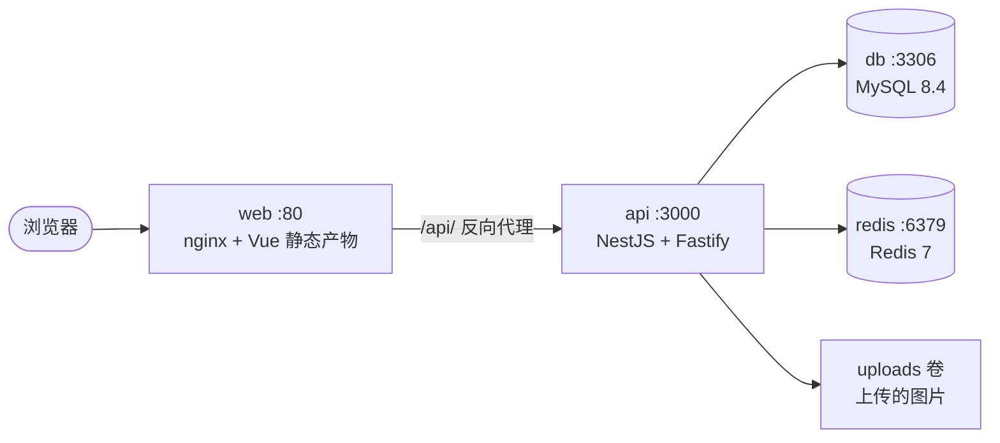
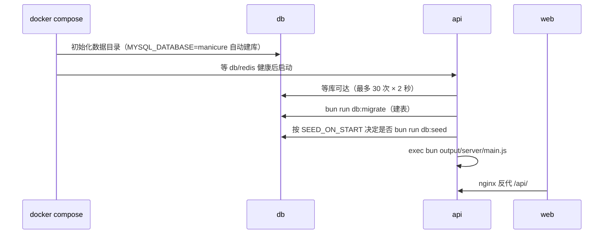

# Docker 一键部署

本页是**单机自部署手册**：一条命令拉起后端、后台前端、MySQL、Redis 四件套，
数据落在命名卷里，首次启动自动建库、跑迁移、灌种子数据。

不想用容器（已有 PM2 + 外部数据库）的见 [构建 · 部署 · 运维](/quality/deploy)。

相关页：[构建 · 部署 · 运维](/quality/deploy) · [配置与环境变量](/overview/config) ·
[迁移 · 种子数据 · 派生口径](/data/migrations-seeds) · [踩坑记录与排查手册](/quality/pitfalls)。

## 一、一分钟上手

### 1.1 前置条件

| 依赖                    | 版本       | 说明                                                 |
| ----------------------- | ---------- | ---------------------------------------------------- |
| Docker Engine / Desktop | 20.10+     | Compose 用 **v2**（`docker compose`，无连字符）      |
| 内存                    | ≥ 4 GB     | MySQL 8.4 自身约 1 GB，构建期还要跑前端打包          |
| 磁盘                    | ≥ 5 GB     | 镜像 + 三个数据卷                                    |
| 端口                    | 80（可改） | 前端入口，改 `deploy/.env` 的 `WEB_PORT`             |
| `git` / `bun`（可选）   | —          | 只在**宿主机**跑命令时需要；容器内用的是镜像自带 bun |

### 1.2 启动

Windows（PowerShell）：

```powershell
powershell -ExecutionPolicy Bypass -File deploy\up.ps1
```

Linux / macOS：

```bash
sh deploy/up.sh
```

脚本做三件事：

1. **生成配置**：若 `deploy/.env` 不存在，就从 `deploy/env.example` 复制一份，并**随机填好**
   `MYSQL_ROOT_PASSWORD`（32 位）、`JWT_ACCESS_SECRET` / `JWT_REFRESH_SECRET`（各 48 位）、
   `SEED_ADMIN_PASSWORD`（16 位），文件权限设为 `600`。
2. **构建并启动**：`docker compose --env-file deploy/.env up -d --build`。
3. **打印结果**：后台地址、以及**首次生成的管理员账号密码**（只在生成配置那一次打印，请立刻存下来）。

手动等价命令：

```bash
cp deploy/env.example deploy/.env    # 然后自己填 MYSQL_ROOT_PASSWORD（必填）
docker compose --env-file deploy/.env up -d --build
```

::: tip 两个环境变量来源别搞混

- `--env-file deploy/.env`：给 **compose 自己**做插值（`${MYSQL_ROOT_PASSWORD}`、`${WEB_PORT}` 这类）；
- `docker-compose.yml` 里 api 服务的 `env_file: [deploy/.env]`：把变量**注入容器内进程**。

两者指向同一个文件，所以只需维护一份。注意 compose 只会**自动**读仓库根目录的 `.env`，
不会读 `deploy/.env`，所以手动敲命令时**每条都要带 `--env-file`**，脚本里已经带好了。
:::

### 1.3 起来之后

| 地址                             | 用途                                  |
| -------------------------------- | ------------------------------------- |
| `http://<服务器 IP>/`            | 后台管理端（Vue 3 + lew-ui 构建产物） |
| `http://<服务器 IP>/api/v1/`     | 后端 API 前缀（全局前缀 `api/v1`）    |
| `http://<服务器 IP>/api/v1/docs` | Swagger，需 `SWAGGER_ENABLED=true`    |

用脚本打印的 `admin` 账号登录，进去第一件事是改密码。

## 二、容器编排



### 2.1 四个服务

| 服务    | 镜像                               | 对外端口                | 健康检查                                | 数据卷                          |
| ------- | ---------------------------------- | ----------------------- | --------------------------------------- | ------------------------------- |
| `db`    | `mysql:8.4`                        | 不映射（同网络内 3306） | `mysqladmin ping -h 127.0.0.1 --silent` | `mysql-data` → `/var/lib/mysql` |
| `redis` | `redis:7-alpine`（`--appendonly`） | 不映射（同网络内 6379） | `redis-cli ping`                        | `redis-data` → `/data`          |
| `api`   | 本地构建（`Dockerfile`）           | 不映射（同网络内 3000） | `fetch http://127.0.0.1:3000/`          | `uploads` → `/app/uploads`      |
| `web`   | 本地构建（`web/Dockerfile`）       | `${WEB_PORT:-80}` → 80  | —                                       | —                               |

启动顺序靠 `depends_on: condition: service_healthy` 串起来：
**db + redis 健康 → api 起 → api 健康 → web 起**。所以第一次 `up` 会有 1~2 分钟看起来"没动静"。

### 2.2 三个命名卷

| 卷名                  | 装什么                  | 备份命令                   |
| --------------------- | ----------------------- | -------------------------- |
| `manicure_mysql-data` | 全部业务数据（61 张表） | `mysqldump`，见 4.1        |
| `manicure_redis-data` | AOF 持久化（缓存/队列） | 一般不用备，丢了从库里重建 |
| `manicure_uploads`    | 上传的图片等文件        | `tar` 打包，见 4.1         |

::: warning 卷是数据唯一归宿
`docker compose down` **不会**删卷（数据安全）；`docker compose down -v` 会**连卷一起删**，
等于清库。生产上除非确定要重装，否则别加 `-v`。
:::

### 2.3 为什么 db / redis 不对外映射端口

安全默认：数据库和 Redis 只暴露给同一 compose 网络里的 `api`，宿主机与外网都连不上。
需要本地用客户端连库调试时，把 `docker-compose.yml` 里对应服务被注释的 `ports` 打开即可：

```yaml
ports: ['${DB_PORT:-3306}:3306']
```

## 三、首次启动发生了什么



### 3.1 种子开关 `SEED_ON_START`

| 值             | 行为                                                                                          |
| -------------- | --------------------------------------------------------------------------------------------- |
| `auto`（默认） | 查 `sys_user` 里有没有 `admin`：**没有**且 `SEED_ADMIN_PASSWORD` 非空 → 跑种子；已存在 → 跳过 |
| `force`        | 每次启动都跑种子（⚠️ 会把 admin 密码重置回 `SEED_ADMIN_PASSWORD`）                            |
| `false`        | 从不跑种子（自己灌数据时用）                                                                  |

::: warning 为什么不能每次启动都跑种子
`bun run db:seed` 对 `sys_user` 用的是 `onDuplicateKeyUpdate({ set: { passwordHash, status } })`，
**每次执行都会把管理员密码改回种子里的值**。所以 entrypoint 默认只在「库里还没有 admin」时才执行。
上线后改密码请走后台「个人设置」，不要用 `SEED_ON_START=force` 图省事。
:::

### 3.2 时区（最容易出错的一处）

业务口径全部是**店内本地日**：可约时段、营业日切分、报表日期边界都按本地日算。因此：

- 容器统一 `TZ=Asia/Shanghai`（改 `deploy/.env` 里的 `TZ` 即可，四个服务都吃这个值）；
- MySQL 启动参数 `--default-time-zone=+08:00`。

::: danger 两者必须同时正确
只改一处会出现「上午的预约跑到前一天」「日报表数字对不上」这类错乱。
`TZ` 改了之后要 `docker compose --env-file deploy/.env up -d` 让容器重建。
:::

## 四、日常运维

```bash
# 所有命令都建议带 --env-file；下面用 $E 代替
E='--env-file deploy/.env'

docker compose $E ps                      # 容器状态（含健康态）
docker compose $E logs -f api             # 跟后端日志
docker compose $E logs --tail 100 db      # 看数据库日志
docker compose $E restart api             # 重启后端
docker compose $E up -d --build           # 改代码/改 compose 后重建
docker compose $E stop                    # 停止（保留容器）
docker compose $E down                    # 删容器，保留数据卷
docker compose $E down -v                 # ⚠️ 连数据卷一起删 = 清库
```

### 4.1 备份与恢复

数据库：

```bash
docker compose --env-file deploy/.env exec -T db \
  sh -c 'mysqldump -uroot -p"$MYSQL_ROOT_PASSWORD" --single-transaction --databases manicure' \
  > backup-$(date +%F).sql

# 恢复
docker compose --env-file deploy/.env exec -T db \
  sh -c 'mysql -uroot -p"$MYSQL_ROOT_PASSWORD" manicure' < backup-2026-09-15.sql
```

上传文件：

```bash
docker run --rm -v manicure_uploads:/data -v "$PWD":/out alpine \
  tar czf /out/uploads-$(date +%F).tar.gz -C /data .
```

### 4.2 升级代码

```bash
git pull
docker compose --env-file deploy/.env up -d --build
```

- `api` 镜像重建后，entrypoint 会自动跑 `db:migrate`（迁移是幂等的）；
- 前端产物打进 nginx 镜像，`--build` 一并重建；
- 建议升级前先按 4.1 备份数据库。

### 4.3 改配置

| 改了什么                                             | 需要的动作                                             |
| ---------------------------------------------------- | ------------------------------------------------------ |
| `deploy/.env` 里的运行时变量（端口/JWT/支付商户号…） | `up -d`（compose 插值 + 容器 env 都会刷新）            |
| `WEB_PORT`                                           | `up -d web`                                            |
| `VITE_API_BASE_URL`                                  | `up -d --build web` —— 它是**构建期**变量，必须重建    |
| 代码                                                 | `up -d --build`                                        |
| `SEED_ADMIN_PASSWORD`                                | 只影响「库里还没有 admin」时的首次种子，改旧库密码无效 |

## 五、文件分工

| 文件                       | 作用                        | 关键点                                                                                |
| -------------------------- | --------------------------- | ------------------------------------------------------------------------------------- |
| `Dockerfile`               | 后端三阶段镜像              | `deps`（装全部依赖）→ `build`（`bun run build`）→ `runtime`（只装生产依赖）           |
| `web/Dockerfile`           | 前端构建 + nginx 托管       | 构建上下文是**仓库根**，产物从 `/repo/output/web` 拷进 nginx                          |
| `web/nginx.conf`           | 静态托管 + `/api/` 反代     | `client_max_body_size 12m`（后端 multipart 限 10 MB）、gzip、SPA fallback `try_files` |
| `docker-compose.yml`       | 编排四件套                  | `env_file` 注容器、`environment` 覆盖库/Redis 地址（`db` / `redis` 服务名当主机名）   |
| `deploy/api-entrypoint.sh` | 容器入口                    | 等库 → 迁移 → 按需种子 → `exec` 起服务                                                |
| `deploy/env.example`       | 环境变量模板                | `deploy/.env` 由它生成；**没有前导点**，所以不会被 `.gitignore` 的 `.env.*` 规则吞掉  |
| `deploy/up.sh` / `up.ps1`  | 一键脚本（Linux / Windows） | 生成配置（随机密钥）→ `up -d --build` → 打印账号密码                                  |
| `.dockerignore`            | 构建上下文瘦身              | 排除 `node_modules`、`miniapp/`、`docs/`、`tests/`、`output/` 等，两个镜像共用        |

### 5.1 五个已经在文件里处理掉的坑

1. **前端产物不是 `web/dist`。** `web/vite.config.ts` 把 `outDir` 指到了 `../output/web`，
   已经超出了 `web/` 目录。所以 `web/Dockerfile` 的构建上下文必须是**仓库根**，
   `WORKDIR /repo` 后在 `/repo/output/web` 取产物。

2. **`web/.env.production` 不在版本库里。** `.gitignore` 的 `.env.*` 规则把它挡掉了，
   全新克隆构建时 `VITE_API_BASE_URL` 会是空字符串，前端请求会打到错误地址。
   所以 `web/Dockerfile` 用构建参数兜底：

   ```dockerfile
   ARG VITE_API_BASE_URL=/api/v1
   ENV VITE_API_BASE_URL=${VITE_API_BASE_URL}
   ```

   Vite 优先读已存在的 `process.env`，所以这个值会覆盖 `.env` 文件。

3. **MySQL 健康检查既不能用 `healthcheck.sh`，也不该带 `-p"$$MYSQL_ROOT_PASSWORD"`。**
   这一条最初写反过，务必看清：`healthcheck.sh` 是 **`mysql:8.0` 时代**的脚本，
   **`mysql:8.4` 镜像里已经删掉了** —— 实探 `mysql:8.4` 的 `/usr/local/bin` 只剩
   `docker-entrypoint.sh` 和 `gosu`。照搬旧写法会让每次健康检查都 exec 失败，
   12 次重试用满后 db 变成 `unhealthy`，而 `api` 又 `depends_on: db: service_healthy`，
   于是 **api / web 永远起不来**，偏偏 `docker compose up -d` 还会**返回 0**，
   很容易被误判成部署成功。

   带密码同样不行：compose 的 `$$` 转义加上 shell 二次解析，密码一旦含引号就可能坏掉。
   最终采用的写法是**不带凭据的 ping**：

   ```yaml
   test: ['CMD-SHELL', 'mysqladmin ping -h 127.0.0.1 --silent']
   ```

   这样写能成立，靠的是两个已实测确认的事实：

   - `mysqladmin ping` 只关心 server 有没有应答，**认证失败（`Access denied`）同样返回 0**，
     所以不需要密码；
   - 首次初始化阶段跑的是「临时 server」，它 `socket: mysqld.sock / port: 0`，即
     **只监听 unix socket、不开 TCP**，所以 `-h 127.0.0.1` 在这个阶段必然失败 ——
     这正好让它能准确区分「初始化中」和「已就绪」，不必依赖 `--innodb_initialized`
     那种（并不存在的）扩展参数。

4. **后端运行时镜像必须带上 `src/`。** 迁移和种子跑的是项目自带的 TS 脚本
   （`src/database/migrate.ts`、`src/database/seed/index.ts`），不是编译产物，
   所以 runtime 阶段除了 `output/`，还要 `COPY src/` 与 `tsconfig.json`。
   密码哈希用的是 Bun 内置的 `Bun.password`（argon2id），**没有第三方加密依赖**，
   因此 `bun install --production` 之后这些脚本依然能跑。

5. **镜像构建跳过 `vue-tsc`，只跑 `vite build`。** `web/package.json` 的 `build` 是
   `vue-tsc --noEmit && vite build`，但在只装了 `web` 依赖的镜像里，`vue-tsc` 会把**所有**
   `.vue` 报成 `TS2307 Cannot find module './App.vue'`，并连带报 `Cannot find module 'vitest'`。

   已经实测排除的可能：不是 `.dockerignore` 吃掉了文件（解包后 `VUE=67 SPEC=4 FILES=165`）；
   不是版本不一致（镜像与本地同为 `vue-tsc 3.3.11` + `typescript 6.0.3`）；把 `node_modules`
   放进 `web/` 内同样失败；只补装 `vitest` 只能消掉 vitest 那一条，`.vue` 照旧全错。

   真正的原因是**类型检查隐含依赖仓库根的 `node_modules`**：`vitest` 声明在**根**
   `package.json`（`web/bun.lock` 里没有它），`web/tsconfig.json` 的 include 也不覆盖
   根目录的 `web/shims.d.ts`，而 `.vue` 语言服务需要完整的依赖树才能工作 —— 镜像只装了
   `web` 的依赖，满足不了这个隐含前提。

   所以 `web/Dockerfile` 直接调 `bunx vite build`（实测 `exit=0`）。
   **类型门禁交给本地/CI 的 `bun run typecheck`**（本地 `exit=0`，已验证通过）——
   镜像只负责产出可部署产物，不重复承担类型检查职责。

## 六、排障

| 现象                                                              | 可能原因                                                                                       | 处理                                                                                           |
| ----------------------------------------------------------------- | ---------------------------------------------------------------------------------------------- | ---------------------------------------------------------------------------------------------- |
| `api` 一直不上、状态 `Created`                                    | db 还没健康                                                                                    | `logs db`；首次初始化要 30~60 秒，健康检查 `start_period` 是 40 秒                             |
| `db` 一直 unhealthy，但 `logs db` 显示 `ready for connections`    | 健康检查命令在镜像里不存在                                                                     | `mysql:8.4` 没有 `healthcheck.sh`；确认 compose 用的是 `mysqladmin ping -h 127.0.0.1 --silent` |
| `db` 一直 unhealthy                                               | 数据目录已被旧密码/旧版本写过                                                                  | 卷里有数据时改 `MYSQL_ROOT_PASSWORD` 不生效，只能 `down -v` 重来                               |
| `up -d` 返回 0，但 api/web 根本没创建                             | 误以为脚本成功                                                                                 | `up -d` **不等**服务健康（除非加 `--wait`）；务必再 `ps` 确认四个容器都在且 `healthy`          |
| 浏览器打开 `http://localhost/` **一直转圈超时**，但服务其实是好的 | `localhost` 被解析到 IPv6 `::1`，而 Docker 端口只绑了 IPv4 `0.0.0.0`                           | 改用 `http://127.0.0.1/`；这是 Windows 及部分 Linux 发行版的常见现象                           |
| 重启 `api` 之后页面开始 502                                       | nginx 在**启动时**解析 `proxy_pass http://api:3000` 并缓存 IP，api 换了 IP 后 nginx 仍打旧地址 | `docker compose --env-file deploy/.env restart web` 让 nginx 重新解析                          |
| 页面能开、接口 404                                                | 前端基址与 nginx 反代不匹配                                                                    | 确认 `VITE_API_BASE_URL=/api/v1`，且 nginx `location /api/` 不改写路径                         |
| 页面能开、接口 502                                                | api 没起或端口不符                                                                             | `logs api`；确认 `PORT=3000`                                                                   |
| 上传图片刷新后 404                                                | `uploads` 卷没挂上                                                                             | 看 `docker compose --env-file deploy/.env config` 里的 volumes                                 |
| 预约时间差 8 小时                                                 | `TZ` 与 MySQL 时区不一致                                                                       | 两处都设：`Asia/Shanghai` / `+08:00`                                                           |
| `bun: command not found`                                          | 基础镜像被换成非 bun 镜像                                                                      | 基础镜像必须是 `oven/bun:1.4-alpine`                                                           |
| 80 端口被占                                                       | 宿主机已有 nginx                                                                               | 改 `deploy/.env` 的 `WEB_PORT`                                                                 |
| 构建很慢 / 上下文几百 MB                                          | `.dockerignore` 没生效                                                                         | 确认它和 `Dockerfile` 都在仓库根，且真的执行了 `--build`                                       |

## 七、什么情况下不该用这套

- **已有 PM2 + 外部 MySQL/Redis**：继续用 [构建 · 部署 · 运维](/quality/deploy) 的 PM2 方案，别为容器而容器；
- **要多机 / 高可用**：这是单机 compose，MySQL 无主从、Redis 单实例，扩展性有限；
- **小程序内 JSAPI 支付**：仍需 HTTPS 域名 + 备案 + 服务器域名白名单，Docker 不解决备案问题。

## 八、本页结论的验证边界

本页结论**在真实 Docker Desktop 上完整跑通过一次**，不是纸面推演。逐项交代做了什么、
看到什么：

| 项                                                                | 状态                                                                                              |
| ----------------------------------------------------------------- | ------------------------------------------------------------------------------------------------- |
| `docker compose config`（插值 / 健康检查 / 卷 / 端口 / env 注入） | ✅ 已通过                                                                                         |
| `deploy/api-entrypoint.sh`、`deploy/up.sh` 语法                   | ✅ 已通过 `bash -n`                                                                               |
| `deploy/up.ps1` 语法                                              | ✅ 已通过 PowerShell 解析器（零错误）                                                             |
| `deploy/.env` 的忽略规则                                          | ✅ 已被 `.gitignore` 忽略；`deploy/env.example` 可正常纳入版本                                    |
| 两个镜像构建                                                      | ✅ `manicure-api:latest`、`manicure-web:latest` 均构建成功                                        |
| 四个容器起来并互相等到健康                                        | ✅ db / redis / api 均 `healthy`，web `Up`（web 无健康检查）                                      |
| 迁移 + 种子在容器内自动执行                                       | ✅ `[migrate] Database migrations completed.`，种子写入 121 菜单 / 32 配置 / 11 服务项 / 4 美甲师 |
| 前端静态产物可访问                                                | ✅ `/assets/index-*.js` → `200`，`application/javascript`                                         |
| nginx → api 反代链路                                              | ✅ 伪造凭据 `POST /api/v1/auth/login` → `401`（业务响应，链路通）                                 |
| 真实登录与鉴权                                                    | ✅ `admin` 登录 → `200` 且返回 `accessToken`；带令牌 `GET /api/v1/auth/profile` → `200`           |
| 浏览器入口可用                                                    | ✅ `http://127.0.0.1/` → `200`（⚠️ 用 `localhost` 会超时，见第六节）                              |

未覆盖的部分也说明白：

- **小程序端**（`miniapp/`）不在这套 compose 里，仍需微信开发者工具单独编译上传；
- **HTTPS / 域名 / 备案**未涉及，nginx 只监听 80，要上生产得自行加证书；
- **多机与高可用**未验证，本页定位就是单机；
- 支付回调（微信 / 支付宝）需要公网可达地址，本机自测跑不通真实回调。

首次部署请对照第六节排障表。
