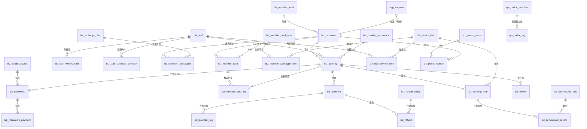
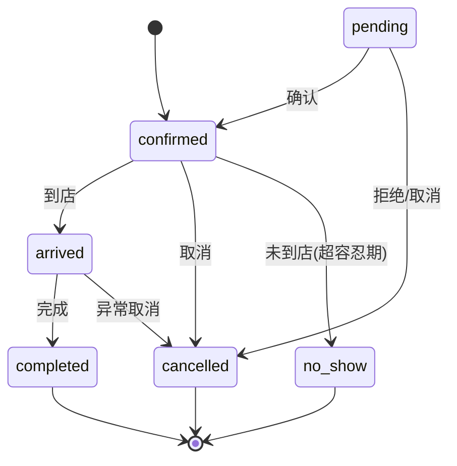
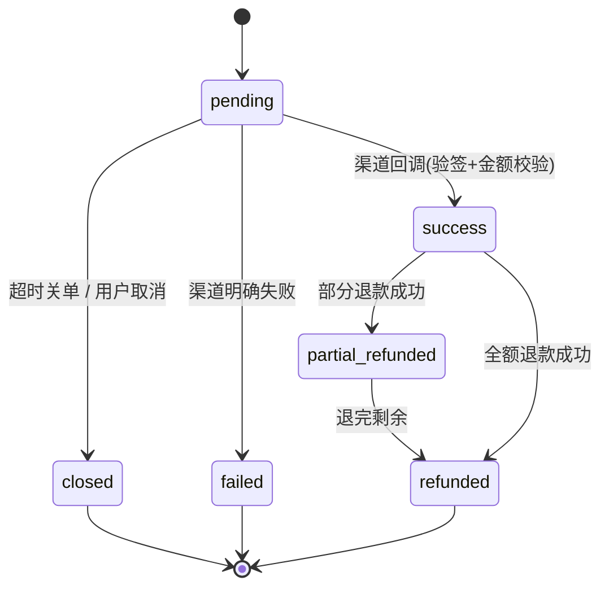

# 美甲店到店预约系统 · 设计方案

> 版本 v1.3 · 2026-09-11 · 状态：**待评审**
>
> **v1.1 修订**：并入一轮基线代码级评审（处置记录见附录 C）。修正 4 处会产生真实 bug 的点——
> cron 表达式、缓冲语义（`end_at` 不再含缓冲）、时区日界转换、`booking_no` 唯一性——并补齐
> 「主数据变更与既有预约的一致性」等设计缺口。§14 待确认项已同步更新。
>
> **v1.2 修订**：**会员体系并入本期实现**（等级 / 积分 / 折扣 / 储值含赠送 / 次卡），新增 8 张表、
> 会员算价与「创建即付全款」流程、账务不变量（§4.4 / §5.7 / §6.5 / §15）；**微信小程序本期只做预留**
> ——落地 `app_` 身份表、独立认证域 `/api/v1/app/**`、登录 + 4 个只读接口真实现，其余写接口只留契约骨架
> （§9.7 / §16）。
>
> **v1.3 修订（大范围扩容）**：除「小程序 UI 工程」（以及依赖它的订阅消息）外，v1.2 的 YAGNI 清单
> **全部转入本期**——新增能力包括：在线支付（微信 Native / 支付宝当面付）、定金与尾款、混合支付、
> 挂账应收月结、积分抵扣与兑换、退款自动判责、储值退款审批、短信与站内通知、美甲师可做项目、
> 评价、报表、提成、周期预约。表从 15 张增至 **32 张**（新表见 §4.5 / §4.6），业务规则见 §17~§22，
> 接口见 §9.8~§9.11。**一次性全量交付**（同一版本内的实施批次见 §2.3），不做分期上线。
> 首期范围：后台管理（服务项目 / 美甲师 / 排班 / 预约 / 会员 / 收银 / 挂账 / 运营）
> 技术基线：NestJS + Fastify + Drizzle ORM(MySQL) + Zod，前端 Vue 3 + lew-ui（沿用 `nest-admin` 基线）

---

## 1. 背景与目标

美甲店需要把「顾客打电话/微信口头约时间」的流程搬到系统里，解决四个具体痛点：

| 痛点                                  | 目标                                                            |
| ------------------------------------- | --------------------------------------------------------------- |
| 靠纸质台账或微信记录，容易漏单、撞单  | 预约单集中管理，**同一美甲师同一时段绝不重叠**                  |
| 不知道哪个美甲师哪个时段空着          | 系统按排班 + 已有预约**自动算出可约时段**                       |
| 说不清美甲师哪天上班                  | 排班可维护：周模板 + 临时请假/加班                              |
| 老顾客信息散落、爽约无记录            | 顾客档案 + **爽约标记**，可查历史                               |
| 回头客没有激励、储值/次卡只能记在纸上 | **会员体系**：等级折扣、积分、储值余额、次卡，账务可审计（§15） |

**首期做店内后台**（店员/店长操作）**+ 会员体系**；**微信小程序本期不开发，但接口契约、认证域、
数据表全部预留到位**（见 §9.7 / §16）。

---

## 2. 范围界定

### 2.1 首期做（C + D + E + F + G + H）

- **C 基础数据**：服务项目、美甲师、排班、顾客档案、**美甲师可做项目配置**（§22）
- **D 预约核心**：可约时段计算、提交预约、冲突检测与防超订、状态流转、后台预约管理、**周期预约**（§21）
- **E 会员体系**：等级与折扣、积分（累计 + **抵扣 + 兑换**）、储值（含充值赠送 + **退款审批**）、
  次卡/套餐卡、会员账务流水（§15）
- **F 收银与账务**：**在线支付（微信 Native / 支付宝当面付）**、现金/线下扫码记账、**定金与尾款**、
  **混合支付**、**挂账应收与月结销账**、退款（**自动判责** + 储值退款审批）、支付对账（§4.5 / §17 / §18）
- **G 运营增强**：**评价**、**报表中心**、**提成规则与结算**（§20）
- **H 通知**：**短信 + 站内消息**（模板可维护、发送日志可查、失败重试，§19）
- **I 小程序预留（本期不开发 UI）**：`app_` 微信身份表、独立认证域 `/api/v1/app/**`、
  登录 + 4 个只读接口真实现、写接口契约骨架（§9.7 / §16）
- 配套：权限点、菜单、数据权限、定时任务、导出

### 2.2 首期明确不做（YAGNI，v1.3 已收缩到三项）

| 不做的事                 | 原因                                                                     |
| ------------------------ | ------------------------------------------------------------------------ |
| 微信小程序 UI 工程       | 本期只预留接口与认证域（§9.7 / §16），UI 与联调后置到 P2                 |
| 订阅消息（微信服务通知） | **客观依赖小程序客户端授权**，没有 UI 就收不到订阅；短信已覆盖提醒场景   |
| 储值余额提现 / 赠送套现  | 预付费资金合规红线（§13 风险）；只做**原路退回实付本金 + 审批**（§15.6） |

> v1.2 里"不做"的其余 9 项（在线支付、定金尾款、混合支付、挂账月结、积分抵扣兑换、退款自动判责、
> 短信通知、美甲师项目配置、评价报表提成、周期预约）**已全部转入本期**，见 §2.1 与 §17~§22。

### 2.3 实施批次（**一次性全量交付**，批次只是开发顺序，不分期上线）

| 批次   | 内容                                                                              | 依赖         |
| ------ | --------------------------------------------------------------------------------- | ------------ |
| **B1** | 预约主链路：基础数据 + 排班 + 可约时段 + 创建/改期/取消 + 冲突与防超订 + 状态流转 | —            |
| **B2** | 会员：等级折扣 → 储值充值 → 次卡 → 账务流水与页面                                 | B1           |
| **B3** | 收银：支付单/回调/对账 + 定金尾款 + 混合支付 + 退款（判责 + 审批）                | B1、B2       |
| **B4** | 挂账应收月结 + 报表中心 + 提成                                                    | B3           |
| **B5** | 运营：评价 + 积分抵扣与兑换 + 周期预约 + 美甲师项目配置 + 通知（短信/站内）       | B1~B4        |
| **B6** | 小程序预留：`app_` 表 + 认证域 + 4 个只读接口 + 写接口契约                        | B1（可并行） |

> 交付节奏是**一次性全量**：B1~B6 全部完成、通过 §12 的全部验收后一起上线。
> 之所以仍给批次，是为了让开发有稳定依赖顺序（尤其 B3 必须在 B1/B2 的表与算价逻辑定型之后），
> 以及让测试能按批次组织集成用例。

---

## 3. 术语与约定

| 术语                | 含义                                                                       |
| ------------------- | -------------------------------------------------------------------------- |
| **服务项目**        | 顾客要做的美甲服务，如「基础美甲 60 分钟」「延长甲 120 分钟」              |
| **美甲师**          | 提供服务的员工，是**被占用的资源**（同一时段只能服务一人）                 |
| **班次**            | 美甲师某天的一段可工作时间，如 10:00–12:00                                 |
| **缓冲**            | 两个预约之间预留的清洁/准备时间                                            |
| **可约时段**        | 由「班次 − 已有预约 − 缓冲」算出、可供顾客选择的候选开始时间               |
| **爽约（no-show）** | 顾客已确认但未到店                                                         |
| **会员**            | 已建档并纳入等级体系的顾客（**顾客即会员**，不另建实体，§15.1）            |
| **等级折扣率**      | 会员等级带的折扣，存**千分比**整数：`1000` = 不打折，`950` = 9.5 折        |
| **储值余额**        | 预充值余额，拆「本金 `balance_principal`」与「赠送 `balance_bonus`」两部分 |
| **次卡 / 套餐卡**   | 预付费次数卡（如「10 次基础美甲」），按次核销，可含多个适用项目            |
| **核销**            | 用次卡抵扣一次服务，写核销记录，不叠加等级折扣                             |
| **预付**            | 创建预约时收钱；**可选「全款 / 定金」**，只交定金时产生**尾款**（§17.2）   |
| **支付单**          | 一次实际收付动作；一笔预约可有多张（即**混合支付**），§4.5                 |
| **退款单**          | 一次退款；金额可由**自动判责规则**算出，或走**审批**（§17.4）              |
| **挂账 / 应收**     | 先做后付：产生应收单，按期**销账**（§18）                                  |
| **积分抵扣 / 兑换** | 结算时用积分抵现（有比例与上限）；或用积分换项目 / 次卡（§15.3）           |
| **周期预约**        | 「每周三 15:00」这类循环规则，按规则批量生成预约单（§21）                  |
| **提成**            | 按美甲师 / 项目 / 分类配置比例或固定额，服务完成后计提（§20.3）            |
| **冲正**            | 对已发生的账务写一笔反向流水修正，**保留原记录**，不做物理修改或删除       |

**沿用基线的既有约定**（必须遵守）：

- 表名 `snake_case`，业务表统一 `biz_` 前缀；**小程序侧身份表用 `app_` 前缀**（与 `sys_` / `biz_` 分域，
  见 §4.4），Drizzle 变量 `camelCase`
- **金额一律用整数「分」**，展示层除以 100；取整方向统一向下（对顾客有利），见 §5.7
- 所有业务表套用 `auditColumns`（`createdAt` / `updatedAt` / `deletedAt` / `createdBy` / `updatedBy`），软删除
- 权限点冒号分隔：`biz:<资源>:<操作>`
- 导入路径必须带 `.js` 后缀（`moduleResolution: NodeNext`）
- 列表接口返回 `{ items, page, pageSize }`（**无 total**，前端多取一条判断 `hasMore`）
- **时间一律 UTC 存储**：连接会话固定 `SET time_zone = '+00:00'`、mysql2 `timezone: 'Z'`（见
  `src/database/database.service.ts`），前端统一按 `Asia/Shanghai` 展示。
  **「店内本地日 → 绝对时刻区间」的转换必须走统一帮助函数 `shopDayRange(date)`**
  （返回 `[当日 00:00+08:00, 次日 00:00+08:00)` 的 UTC 时刻）；业务代码里**禁止**直接写
  `new Date('YYYY-MM-DD')`——JS 会按 UTC 零点解析，导致整体偏 8 小时。
- **权限点各段全小写、不用驼峰**（沿用既有 `monitor:loginlog:list` / `monitor:operlog:list` 的风格）
- **软删豁免（显式声明）**：`biz_staff_weekly_shift` 的 PUT 整体替换、`biz_staff_schedule_override`
  的 DELETE 是**物理删**（配置型数据、无独立保留价值）；`biz_booking_item` 作为从属子表也不套
  `auditColumns`（见 §4.3）。其余业务表一律软删。

---

## 4. 数据模型

### 4.1 表清单（32 张）

**A. 预约主链路（7 张，§4.3）**

| 表                            | 职责                                    |
| ----------------------------- | --------------------------------------- |
| `biz_service_item`            | 服务项目（含时长、价格、缓冲）          |
| `biz_staff`                   | 美甲师档案                              |
| `biz_staff_weekly_shift`      | 周模板班次（美甲师 × 星期，一天可多段） |
| `biz_staff_schedule_override` | 日期例外（请假 / 临时加班 / 调班）      |
| `biz_customer`                | 顾客档案（**兼会员档案**，见 §4.4）     |
| `biz_booking`                 | 预约单（金额 / 支付 / 应收 / 周期来源） |
| `biz_booking_item`            | 预约项目明细（支持一次做多个项目）      |

**B. 会员体系（7 张，§4.4）**

| 表                          | 职责                                              |
| --------------------------- | ------------------------------------------------- |
| `biz_member_level`          | 会员等级（折扣率 + 升级门槛）                     |
| `biz_recharge_plan`         | 充值方案（实付 / 赠送）                           |
| `biz_member_card_type`      | 次卡卡种（项目组合、次数、价格、有效期）          |
| `biz_member_card_type_item` | 卡种适用项目（子表，支持套餐卡）                  |
| `biz_member_card`           | 会员卡实例（次数、有效期、状态）                  |
| `biz_member_card_log`       | 次卡核销 / 撤销记录（只追加）                     |
| `biz_member_transaction`    | 会员账务流水（储值 / 积分 / 消费 / 冲正，只追加） |

**C. 支付与账务（8 张，§4.5）**

| 表                       | 职责                                                            |
| ------------------------ | --------------------------------------------------------------- |
| `biz_payment`            | 支付单：一次收付动作（定金 / 尾款 / 全款 / 购卡 / 充值 / 销账） |
| `biz_payment_log`        | 支付过程日志（下单、回调、查询、关单，只追加，用于排障与举证）  |
| `biz_payment_diff`       | 渠道对账差异（下载账单逐笔比对的结果与处理状态）                |
| `biz_refund`             | 退款单（原路退回 / 现金退款 / 退入储值，含审批状态）            |
| `biz_refund_policy`      | 退款判责规则（提前 X 小时 → 退 Y‰）                             |
| `biz_credit_account`     | 挂账主体（顾客 / 公司 / 员工）与额度、账期                      |
| `biz_receivable`         | 应收单（挂账产生，含到期日与已销金额）                          |
| `biz_receivable_payment` | 销账记录（一笔应收可多次还款）                                  |

**D. 运营与配置（9 张，§4.6）**

| 表                       | 职责                                                         |
| ------------------------ | ------------------------------------------------------------ |
| `biz_staff_service_item` | 美甲师可做项目（差异化配置，影响可约时段与下单校验）         |
| `biz_review`             | 服务评价（评分 / 内容 / 图片 / 公开 / 回复）                 |
| `biz_commission_rule`    | 提成规则（按美甲师 / 项目 / 分类，比例或固定额）             |
| `biz_commission_record`  | 提成计提记录（按预约项目产生，可结算 / 冲销）                |
| `biz_booking_recurrence` | 周期预约规则（每 N 周的星期几 + 时间 + 生效区间）            |
| `biz_points_goods`       | 积分兑换品（换项目 / 换次卡）                                |
| `biz_points_redeem`      | 积分兑换记录（扣积分 + 发放结果）                            |
| `sys_notice_template`    | 通知模板（短信 / 站内，含变量定义）                          |
| `sys_notice_log`         | 通知发送日志（收件人、渠道、内容、状态、供应商消息号、错误） |

**E. 小程序预留（1 张，§4.4）**

| 表            | 职责                                                       |
| ------------- | ---------------------------------------------------------- |
| `app_wx_user` | 微信身份（openid / unionid）与顾客档案的绑定，小程序侧入口 |

### 4.2 ER 关系



### 4.3 表结构详情

#### `biz_service_item` 服务项目

| 字段               | 类型                                          | 说明                                 |
| ------------------ | --------------------------------------------- | ------------------------------------ |
| `id`               | int unsigned PK                               | 自增                                 |
| `name`             | varchar(50) NOT NULL                          | 项目名，如「基础美甲」               |
| `category`         | varchar(30) NULL                              | 分类：基础 / 延长 / 彩绘 / 护理      |
| `duration_minutes` | int unsigned NOT NULL                         | **标准时长（分钟）**，决定占用时段   |
| `buffer_minutes`   | int unsigned DEFAULT 0                        | 缓冲时长，参与冲突计算               |
| `price`            | int unsigned DEFAULT 0                        | 价格，**单位「分」**（避免浮点误差） |
| `description`      | varchar(500) NULL                             | 说明                                 |
| `image`            | varchar(500) NULL                             | 展示图（为小程序预留）               |
| `status`           | enum(active/disabled) DEFAULT active NOT NULL | 停用后不可被预约                     |
| `sort`             | int DEFAULT 0 NOT NULL                        | 排序                                 |
| `remark`           | varchar(500) NULL                             | 备注                                 |
| —                  |                                               | `...auditColumns`                    |

索引：`idx_service_item_status` on `(status, sort)`

> **价格为什么用「分」**：整数运算无精度问题，展示层除以 100。用 `decimal` 或浮点会在统计求和时出偏差。

#### `biz_staff` 美甲师

| 字段       | 类型                                          | 说明                                                 |
| ---------- | --------------------------------------------- | ---------------------------------------------------- |
| `id`       | int unsigned PK                               |                                                      |
| `user_id`  | int unsigned NULL                             | **可选**关联 `sys_user.id`（美甲师本人是否登录后台） |
| `nickname` | varchar(50) NOT NULL                          | 昵称 / 艺名                                          |
| `avatar`   | varchar(500) NULL                             | 头像                                                 |
| `phone`    | varchar(20) NULL                              | 联系电话                                             |
| `bio`      | varchar(500) NULL                             | 简介 / 擅长                                          |
| `status`   | enum(active/disabled) DEFAULT active NOT NULL | 停用后不再出现在可约列表                             |
| `sort`     | int DEFAULT 0 NOT NULL                        |                                                      |
| `remark`   | varchar(500) NULL                             |                                                      |
| —          |                                               | `...auditColumns`                                    |

索引：`idx_staff_user` on `(user_id)`；外键 `user_id → sys_user.id` `ON DELETE SET NULL`

> **为什么不直接复用 `sys_user`**：美甲师未必有后台账号（店里可能只有店长登录）。用可空的 `user_id` 让「是否给登录账号」变成可选，两种情形共用一张档案表。

#### `biz_staff_weekly_shift` 周模板班次

| 字段         | 类型                  | 说明                            |
| ------------ | --------------------- | ------------------------------- |
| `id`         | int unsigned PK       |                                 |
| `staff_id`   | int unsigned NOT NULL | → `biz_staff.id`                |
| `weekday`    | tinyint NOT NULL      | **1=周一 … 7=周日**（ISO 8601） |
| `start_time` | time NOT NULL         | 如 `10:00:00`                   |
| `end_time`   | time NOT NULL         | 如 `12:00:00`                   |
| —            |                       | `...auditColumns`               |

索引：`idx_shift_staff_weekday` on `(staff_id, weekday)`
外键：`fk_shift_staff` `staff_id → biz_staff.id` `ON DELETE CASCADE`
（**物理删表**：PUT 整体替换时先删后插，见 §3 软删豁免）

> **一天多段**：同一 `staff_id + weekday` 存在多行即为多段（如 10:00–12:00 与 13:00–20:00 中间午休）。应用层校验同一天各段**不重叠**。
> **为什么用 `time` 而非 `datetime`**：周模板表达的是「每天的这个区间」，与具体日期无关。

#### `biz_staff_schedule_override` 日期例外

| 字段         | 类型                      | 说明                                |
| ------------ | ------------------------- | ----------------------------------- |
| `id`         | int unsigned PK           |                                     |
| `staff_id`   | int unsigned NOT NULL     | → `biz_staff.id`                    |
| `date`       | date NOT NULL             | 生效日期                            |
| `type`       | enum(off/custom) NOT NULL | `off`=整天休息；`custom`=自定义时段 |
| `start_time` | time NULL                 | `type=custom` 时必填                |
| `end_time`   | time NULL                 | `type=custom` 时必填                |
| `reason`     | varchar(200) NULL         | 请假原因，如「调休」                |
| —            |                           | `...auditColumns`                   |

索引：`idx_override_staff_date` on `(staff_id, date)`
外键：`fk_override_staff` `staff_id → biz_staff.id` `ON DELETE CASCADE`
（**物理删表**，见 §3 软删豁免）

应用层校验：`start_time < end_time`；同一天同一美甲师的多个 `custom` 段之间**不重叠**；
`type='off'` 时 `start_time` / `end_time` 必须为空（避免出现「既请假又上班」的脏数据）。

**求值优先级（重要）**：

```
若当天存在 type='off' 的记录        → 当天不可约（忽略周模板）
否则若当天存在 type='custom' 的记录 → 用这些段替代周模板
否则                                → 用周模板中该 weekday 的段
```

> 不加唯一约束，因为 `custom` 允许一天多段。

#### `biz_customer` 顾客档案

| 字段                | 类型                                               | 说明                                       |
| ------------------- | -------------------------------------------------- | ------------------------------------------ |
| `id`                | int unsigned PK                                    |                                            |
| `name`              | varchar(50) NOT NULL                               | 姓名 / 称呼                                |
| `phone`             | varchar(20) NULL                                   | 手机号                                     |
| `gender`            | enum(unknown/male/female) DEFAULT unknown NOT NULL |                                            |
| `birthday`          | date NULL                                          | 生日（将来做生日关怀）                     |
| `remark`            | varchar(500) NULL                                  | 备注，如「偏好裸色系」「孕妇」             |
| `visit_count`       | int unsigned DEFAULT 0 NOT NULL                    | 到店次数（冗余统计）                       |
| `last_visit_at`     | datetime NULL                                      | 最近到店时间                               |
| `level_id`          | int unsigned NULL                                  | → `biz_member_level.id`，**NULL = 非会员** |
| `member_no`         | varchar(32) NULL                                   | 会员号（可空，唯一）                       |
| `member_since`      | datetime NULL                                      | 入会时间（首次充值 / 发卡 / 手工开卡）     |
| `total_spent`       | int unsigned DEFAULT 0 NOT NULL                    | **累计实付消费（分）**，决定等级，退款冲减 |
| `points`            | int unsigned DEFAULT 0 NOT NULL                    | 积分余额                                   |
| `points_total`      | int unsigned DEFAULT 0 NOT NULL                    | 累计获得积分（只增，用于展示）             |
| `balance_principal` | int unsigned DEFAULT 0 NOT NULL                    | 储值**本金**余额（分）                     |
| `balance_bonus`     | int unsigned DEFAULT 0 NOT NULL                    | 储值**赠送**余额（分，不可退）             |
| —                   |                                                    | `...auditColumns`                          |

索引：`uq_customer_phone` **UNIQUE** on `(phone)`；`uq_customer_member_no` **UNIQUE** on `(member_no)`；
`idx_customer_level` on `(level_id)`

> MySQL 的 UNIQUE 允许多个 `NULL`，因此「无手机号的散客」可以有多个，不会冲突。
> **但软删的行仍然占着手机号**：查重时必须**不过滤** `deletedAt`（与 `UsersService.create` 校验
> `username` 的既有写法一致）；命中软删记录时提示「该手机号属于已删除顾客 #id，是否恢复？」，否则
> 删掉一个顾客就永远建不回同号，最后撞 1062。注意**不能**用 `(phone, deleted_at)` 组合唯一索引绕开
> ——MySQL 把多个 NULL 视为互不相同，那样等于没有约束。
> `visit_count` / `last_visit_at` 是冗余统计，在预约完成时增量更新；提供 `POST /biz/customers/:id/recount` 供对账修复。
> `level_id` 以下的会员字段**全部由账务流水驱动**（§15.7 不变量），禁止手工 UPDATE；`member_no` 生成方式
> 同 `booking_no`（主键回填，如 `M{yyyyMMdd}{id}`）。

#### `biz_booking` 预约单

| 字段                      | 类型                                                                                   | 说明                                                                             |
| ------------------------- | -------------------------------------------------------------------------------------- | -------------------------------------------------------------------------------- |
| `id`                      | int unsigned PK                                                                        |                                                                                  |
| `booking_no`              | varchar(32) NOT NULL                                                                   | 单号，如 `B20260911-0007`，便于口头沟通                                          |
| `customer_id`             | int unsigned NOT NULL                                                                  | → `biz_customer.id`                                                              |
| `staff_id`                | int unsigned NOT NULL                                                                  | → `biz_staff.id`                                                                 |
| `start_at`                | datetime NOT NULL                                                                      | **开始时间**                                                                     |
| `end_at`                  | datetime NOT NULL                                                                      | **服务结束时间（不含缓冲）** = `start_at + duration_minutes`                     |
| `duration_minutes`        | int unsigned NOT NULL                                                                  | 项目总时长快照（不含缓冲）                                                       |
| `buffer_minutes`          | int unsigned DEFAULT 0 NOT NULL                                                        | 缓冲快照 = 各项目缓冲的**最大值**，参与冲突判定（§5.3）                          |
| `original_price`          | int unsigned DEFAULT 0 NOT NULL                                                        | **原价快照（分）** = Σ `biz_booking_item.price`                                  |
| `level_discount_permille` | int unsigned DEFAULT 1000 NOT NULL                                                     | 等级折扣率快照（千分比，1000 = 无折扣，§5.7）                                    |
| `level_discount_amount`   | int unsigned DEFAULT 0 NOT NULL                                                        | 等级优惠金额（分）                                                               |
| `points_discount_amount`  | int unsigned DEFAULT 0 NOT NULL                                                        | **积分抵扣金额（分）**，上限见 §15.3                                             |
| `adjust_amount`           | int DEFAULT 0 NOT NULL                                                                 | 手动改价差额（分，可正可负），需 `biz:booking:adjust` + 原因                     |
| `adjust_reason`           | varchar(200) NULL                                                                      | 改价原因                                                                         |
| `payable_amount`          | int unsigned DEFAULT 0 NOT NULL                                                        | **应付金额（分）** = 原价 − 等级优惠 − 积分抵扣 + 改价                           |
| `deposit_amount`          | int unsigned DEFAULT 0 NOT NULL                                                        | **下单应收金额**：选「全款」时 = `payable_amount`；选「定金」时为定金值（§17.2） |
| `paid_amount`             | int unsigned DEFAULT 0 NOT NULL                                                        | 已收金额（分，由支付单驱动，冗余用于列表）                                       |
| `due_amount`              | int unsigned DEFAULT 0 NOT NULL                                                        | **尾款** = `payable_amount − paid_amount`（只收定金时 > 0）                      |
| `pay_status`              | enum(unpaid/partial/paid/refunded/credit) DEFAULT unpaid NOT NULL                      | 资金状态（§7.4）；**收款/退款动作的幂等闸门**                                    |
| `pay_channel_summary`     | varchar(64) NULL                                                                       | 已收渠道汇总（如 `cash,balance`，混合支付由支付单重算）                          |
| `settled_at`              | datetime NULL                                                                          | 结清（尾款收齐）时间                                                             |
| `credit_account_id`       | int unsigned NULL                                                                      | 挂账主体 → `biz_credit_account.id`（NULL = 非挂账，§18）                         |
| `recurrence_id`           | int unsigned NULL                                                                      | 周期预约来源 → `biz_booking_recurrence.id`（§21）                                |
| `member_card_id`          | int unsigned NULL                                                                      | 次卡核销时记录所用卡 → `biz_member_card.id`                                      |
| `refund_amount`           | int unsigned DEFAULT 0 NOT NULL                                                        | 已退款金额（分，累加）                                                           |
| `refunded_at`             | datetime NULL                                                                          | 最近一次退款时间                                                                 |
| `status`                  | enum(pending/confirmed/arrived/completed/cancelled/no_show) DEFAULT confirmed NOT NULL | 见 §7                                                                            |
| `channel`                 | enum(admin/miniapp) DEFAULT admin NOT NULL                                             | 来源，为小程序预留                                                               |
| `customer_name`           | varchar(50) NOT NULL                                                                   | **快照**，防顾客改名影响历史                                                     |
| `customer_phone`          | varchar(20) NULL                                                                       | **快照**                                                                         |
| `remark`                  | varchar(500) NULL                                                                      | 顾客需求备注                                                                     |
| `cancel_reason`           | varchar(200) NULL                                                                      | 取消 / 爽约原因                                                                  |
| `confirmed_at`            | datetime NULL                                                                          | 状态时间戳                                                                       |
| `arrived_at`              | datetime NULL                                                                          |                                                                                  |
| `finished_at`             | datetime NULL                                                                          |                                                                                  |
| `cancelled_at`            | datetime NULL                                                                          |                                                                                  |
| —                         |                                                                                        | `createdBy` / `updatedBy` + `...auditColumns`                                    |

**索引（关键）**：

| 索引名                     | 列                                | 用途                               |
| -------------------------- | --------------------------------- | ---------------------------------- |
| `idx_booking_staff_time`   | `(staff_id, start_at, end_at)`    | **冲突检测核心索引**，缺失会全表扫 |
| `uq_booking_no`            | `(booking_no)` **UNIQUE**         | 单号唯一，防并发重号               |
| `idx_booking_customer`     | `(customer_id, start_at)`         | 顾客历史预约                       |
| `idx_booking_status_start` | `(status, start_at)`              | 列表筛选 + 定时任务扫描            |
| `idx_booking_pay`          | `(pay_status, start_at)`          | **待收尾款 / 挂账筛查**            |
| `idx_booking_credit`       | `(credit_account_id, pay_status)` | 挂账台账与月结                     |
| `idx_booking_recurrence`   | `(recurrence_id)`                 | 周期预约生成结果追溯与回滚         |

外键：`customer_id → biz_customer.id` `ON DELETE RESTRICT`；`staff_id → biz_staff.id` `ON DELETE RESTRICT`；
`credit_account_id → biz_credit_account.id` `ON DELETE RESTRICT`；
`recurrence_id → biz_booking_recurrence.id` `ON DELETE SET NULL`

> **快照字段的价值**：顾客改手机号、项目调价、会员等级变化之后，历史单据必须还原成「当时的样子」。这也是价格独立存 `original_price` / `level_discount_permille` 而非 join 计算的原因。

> **`end_at` 为什么不含缓冲**：占用区间的尾随缓冲极易被重复计入，而且会让「候选在旧单之前/之后」的
> 结论不对称（详见 §5.3）。判据统一为 `gap = max(本单缓冲, 对方缓冲)`，因此缓冲必须随单快照到
> `buffer_minutes`，**不能**临时 join 项目表——项目缓冲改了，历史单据的占用区间会跟着漂移。

> **`booking_no` 必须唯一**：`uq_booking_no` 不是可选项。日序（`B20260911-0007`）不能靠「查当日最大号
> +1」实现——§6 的锁只串行化了**同一美甲师**，两位美甲师并发录单必然重号（且不报错）。首期直接用主键：
> 事务内 INSERT 拿到 `insertId` 后回填 `booking_no = 'B' + yyyyMMdd + id`（如 `B2026091100042`），
> 一句话、天然唯一；若坚持短日序，需要额外的序列表并在事务内 `FOR UPDATE`。

#### `biz_booking_item` 预约项目明细

| 字段               | 类型                            | 说明                    |
| ------------------ | ------------------------------- | ----------------------- |
| `id`               | int unsigned PK                 |                         |
| `booking_id`       | int unsigned NOT NULL           | → `biz_booking.id`      |
| `service_item_id`  | int unsigned NOT NULL           | → `biz_service_item.id` |
| `name`             | varchar(50) NOT NULL            | 快照                    |
| `duration_minutes` | int unsigned NOT NULL           | 快照                    |
| `price`            | int unsigned DEFAULT 0 NOT NULL | 快照                    |
| `sort`             | int DEFAULT 0 NOT NULL          | 展示顺序                |

索引：`idx_booking_item_booking` on `(booking_id)`
外键：`fk_booking_item_booking` `booking_id → biz_booking.id` `ON DELETE CASCADE`；
`fk_booking_item_service` `service_item_id → biz_service_item.id` `ON DELETE RESTRICT`

> 子表**不套** `auditColumns`：随主单生命周期，没有独立审计价值（§3 已声明豁免）。

> 首期 UI 允许选 1–N 个项目（默认 1 个）；`biz_booking.end_at - start_at` = 项目时长之和（**不含缓冲**），
> 判定占用区间时还要按 §5.3 加上 `gap`。
> 用子表而非 JSON 字段，是为了将来能直接统计「哪个项目最受欢迎」。

### 4.4 会员体系与小程序身份表结构

> 业务规则（等级怎么升、积分怎么算、储值怎么扣、次卡怎么核销）见 **§15**；金额算价见 **§5.7**；
> 并发与账务不变量见 **§6.5** 与 **§15.7**。

#### `biz_member_level` 会员等级

| 字段                | 类型                                          | 说明                                                        |
| ------------------- | --------------------------------------------- | ----------------------------------------------------------- |
| `id`                | int unsigned PK                               |                                                             |
| `name`              | varchar(30) NOT NULL                          | 等级名，如「银卡 / 金卡」                                   |
| `discount_permille` | int unsigned DEFAULT 1000 NOT NULL            | **折扣率千分比**：1000 = 不打折，950 = 9.5 折，880 = 8.8 折 |
| `upgrade_amount`    | int unsigned DEFAULT 0 NOT NULL               | 升级门槛：`total_spent` 达到即自动升级（分）                |
| `sort`              | int DEFAULT 0 NOT NULL                        | 等级由低到高                                                |
| `status`            | enum(active/disabled) DEFAULT active NOT NULL | 停用后不参与自动升级（已在该等级的会员保留）                |
| `remark`            | varchar(200) NULL                             |                                                             |
| —                   |                                               | `...auditColumns`                                           |

索引：`uq_level_name` **UNIQUE** on `(name)`；`idx_level_status_sort` on `(status, sort)`

> `upgrade_amount` 必须随 `sort` 单调不减，保存时校验（否则自动升级结果取决于遍历顺序）。

#### `biz_recharge_plan` 充值方案

| 字段           | 类型                                          | 说明                               |
| -------------- | --------------------------------------------- | ---------------------------------- |
| `id`           | int unsigned PK                               |                                    |
| `name`         | varchar(30) NOT NULL                          | 如「充 1000 送 100」               |
| `pay_amount`   | int unsigned NOT NULL                         | 顾客实付金额（分）                 |
| `bonus_amount` | int unsigned DEFAULT 0 NOT NULL               | 赠送金额（分，进 `balance_bonus`） |
| `status`       | enum(active/disabled) DEFAULT active NOT NULL |                                    |
| `sort`         | int DEFAULT 0 NOT NULL                        |                                    |
| `remark`       | varchar(200) NULL                             |                                    |
| —              |                                               | `...auditColumns`                  |

索引：`uq_recharge_plan_name` **UNIQUE** on `(name)`

> 充值也可以**自定义金额**（不走方案，`bonus_amount = 0`）；赠送比例做上限校验
> （`biz.member.maxBonusPermille`，默认 200‰ = 最多送 20%），防手滑多打一个 0。

#### `biz_member_card_type` 次卡卡种

| 字段          | 类型                                          | 说明                                                              |
| ------------- | --------------------------------------------- | ----------------------------------------------------------------- |
| `id`          | int unsigned PK                               |                                                                   |
| `name`        | varchar(50) NOT NULL                          | 如「10 次基础美甲卡」                                             |
| `price`       | int unsigned NOT NULL                         | 售价（分），发卡时可改价                                          |
| `total_times` | int unsigned NOT NULL                         | 总次数                                                            |
| `valid_days`  | int unsigned DEFAULT 0 NOT NULL               | 有效期天数，**0 = 永久**；`expire_at = purchased_at + valid_days` |
| `status`      | enum(active/disabled) DEFAULT active NOT NULL | 停用后不可再发卡                                                  |
| `sort`        | int DEFAULT 0 NOT NULL                        |                                                                   |
| `remark`      | varchar(200) NULL                             |                                                                   |
| —             |                                               | `...auditColumns`                                                 |

索引：`uq_card_type_name` **UNIQUE** on `(name)`；`idx_card_type_status_sort` on `(status, sort)`

#### `biz_member_card_type_item` 卡种适用项目

| 字段              | 类型                   | 说明                        |
| ----------------- | ---------------------- | --------------------------- |
| `id`              | int unsigned PK        |                             |
| `card_type_id`    | int unsigned NOT NULL  | → `biz_member_card_type.id` |
| `service_item_id` | int unsigned NOT NULL  | → `biz_service_item.id`     |
| `sort`            | int DEFAULT 0 NOT NULL |                             |

索引：`uq_card_type_item` **UNIQUE** on `(card_type_id, service_item_id)`
外键：`fk_card_type_item_type` `card_type_id → biz_member_card_type.id` `ON DELETE CASCADE`；
`fk_card_type_item_service` `service_item_id → biz_service_item.id` `ON DELETE RESTRICT`
（**物理删表**：随卡种整体替换，见 §3 软删豁免）

> 一个卡种至少 1 个适用项目；套餐卡可挂多个（核销时记录实际做的项目）。
> 用子表而非 JSON，理由同 §4.3 的 `biz_booking_item`：便于校验与统计。

#### `biz_member_card` 会员卡实例

| 字段           | 类型                                                          | 说明                                              |
| -------------- | ------------------------------------------------------------- | ------------------------------------------------- |
| `id`           | int unsigned PK                                               |                                                   |
| `card_no`      | varchar(32) NOT NULL                                          | 卡号，`C{yyyyMMdd}{id}`（同 `booking_no` 生成法） |
| `customer_id`  | int unsigned NOT NULL                                         | → `biz_customer.id`                               |
| `card_type_id` | int unsigned NOT NULL                                         | → `biz_member_card_type.id`                       |
| `card_name`    | varchar(50) NOT NULL                                          | **快照**                                          |
| `total_times`  | int unsigned NOT NULL                                         | **快照**                                          |
| `used_times`   | int unsigned DEFAULT 0 NOT NULL                               | 已核销次数                                        |
| `price`        | int unsigned DEFAULT 0 NOT NULL                               | 购卡价快照（分）                                  |
| `pay_channel`  | enum(cash/wechat/alipay/balance) NOT NULL                     | 购卡支付方式（不允许再用次卡买卡）                |
| `purchased_at` | datetime NOT NULL                                             | 购买时间（有效期起点）                            |
| `expire_at`    | datetime NULL                                                 | NULL = 永久                                       |
| `status`       | enum(active/used_up/expired/refunded) DEFAULT active NOT NULL |                                                   |
| `remark`       | varchar(200) NULL                                             |                                                   |
| —              |                                                               | `...auditColumns`                                 |

索引：`uq_member_card_no` **UNIQUE** on `(card_no)`；`idx_card_customer` on `(customer_id, status)`；
`idx_card_expire` on `(status, expire_at)`
外键：`fk_card_customer` `customer_id → biz_customer.id` `ON DELETE RESTRICT`；
`fk_card_type` `card_type_id → biz_member_card_type.id` `ON DELETE RESTRICT`

#### `biz_member_card_log` 次卡核销记录（只追加）

| 字段              | 类型                            | 说明                                   |
| ----------------- | ------------------------------- | -------------------------------------- |
| `id`              | int unsigned PK                 |                                        |
| `card_id`         | int unsigned NOT NULL           | → `biz_member_card.id`                 |
| `booking_id`      | int unsigned NULL               | → `biz_booking.id`（手工核销可为空）   |
| `service_item_id` | int unsigned NOT NULL           | 实际核销的项目（快照语义，见下）       |
| `type`            | enum(use/revert) NOT NULL       | `revert` = 撤销核销                    |
| `times`           | int unsigned DEFAULT 1 NOT NULL | 本次变动次数（`revert` 时按正数回补）  |
| `operator_id`     | int unsigned NULL               | 操作人（`createdBy`）                  |
| `created_at`      | timestamp                       | 只追加，无 `updated_at` / `deleted_at` |

索引：`idx_card_log_card` on `(card_id, id)`；`idx_card_log_booking` on `(booking_id)`
外键：`fk_card_log_card` `card_id → biz_member_card.id` `ON DELETE CASCADE`；
`fk_card_log_booking` `booking_id → biz_booking.id` `ON DELETE SET NULL`

#### `biz_member_transaction` 会员账务流水（只追加，**不可修改删除**）

| 字段                        | 类型                                                                                                                            | 说明                                                       |
| --------------------------- | ------------------------------------------------------------------------------------------------------------------------------- | ---------------------------------------------------------- |
| `id`                        | int unsigned PK                                                                                                                 |                                                            |
| `customer_id`               | int unsigned NOT NULL                                                                                                           | → `biz_customer.id`                                        |
| `type`                      | enum(recharge/consume/refund/card_buy/card_use/card_revert/points_earn/points_spend/points_redeem/level_change/adjust) NOT NULL | 流水类型                                                   |
| `amount`                    | int DEFAULT 0 NOT NULL                                                                                                          | **业务金额**（分）：消费为正、退款为负、充值 = 实付 + 赠送 |
| `balance_delta_principal`   | int DEFAULT 0 NOT NULL                                                                                                          | 本金余额变动（分，负 = 扣减）                              |
| `balance_delta_bonus`       | int DEFAULT 0 NOT NULL                                                                                                          | 赠送余额变动（分）                                         |
| `balance_principal_after`   | int unsigned DEFAULT 0 NOT NULL                                                                                                 | 变动后本金余额快照                                         |
| `balance_bonus_after`       | int unsigned DEFAULT 0 NOT NULL                                                                                                 | 变动后赠送余额快照                                         |
| `points_delta`              | int DEFAULT 0 NOT NULL                                                                                                          | 积分变动                                                   |
| `points_after`              | int unsigned DEFAULT 0 NOT NULL                                                                                                 | 变动后积分余额                                             |
| `pay_channel`               | enum(cash/wechat/alipay/balance/card) NULL                                                                                      | 该笔的收付方式                                             |
| `booking_id`                | int unsigned NULL                                                                                                               | → `biz_booking.id`                                         |
| `card_id`                   | int unsigned NULL                                                                                                               | → `biz_member_card.id`                                     |
| `plan_id`                   | int unsigned NULL                                                                                                               | → `biz_recharge_plan.id`                                   |
| `reversal_of`               | int unsigned NULL                                                                                                               | → 本表 `id`，指向被冲正的原流水                            |
| `remark`                    | varchar(200) NULL                                                                                                               | 冲正原因 / 备注                                            |
| `created_by` / `created_at` |                                                                                                                                 | 只追加，无 `updated_at` / `deleted_at`                     |

索引：`idx_txn_customer` on `(customer_id, id)`；`idx_txn_booking` on `(booking_id)`；
`idx_txn_type_created` on `(type, created_at)`

> **对账口径**：`SUM(balance_delta_principal) = biz_customer.balance_principal`，
> `SUM(balance_delta_bonus) = balance_bonus`，`SUM(points_delta) = points`。
> 任何不一致都视为 bug，由 `POST /biz/members/:id/recount` 修复而不是手改余额。

#### `app_wx_user` 微信身份（小程序侧，`app_` 域）

| 字段                 | 类型                                                     | 说明                                                                                             |
| -------------------- | -------------------------------------------------------- | ------------------------------------------------------------------------------------------------ |
| `id`                 | int unsigned PK                                          |                                                                                                  |
| `openid`             | varchar(64) NOT NULL                                     | 小程序内唯一标识                                                                                 |
| `unionid`            | varchar(64) NULL                                         | 开放平台打通后可用（同主体多小程序/公众号唯一）                                                  |
| `customer_id`        | int unsigned NULL                                        | → `biz_customer.id`，**授权手机号后绑定**；NULL = 仅浏览                                         |
| `staff_id`           | int unsigned NULL                                        | → `biz_staff.id`，**美甲师工作台**身份（v1.4 新增）                                              |
| `staff_status`       | enum(`none,pending,active,rejected`) DEFAULT `none`      | 工作台授权状态；**只有 `active` 能进工作台**（v1.4 新增）                                        |
| `staff_requested_at` | datetime NULL                                            | 手机号命中美甲师档案、提交开通申请的时间（v1.4 新增）                                            |
| `staff_decided_at`   | datetime NULL                                            | 店长确认 / 驳回时间（v1.4 新增）                                                                 |
| `staff_decided_by`   | int unsigned NULL                                        | 决策人 `sys_user.id`，用于追溯是谁开的权（v1.4 新增）                                            |
| `nickname`           | varchar(50) NULL                                         | 微信昵称（授权时快照）                                                                           |
| `avatar`             | varchar(500) NULL                                        | 微信头像                                                                                         |
| `phone`              | varchar(20) NULL                                         | 微信授权手机号快照                                                                               |
| `last_login_at`      | datetime NULL                                            | 最近登录                                                                                         |
| —                    |                                                          | `...auditColumns`                                                                                |

索引：`uq_wx_openid` **UNIQUE** on `(openid)`；`idx_wx_unionid` on `(unionid)`；
`idx_wx_customer` on `(customer_id)`；`idx_wx_staff` on `(staff_id, staff_status)`
外键：`fk_wx_user_customer` `customer_id → biz_customer.id` `ON DELETE SET NULL`；
`fk_wx_user_staff` `staff_id → biz_staff.id` `ON DELETE SET NULL`

> 微信身份必须独立于顾客档案：小程序**先有 openid 才能浏览**，手机号授权后才匹配/创建 `biz_customer`。
> 把 openid 直接塞进 `biz_customer` 会导致「只逛过没留手机号的访客」污染顾客档案。

> **同一个微信号可以同时是顾客和美甲师**（店员自己也会来做指甲），所以两种身份各占一组列。
> **工作台开通必须店长确认**（`pending → active`，v1.4）：
> 仅凭手机号自动开通等于提权漏洞——§16.2 允许「手机号属于他人 openid 也允许绑定」，
> 号码一旦被复用即可看到该美甲师的预约与业绩。
> **角色不进 token**：`staff_status` 每请求从库校验，
> 这样停用（`biz_staff.status=disabled`）或撤权后**下一次请求立即失效**，而不是等 token 过期。
> 开通/驳回接口与权限点见 §9.11「美甲师工作台授权」。

### 4.5 支付与账务表结构（v1.3 新增）

> 支付与退款的业务规则见 **§17**，挂账与应收见 **§18**，并发与幂等见 **§6.6**，状态机见 **§7.4**。

#### `biz_payment` 支付单（一笔预约可有多张 = 混合支付）

| 字段              | 类型                                                                                         | 说明                                                    |
| ----------------- | -------------------------------------------------------------------------------------------- | ------------------------------------------------------- |
| `id`              | int unsigned PK                                                                              |                                                         |
| `payment_no`      | varchar(32) NOT NULL                                                                         | 支付单号 `P{yyyyMMdd}{id}`（主键回填，UNIQUE）          |
| `out_trade_no`    | varchar(64) NOT NULL                                                                         | **提交给渠道的商户订单号**（唯一，回调按它匹配）        |
| `booking_id`      | int unsigned NULL                                                                            | → `biz_booking.id`（充值 / 购卡类支付为空）             |
| `customer_id`     | int unsigned NOT NULL                                                                        | → `biz_customer.id`                                     |
| `purpose`         | enum(deposit/final/recharge/card_buy/credit_settle) NOT NULL                                 | 这笔钱在干什么：定金 / 尾款 / 充值 / 购卡 / 销账        |
| `channel`         | enum(wxpay_native/alipay_qr/cash/wechat_offline/alipay_offline/balance/card/credit) NOT NULL | 支付方式（在线 Native、线下扫码记账、储值、次卡、挂账） |
| `amount`          | int unsigned NOT NULL                                                                        | 应收金额（分）                                          |
| `received_amount` | int unsigned DEFAULT 0 NOT NULL                                                              | 实收金额（分，现金找零后可能小于 `amount`）             |
| `status`          | enum(pending/success/failed/closed/refunded/partial_refunded) DEFAULT pending NOT NULL       | 见 §7.4                                                 |
| `code_url`        | varchar(512) NULL                                                                            | Native 二维码内容（微信 `code_url` / 支付宝 `qr_code`） |
| `transaction_id`  | varchar(64) NULL                                                                             | 渠道交易号（回调带入，对账靠它）                        |
| `paid_at`         | datetime NULL                                                                                | 支付成功时间（**以渠道时间为准**）                      |
| `expire_at`       | datetime NULL                                                                                | 二维码 / 订单失效时间（默认 5 分钟，§17.3）             |
| `refunded_amount` | int unsigned DEFAULT 0 NOT NULL                                                              | 已退金额（分，累加）                                    |
| `callback_at`     | datetime NULL                                                                                | 最近一次回调时间                                        |
| `remark`          | varchar(200) NULL                                                                            |                                                         |
| —                 |                                                                                              | `...auditColumns`                                       |

索引：`uq_payment_no` **UNIQUE** `(payment_no)`；`uq_payment_out_trade_no` **UNIQUE** `(out_trade_no)`；
`idx_payment_booking` `(booking_id)`；`idx_payment_customer` `(customer_id, id)`；
`idx_payment_status` `(status, created_at)`；`idx_payment_txn` `(transaction_id)`
外键：`booking_id → biz_booking.id` `ON DELETE RESTRICT`（账务不允许随单物理删除）

> **为什么必须独立成表**：混合支付、定金 + 尾款、一笔单多次退款，用预约上的单个 `pay_channel`
> 都表达不了；金额与渠道事实必须落在支付单上，预约上的 `paid_amount` / `due_amount` 只是冗余汇总。

#### `biz_payment_log` 支付过程日志（只追加）

| 字段          | 类型                                                               | 说明                                         |
| ------------- | ------------------------------------------------------------------ | -------------------------------------------- |
| `id`          | int unsigned PK                                                    |                                              |
| `payment_id`  | int unsigned NOT NULL                                              | → `biz_payment.id`                           |
| `event`       | enum(create/callback/query/close/refund/callback_invalid) NOT NULL | 事件类型                                     |
| `http_status` | int NULL                                                           | 渠道返回的 HTTP 状态                         |
| `raw`         | json NULL                                                          | **渠道原始报文**（脱敏后保存，用于排障举证） |
| `created_at`  | timestamp                                                          | 只追加，无 `updated_at` / `deleted_at`       |

索引：`idx_payment_log_payment` `(payment_id, id)`；外键 `fk_payment_log_payment` `ON DELETE CASCADE`

#### `biz_payment_diff` 渠道对账差异

| 字段             | 类型                                                                                | 说明                         |
| ---------------- | ----------------------------------------------------------------------------------- | ---------------------------- |
| `id`             | int unsigned PK                                                                     |                              |
| `bill_date`      | date NOT NULL                                                                       | 对账日（渠道账单日期）       |
| `channel`        | enum(wxpay_native/alipay_qr) NOT NULL                                               | 渠道                         |
| `out_trade_no`   | varchar(64) NULL                                                                    | 系统侧单号（渠道缺单时为空） |
| `transaction_id` | varchar(64) NULL                                                                    | 渠道侧单号（系统缺单时为空） |
| `system_amount`  | int unsigned DEFAULT 0 NOT NULL                                                     | 系统金额（分）               |
| `channel_amount` | int unsigned DEFAULT 0 NOT NULL                                                     | 渠道金额（分）               |
| `diff_type`      | enum(missing_in_system/missing_in_channel/amount_mismatch/status_mismatch) NOT NULL | 差异类型                     |
| `status`         | enum(pending/resolved/ignored) DEFAULT pending NOT NULL                             | 处理状态                     |
| `handle_by`      | int unsigned NULL                                                                   | 处理人                       |
| `handled_at`     | datetime NULL                                                                       | 处理时间                     |
| `remark`         | varchar(200) NULL                                                                   | 处理说明                     |
| —                |                                                                                     | `...auditColumns`            |

索引：`uq_payment_diff` **UNIQUE** `(bill_date, channel, transaction_id, diff_type)`；
`idx_payment_diff_status` `(status, bill_date)`

#### `biz_refund` 退款单

| 字段                | 类型                                                                    | 说明                                               |
| ------------------- | ----------------------------------------------------------------------- | -------------------------------------------------- |
| `id`                | int unsigned PK                                                         |                                                    |
| `refund_no`         | varchar(32) NOT NULL                                                    | 退款单号 `R{yyyyMMdd}{id}`（主键回填，UNIQUE）     |
| `payment_id`        | int unsigned NOT NULL                                                   | → `biz_payment.id`（**退款必须挂在具体支付单上**） |
| `booking_id`        | int unsigned NULL                                                       | → `biz_booking.id`（冗余，便于列表）               |
| `customer_id`       | int unsigned NOT NULL                                                   | → `biz_customer.id`                                |
| `amount`            | int unsigned NOT NULL                                                   | 申请退款金额（分）                                 |
| `actual_amount`     | int unsigned DEFAULT 0 NOT NULL                                         | 实际退款金额（分，判责扣减后）                     |
| `deduct_amount`     | int unsigned DEFAULT 0 NOT NULL                                         | 判责扣减金额（分，`amount − actual_amount`）       |
| `mode`              | enum(original/cash/balance) NOT NULL                                    | 原路退回 / 现金退 / 退入储值余额                   |
| `policy_id`         | int unsigned NULL                                                       | → `biz_refund_policy.id`（命中的判责规则）         |
| `liable`            | enum(store/customer/force_majeure) DEFAULT store NOT NULL               | 责任归属（影响扣减与报表）                         |
| `reason`            | varchar(200) NOT NULL                                                   | 退款原因（必填）                                   |
| `status`            | enum(pending/approved/rejected/success/failed) DEFAULT pending NOT NULL | 审批与执行状态                                     |
| `apply_by`          | int unsigned NOT NULL                                                   | 申请人                                             |
| `apply_at`          | datetime NOT NULL                                                       | 申请时间                                           |
| `approve_by`        | int unsigned NULL                                                       | 审批人（店长）                                     |
| `approve_at`        | datetime NULL                                                           | 审批时间                                           |
| `reject_reason`     | varchar(200) NULL                                                       | 驳回原因                                           |
| `channel_refund_id` | varchar(64) NULL                                                        | 渠道退款单号                                       |
| `refunded_at`       | datetime NULL                                                           | 退款成功时间                                       |
| `remark`            | varchar(200) NULL                                                       |                                                    |
| —                   |                                                                         | `...auditColumns`                                  |

索引：`uq_refund_no` **UNIQUE** `(refund_no)`；`idx_refund_payment` `(payment_id)`；
`idx_refund_status` `(status, created_at)`；`idx_refund_booking` `(booking_id)`

> **同一次退款只能执行一次**：`status` 的条件更新（`pending/approved → success`）是唯一闸门（§6.6）。

#### `biz_refund_policy` 退款判责规则

| 字段              | 类型                                          | 说明                                      |
| ----------------- | --------------------------------------------- | ----------------------------------------- |
| `id`              | int unsigned PK                               |                                           |
| `name`            | varchar(50) NOT NULL                          | 如「提前 24 小时以上」                    |
| `hours_before`    | int unsigned NOT NULL                         | 距预约开始时间的提前小时数（阈值）        |
| `refund_permille` | int unsigned NOT NULL                         | 可退比例（千分比，1000 = 全退，0 = 不退） |
| `min_amount`      | int unsigned DEFAULT 0 NOT NULL               | 最低退款金额（分，低于此值按此值退）      |
| `status`          | enum(active/disabled) DEFAULT active NOT NULL |                                           |
| `sort`            | int DEFAULT 0 NOT NULL                        |                                           |
| `remark`          | varchar(200) NULL                             |                                           |
| —                 |                                               | `...auditColumns`                         |

索引：`uq_refund_policy_name` **UNIQUE** `(name)`；`idx_refund_policy_status_sort` `(status, sort)`

> 命中规则：取「`hours_before <= 距开始小时数`」中 `hours_before` **最大**的一条；都不命中 → 全退。
> 规则只影响**建议可退金额**，最终仍由店员在退款弹窗里确认（可改，改需原因）。

#### `biz_credit_account` 挂账主体

| 字段           | 类型                                          | 说明                                     |
| -------------- | --------------------------------------------- | ---------------------------------------- |
| `id`           | int unsigned PK                               |                                          |
| `name`         | varchar(50) NOT NULL                          | 公司 / 顾客 / 员工名称                   |
| `type`         | enum(customer/company/staff) NOT NULL         | 挂账主体类型                             |
| `customer_id`  | int unsigned NULL                             | `type=customer` 时指向 `biz_customer.id` |
| `contact`      | varchar(50) NULL                              | 联系人                                   |
| `phone`        | varchar(20) NULL                              | 联系电话                                 |
| `credit_limit` | int unsigned DEFAULT 0 NOT NULL               | 挂账额度（分，**0 = 不限**）             |
| `used_amount`  | int unsigned DEFAULT 0 NOT NULL               | 已挂未结金额（分，销账时回减）           |
| `settle_day`   | tinyint unsigned DEFAULT 0 NOT NULL           | 月结日 1..28，**0 = 不定期**             |
| `status`       | enum(active/disabled) DEFAULT active NOT NULL | 停用后不可再挂账                         |
| `remark`       | varchar(500) NULL                             |                                          |
| —              |                                               | `...auditColumns`                        |

索引：`uq_credit_account_name` **UNIQUE** `(name)`；`idx_credit_account_type` `(type, status)`

#### `biz_receivable` 应收单

| 字段                | 类型                                                               | 说明                                 |
| ------------------- | ------------------------------------------------------------------ | ------------------------------------ |
| `id`                | int unsigned PK                                                    |                                      |
| `receivable_no`     | varchar(32) NOT NULL                                               | 应收单号 `A{yyyyMMdd}{id}`（UNIQUE） |
| `credit_account_id` | int unsigned NOT NULL                                              | → `biz_credit_account.id`            |
| `booking_id`        | int unsigned NULL                                                  | → `biz_booking.id`（挂账消费产生）   |
| `customer_id`       | int unsigned NULL                                                  | → `biz_customer.id`（冗余）          |
| `amount`            | int unsigned NOT NULL                                              | 应收金额（分）                       |
| `settled_amount`    | int unsigned DEFAULT 0 NOT NULL                                    | 已销金额（分）                       |
| `due_date`          | date NULL                                                          | 到期日（按账期算，不定期为 NULL）    |
| `status`            | enum(open/partial/settled/overdue/cancelled) DEFAULT open NOT NULL | 见 §18                               |
| `settled_at`        | datetime NULL                                                      | 结清时间                             |
| `remark`            | varchar(200) NULL                                                  |                                      |
| —                   |                                                                    | `...auditColumns`                    |

索引：`uq_receivable_no` **UNIQUE** `(receivable_no)`；
`idx_receivable_account` `(credit_account_id, status)`；`idx_receivable_due` `(status, due_date)`

#### `biz_receivable_payment` 销账记录

| 字段            | 类型                                                                             | 说明                    |
| --------------- | -------------------------------------------------------------------------------- | ----------------------- |
| `id`            | int unsigned PK                                                                  |                         |
| `receivable_id` | int unsigned NOT NULL                                                            | → `biz_receivable.id`   |
| `amount`        | int unsigned NOT NULL                                                            | 本次还款金额（分）      |
| `pay_channel`   | enum(cash/wechat_offline/alipay_offline/balance/wxpay_native/alipay_qr) NOT NULL | 还款方式                |
| `payment_id`    | int unsigned NULL                                                                | 在线还款时关联支付单    |
| `paid_at`       | datetime NOT NULL                                                                | 还款时间                |
| `remark`        | varchar(200) NULL                                                                |                         |
| `created_by`    | int unsigned NULL                                                                | 收款人                  |
| `created_at`    | timestamp                                                                        | 只追加，无 `updated_at` |

索引：`idx_recv_pay_receivable` `(receivable_id, id)`；外键 `fk_recv_pay_receivable` `ON DELETE CASCADE`

### 4.6 运营与配置表结构（v1.3 新增）

> 业务规则见 **§19**（通知）、**§20**（评价 / 报表 / 提成）、**§21**（周期预约）、**§22**（美甲师可做项目）。

#### `biz_staff_service_item` 美甲师可做项目

| 字段              | 类型                   | 说明                    |
| ----------------- | ---------------------- | ----------------------- |
| `id`              | int unsigned PK        |                         |
| `staff_id`        | int unsigned NOT NULL  | → `biz_staff.id`        |
| `service_item_id` | int unsigned NOT NULL  | → `biz_service_item.id` |
| `sort`            | int DEFAULT 0 NOT NULL |                         |

索引：`uq_staff_service_item` **UNIQUE** `(staff_id, service_item_id)`
外键：`fk_staff_service_staff` `ON DELETE CASCADE`；`fk_staff_service_item` `ON DELETE RESTRICT`
（**物理删表**：整体替换，见 §3 软删豁免）

> **空集合的语义**：某美甲师在这张表里**一条记录都没有**时，表示「可做全部项目」（兼容 v1.2 行为，
> 也避免刚建档案的美甲师立刻不可约）；只要有一条记录，就只可做这些项目（§22）。

#### `biz_review` 服务评价

| 字段          | 类型                                              | 说明                                       |
| ------------- | ------------------------------------------------- | ------------------------------------------ |
| `id`          | int unsigned PK                                   |                                            |
| `booking_id`  | int unsigned NOT NULL                             | → `biz_booking.id`（**一单一评**，唯一）   |
| `customer_id` | int unsigned NOT NULL                             | → `biz_customer.id`                        |
| `staff_id`    | int unsigned NOT NULL                             | → `biz_staff.id`（冗余，便于按美甲师统计） |
| `score`       | tinyint unsigned NOT NULL                         | 1..5                                       |
| `content`     | varchar(1000) NULL                                | 评价内容                                   |
| `images`      | json NULL                                         | 图片地址数组                               |
| `is_public`   | boolean DEFAULT true NOT NULL                     | 是否公开展示                               |
| `reply`       | varchar(500) NULL                                 | 店家回复                                   |
| `replied_at`  | datetime NULL                                     | 回复时间                                   |
| `status`      | enum(published/hidden) DEFAULT published NOT NULL | 隐藏用于处理恶意评价                       |
| —             |                                                   | `...auditColumns`                          |

索引：`uq_review_booking` **UNIQUE** `(booking_id)`；`idx_review_staff` `(staff_id, status, id)`

#### `biz_commission_rule` 提成规则

| 字段             | 类型                                              | 说明                                                                      |
| ---------------- | ------------------------------------------------- | ------------------------------------------------------------------------- |
| `id`             | int unsigned PK                                   |                                                                           |
| `name`           | varchar(50) NOT NULL                              |                                                                           |
| `scope`          | enum(staff/category/service_item) NOT NULL        | 规则维度（优先级：service_item > category > staff）                       |
| `target_id`      | int unsigned NULL                                 | 维度对应的 id（`staff` 时为美甲师 id，`category` 时为分类名 hash 不需要） |
| `staff_id`       | int unsigned NULL                                 | `scope=staff` 时的美甲师                                                  |
| `category`       | varchar(30) NULL                                  | `scope=category` 时的项目分类                                             |
| `permille`       | int unsigned DEFAULT 0 NOT NULL                   | 提成比例（千分比，如 100 = 10%）                                          |
| `fixed_amount`   | int unsigned DEFAULT 0 NOT NULL                   | 固定提成额（分，与 `permille` 二选一，同时存在时取比例 + 固定之和）       |
| `base`           | enum(payable/paid/original) DEFAULT paid NOT NULL | 计提基数：应付 / 实收 / 原价（默认实收，防挂账提前计提）                  |
| `effective_from` | date NOT NULL                                     | 生效起始日                                                                |
| `effective_to`   | date NULL                                         | 生效截止日（NULL = 长期）                                                 |
| `status`         | enum(active/disabled) DEFAULT active NOT NULL     |                                                                           |
| `sort`           | int DEFAULT 0 NOT NULL                            | 优先级（同维度多条时取 sort 最小）                                        |
| `remark`         | varchar(200) NULL                                 |                                                                           |
| —                |                                                   | `...auditColumns`                                                         |

索引：`idx_commission_rule_scope` `(scope, status, sort)`

#### `biz_commission_record` 提成计提记录

| 字段              | 类型                                                    | 说明                                         |
| ----------------- | ------------------------------------------------------- | -------------------------------------------- |
| `id`              | int unsigned PK                                         |                                              |
| `booking_id`      | int unsigned NOT NULL                                   | → `biz_booking.id`                           |
| `booking_item_id` | int unsigned NOT NULL                                   | → `biz_booking_item.id`（按项目计提）        |
| `staff_id`        | int unsigned NOT NULL                                   | → `biz_staff.id`                             |
| `rule_id`         | int unsigned NULL                                       | → `biz_commission_rule.id`（未命中规则为空） |
| `base_amount`     | int unsigned NOT NULL                                   | 计提基数金额（分）                           |
| `amount`          | int unsigned NOT NULL                                   | 提成金额（分）                               |
| `period`          | char(6) NOT NULL                                        | 计提期间 `yyyyMM`                            |
| `status`          | enum(accrued/settled/reversed) DEFAULT accrued NOT NULL | 已计提 / 已结算 / 已冲销                     |
| `settled_at`      | datetime NULL                                           | 结算时间                                     |
| `settle_batch`    | varchar(32) NULL                                        | 结算批次号                                   |
| `remark`          | varchar(200) NULL                                       |                                              |
| `created_by`      | int unsigned NULL                                       |                                              |
| `created_at`      | timestamp                                               | 只追加                                       |

索引：`idx_comm_record_staff_period` `(staff_id, period, status)`；`idx_comm_record_booking` `(booking_id)`

#### `biz_booking_recurrence` 周期预约规则

| 字段               | 类型                                                | 说明                                               |
| ------------------ | --------------------------------------------------- | -------------------------------------------------- |
| `id`               | int unsigned PK                                     |                                                    |
| `name`             | varchar(50) NULL                                    | 备注名，如「张女士每周三」                         |
| `customer_id`      | int unsigned NOT NULL                               | → `biz_customer.id`                                |
| `staff_id`         | int unsigned NOT NULL                               | → `biz_staff.id`                                   |
| `service_item_ids` | json NOT NULL                                       | 项目 id 数组（顺序即服务顺序）                     |
| `weekday`          | tinyint unsigned NOT NULL                           | 1=周一 … 7=周日（ISO 8601）                        |
| `start_time`       | time NOT NULL                                       | 如 `15:00:00`（店内本地时间）                      |
| `duration_minutes` | int unsigned NOT NULL                               | 时长合计快照（用于生成时占位）                     |
| `start_date`       | date NOT NULL                                       | 生效起始日                                         |
| `end_date`         | date NULL                                           | 生效截止日（NULL = 不限期，靠 `status` 停用）      |
| `generate_days`    | int unsigned DEFAULT 30 NOT NULL                    | 提前生成天数（滚动窗口）                           |
| `generated_until`  | date NULL                                           | 已生成到哪一天（幂等游标）                         |
| `status`           | enum(active/paused/stopped) DEFAULT active NOT NULL | 暂停 = 不再生成；停止 = 终态                       |
| `last_run_at`      | datetime NULL                                       | 最近一次生成时间                                   |
| `conflict_policy`  | enum(skip/notify) DEFAULT notify NOT NULL           | 生成时撞已有预约：跳过 or 照旧生成并标记待人工处理 |
| `remark`           | varchar(200) NULL                                   |                                                    |
| —                  |                                                     | `...auditColumns`                                  |

索引：`idx_recurrence_status` `(status, generated_until)`；`idx_recurrence_customer` `(customer_id)`

#### `biz_points_goods` 积分兑换品

| 字段           | 类型                                          | 说明                                                |
| -------------- | --------------------------------------------- | --------------------------------------------------- |
| `id`           | int unsigned PK                               |                                                     |
| `name`         | varchar(50) NOT NULL                          | 如「积 500 分换 1 次基础美甲」                      |
| `card_type_id` | int unsigned NOT NULL                         | → `biz_member_card_type.id`（**兑换即发一张次卡**） |
| `points`       | int unsigned NOT NULL                         | 所需积分                                            |
| `stock`        | int DEFAULT -1 NOT NULL                       | 库存，**-1 = 不限**（兑换发卡不占实体库存）         |
| `per_limit`    | int unsigned DEFAULT 0 NOT NULL               | 每人限兑次数（**0 = 不限**）                        |
| `status`       | enum(active/disabled) DEFAULT active NOT NULL |                                                     |
| `sort`         | int DEFAULT 0 NOT NULL                        |                                                     |
| `remark`       | varchar(200) NULL                             |                                                     |
| —              |                                               | `...auditColumns`                                   |

索引：`uq_points_goods_name` **UNIQUE** `(name)`；`idx_points_goods_status` `(status, sort)`

> **兑换品复用卡种**：换项目 = 换一张「该项目 1 次卡」，不需要再引入"券"体系（§15.3）。
> 若将来要换实物，再扩展 `type` 与库存字段。

#### `biz_points_redeem` 积分兑换记录

| 字段             | 类型                                            | 说明                                 |
| ---------------- | ----------------------------------------------- | ------------------------------------ |
| `id`             | int unsigned PK                                 |                                      |
| `redeem_no`      | varchar(32) NOT NULL                            | 兑换单号 `X{yyyyMMdd}{id}`（UNIQUE） |
| `customer_id`    | int unsigned NOT NULL                           | → `biz_customer.id`                  |
| `goods_id`       | int unsigned NOT NULL                           | → `biz_points_goods.id`              |
| `points`         | int unsigned NOT NULL                           | 本次扣除积分（快照）                 |
| `member_card_id` | int unsigned NULL                               | 发放的次卡 → `biz_member_card.id`    |
| `status`         | enum(success/reverted) DEFAULT success NOT NULL | 撤销兑换（回补积分、废卡）           |
| `remark`         | varchar(200) NULL                               | 撤销原因等                           |
| `created_by`     | int unsigned NULL                               | 操作人（后台代兑）                   |
| `created_at`     | timestamp                                       | 只追加                               |

索引：`uq_points_redeem_no` **UNIQUE** `(redeem_no)`；`idx_points_redeem_customer` `(customer_id, id)`

#### `sys_notice_template` 通知模板

| 字段        | 类型                                          | 说明                                              |
| ----------- | --------------------------------------------- | ------------------------------------------------- |
| `id`        | int unsigned PK                               |                                                   |
| `code`      | varchar(50) NOT NULL                          | 模板编码，如 `booking_created` / `booking_remind` |
| `name`      | varchar(50) NOT NULL                          | 模板名                                            |
| `channel`   | enum(sms/site/both) DEFAULT both NOT NULL     | 发送渠道                                          |
| `title`     | varchar(100) NULL                             | 站内消息标题（短信忽略）                          |
| `content`   | varchar(1000) NOT NULL                        | 模板内容，支持 `{customerName}` 等变量            |
| `variables` | json NULL                                     | 变量清单与说明，保存时校验未定义变量              |
| `status`    | enum(active/disabled) DEFAULT active NOT NULL |                                                   |
| `remark`    | varchar(200) NULL                             |                                                   |
| —           |                                               | `...auditColumns`                                 |

索引：`uq_notice_template_code` **UNIQUE** `(code)`

#### `sys_notice_log` 通知发送日志（站内消息也存这里）

| 字段              | 类型                                                          | 说明                                   |
| ----------------- | ------------------------------------------------------------- | -------------------------------------- |
| `id`              | int unsigned PK                                               |                                        |
| `template_code`   | varchar(50) NOT NULL                                          | → 模板 code（模板删了也保留历史）      |
| `channel`         | enum(sms/site) NOT NULL                                       | 实际渠道                               |
| `recipient_type`  | enum(customer/user) NOT NULL                                  | 收件人类型                             |
| `recipient_id`    | int unsigned NOT NULL                                         | `biz_customer.id` 或 `sys_user.id`     |
| `phone`           | varchar(20) NULL                                              | 短信接收号码（快照）                   |
| `title`           | varchar(100) NULL                                             | 站内标题                               |
| `content`         | varchar(1000) NOT NULL                                        | **渲染后的最终内容**（快照，便于举证） |
| `status`          | enum(pending/success/failed/skipped) DEFAULT pending NOT NULL | 发送状态                               |
| `provider`        | varchar(30) NULL                                              | 短信服务商标识                         |
| `provider_msg_id` | varchar(64) NULL                                              | 供应商消息号（回执匹配）               |
| `error`           | varchar(500) NULL                                             | 失败原因                               |
| `retry_count`     | tinyint unsigned DEFAULT 0 NOT NULL                           | 重试次数（上限 3，§19.3）              |
| `sent_at`         | datetime NULL                                                 | 发送时间                               |
| `read_at`         | datetime NULL                                                 | 站内消息已读时间（未读 = NULL）        |
| `booking_id`      | int unsigned NULL                                             | 关联预约（便于从预约看通知）           |
| `created_at`      | timestamp                                                     | 只追加                                 |

索引：`idx_notice_log_status` `(status, retry_count, id)`；`idx_notice_log_recipient` `(recipient_type, recipient_id, id)`；
`idx_notice_log_booking` `(booking_id)`

---

## 5. 核心算法：可约时段计算

### 5.1 输入与输出

**输入**：`staffId`、`date`（**店内本地日**，如 `2026-09-11`）、`serviceItemIds[]`（选中的项目）、
`channel`（`admin` / `miniapp`）、`stepMinutes`（粒度，默认 15）

**输出**：`{ startAt: string, endAt: string }[]`——时间为**带 `+08:00` 偏移的 ISO8601**，前端拿到即可
展示；空数组时附带 `reason`：`off`（请假）/ `no_shift`（当天无班）/ `fully_booked`（约满）/
`out_of_window`（超出提前期）。只返回 `string[]` 表达不了这些差别，前端只能笼统提示「无可约时段」。

### 5.2 算法

```
D = Σ serviceItem.durationMinutes          // 服务总时长
B = max(serviceItem.bufferMinutes, 0)      // 本单缓冲，取最大值（见 §14）

// 步骤 0：把「店内本地日」转成绝对时刻区间（唯一允许的日界转换方式）
[dayStart, dayEnd) = shopDayRange(date)     // Asia/Shanghai 00:00 → 次日 00:00，结果均为 UTC 时刻

// 步骤 1：求当天班次段（time 列是墙钟，与 date 组合后再按 Asia/Shanghai 解释成绝对时刻）
shifts = []
if override 存在且含 type='off'      → return []          // 整天休息（reason=off）
else if override 中存在 type='custom' → shifts = 这些 custom 段
else                                  → shifts = 周模板中 weekday == 该日 的所有段
if shifts 为空 → return []                                 // reason=no_shift

// 步骤 1.5：美甲师可做项目校验（§22）
//   该美甲师在 biz_staff_service_item 无记录 → 可做全部项目（兼容默认行为）
//   有记录 → 必须覆盖 serviceItemIds，否则 return []（reason=staff_cannot_do）
if !staffCanDoAll(staffId, serviceItemIds) → return []

// 步骤 2：取当天有效预约（占用时段）
bookings = SELECT start_at, end_at, buffer_minutes FROM biz_booking
           WHERE staff_id = :staffId
             AND status IN ('pending','confirmed','arrived')
             AND deleted_at IS NULL
             AND start_at < :dayEnd            // 范围条件，避免 DATE(start_at)=:date 使索引失效
             AND end_at   > :dayStart

// 步骤 3：枚举候选起点（t 为绝对时刻；网格以 dayStart 为基准对齐）
result = []
for seg in shifts:                                  // seg 已按 Asia/Shanghai 解释为 [segStart, segEnd)
    for t = segStart; t + D <= segEnd; t += step:
        if channel == 'miniapp' && t < now + minLeadMinutes:  continue   // 见 §5.6
        if channel == 'admin'   && t < now + adminMinLead:    continue   // 默认 0，允许即时开单
        if t > now + maxAdvanceDays * 1day:                   continue
        conflict = false
        for b in bookings:
            gap = max(B, b.buffer_minutes)   // 与录入顺序无关的对称判据（§5.3）
            if t < b.end_at + gap && b.start_at < t + D + gap:
                conflict = true; break
        if !conflict: result.push({ startAt: t, endAt: t + D })

return result
```

### 5.3 重叠判定与缓冲语义

两个半开区间 `[s1,e1)` 与 `[s2,e2)` 重叠的充要条件：

$$s_1 < e_2 \;\land\; s_2 < e_1$$

缓冲的处理（**v1.1 修正的核心**）：

- `biz_booking.end_at` = **服务结束时间，不含缓冲**；缓冲单独快照在 `buffer_minutes`。
- 两单之间的最小间隔 `gap = max(本单缓冲, 对方缓冲)`，判据写成
  `t < b.end_at + gap && b.start_at < t + D + gap`，**前后对称**。
- v1.0 的写法（`end_at` 含缓冲、比较时再统一 `+B`）会把缓冲**双重计入**：已有单的尾巴已经含了它的
  缓冲，再加一次就变成 `B旧+B新`；同时不对称——新单排在旧单**之后**要求 `B旧+B新`，排在**之前**只要
  `B新`，同一对预约因录入顺序不同而结论不同。
- 班次边界用 `t + D <= segEnd`：末位不再被缓冲吃掉，一天最后一段可以排满。

> **候选起点网格**：`t` 以「店内本地日 00:00」为基准按 `step` 递增，而不是以班次起点为基准；
> 否则 10:07 开始的班次会给出 10:07 / 10:22 这种没法口头沟通的时刻。

### 5.4 复杂度与性能

- 单美甲师单日预约数通常 **< 20**，班次段 < 5，step=15 时一天的候选点 < 60
- 因此**纯内存计算完全够用**，不需要复杂的 SQL 时间区间运算
- 只依赖 `idx_booking_staff_time` 取出当天该美甲师的有效预约即可

### 5.5 提交时的二次校验（**不能省**）

`available-slots` 返回的结果**只是建议**——从「查询」到「提交」之间，别人可能已经占了。因此创建预约时**必须重复执行一次冲突检测**（在事务内，见 §6）。前端传的 `startAt` 只是期望值，服务端有权拒绝。

### 5.6 可配置参数（走 `sys_config`，运营可调）

| 配置 key                          | 含义                            | 默认值        |
| --------------------------------- | ------------------------------- | ------------- |
| `biz.booking.timezone`            | 店内时区（`shopDayRange()` 用） | Asia/Shanghai |
| `biz.booking.stepMinutes`         | 可约时段的粒度（分钟）          | 15            |
| `biz.booking.minLeadMinutes`      | 小程序端至少提前多久预约        | 60            |
| `biz.booking.adminMinLeadMinutes` | 后台代录至少提前多久            | 0             |
| `biz.booking.maxAdvanceDays`      | 最多提前多少天预约              | 30            |
| `biz.booking.noShowGraceMinutes`  | 超时多久未到店判为爽约          | 15            |

读取失败（配置缺失）时回落默认值，**不因配置问题导致核心链路不可用**。`sys_config.value` 是字符串，
解析集中在一个模块里做（缺失 / 非法 / 越界一律回落默认值），不要在各 service 里散落 `Number(...)`。

> **为什么后台代录的提前期是 0**：首期只有后台，最常见的场景是「顾客已经坐在店里，店员开单」。
> 沿用 60 分钟的提前期会把核心场景直接拒掉——这是 v1.0 的一个实际可用性缺陷。顾客自助端（P2）
> 才需要 60 分钟防呆。

### 5.7 算价与金额快照（v1.2 新增，v1.3 加入积分抵扣）

```
original  = Σ booking_item.price                        // 项目原价之和（分）
permille  = customer.level_id ? level.discount_permille : 1000
levelDisc = floor(original * (1000 - permille) / 1000)  // 向下取整到分

// 积分抵扣（§15.3）：可用积分数按汇率折算，再受折后金额的比例上限约束
base4Points = max(original - levelDisc, 0)
pointsDisc  = min(floor(points / pointsDiscountPerYuan), floor(base4Points * maxPointsPermille / 1000))
pointsUsed  = pointsDisc * pointsDiscountPerYuan            // 实际扣减的积分数

adjust    = 店员手动改价差额（分，可正可负，需 biz:booking:adjust + adjust_reason）
payable   = max(original - levelDisc - pointsDisc + adjust, 0)
deposit   = 选「全款」? payable : 定金金额（§17.2）
```

规则：

- **取整一律向下**（少收不多少），分位差额不写流水；折扣率存千分比就是为了支持 9.5 折 / 8.8 折这类一位小数。
- 六个金额（`original_price` / `level_discount_*` / `points_discount_amount` / `adjust_amount` /
  `payable_amount`）全部**快照落库**（§4.3），此后调整等级、积分比例或项目价格都不影响历史单据。
- **积分抵扣与等级折扣可叠加**，但抵扣上限由 `biz.member.maxPointsPermille` 控制（默认 300‰ = 最多抵 30%），
  防止"用积分把单子抵成 0"。
- 次卡核销：`payable = 0`、支付单 `channel = card`，**不叠加**等级折扣与积分抵扣（卡价已是打包优惠）。
- 储值余额支付：按 §15.4 的顺序扣「赠送 → 本金」或按比例扣（配置项），**余额不足直接 409**，不部分扣减。
- 算价发生在**创建预约**与**结算尾款**两处；`available-slots` 与后续状态流转都不涉及金额。

### 5.8 定金、尾款与混合支付的金额口径（v1.3 新增）

```
payable_amount = 最终应付（§5.7）
deposit_amount = 下单时约定应收（全款 = payable；定金 = 店员填写或按 biz.booking.depositPermille 计算）
paid_amount    = Σ biz_payment(status='success').received_amount      // 冗余汇总
due_amount     = max(payable_amount - paid_amount, 0)                 // 尾款
pay_status     = unpaid(paid=0) / partial(0<paid<due 或 收定金未结清) / paid(paid>=payable) / refunded / credit
```

- **一笔预约可有多张支付单**（`purpose=deposit` + `purpose=final`，或多渠道混合支付），
  所以**不**在预约上存单一 `pay_channel`，而存 `pay_channel_summary`（如 `cash,balance`）。
- **尾款催收**：`pay_status='partial'` 的单子在列表与报表里单独标识；到店完成后仍需补收（§17.2）。
- **收款/退款后必须重算** `paid_amount` / `due_amount` / `pay_status` / `pay_channel_summary`，
  重算逻辑必须只有一处（`BookingSettlementService.recalc(bookingId)`），禁止各接口各写一遍。
- **挂账**：`channel=credit` 的支付单不产生实收，只产生应收单（§18）；`pay_status` 置 `credit`。

### 5.9 周期预约的批量生成（v1.3 新增）

```
输入：recurrence 规则（weekday / start_time / start_date / end_date / generate_days / status）
窗口：[max(today, generated_until + 1), min(today + generate_days, end_date)]

for each date in 窗口 where weekday matches:
    t = date + start_time（按 Asia/Shanghai 解释成绝对时刻）
    若该 staff 在 [t, t + duration + gap) 已有未完成预约：
        conflict_policy='skip'   → 记 notice 日志并跳过
        conflict_policy='notify' → 照旧生成（占用冲突不阻断），生成后置「待人工处理」标记并通知店员
    否则：按 §9.5 的创建流程建单（可走定金/全款；周期单默认 `pay_status='unpaid'`，到店再收）
generated_until = 窗口右端
```

- 生成必须**幂等**：以 `generated_until` 为游标，且 `biz_booking` 上按
  `(recurrence_id, start_at)` 做唯一约束校验（已存在则跳过），避免任务重跑产生重复单。
- 周期单默认**不收预付款**（顾客是熟客、按期到店），因此 `pay_status='unpaid'`，
  与普通"创建即收款"的流程不同——这是唯一的例外，需要在前端明确标识。
- 暂停（`paused`）只停生成，**不影响已生成的单**；停止（`stopped`）为终态。

---

## 6. 并发控制与防超订

### 6.1 问题

「先查冲突、再插入」在并发下**必然超订**：两个请求同时查到「无冲突」，然后都插入成功。

### 6.2 方案：事务内锁美甲师行

```
db.transaction(async (tx) => {
  1) SELECT id FROM biz_staff WHERE id = :staffId FOR UPDATE     // 串行化同一美甲师
  2) 重新执行 §5.2 步骤 2–3 的冲突检测（复检查询同样带 FOR UPDATE）
  3) 若冲突 → 抛 ConflictException('该时段已被占用，请重新选择')
  4) 生成 booking_no（§4.3），INSERT biz_booking + biz_booking_item
  5) 回填 booking_no（采用 `B{yyyyMMdd}{id}` 时）
})
```

**为什么锁美甲师行而不是别的**：

| 方案                            | 评价                                                                  |
| ------------------------------- | --------------------------------------------------------------------- |
| **锁 `biz_staff` 该行**（选用） | 粒度刚好：同一美甲师串行、不同美甲师互不阻塞；不依赖额外组件          |
| 锁整个资源表 / `LOCK TABLES`    | 粒度过粗，并发性能差                                                  |
| Redis 分布式锁                  | 项目的 Redis 是**可选依赖**（未配置时静默降级），拿它保障正确性不可靠 |
| 唯一索引                        | 任意时间段无法用唯一约束表达（只适用于固定时段槽方案）                |

> Drizzle 用法：`.select().from(bizStaff).where(eq(bizStaff.id, staffId)).for('update')`

**两条硬约束（写进代码注释，不要靠记忆）**：

1. **`FOR UPDATE` 必须是事务内第一条语句。** MySQL 默认 REPEATABLE READ 下，事务的一致性读快照是在
   **第一条普通 `SELECT`** 时建立的；若在拿锁之前先普通 `SELECT` 过一次（比如顺手再校验一遍项目是否
   存在），等锁期间对方刚提交的单子就落在快照之外，复检会「看不见」它，照样超订。
   更稳的做法：**冲突复检的查询也带上 `.for('update')`**（当前读永远看最新已提交版本），
   这样即使日后有人调整了语句顺序也不会退化。
2. 事务内一切读写都用 `tx`，不要用 `this.database.db`——跑到事务外，锁形同虚设。

### 6.3 需要保护的其余写操作

改期（`PATCH /biz/bookings/:id`）、改美甲师、改项目、状态流转中的「确认」——凡会改变
`start_at` / `end_at` / `staff_id` / 项目组合的操作，都走同一套「锁 + 复检」。

### 6.4 主数据 / 排班变更与既有预约的一致性

**已存在的预约是事实，不允许被静默作废。** 任何会让既有预约落在无效区间的主数据变更都必须显式告知：

| 变更                                | 判定                                        | 行为                                                                                                    |
| ----------------------------------- | ------------------------------------------- | ------------------------------------------------------------------------------------------------------- |
| 新增 `off` 请假 / `custom` 缩短班次 | 该日存在 `pending/confirmed/arrived` 的预约 | **默认 409 拒绝**，响应带上受影响单据（`bookingNo` / 时段 / 顾客）；`force=true` 才放行（前端二次确认） |
| 缩短 / 删除周模板班次               | 未来 30 天内既有预约超出新班次              | 保存前返回冲突清单，要求先改期再保存                                                                    |
| 停用美甲师                          | 存在未完成预约                              | 拒绝（§9.2 已定）                                                                                       |
| 停用 / 删除服务项目                 | 存在引用它的未完成预约                      | 拒绝（§9.1 已定）；已完成单不受影响（快照）                                                             |
| 修改项目时长 / 缓冲 / 价格          | —                                           | 不动历史（快照），只影响新单                                                                            |

> 这是 v1.0 最大的业务漏洞：请假和改班次完全没写策略，实施时最容易做成「排班随便改，已约的单子静默
> 掉在班次外面」，到店才发现撞单。前端在排班里加 `off` 时，应先把受影响的预约列出来让店员处理。

### 6.5 会员账务的并发、锁顺序与幂等（v1.2 新增）

1. **锁顺序固定：先 `biz_staff` 行，再 `biz_customer` 行**。创建预约同时要占时段与扣余额，两把锁必须
   全局同序，否则两个并发请求会死锁（MySQL 报 1213）。退款/充值只需锁会员行。
2. 余额扣减用**条件更新**，不要把余额读出来在应用层相减：

   ```
   UPDATE biz_customer
      SET balance_bonus = balance_bonus - :b, balance_principal = balance_principal - :p
    WHERE id = :id AND balance_bonus >= :b AND balance_principal >= :p
   -- affectedRows = 0 → 余额不足，抛 ConflictException（余额永不为负由数据库保证）
   ```

3. 次卡核销同理，用条件更新当闸门：

   ```
   UPDATE biz_member_card
      SET used_times = used_times + 1,
          status = IF(used_times + 1 >= total_times, 'used_up', 'active')
    WHERE id = :id AND status = 'active' AND used_times < total_times
   ```

4. **收款与建单必须同事务**：扣了钱没生成单据（或反之）是最严重的事故；禁止「先收款、后异步建单」。
5. **冲正不修改原流水**：新增反向流水并写 `reversal_of`；预约上的 `refund_amount` / `refunded_at`
   用条件更新保证只冲一次。
6. **等级重算幂等**：`recountMemberLevels` 只按 `total_spent` 覆盖 `level_id`，重复执行结果一致。
7. 会员统计字段（`total_spent` / `points` / `balance_*`）与流水在**同一事务**内更新；后台、定时任务、
   将来的小程序端都必须调用同一个 service 方法，禁止在别处直接 UPDATE 这些字段。

### 6.6 支付、退款与挂账的并发与幂等（v1.3 新增）

**全局锁顺序**（跨表事务一律遵守，防死锁）：

```
biz_staff  →  biz_customer  →  biz_payment  →  biz_member_card（同类多行按 id 升序）
```

1. **回调幂等**：支付成功只允许由一次条件更新落地——

   ```
   UPDATE biz_payment
      SET status='success', transaction_id=:txn, paid_at=:channelTime, callback_at=NOW()
    WHERE out_trade_no=:outTradeNo AND status='pending'
   -- affectedRows = 0 → 说明已处理过（重复回调 / 并发回调），直接返回成功，不要抛错
   ```

2. **回调必须验签**，并校验「金额 == payment.amount」「out_trade_no 存在」；金额不一致时写
   `biz_payment_log(event='callback_invalid')` 并**拒绝**，绝不能按回调金额改账。
3. **「发货」与状态变更同事务**：置预约 `pay_status`、写 `biz_member_transaction`、加积分、重算等级、
   生成通知记录，全部在回调处理的同一事务内完成，入口唯一（`affectedRows=1` 的那次）。
4. **关单竞争**：`expire_at < now AND status='pending'` → `closed`（条件更新）；与回调竞争时谁先改状态谁生效，
   另一方的影响行数为 0 而自然放弃（这正是条件更新的价值）。
5. **退款只执行一次**：审批通过后执行渠道退款，落地用
   `UPDATE biz_refund SET status='success', channel_refund_id=?, refunded_at=? WHERE id=? AND status='approved'`；
   同时校验 `payment.refunded_amount + refund.actual_amount <= payment.amount`（条件更新）。
6. **销账不得超额**（同一 `affectedRows` 判定），并同步回减 `biz_credit_account.used_amount`：

   ```
   UPDATE biz_receivable
      SET settled_amount = settled_amount + :x,
          status = IF(settled_amount + :x >= amount, 'settled', 'partial')
    WHERE id = :id AND settled_amount + :x <= amount
   ```

7. **积分扣减**（抵扣 / 兑换）：`UPDATE biz_customer SET points = points - :p WHERE id = :id AND points >= :p`。
8. **对账任务可重入**：`biz_payment_diff` 用 `(bill_date, channel, transaction_id, diff_type)` 唯一键
   保证重复跑不产生重复差异记录。
9. 支付单/退款单**永不物理删除**；作废用状态（`closed` / `failed` / `rejected`），并在 `biz_payment_log` 留痕。

---

## 7. 预约状态机

### 7.1 状态定义

| 状态        | 含义                 | 首期是否使用                                    |
| ----------- | -------------------- | ----------------------------------------------- |
| `pending`   | 待确认               | ❌ 首期为小程序预留，后台代录**直接 confirmed** |
| `confirmed` | 已确认（默认态）     | ✅                                              |
| `arrived`   | 顾客已到店           | ✅                                              |
| `completed` | 服务完成             | ✅ 终态                                         |
| `cancelled` | 已取消（顾客/店家）  | ✅ 终态                                         |
| `no_show`   | 爽约（确认了但没来） | ✅ 终态                                         |

### 7.2 流转图



### 7.3 流转规则

| 规则                                         | 说明                                                |
| -------------------------------------------- | --------------------------------------------------- |
| 只有 `pending` / `confirmed` 可取消          | 已到店后取消要单独授权（首期不做，直接不允许）      |
| 只有 `confirmed` 可标记到店 / 爽约           | 防止跳过流程                                        |
| `completed` / `cancelled` / `no_show` 为终态 | 不允许再流转                                        |
| 改期仅限 `pending` / `confirmed`             | 改期 = 更新 `start_at`/`end_at`（需重新走冲突检测） |
| 每次流转记录时间戳与操作人                   | `arrived_at` 等 + `updated_by`                      |
| 状态校验集中在 service 一层                  | 用一张 `允许的流转` 映射表，禁止散落在 controller   |

> **状态流转用独立动作端点**（`POST /biz/bookings/:id/arrive`），而不是通用的 `PATCH status`。好处：每个动作可以有**独立权限点**（前台能点到店、但不能点爽约），且语义清晰、便于记录原因。

### 7.4 资金状态机（v1.2 新增，v1.3 扩展）

**预约侧** `pay_status`：`unpaid` → `partial`（收了定金）→ `paid`（结清）；`paid/partial` 退款后 → `refunded`；
挂账 → `credit`。金额字段 `paid_amount` / `due_amount` / `refund_amount` 全部由支付单与退款单**重算**。

**支付单** `biz_payment.status`：



**退款单** `biz_refund.status`：`pending`（申请）→ `approved`（审批通过）→ `success`（渠道/现金退款完成）；
或 `pending → rejected`；`approved → failed`（渠道失败，可重试或改现金退）。

| 场景             | 服务状态                               | 资金动作                                                                           |
| ---------------- | -------------------------------------- | ---------------------------------------------------------------------------------- |
| 正常路径（全款） | 创建 → confirmed → arrived → completed | 创建时一张 `purpose=final` 支付单收清 → `pay_status=paid`；完成时**不再收款**      |
| 正常路径（定金） | 同上                                   | 创建时 `purpose=deposit` 收定金 → `partial`；到店或完成时 `settle` 收尾款 → `paid` |
| 混合支付         | 同上                                   | 同一笔可开多张支付单（如 `balance` 5000 + `cash` 4500），全部成功才 `paid`         |
| 挂账（先做后付） | 同上                                   | 生成应收单，`pay_status=credit`；销账后 → `paid`（§18）                            |
| 取消 / 爽约      | `→ cancelled` / `→ no_show`            | 有实收则走**退款单**（判责算金额 + 审批，§17.4）；**不自动退**                     |
| 改期 / 改项目    | `pending/confirmed` 内改               | 重算 `payable_amount`；差额走「退款单 + 新支付单」，不做差额补收                   |
| 周期预约生成的单 | 同正常路径                             | **默认不收预付款**（`unpaid`），到店结算（§21）                                    |

- 列表必须能按 `pay_status` 过滤，标识「未收 / 已收定金 / 待收尾款 / 已结清 / 已退款 / 挂账」。
- **有实收（`paid_amount > 0`）的预约不允许直接软删**，必须先完成退款流程（§9.5）。

---

## 8. 权限与数据权限

### 8.1 权限点

| 资源       | 权限点                                                                                                          |
| ---------- | --------------------------------------------------------------------------------------------------------------- |
| 服务项目   | `biz:serviceitem:list` / `create` / `update` / `delete`                                                         |
| 美甲师     | `biz:staff:list` / `create` / `update` / `delete`                                                               |
| 排班       | `biz:schedule:list` / `update`                                                                                  |
| 顾客       | `biz:customer:list` / `create` / `update` / `delete`                                                            |
| 预约       | `biz:booking:list` / `create` / `update` / `cancel` / `arrive` / `complete` / `noshow` / `delete` / `manageall` |
| 会员等级   | `biz:memberlevel:list` / `create` / `update` / `delete`                                                         |
| 充值方案   | `biz:rechargeplan:list` / `create` / `update` / `delete`                                                        |
| 卡种       | `biz:cardtype:list` / `create` / `update` / `delete`                                                            |
| 会员       | `biz:member:list` / `update` / `adjust`（手工调级/调积分）/ `recount`                                           |
| 储值       | `biz:member:recharge`（充值）/ `biz:member:refund`（冲正退款）                                                  |
| 次卡       | `biz:card:list` / `issue`（发卡）/ `use`（核销）/ `revoke`（撤销核销）/ `refund`                                |
| 改价       | `biz:booking:adjust`（预约手动改价，独立权限点，见 §5.7）                                                       |
| 支付       | `biz:payment:list` / `create`（发起收款）/ `close`（关单）/ `reconcile`（对账与差异处理）                       |
| 退款       | `biz:refund:list` / `apply`（申请）/ `approve`（审批，与申请分离）                                              |
| 挂账       | `biz:credit:list` / `create` / `update` / `delete`；`biz:receivable:list` / `settle`（销账）/ `cancel`          |
| 积分       | `biz:pointsgoods:list` / `create` / `update` / `delete`；`biz:points:redeem`（兑换）/ `revert`（撤销兑换）      |
| 评价       | `biz:review:list` / `reply`（回复）/ `hide`（隐藏）/ `delete`                                                   |
| 报表       | `biz:report:view` / `export`（导出）                                                                            |
| 提成       | `biz:commission:rule`（规则维护）/ `list` / `settle`（结算）                                                    |
| 通知       | `biz:notice:template`（模板维护）/ `send`（手动发送）/ `log`（发送记录）                                        |
| 周期预约   | `biz:recurrence:list` / `create` / `update` / `delete`                                                          |
| 美甲师项目 | `biz:staff:items`（维护「某美甲师可做哪些项目」，§22）                                                          |

> `biz:booking:manageall`：授予后可查看**全部**预约，不受「美甲师只能看自己」的限制（店长/前台应有此权限）。
> **钱的权限要收窄**：`payment:create` / `refund:approve` / `recharge` / `card:issue` / `booking:adjust` /
> `receivable:settle` / `commission:settle` 默认只给店长，前台不授予（§15.9）。
> **申请与审批必须分离**：`refund:apply` 可以给前台，`refund:approve` 只给店长——同一角色同时拥有两者时
> 也要在 UI 上二次确认。

命名遵循基线约定（冒号分隔、**各段全小写、不用驼峰**——既有代码就是 `monitor:loginlog:list` /
`monitor:operlog:list` 这种写法），超级管理员（`*:*:*`）自动通过。（v1.0 写的 `serviceItem` /
`noShow` / `manageAll` 与既有风格不一致，已改。）

### 8.2 数据权限（特殊处理）

现有 `resolveDataScope` 按 `userId` / `deptId` 过滤，而预约的可见性应该按 **`staffId`** 判断（美甲师只看自己的单）。

**决策：不改动通用的 `data-scope.ts`**，改在预约 service 内部处理：

```
// 1) 先判断「是否受美甲师身份限制」
staff = SELECT id FROM biz_staff
        WHERE user_id = :currentUserId AND deleted_at IS NULL LIMIT 1

if (staff 存在 && 当前用户不具备 'biz:booking:manageall')
    conditions.push(eq(bizBooking.staffId, staff.id))     // 只能看自己的单
else
    // 2) 否则回落到通用数据权限
    scope = await resolveDataScope(db, actor)
    // all    → 不加额外条件
    // deptIds→ 用子查询按「创建人所属部门」过滤（与 operation-logs 同一写法）
    // self   → 仅看自己创建的单：eq(bizBooking.createdBy, actor.id)
```

**理由**：`data-scope.ts` 是被 users / depts / login-logs / operation-logs 共用的通用逻辑，为单个业务模块引入 `staffId` 概念会污染它；而且「美甲师身份」是业务概念，理应留在业务模块内。

**同一条规则也约束 `available-slots`**：具有美甲师身份、且没有 `biz:booking:manageall` 的用户，只能
查自己的可约时段；`staffId` 不等于自己时返回 403。否则任意前台账号都能把全店美甲师的空闲情况拉出来。

**实现建议**：把这段「先判美甲师身份、否则回落通用数据权限」的逻辑封装成一个私有方法
（如 `resolveBookingScope(actor)`），列表 / 详情 / 可约时段三处共用，避免出现三份分叉的副本。

### 8.3 小程序端认证域与权限隔离（v1.2 预留）

- **独立 token 域**：`/api/v1/app/**` 走独立守卫 `AppAccessTokenGuard`，签发时带 `scope: 'app'`；
  后台与 app 的 token **互不通用**——后台守卫拒绝 app token（防会员拿小程序 token 打后台接口），
  app 守卫拒绝后台 token（防店员账号在 C 端越权）。
- **app 域不接 RBAC**：没有角色与权限点，只有「本人数据」；所有查询强制
  `customer_id = 当前绑定顾客`。未绑定手机号的访客只能访问项目 / 美甲师 / 可约时段（§9.7）。
- **不复用后台 DTO**：app 域专门写 `AppXxxVo`，禁止返回成本、`createdBy`、其他顾客信息、后台备注等内部字段。
- 复用基线的 `@fastify/rate-limit`，对 app 域单独收紧（如登录 10 次/分钟/IP）。
- Swagger 用独立分组（`app`），便于小程序端按文档联调。

---

## 9. 后端接口清单

前缀统一 `/api/v1`（沿用 `API_PREFIX`）。

### 9.1 服务项目

| 方法   | 路径                     | 权限     | 说明                            |
| ------ | ------------------------ | -------- | ------------------------------- |
| GET    | `/biz/service-items`     | `list`   | 分页；支持 `keyword` / `status` |
| GET    | `/biz/service-items/:id` | `list`   | 详情                            |
| POST   | `/biz/service-items`     | `create` |                                 |
| PATCH  | `/biz/service-items/:id` | `update` |                                 |
| DELETE | `/biz/service-items/:id` | `delete` | 软删；**被预约引用时拒绝**      |

### 9.2 美甲师

| 方法   | 路径              | 权限     | 说明                            |
| ------ | ----------------- | -------- | ------------------------------- |
| GET    | `/biz/staffs`     | `list`   | 分页；支持 `keyword` / `status` |
| GET    | `/biz/staffs/:id` | `list`   | 详情                            |
| POST   | `/biz/staffs`     | `create` |                                 |
| PATCH  | `/biz/staffs/:id` | `update` |                                 |
| DELETE | `/biz/staffs/:id` | `delete` | 软删；**有未完成预约时拒绝**    |

### 9.3 排班

| 方法   | 路径                                    | 权限                  | 说明                                                                                |
| ------ | --------------------------------------- | --------------------- | ----------------------------------------------------------------------------------- |
| GET    | `/biz/staffs/:id/weekly-shifts`         | `biz:schedule:list`   | 周模板（7 天全部段）                                                                |
| PUT    | `/biz/staffs/:id/weekly-shifts`         | `biz:schedule:update` | **整体替换**（事务内先删后插），比逐条增删更贴合 UI                                 |
| GET    | `/biz/staffs/:id/overrides`             | `biz:schedule:list`   | 例外列表，支持 `from` / `to`                                                        |
| POST   | `/biz/staffs/:id/overrides`             | `biz:schedule:update` | 新增例外（请假 / 加班）；当日有预约时 409 + 受影响清单，`force=true` 才落库（§6.4） |
| DELETE | `/biz/staffs/:id/overrides/:overrideId` | `biz:schedule:update` | 删除例外                                                                            |

> 排班用 **PUT 整体替换**而非逐条 CRUD：UI 上是一次编辑 7 天的表格，整体替换能天然保证「同天各段不重叠」的一致性，也避免前端做复杂的增量 diff。

### 9.4 顾客

| 方法   | 路径                          | 权限                | 说明                                             |
| ------ | ----------------------------- | ------------------- | ------------------------------------------------ |
| GET    | `/biz/customers`              | `biz:customer:list` | 分页；支持 `keyword`（姓名/手机号）              |
| GET    | `/biz/customers/:id`          | `list`              | 详情                                             |
| GET    | `/biz/customers/:id/bookings` | `list`              | 该顾客的历史预约                                 |
| POST   | `/biz/customers`              | `create`            | 手机号重复 → `ConflictException`                 |
| PATCH  | `/biz/customers/:id`          | `update`            |                                                  |
| DELETE | `/biz/customers/:id`          | `delete`            | 软删；**有预约记录时拒绝**                       |
| POST   | `/biz/customers/:id/recount`  | `update`            | 重算 `visit_count` / `last_visit_at`（对账修复） |

### 9.5 预约（核心）

| 方法   | 路径                            | 权限                 | 说明                                                                                              |
| ------ | ------------------------------- | -------------------- | ------------------------------------------------------------------------------------------------- |
| GET    | `/biz/bookings/available-slots` | `list`               | **可约时段**：`staffId` + `date`（店内本地日）+ `serviceItemIds[]` → `{ slots, reason? }`（§5.1） |
| GET    | `/biz/bookings`                 | `list`               | 分页；支持 `date` / `dateFrom,dateTo` / `staffId` / `status` / `customerId` / `keyword`           |
| GET    | `/biz/bookings/:id`             | `list`               | 详情（含项目明细）                                                                                |
| POST   | `/biz/bookings`                 | `create`             | **创建 + 收定/全款（同一事务，§5.8 / §17.2）**                                                    |
| PATCH  | `/biz/bookings/:id`             | `update`             | 改期 / 改美甲师 / 改项目（走锁 + 复检；金额重算，差额走「退款单 + 新支付单」）                    |
| POST   | `/biz/bookings/:id/confirm`     | `update`             | `pending → confirmed`（首期预留）                                                                 |
| POST   | `/biz/bookings/:id/arrive`      | `arrive`             | `confirmed → arrived`                                                                             |
| POST   | `/biz/bookings/:id/complete`    | `complete`           | `arrived → completed`，累加顾客到店统计、**计提提成**（§20.3）                                    |
| POST   | `/biz/bookings/:id/settle`      | `biz:payment:create` | **结算尾款 / 挂账 / 补收**：`payments[]`（多笔混合）+ 积分抵扣 + `creditAccountId`（§17.2）       |
| POST   | `/biz/bookings/:id/no-show`     | `noshow`             | `confirmed → no_show`，需填原因                                                                   |
| POST   | `/biz/bookings/:id/cancel`      | `cancel`             | `→ cancelled`，需填原因；有实收时提示走退款流程                                                   |
| POST   | `/biz/bookings/:id/refund`      | `biz:refund:apply`   | 发起退款：按 §17.4 自动判责算金额（可改），生成待审批退款单                                       |
| DELETE | `/biz/bookings/:id`             | `delete`             | 软删（仅管理员，误录清理）；**`paid_amount > 0` 时拒绝，须先退款**                                |

**创建预约的请求体（草案，v1.3）**：

```
customerId     number      必填，必须已存在（首期不支持内联新建顾客）
staffId        number      必填
startAt        string      必填，**带 +08:00 偏移的 ISO8601**（期望开始时间，服务端有权拒绝）
serviceItemIds number[]    必填，1..3 个
payMode        enum        必填：full（收全款）/ deposit（收定金）
depositAmount  number?     payMode=deposit 时必填（分；不传则按 biz.booking.depositPermille 计算）
payments       object[]    实收明细，**支持混合支付**，每项 { channel, amount, memberCardId?, receivedAmount? }
pointsUsed     number?     使用积分数（服务端按 §5.7 复算可抵上限，超限 400）
adjustAmount   number?     手动改价差额（分，可正可负），需 biz:booking:adjust
adjustReason   string?     adjustAmount ≠ 0 时必填
remark         string?     可选
force          boolean?    顾客同时段已有预约时是否强行创建（默认 false，见下）
```

> 首期前端流程是「先在顾客管理里建好档案，再在预约弹窗里搜索选择」，因此接口不做内联建人，保持单一职责。
> **`payments` 的约束**：`Σ payments[].amount == depositAmount`（收定金时）或 `== payableAmount`（收全款时）
> ——不足额时按 §5.8 置 `partial`（只允许在 `payMode=deposit` 或挂账场景出现），超额直接 400。

响应：`{ id, bookingNo, startAt, endAt, status, originalPrice, levelDiscountAmount, pointsDiscountAmount, adjustAmount, payableAmount, depositAmount, paidAmount, dueAmount, payStatus, payments[] }`

> **顾客侧冲突（软检查）**：同一顾客在同一时段已有未完成预约时，默认 409 并提示「该顾客此时段已有
> 预约」，可用 `force=true` 覆盖（确实存在一位顾客同时做两个项目、由两位美甲师分别操作的情况）。
> 首期只做软拦，目的是防手滑重复录单。

**创建时的服务端处理顺序**（不可调换）：

1. Zod 校验入参
2. **前置校验全部放在事务外**：顾客 / 美甲师 / 项目存在且启用；`serviceItemIds` 去重且 1..3 个；
   **美甲师可做这些项目**（§22）；做 §5.6 的提前期校验；`adjustAmount ≠ 0` 时校验 `biz:booking:adjust`
   与 `adjustReason`
3. 计算 `D`（项目时长和）、`B`（缓冲最大值）与**全部金额**（§5.7，读会员等级与积分算折扣与抵扣上限）
4. 校验 `startAt` 与 `stepMinutes` 网格对齐（否则 400）、落在班次内、且 `startAt + D` 不超出班次
5. 开事务 → **第一条语句**锁美甲师行（`SELECT ... FOR UPDATE`，§6.2）
6. 冲突检测（§5.3 的对称 `gap` 判据，查询同样带 `FOR UPDATE`）
7. 写入 `biz_booking` + `biz_booking_item`（先拿 `insertId`），回填 `bookingNo`
8. **收款**（§17.2）：锁会员行（锁顺序 `staff → customer → payment`，§6.6）→ 校验余额 / 次卡 / 积分 →
   条件更新扣减 → 逐笔写 `biz_payment`（在线渠道先落 `pending` + `code_url`）+ `biz_member_transaction` →
   `BookingSettlementService.recalc(bookingId)` 重算 `paid_amount` / `due_amount` / `pay_status`
9. 提交事务（**建单与收款必须一起提交或一起回滚**）→ 提交后再发通知（§19），通知失败不影响主流程

> 第 2 步之所以必须在事务外：任何在 `FOR UPDATE` 之前执行的普通 `SELECT` 都会建立 RR 快照，
> 让第 6 步的复检看不见并发提交（§6.2 硬约束 1）。
>
> **在线支付是两步**：事务内落 `pending` 支付单并返回二维码；顾客扫码付款后由回调（§17.3）把
> `status` 置 `success` 并重算预约资金状态。**未支付的预约仍然占用时段**（与线下收银一致），
> 超时未支付由 `closeExpiredPayments` 关单并在列表上标识「未收款」。

### 9.6 会员相关接口（v1.2 新增）

| 方法   | 路径                            | 权限                      | 说明                                                                     |
| ------ | ------------------------------- | ------------------------- | ------------------------------------------------------------------------ |
| GET    | `/biz/member-levels`            | `biz:memberlevel:list`    | 等级列表（含折扣率、门槛）                                               |
| POST   | `/biz/member-levels`            | `biz:memberlevel:create`  | 新增等级（校验门槛随 sort 单调）                                         |
| PATCH  | `/biz/member-levels/:id`        | `biz:memberlevel:update`  | 改折扣率 / 门槛（不影响历史单据）                                        |
| DELETE | `/biz/member-levels/:id`        | `biz:memberlevel:delete`  | 软删；有会员在该等级时拒绝                                               |
| GET    | `/biz/recharge-plans`           | `biz:rechargeplan:list`   | 充值方案列表                                                             |
| POST   | `/biz/recharge-plans`           | `biz:rechargeplan:create` | 新增（赠送比例上限校验）                                                 |
| PATCH  | `/biz/recharge-plans/:id`       | `biz:rechargeplan:update` |                                                                          |
| DELETE | `/biz/recharge-plans/:id`       | `biz:rechargeplan:delete` | 软删                                                                     |
| GET    | `/biz/card-types`               | `biz:cardtype:list`       | 卡种列表（含适用项目）                                                   |
| POST   | `/biz/card-types`               | `biz:cardtype:create`     | 新增卡种 + 适用项目（整体替换，同 §9.3 的 PUT 思路）                     |
| PATCH  | `/biz/card-types/:id`           | `biz:cardtype:update`     |                                                                          |
| DELETE | `/biz/card-types/:id`           | `biz:cardtype:delete`     | 软删；已发出的卡不受影响                                                 |
| GET    | `/biz/members`                  | `biz:member:list`         | 会员列表：支持 `keyword`（姓名/手机号/会员号）/ `levelId` / `hasBalance` |
| GET    | `/biz/members/:id`              | `biz:member:list`         | 会员详情：档案 + 等级 + 余额 + 积分 + 次卡                               |
| GET    | `/biz/members/:id/transactions` | `biz:member:list`         | 账务流水（分页，只读）                                                   |
| POST   | `/biz/members/:id/recharge`     | `biz:member:recharge`     | 充值：`planId` 或自定义 `payAmount` + `payChannel` + `remark`            |
| POST   | `/biz/members/:id/refund`       | `biz:member:refund`       | 冲正：退余额 / 退回现金（写反向流水 + `reversal_of`）                    |
| POST   | `/biz/members/:id/adjust`       | `biz:member:adjust`       | 手工调级 / 调积分（必须填原因，写流水）                                  |
| POST   | `/biz/members/:id/recount`      | `biz:member:recount`      | 按流水重算余额 / 积分 / 累计消费 / 等级（对账修复）                      |
| POST   | `/biz/members`                  | `biz:member:update`       | 把已有顾客纳为会员（建会员号、置 `member_since`）                        |
| GET    | `/biz/member-cards`             | `biz:card:list`           | 次卡列表：支持 `customerId` / `status` / `cardTypeId`                    |
| POST   | `/biz/member-cards`             | `biz:card:issue`          | 发卡：`customerId` + `cardTypeId` + `payChannel`（可改价）               |
| POST   | `/biz/member-cards/:id/revert`  | `biz:card:revoke`         | 撤销一次核销（写 `revert` 记录并回补次数）                               |
| POST   | `/biz/member-cards/:id/refund`  | `biz:card:refund`         | 退卡：按剩余次数比例退（人工填写退款金额），置 `refunded`                |

> 所有金额接口都在**服务端重算**，前端传来的金额只用于展示与二次确认——不允许直接落库。

### 9.7 小程序端接口（`/api/v1/app/**`，v1.2 预留）

**本期真实现（登录 + 手机号绑定 + 4 个只读接口）**

| 方法 | 路径                          | 认证      | 说明                                                                         |
| ---- | ----------------------------- | --------- | ---------------------------------------------------------------------------- |
| POST | `/api/v1/app/auth/login`      | 公开      | `code` → `openid` → upsert `app_wx_user` → 签发 app token（§16.2）           |
| GET  | `/api/v1/app/service-items`   | app token | 启用中的服务项目（名称/时长/价格/分类/图片），**不含成本与备注**             |
| GET  | `/api/v1/app/staffs`          | app token | 可选美甲师列表（昵称/头像/擅长），用于选择                                   |
| GET  | `/api/v1/app/available-slots` | app token | 复用 §5 算法：`staffId` + `date` + `serviceItemIds[]` → `{ slots, reason? }` |
| GET  | `/api/v1/app/member/me`       | app token | 会员信息：等级、折扣率、积分、余额、次卡；未绑定手机号返回 401 + `needBind`  |

| POST | `/api/v1/app/auth/phone`      | app token | 手机号绑定（**v1.4 转真实现**）：`code` → 手机号 → 匹配/创建 `biz_customer` → 绑定锚点；同时探测美甲师档案 |

> **手机号绑定的两个分支（v1.4）**：
>
> 1. 命中**软删**顾客档案 → **409 + `needRestoreConfirm` + `customerId`**。
>    手机号快照照落（`app_wx_user.phone`），但 `customer_id` **不写**、档案**不恢复**：
>    恢复会带回余额/积分/次卡历史，属数据完整性动作，由门店在后台确认（§4.3）。
> 2. 命中在职美甲师档案 → 响应给 `staffCandidate`，**不写 `staff_id`、不置 `staff_status`**；
>    工作台开通必须经店长确认（§4.4 / §9.11）。
>
> 顺序上先落手机号快照再绑顾客，是为了让分支 1 不必让用户再弹一次微信授权
> ——`getPhoneNumber` 的 code 是一次性的，**不能**设计成「先换号、等用户确认、再用同一个 code 继续」。

**本期只留契约骨架（路由 + DTO + Swagger 已定，业务返回 501 / TODO）**

| 方法 | 路径                                | 说明                                                           |
| ---- | ----------------------------------- | -------------------------------------------------------------- |
| GET  | `/api/v1/app/bookings`              | 我的预约列表（仅本人）                                         |
| POST | `/api/v1/app/bookings`              | 自助下单（**预留微信支付**：`wxpay_online` + 预支付单号）      |
| POST | `/api/v1/app/bookings/:id/cancel`   | 自助取消（是否退按 §15.6 的人工规则，先返回 501）              |
| POST | `/api/v1/app/payments/wxpay/notify` | 微信支付回调（验签 + 幂等 + 置 `paid`），本期不接通道          |

> 契约先落地的好处：本期后台的所有字段、金额口径、状态语义都已经确定，P2 只要填实现，不需要改后台模型。

### 9.8 支付、退款与对账接口（v1.3 新增）

| 方法  | 路径                           | 权限                    | 说明                                                                                          |
| ----- | ------------------------------ | ----------------------- | --------------------------------------------------------------------------------------------- |
| GET   | `/biz/payments`                | `biz:payment:list`      | 支付单列表：`channel` / `status` / `purpose` / `dateFrom,dateTo` / `bookingNo` / `customerId` |
| GET   | `/biz/payments/:id`            | `biz:payment:list`      | 详情（含 `payment_log` 轨迹）                                                                 |
| POST  | `/biz/payments`                | `biz:payment:create`    | 发起收款：现金/线下扫码**直接 success**；在线渠道返回 `{ paymentId, codeUrl, expireAt }`      |
| GET   | `/biz/payments/:id/status`     | `biz:payment:list`      | 收银台轮询支付状态（轻量接口，只返回 status）                                                 |
| POST  | `/biz/payments/:id/query`      | `biz:payment:create`    | 主动向渠道查单（回调丢失时兜底）                                                              |
| POST  | `/biz/payments/:id/close`      | `biz:payment:close`     | 关单（仅 `pending`）                                                                          |
| POST  | `/biz/payments/notify/wxpay`   | **公开 + 验签**         | 微信支付回调：验签 → 幂等条件更新 → 同事务发货（§17.3）                                       |
| POST  | `/biz/payments/notify/alipay`  | **公开 + 验签**         | 支付宝回调（同上）                                                                            |
| POST  | `/biz/refunds/preview`         | `biz:refund:apply`      | 判责试算：`{ bookingId, cancelAt? }` → `{ policyId, suggestAmount, deductAmount }`            |
| POST  | `/biz/refunds`                 | `biz:refund:apply`      | 发起退款（可覆盖建议金额，改需原因）→ 生成待审批退款单                                        |
| GET   | `/biz/refunds`                 | `biz:refund:list`       | 退款单列表：`status` / `mode` / `dateFrom,dateTo`                                             |
| POST  | `/biz/refunds/:id/approve`     | `biz:refund:approve`    | 审批通过并执行（原路退回调渠道；现金/退余额直接落地）                                         |
| POST  | `/biz/refunds/:id/reject`      | `biz:refund:approve`    | 驳回（必填原因）                                                                              |
| GET   | `/biz/payment-diffs`           | `biz:payment:reconcile` | 对账差异列表：`billDate` / `channel` / `status`                                               |
| POST  | `/biz/payment-diffs/reconcile` | `biz:payment:reconcile` | 触发指定日期对账（下载渠道账单 + 逐笔比对）                                                   |
| PATCH | `/biz/payment-diffs/:id`       | `biz:payment:reconcile` | 标记已处理 / 忽略 + 备注                                                                      |

> **回调是公开端点**：不进 `AccessTokenGuard`，但必须**验签 + 校验金额 + 幂等**（§6.6 第 1~2 条），
> 且只允许渠道 IP 段（可配置开关，默认只做验签）。

### 9.9 挂账与应收接口（v1.3 新增）

| 方法   | 路径                          | 权限                    | 说明                                                                         |
| ------ | ----------------------------- | ----------------------- | ---------------------------------------------------------------------------- |
| GET    | `/biz/credit-accounts`        | `biz:credit:list`       | 挂账主体列表（含额度与已挂未结金额）                                         |
| POST   | `/biz/credit-accounts`        | `biz:credit:create`     |                                                                              |
| PATCH  | `/biz/credit-accounts/:id`    | `biz:credit:update`     |                                                                              |
| DELETE | `/biz/credit-accounts/:id`    | `biz:credit:delete`     | 软删；**有未结应收时拒绝**                                                   |
| GET    | `/biz/receivables`            | `biz:receivable:list`   | 应收列表：`creditAccountId` / `status` / `dueDateFrom,dueDateTo` / `overdue` |
| GET    | `/biz/receivables/:id`        | `biz:receivable:list`   | 详情（含销账记录）                                                           |
| POST   | `/biz/receivables/:id/settle` | `biz:receivable:settle` | 销账：`payments[]`（支持多笔混合）；在线渠道返回二维码                       |
| POST   | `/biz/receivables/:id/cancel` | `biz:receivable:cancel` | 作废（必填原因，仅未销账时）                                                 |
| GET    | `/biz/receivables/summary`    | `biz:receivable:list`   | 挂账汇总：按主体给出账龄（0-30 / 31-60 / 60+）与逾期金额                     |

### 9.10 积分抵扣与兑换接口（v1.3 新增）

| 方法   | 路径                             | 权限                     | 说明                                                                                          |
| ------ | -------------------------------- | ------------------------ | --------------------------------------------------------------------------------------------- |
| GET    | `/biz/points-goods`              | `biz:pointsgoods:list`   | 兑换品列表（含所需积分、库存、限兑）                                                          |
| POST   | `/biz/points-goods`              | `biz:pointsgoods:create` |                                                                                               |
| PATCH  | `/biz/points-goods/:id`          | `biz:pointsgoods:update` |                                                                                               |
| DELETE | `/biz/points-goods/:id`          | `biz:pointsgoods:delete` | 软删                                                                                          |
| POST   | `/biz/points/preview`            | `biz:member:list`        | 抵扣试算：`{ customerId, serviceItemIds }` → `{ maxPoints, maxDiscountAmount }`（前端算价用） |
| POST   | `/biz/members/:id/redeem`        | `biz:points:redeem`      | 兑换：**同一事务**内扣积分 + 发次卡（§15.3）                                                  |
| GET    | `/biz/points-redeems`            | `biz:points:redeem`      | 兑换记录列表：`customerId` / `goodsId` / `status`                                             |
| POST   | `/biz/points-redeems/:id/revert` | `biz:points:revert`      | 撤销兑换（回补积分 + 废卡，必填原因）                                                         |

### 9.11 运营接口：评价 / 报表 / 提成 / 周期预约 / 通知 / 美甲师项目（v1.3 新增）

**评价**

| 方法   | 路径                     | 权限                | 说明                                                     |
| ------ | ------------------------ | ------------------- | -------------------------------------------------------- |
| GET    | `/biz/reviews`           | `biz:review:list`   | 列表：`staffId` / `score` / `status` / `dateFrom,dateTo` |
| POST   | `/biz/reviews`           | `biz:review:create` | 后台代录（顾客当面没写时），仍受「一单一评」约束         |
| POST   | `/biz/reviews/:id/reply` | `biz:review:reply`  | 店家回复                                                 |
| PATCH  | `/biz/reviews/:id`       | `biz:review:hide`   | `published` / `hidden` 切换                              |
| DELETE | `/biz/reviews/:id`       | `biz:review:delete` | 软删                                                     |

**报表**（全部只读，支持 `dateFrom` / `dateTo` 与渠道、美甲师维度）

| 方法 | 路径                       | 权限                | 说明                                                              |
| ---- | -------------------------- | ------------------- | ----------------------------------------------------------------- |
| GET  | `/biz/reports/overview`    | `biz:report:view`   | 概览：实收营收、单量、客单价、新客 / 回头客、会员与储值变动       |
| GET  | `/biz/reports/revenue`     | `biz:report:view`   | 营收明细（按日 / 周 / 月，拆渠道，**退款冲减**）                  |
| GET  | `/biz/reports/services`    | `biz:report:view`   | 项目排行（次数、金额、次卡核销占比）                              |
| GET  | `/biz/reports/staffs`      | `biz:report:view`   | 美甲师业绩（单量、金额、提成、平均评分）                          |
| GET  | `/biz/reports/members`     | `biz:report:view`   | 会员报表（新增、储值进出、余额结存、次卡核销）                    |
| GET  | `/biz/reports/receivables` | `biz:report:view`   | 挂账与应收账龄                                                    |
| GET  | `/biz/reports/export`      | `biz:report:export` | 导出 CSV（同步小数据）/ Excel（超过 1 万行走异步任务 + 文件下载） |

**提成**

| 方法   | 路径                                  | 权限                    | 说明                                              |
| ------ | ------------------------------------- | ----------------------- | ------------------------------------------------- |
| GET    | `/biz/commission-rules`               | `biz:commission:rule`   | 规则列表                                          |
| POST   | `/biz/commission-rules`               | `biz:commission:rule`   | 新增规则                                          |
| PATCH  | `/biz/commission-rules/:id`           | `biz:commission:rule`   | 修改（只影响之后计提）                            |
| DELETE | `/biz/commission-rules/:id`           | `biz:commission:rule`   | 软删                                              |
| GET    | `/biz/commission-records`             | `biz:commission:list`   | 计提记录：`staffId` / `period` / `status`         |
| POST   | `/biz/commission-settle`              | `biz:commission:settle` | 按期间结算：生成批次号并把 `accrued` 置 `settled` |
| POST   | `/biz/commission-records/:id/reverse` | `biz:commission:settle` | 单笔冲销（必填原因）                              |

**周期预约**

| 方法   | 路径                            | 权限                    | 说明                                                     |
| ------ | ------------------------------- | ----------------------- | -------------------------------------------------------- |
| GET    | `/biz/recurrences`              | `biz:recurrence:list`   | 规则列表（含 `generated_until` 与下次生成日）            |
| POST   | `/biz/recurrences`              | `biz:recurrence:create` | 创建并**立即生成第一个窗口**；返回生成成功 / 冲突数      |
| PATCH  | `/biz/recurrences/:id`          | `biz:recurrence:update` | 改时间 / 项目 / 有效期（**不回溯已生成的单**）           |
| POST   | `/biz/recurrences/:id/pause`    | `biz:recurrence:update` | 暂停生成                                                 |
| POST   | `/biz/recurrences/:id/resume`   | `biz:recurrence:update` | 恢复生成                                                 |
| POST   | `/biz/recurrences/:id/stop`     | `biz:recurrence:update` | 停止（终态）                                             |
| DELETE | `/biz/recurrences/:id`          | `biz:recurrence:delete` | 停止并软删规则（已生成的预约保留，`recurrence_id` 置空） |
| GET    | `/biz/recurrences/:id/bookings` | `biz:recurrence:list`   | 该规则已生成的预约                                       |

**通知**

| 方法   | 路径                          | 权限                  | 说明                                                                   |
| ------ | ----------------------------- | --------------------- | ---------------------------------------------------------------------- |
| GET    | `/biz/notice-templates`       | `biz:notice:template` | 模板列表                                                               |
| POST   | `/biz/notice-templates`       | `biz:notice:template` | 新增（校验 `{变量}` 都已声明）                                         |
| PATCH  | `/biz/notice-templates/:id`   | `biz:notice:template` | 修改                                                                   |
| DELETE | `/biz/notice-templates/:id`   | `biz:notice:template` | 软删（历史日志保留）                                                   |
| GET    | `/biz/notice-logs`            | `biz:notice:log`      | 发送记录：`channel` / `status` / `templateCode` / `dateFrom,dateTo`    |
| GET    | `/biz/notice-logs/:id`        | `biz:notice:log`      | 详情（渲染后内容 + 供应商消息号 + 错误）                               |
| POST   | `/biz/notice-logs/:id/resend` | `biz:notice:send`     | 重发单条                                                               |
| POST   | `/biz/notice/send`            | `biz:notice:send`     | 手动发送：`{ templateCode, recipientType, recipientIds[], variables }` |
| GET    | `/biz/notice/inbox`           | 登录即可              | 当前后台用户的站内消息（`read_at IS NULL` 视为未读）                   |
| POST   | `/biz/notice/inbox/read`      | 登录即可              | 批量标记已读                                                           |

**美甲师可做项目**

| 方法 | 路径                            | 权限              | 说明                                           |
| ---- | ------------------------------- | ----------------- | ---------------------------------------------- |
| GET  | `/biz/staffs/:id/service-items` | `biz:staff:list`  | 该美甲师可做项目；**空数组 = 可做全部**（§22） |
| PUT  | `/biz/staffs/:id/service-items` | `biz:staff:items` | 整体替换（物理删 + 插入，同 §9.3 的思路）      |

---

## 10. 前端页面

### 10.1 页面清单

| 路径                      | 菜单名     | 组件                           | 说明                                               |
| ------------------------- | ---------- | ------------------------------ | -------------------------------------------------- |
| `/biz/service-items`      | 服务项目   | `biz/service-items/index`      | 标准 CRUD                                          |
| `/biz/staffs`             | 美甲师     | `biz/staffs/index`             | 标准 CRUD                                          |
| `/biz/schedules`          | 排班管理   | `biz/schedules/index`          | 选美甲师 → 编辑周模板 + 例外                       |
| `/biz/customers`          | 顾客档案   | `biz/customers/index`          | 标准 CRUD + 历史预约抽屉                           |
| `/biz/bookings`           | 预约管理   | `biz/bookings/index`           | 列表 + 筛选 + 状态操作                             |
| `/biz/member-levels`      | 会员等级   | `biz/member-levels/index`      | 折扣率 + 升级门槛                                  |
| `/biz/recharge-plans`     | 充值方案   | `biz/recharge-plans/index`     | 实付 / 赠送                                        |
| `/biz/card-types`         | 次卡卡种   | `biz/card-types/index`         | 适用项目 + 次数 + 有效期                           |
| `/biz/members`            | 会员管理   | `biz/members/index`            | 列表 + 详情抽屉 + 充值 / 冲正 / 发卡 / 核销        |
| `/biz/member-cards`       | 会员次卡   | `biz/member-cards/index`       | 次卡列表 + 撤销核销 / 退卡                         |
| `/biz/cashier`            | 收银台     | `biz/cashier/index`            | 待收款 / 待收尾款 / 挂账队列 + 扫码收款 + 混合支付 |
| `/biz/payments`           | 支付流水   | `biz/payments/index`           | 支付单列表 + 详情（渠道轨迹）+ 查单 / 关单         |
| `/biz/refunds`            | 退款审批   | `biz/refunds/index`            | 退款单 + 判责金额 + 审批（通过 / 驳回）            |
| `/biz/payment-diffs`      | 支付对账   | `biz/payment-diffs/index`      | 渠道对账差异 + 标记处理                            |
| `/biz/credit-accounts`    | 挂账主体   | `biz/credit-accounts/index`    | 额度与账期维护                                     |
| `/biz/receivables`        | 应收台账   | `biz/receivables/index`        | 应收单 + 销账 + 账龄汇总                           |
| `/biz/points-goods`       | 积分兑换品 | `biz/points-goods/index`       | 兑换品维护（对应卡种）                             |
| `/biz/reviews`            | 评价管理   | `biz/reviews/index`            | 列表 + 回复 + 隐藏                                 |
| `/biz/reports`            | 报表中心   | `biz/reports/index`            | 营收 / 项目 / 美甲师 / 会员 / 应收 分页签 + 导出   |
| `/biz/commission-rules`   | 提成规则   | `biz/commission-rules/index`   | 规则维护                                           |
| `/biz/commission-records` | 提成结算   | `biz/commission-records/index` | 计提记录 + 期间结算 + 冲销                         |
| `/biz/recurrences`        | 周期预约   | `biz/recurrences/index`        | 规则 + 生成预览 + 生成结果                         |
| `/biz/notice-templates`   | 通知模板   | `biz/notice-templates/index`   | 短信 / 站内模板维护                                |
| `/biz/notice-logs`        | 通知记录   | `biz/notice-logs/index`        | 发送日志 + 重发                                    |

> 美甲师可做项目不单独建页：放在「美甲师」详情抽屉里用一个多选项目组件维护（§22）。
> 加上会员相关的 5 个页面（§10.1 前半），本期共 **24 个页面**。

菜单在 `src/database/seed/menus.ts` 中新增（目录 `type:'M'` + 页面 `type:'C'` + 按钮 `type:'F'`），**前端路由自动生成，无需改 `router/index.ts`**。

### 10.2 复用基线模式

所有列表页沿用 `useTable` + `LewTable` + `LewPagination` + `LewModal`/`LewForm`（`formKey` 强制重建 + `setForm` 回填），权限用 `v-permission` / `<IconButton permission="...">`，删除走 `confirmDanger`。

### 10.3 两个 UI 难点（需提前认知）

| 难点                                       | 首期方案                                                                | 为什么不做到最好                                                    |
| ------------------------------------------ | ----------------------------------------------------------------------- | ------------------------------------------------------------------- |
| **排班编辑**（美甲师 × 星期的二维网格）    | 选一个美甲师 → 表格展示周一至周日各班次 → 点击弹窗编辑，整体 `PUT` 提交 | lew-ui 无可直接复用的「周视图排班」组件，自研拖拽网格成本高、收益低 |
| **预约日历**（日视图时间轴，按美甲师分列） | **首期只做列表 + 日期/美甲师筛选**；日历留到 P1-4 视需要再加            | 自研时间轴网格工作量可能超过后端全部，先用列表验证流程是否够用      |

### 10.4 预约创建交互（首期）

弹窗表单：搜索并选择已存在的顾客（**首期不在弹窗里新建，先在顾客档案建好**，见 §9.5）→ 选服务项目（可多选，实时累加时长与价格）→ 选美甲师 → 选日期 → **拉取可约时段**（调 `available-slots`）→ 点选一个时段 → 提交。

若提交返回 409 冲突，**保留表单内容**并提示「该时段刚被占用，请重新选择」，同时自动刷新可约时段列表。

### 10.5 UI 要点（v1.2 会员 / v1.3 收银与运营）

| 要点            | 做法                                                                                                        |
| --------------- | ----------------------------------------------------------------------------------------------------------- |
| 会员详情抽屉    | 四个 Tab：档案 / 账务流水 / 次卡 / 预约历史；**流水只读**，充值、退款按钮按权限点显示                       |
| 充值弹窗        | 选充值方案或自定义金额，**实付与赠送分开显示**，确认前二次提示「赠送 ¥X 不可退」                            |
| **收银台**      | 三栏：待收款队列（未收 / 待收尾款 / 挂账）→ 单据金额明细 → 支付区（**混合支付可加多行**）。本期最复杂的页面 |
| **扫码收款**    | 二维码 5 分钟失效，页面轮询 `/biz/payments/:id/status`；过期后提供「重新获取」与「改现金收款」              |
| **退款审批**    | 默认只看 `pending`；弹窗展示判责依据（命中规则、距开始时间、扣减金额），金额可改但必填原因                  |
| **对账**        | 差异按 `diff_type` 分色；处理完必须填备注，**不允许静默忽略**                                               |
| **挂账台账**    | 按主体聚合 + 账龄色阶；销账支持多笔混合并实时显示剩余额度                                                   |
| **报表**        | 统一日期区间 + 导出；页面顶部标注「营收 = 实收，已扣退款」，避免与"流水"混淆                                |
| **提成结算**    | 结算前二次确认并显示期间总额与人数；结算后不可修改，只能冲销                                                |
| **周期预约**    | 创建前先预览「将要生成的日期列表」与冲突情况，再确认                                                        |
| **通知**        | 模板编辑提供变量插入；日志按状态筛选 + 单条重发                                                             |
| 次卡核销 / 改价 | 从预约详情或会员详情发起；改价是独立权限点且必须填原因                                                      |

---

## 11. 定时任务

复用 `src/modules/jobs` 的 handler Map 模式（`sys_job` 表驱动 cron）。

| handler 名                    | 建议 cron        | 逻辑                                                                   |
| ----------------------------- | ---------------- | ---------------------------------------------------------------------- |
| `autoCompleteExpiredBookings` | `0 */10 * * * *` | `status='arrived'` 且 `end_at < now` → `completed`，累加顾客到店统计   |
| `autoNoShowBookings`          | `0 */10 * * * *` | `status='confirmed'` 且 `start_at + graceMinutes < now` → `no_show`    |
| `expireMemberCards`           | `0 5 0 * * *`    | 次卡 `status='active'` 且 `expire_at < now` → `expired`                |
| `recountMemberLevels`         | `0 30 3 * * *`   | 按 `total_spent` 重算 `level_id`（幂等，修正历史/手工改级）            |
| `closeExpiredPayments`        | `0 * * * * *`    | `status='pending'` 且 `expire_at < now` → `closed`（在线支付超时关单） |
| `queryPendingPayments`        | `0 */2 * * * *`  | 对未过期的在线支付单**主动查单**，回调丢失时兜底并补记支付             |
| `reconcilePayments`           | `0 30 6 * * *`   | 每日拉取前一天渠道账单，逐笔比对写 `biz_payment_diff`（幂等）          |
| `markOverdueReceivables`      | `0 10 1 * * *`   | `status IN ('open','partial')` 且 `due_date < today` → `overdue`       |
| `sendBookingReminders`        | `0 0 18 * * *`   | 次日预约的提醒通知（短信 / 站内，走 §19.2 模板）                       |
| `retryFailedNotices`          | `0 */5 * * * *`  | `status='failed' AND retry_count < 3` → 重试发送                       |
| `generateRecurringBookings`   | `0 15 3 * * *`   | 周期预约滚动生成（§5.9，幂等靠 `generated_until` + 唯一约束）          |

> **定时任务不碰钱**（§15.7 不变量 5）：只改状态与等级，绝不改余额/积分。次卡到期、等级重算、
> 关单、对账、提醒都必须可重复执行而不产生副作用。

> **cron 不要写成 Quartz 风格**：`0 */10 * * * ?` 在本项目的 `cron` v4 下会抛
> `Field (dayOfWeek) cannot be parsed`，而 `JobsService.assertCron` 正是靠 `new CronJob()` 抛错来校验的，
> 照抄会直接被拒。v1.0 写的 `?` 是错的（已实测确认），正确的是 `0 */10 * * * *`。

**容忍期做成配置项**：在 `sys_config` 增加 `biz.booking.noShowGraceMinutes`（默认 15），运营可自行调整，避免硬编码。

**每个 handler 都必须幂等**：状态变更用「条件更新 + 影响行数」当唯一闸门——

```
UPDATE biz_booking SET status='completed', finished_at=:now
 WHERE id=:id AND status='arrived'        -- affectedRows=0 说明别人已经改过，直接跳过
```

顾客统计（`visit_count` / `last_visit_at`）只在 `affectedRows = 1` 时累加；否则定时任务与店员手动点
「完成」同时发生就会双计。

**索引补充**：`autoCompleteExpiredBookings` 的条件是 `(status, end_at)`，`idx_booking_status_start`
帮不上 `end_at`，建议再加 `idx_booking_status_end`。

> 注意：`sys_job` 的初始数据不会由 seed 自动写入（基线项目需手工/接口创建），首期需要在部署时执行一次，或把这两条加进 seed 脚本。

---

## 12. 实施批次与验收标准

### B1 预约主链路

- 交付：基础数据 + 排班 + 可约时段 + 创建/改期/取消 + 冲突检测与锁 + 状态流转 + 列表页 + 定时任务
- **验收**：
  - 能完整增删改查；停用的项目不出现在可约选择中；手机号重复创建顾客被拒绝并给出明确提示
  - 给某美甲师配「周一至周五 10:00–12:00 / 13:00–20:00」，周末不配 → 周末可约时段返回空
  - 添加 `off` 例外 → 该日返回空；`custom` 例外 → 改为自定义时段
  - **冲突保护**：该日已有预约时添加 `off` → 409 + 受影响清单，`force=true` 才落库（§6.4）
  - 可约时段正确扣除已有预约与缓冲；**缓冲只计一次**（B=15 分钟时两单之间就是 15 分钟）
  - **对称性**：同一对预约，先录 A 再录 B 与先录 B 再录 A，可约结果一致
  - **时区用例**：本地日 `2026-09-11` 的可约时段必须落在 `[2026-09-10T16:00Z, 2026-09-11T16:00Z)`；
    进程 `TZ` 设成 `UTC` / `America/New_York` 跑同一组用例结果不变
  - `startAt` 不在 `stepMinutes` 网格 → 400；不在班次内或超出班次 → 拒绝
  - **并发测试**：同一美甲师同一时段并发 10 个创建请求，**恰好 1 个成功**、9 个冲突
  - 非法状态流转被拒绝（如 `completed → arrived`）；`booking_no` 并发下无重复
  - `arrived` 且已过 `end_at` → 自动 `completed`；`confirmed` 超容忍期 → `no_show`（均幂等）
- **开工前提**：并发、时区、幂等验收都需要**真实 MySQL**。动工前先补集成测试入口
  （`.env.test` + 独立库 + 建表/清表脚本），否则只能手测、回归时无法发现退化。

### B2 会员体系（等级 / 储值 / 次卡 / 积分）

- 交付：等级与折扣 → 储值充值 → 次卡 → 积分（累计 + 抵扣 + 兑换）→ 会员页面与账务流水
- **验收**：
  - **算价**：原价 10000 分、9.5 折 → 优惠 500、应付 9500；再用 1000 积分（比例 100 分/元、
    上限 30%）→ 最多抵 3000，实际按 `min(积分可抵, 折后 30%)` 计算并落库
  - **充值**：充 1000 送 100 → `balance_principal +100000`、`balance_bonus +10000`；赠送超上限被拒
  - **余额支付**：应付 9500、余额 8000 → 409 挡住（不部分扣）；余额充足则扣减与流水一致
  - **不变量**（§15.7）：`SUM(balance_delta_principal) = balance_principal`、`SUM(points_delta) = points`；
    并发 10 笔余额支付只成功到余额用尽，**余额永不为负**
  - **次卡**：10 次卡核销 10 次 → `used_up`；第 11 次被拒；撤销一次后回补；过期卡不可核销
  - **积分兑换**：兑换扣积分 + 发次卡在同一事务；撤销兑换回补积分并废卡
  - **等级**：累计消费跨门槛自动升级；`recountMemberLevels` 重复执行结果一致
  - **审计**：流水表**只追加**，接口层面无任何更新 / 删除流水的入口（代码评审项）

### B3 收银：支付 / 定金尾款 / 混合支付 / 退款 / 对账

- 交付：支付单 + 回调 + 收款台 + 定金与尾款 + 混合支付 + 退款（判责 + 审批）+ 对账差异 + 定时任务
- **验收**：
  - **定金 + 尾款**：`payMode=deposit` 收 3000 → `pay_status=partial`、`due_amount = 应付 − 3000`；
    `settle` 收清尾款 → `paid`、`settled_at` 落库
  - **混合支付**：应付 10000，`balance` 4000 + `cash` 6000 → 生成 2 张支付单，`pay_status=paid`，
    `pay_channel_summary = balance,cash`
  - **回调幂等**：同一支付回调重放 3 次 → 只有 1 次生效，`paid_amount` 不变；
    **金额不一致的回调被拒绝**并写 `callback_invalid` 日志
  - **超时关单**：5 分钟未支付 → `closed`；关单后回调到达不影响账（影响行数为 0）
  - **退款判责**：配置「提前 24h 全退 / 2h 内扣 50%」，分别在 30h / 1h 前取消 → 建议退款额正确；
    审批通过后**只能执行一次**，重复调用返回已处理
  - **对账**：构造「系统有渠道无」「金额不一致」两类差异 → 跑对账后差异落库且可标记处理；重跑不重复
  - 在线支付通道联调（微信 Native / 支付宝当面付）在**沙箱或真实小额**下各跑通一次正向 + 一次退款

### B4 挂账应收 / 报表 / 提成

- 交付：挂账主体 + 应收台账 + 销账 + 账龄；报表中心 6 张表 + 导出；提成规则 + 计提 + 结算
- **验收**：
  - 挂账：额度 5000 的主体挂 6000 被拒；挂 4000 后 `used_amount=4000`；销账 1500 → 应收 `partial`、
    `used_amount=2500`；超额的销账请求被拒（条件更新拦下）
  - 到期日过后由 `markOverdueReceivables` 置 `overdue`，账龄汇总数字对得上
  - 报表：营收按**实收**统计且退款冲减；构造 1 笔现金 + 1 笔在线 + 1 笔退款 → 三个数字可手工复核
  - 提成：分类 10% + 美甲师固定 5 元 → 完成一单后计提金额正确；退款/取消 → 记录 `reversed`；
    按期间结算生成批次且结算后不可改
  - 导出：小数据同步返回 CSV；超 1 万行走异步任务并可从文件下载

### B5 运营：评价 / 周期预约 / 美甲师项目 / 通知

- 交付：评价（含回复与隐藏）+ 周期预约（规则 + 生成 + 暂停/停止）+ 美甲师可做项目 +
  通知（模板 + 短信通道 + 站内消息 + 重试）
- **验收**：
  - 一单一评：同一预约二次评价被拒；隐藏后公开列表不再返回
  - **美甲师项目**：把某美甲师限制为 2 个项目 → 查第 3 个项目的可约时段返回空（`reason=staff_cannot_do`）；
    下单越权项目 → 400；**清空配置后恢复「可做全部」**
  - **周期预约**：「每周三 15:00，未来 4 周」→ 恰好生成 4 单且都回指 `recurrence_id`；
    任务重跑不产生重复；撞已有预约时按 `conflict_policy` 跳过或标记并通知；
    暂停后不再生成、**已生成的单不受影响**
  - **通知**：模板变量缺失时保存被拒；短信未配置时**不阻塞业务**且日志记 `failed`；
    重试任务把失败记录重试至多 3 次；站内消息未读/已读状态正确

### B6 小程序预留（不开发 UI）

- 交付：`app_wx_user` 表、`src/modules/app/**`（auth / catalog / member）、`AppAccessTokenGuard`、
  独立 Swagger 分组，以及 **1 个**写接口的契约骨架（返回 501）
  （`POST /app/auth/phone` 由 A8、`GET /app/member/cards` 由 A9、`POST /app/reviews` 由 A11、
  `POST /app/subscribe` 由 A12、`POST /app/payments/wxpay/notify` 由 A13、
  `GET / POST /app/bookings` + `POST /app/bookings/:id/cancel` 由 A10
  换成真实现，六者都不计入 501；见 §16.1）
- **验收**：
  - `POST /app/auth/login` 用测试 code 换到 app token；同一 openid 重复登录不产生第二条身份记录
  - **认证隔离**：app token 打 `/api/v1/biz/**` 被拒；后台 token 打 `/api/v1/app/**` 同样被拒
  - 4 个只读接口返回的数据**不含**成本、`createdBy`、后台备注等字段（用 Zod schema 断言字段集合）
  - `GET /app/available-slots` 与后台 `available-slots` 对同一输入结果一致（复用同一 service）
  - 未绑定手机号访问 `/app/member/me` → 401 + `needBind`，引导到留空的 `auth/phone`
  - 自助下单落 `channel=miniapp` + `status=pending`，不收款（JSAPI 在 P2）；仅本人可取消
  - **1 个**骨架接口在 Swagger 可见、schema 完整，调用返回 501 且不落库
    （清单见 §16.1；用例见 `tests/integration/b6-app-contract.int.spec.ts` 的 `SKELETON_ROUTES`）

---

## 13. 风险与决策记录

| #   | 决策                               | 理由                                                                      |
| --- | ---------------------------------- | ------------------------------------------------------------------------- |
| 1   | 锁美甲师行防超订，不用 Redis 锁    | Redis 在基线中是可选依赖，未配置时静默降级，不能承担正确性                |
| 2   | 价格用「分」存 `int`               | 浮点/decimal 在统计求和时有精度风险                                       |
| 3   | 预约项目用子表而非 JSON            | 便于将来统计「最受欢迎项目」                                              |
| 4   | 快照顾客姓名/手机号/项目名/价格    | 主数据变更后历史单据必须可还原                                            |
| 5   | 美甲师独立建表，`user_id` 可空     | 店里可能只有店长登录后台，美甲师本人无账号                                |
| 6   | 排班用「PUT 整体替换」             | 贴合「一次编辑一周」的 UI，天然保证一致性                                 |
| 7   | 不改通用 `data-scope.ts`           | 避免为单模块引入 `staffId` 概念污染 4 个现有调用方                        |
| 8   | 状态流转用独立动作端点             | 可给每个动作独立权限点（前台可点到店但不可点爽约）                        |
| 9   | `end_at` 不含缓冲，缓冲单独快照    | 避免缓冲双重计入与「前/后不对称」（§5.3）                                 |
| 10  | 日界统一走 `shopDayRange()`        | 基线已定 UTC 存储，散落的 `new Date(date)` 必然出错（§3）                 |
| 11  | 请假 / 改班次默认 409 + 清单       | 已约的单子不能被静默作废（§6.4）                                          |
| 12  | 会员挂在 `biz_customer` 上         | 「顾客即会员」，避免顾客/会员两套档案与两套 id                            |
| 13  | 微信身份独立成 `app_wx_user`       | 小程序先有 openid 才能浏览，访客不应污染顾客档案（§4.4）                  |
| 14  | **定金 / 全款每单选，尾款可补收**  | 高客单防跳单，同时保留熟客全额付（§5.8 / §17.2，覆盖 v1.2 的"一律全款"）  |
| 15  | 储值拆「本金 / 赠送」两个余额      | 赠送不可退、可审计；扣减顺序可配（§15.4）                                 |
| 16  | 流水只追加 + 冲正不删原记录        | 资金可审计、可复算（§15.7）                                               |
| 17  | 折扣率存千分比整数                 | 支持 9.5 / 8.8 折这类一位小数，且无浮点误差（§5.7）                       |
| 18  | 小程序本期只做契约 + 骨架          | 后台模型先定死，P2 填实现即可，不用改后台（§9.7）                         |
| 19  | **支付单独立成表**                 | 混合支付、定金+尾款、多次退款都无法用"预约上一个渠道"表达（§4.5）         |
| 20  | 在线支付只做 **Native 扫码**       | 不做小程序 UI 也能收钱；JSAPI 留到 P2（§17.1）                            |
| 21  | 退款 = 判责规则 + 申请/审批分离    | 规则给建议、人做决定；金额可改但必须留原因（§17.4）                       |
| 22  | 挂账独立台账 + 账龄                | 先做后付是门店刚需，但不能混进预约表（§18）                               |
| 23  | 积分抵扣可与等级折扣叠加（有上限） | 抵太多等于白做；上限 `maxPointsPermille` 默认 30%（§5.7）                 |
| 24  | 积分兑换复用次卡                   | 换项目 = 发一张该项目次卡，省掉整套"券"体系（§15.3）                      |
| 25  | 提成按项目计提、按期间结算         | 一笔单多项目/多美甲师时口径清晰，结算批次可冻结（§20.3）                  |
| 26  | 周期预约用滚动窗口 + 游标          | `generated_until` + `(recurrence_id, start_at)` 唯一 = 任务可重入（§5.9） |
| 27  | 美甲师项目**空集合 = 可做全部**    | 不给刚建档的美甲师造成"立刻不可约"，也兼容 v1.2 行为（§22）               |
| 28  | 通知只做短信 + 站内消息            | 订阅消息必须由小程序授权，客观上做不了（§2.2 / §19）                      |

### 风险清单

| 风险                          | 影响                                                                 | 缓解 / 状态                                                                                   |
| ----------------------------- | -------------------------------------------------------------------- | --------------------------------------------------------------------------------------------- |
| 时区错位                      | `datetime` 存 UTC，日界转换写错会让可约时段整体偏 8 小时             | **已定死**（§3）：基线固定 UTC 会话，日界一律走 `shopDayRange()`；P1-3 加跨 TZ 用例           |
| 排班与预约的边界（缓冲）      | v1.0 的双重/不对称计入会让可约结果随录入顺序变化                     | **已修正**（§5.3）：`end_at` 不含缓冲，`gap = max(双方缓冲)`；配边界单元测试                  |
| 主数据变更撞既有预约          | 请假 / 改班次后已约的单子静默落在班次外，到店才发现撞单              | **已补规则**（§6.4）：默认 409 + 受影响清单，`force` 才放行                                   |
| 事务隔离级别                  | RR 下若复检前有普通 `SELECT`，快照可能看不到刚提交的单子 → 超订      | **已写硬约束**（§6.2）：复检查询带 `FOR UPDATE`，锁是第一句                                   |
| 软删 + 唯一索引               | 删掉顾客后同号建不回来（1062）                                       | 查重不过滤 `deletedAt`，命中软删记录走「恢复」提示（§4.3）                                    |
| 并发 / 时区验收没有测试支架   | 关键验收项无法自动化，只能手测                                       | P1-3 开工前补真实 MySQL 集成测试入口（§12）                                                   |
| **预付费资金合规**            | 储值/次卡属预付性质资金，涉及单用途预付卡监管；乱账 = 直接的经济纠纷 | 余额**不可提现**、赠送不可退、退款只退实付本金且需审批（§15.6）；流水只追加可审计（§15.7）    |
| **支付通道资质与联调**        | 无商户号 / 证书 / 回调域名就无法收款；通道审核有周期                 | 动工前先确认商户号与费率；Native 扫码不需要小程序；沙箱 + 小额真实各跑一次（§12 B3）          |
| **回调丢失或重复**            | 丢了 = 顾客付钱系统不认；重了 = 重复发货                             | 主动查单任务兜底 + 条件更新幂等 + 金额校验拒绝异常回调（§6.6 / §17.3）                        |
| **对账差异长期不处理**        | 账实不符越滚越大                                                     | 每日 6:30 自动对账写差异台账，差异必须填备注才能关闭，不允许静默忽略（§17.5 / §9.8）          |
| **退款判责争议**              | 顾客认为该全退、店家认为该扣                                         | 规则可配但只是**建议**，最终金额由店员填写并留原因 + 店长审批（§17.4）                        |
| **挂账变成坏账**              | 先做后付没有上限就是送钱                                             | 额度 + 账期 + 逾期任务 + 账龄汇总，超额与超期在下单时即拦（§18）                              |
| **短信到达率与成本**          | 短信按条计费，模板不合规会被通道拦截                                 | 模板需报备；发送日志留痕；失败重试上限 3 次；`retryFailedNotices` 与费用可在报表查看（§19.3） |
| **提成口径争议**              | 美甲师对提成算法不认账                                               | 按项目计提、记录命中规则与基数、结算批次冻结、可单笔冲销（§20.3）                             |
| **周期预约重复生成**          | 任务重跑把同一周生成两遍                                             | `generated_until` 游标 + `(recurrence_id, start_at)` 唯一约束（§5.9）                         |
| **范围过大（一次性交付）**    | 本期是 v1.2 的 3~4 倍工作量，一次上线风险集中                        | 按 §2.3 的 B1~B6 保持依赖顺序；每批次都要有自己的集成验收（§12），不允许"最后一起测"          |
| **钱与单不一致**              | 收款成功但建单失败（或反之）是最严重的事故                           | 收款与建单**同事务**（§6.5 第 4 条）；`pay_status` 条件更新做幂等闸门                         |
| **余额被并发扣成负数**        | 两个收银口同时结算同一会员                                           | 条件更新 `WHERE balance >= ?` + `affectedRows` 判定（§6.5 / §6.6），**不在应用层相减**        |
| **赠送金额被薅**              | 充值赠送比例填错（多打一个 0）                                       | 赠送比例上限 `biz.member.maxBonusPermille`；充值二次确认；`recharge` 权限只给店长（§8.1）     |
| **等级/折扣规则变更打乱历史** | 改等级折扣率后历史单据金额变化                                       | 折扣率与全部金额**快照落库**（§5.7），只影响新单                                              |
| **小程序越权**                | 会员 token 打后台接口，或店员账号在 C 端拉全店数据                   | 独立 token 域 + 双向拒绝 + app 域不接 RBAC（§8.3）                                            |
| 日历 UI 工作量被低估          | 可能拖垮 B1                                                          | 本期只做列表 + 筛选，日历留到后续版本                                                         |
| 顾客手机号唯一约束            | 一位顾客换号或共用号码时会冲突                                       | `phone` 允许 `NULL`；重复时提示「已存在同名顾客，是否为同一人？」由人工判断                   |

---

## 14. 待确认事项

以下是我在设计中做的假设，**请逐条确认或否决**，确认后再进入实施计划：

| #   | 待确认                                | 我的默认假设                                                                                              |
| --- | ------------------------------------- | --------------------------------------------------------------------------------------------------------- |
| 1   | 是否保留 `pending` 状态               | 保留枚举，但首期流程不使用（店员代录直接 `confirmed`）                                                    |
| 2   | 是否需要 `arrived`（已到店）状态      | 需要（便于区分「约了没来」和「来了在做」）                                                                |
| 3   | 是否要「服务中」状态                  | **不要**（首期用 `arrived` 表达「人在店里」）                                                             |
| 4   | 缓冲时间首期是否启用                  | 字段保留，默认 0，先不用；需要时按项目配置                                                                |
| 5   | 多个项目的总时长/缓冲怎么算           | 时长**求和**；缓冲取**最大值**（不是求和），并快照进 `buffer_minutes`                                     |
| 6   | 提前预约窗口                          | 后台代录 **0 分钟**（允许即时开单）；小程序端 60 分钟；最多提前 30 天（均走 `sys_config`）                |
| 7   | 单次最多选几个项目                    | 3 个                                                                                                      |
| 8   | 营业时间是否需要独立配置              | 不需要——营业时间就是「所有美甲师班次的并集」，不单独建表                                                  |
| 9   | 请假 / 改班次撞已有预约怎么办         | 默认 409 + 受影响清单，`force=true` 才落库（§6.4）                                                        |
| 10  | `booking_no` 用什么格式               | `B{yyyyMMdd}{id}`（主键回填，天然唯一）；不做短日序                                                       |
| 11  | 同一顾客同时段重复预约要不要拦        | 软拦：默认 409，可用 `force=true` 覆盖（§9.5）                                                            |
| 12  | 配置型子表是否也软删                  | 不软删（`weekly_shift` / `schedule_override` 物理删，`booking_item` 不套 auditColumns），已在 §3 声明豁免 |
| 13  | 后台代录是否受「至少提前 N 分钟」限制 | **不受**（默认 0 分钟）；该限制只针对小程序自助端（§5.6）                                                 |
| 14  | 会员是否必须留手机号                  | **必须**（手机号是会员与小程序绑定、充值对账的唯一锚点）；无手机号只能是散客，不建会员                    |
| 15  | 入会条件                              | 首次充值 / 首次购卡 / 店员手工纳为会员，三者任一即 `member_since` 生效、`level_id` 置最低等级（§15.1）    |
| 16  | 储值扣减顺序                          | 默认「先扣赠送、后扣本金」（对顾客有利：剩余可退本金更多），配置 `biz.member.bonusDeductMode`（§15.4）    |
| 17  | 等级是否只升不降                      | 默认**只升不降**（退款导致累计消费回落后不降级），由 `recountMemberLevels` 保持                           |
| 18  | 积分有效期                            | 本期**永不过期**；将来要做过期需加 `points_expire_at` 与过期任务                                          |
| 19  | 经营分析口径                          | 营收按**实收**（`paid_amount`）统计、退款冲减；`total_spent` 只用于等级，两者口径必须一致（§15.7）        |
| 20  | 小程序登录态                          | 本期只发 access token（预留 refresh token 接口）；P2 再接静默续期与手机号强制绑定流程                     |
| 21  | 支付商户号与费率                      | **待你提供**：微信支付商户号 / 支付宝商户号、费率、结算周期、回调域名（Native 扫码不需要小程序）          |
| 22  | 定金比例默认值                        | 30%（配置 `biz.booking.depositPermille`，下单可改）                                                       |
| 23  | 收入确认口径                          | **实收**（`paid_amount`）计营收；挂账在下单时**不计**收入，销账时计入（若你要"下单即计收入"需改报表口径） |
| 24  | 积分汇率与抵扣上限                    | 100 分 = 1 元；单笔最多抵折后金额的 30%（`biz.member.pointsPerYuan` / `maxPointsPermille`）               |
| 25  | 退款判责默认档位                      | 提前 ≥24h 全退、24h~2h 退 50%、<2h 或爽约不退（做成规则表，可改）                                         |
| 26  | 挂账账期与额度                        | 默认月结（每月 5 日结上月），额度默认 **0 = 不限**（建议给个默认上限，比如 5000 元）                      |
| 27  | 未命中提成规则时                      | **不提成**（不猜、不给默认比例），在提成报表里单独列出"未配置规则"的单量                                  |
| 28  | 短信服务商与签名                      | **待你提供**：服务商（阿里云/腾讯云）、AccessKey、签名名称、各模板报备结果                                |
| 29  | 周期预约的收款策略                    | 默认**不收预付款**（`unpaid`），到店结算；若要生成时即收定金需另行确认                                    |
| 30  | 在线支付二维码有效期                  | 5 分钟（配置 `biz.payment.qrExpireMinutes`）                                                              |
| 31  | 通知触发点                            | 下单成功 / 改期 / 取消 / 次日提醒 / 储值变动 / 次卡到期 —— 全部**默认只发站内**，短信需逐条开启（控成本） |
| 32  | 报表"营业日"口径                      | 默认自然日 00:00–24:00（Asia/Shanghai）；若店铺营业到凌晨 2 点，需要改成"营业日"（按营业结束时间切日）    |

---

## 15. 会员体系（本期实现）

> 表结构见 §4.4，算价见 §5.7，并发与锁见 §6.5，接口见 §9.6。

### 15.1 会员身份与入会

- **顾客即会员**：会员字段直接挂在 `biz_customer` 上（§4.3），不新建会员实体，也不引入第二个 id。
- **入会条件**（满足任一即写入 `member_since`，并把 `level_id` 置为最低启用等级）：首次充值 / 首次购卡 /
  店员手工纳为会员（`POST /biz/members`）。
- **手机号是必填锚点**：没有手机号只能是散客（`level_id = NULL`）。手机号是小程序绑定、充值对账、
  找回会员的唯一凭据，允许"无手机号散客"但不允许"无手机号会员"。
- 会员号 `member_no` 生成方式同 `booking_no`（`M{yyyyMMdd}{id}`，主键回填，唯一）。
- 退会 = 把 `level_id` 置 NULL（保留流水与余额，不允许在有余额/有效次卡时退会）。

### 15.2 等级与自动升级

- 等级表 `biz_member_level`：`discount_permille`（折扣率千分比）+ `upgrade_amount`（累计消费门槛）。
- 升级判定：`level = max(sort) where status='active' and upgrade_amount <= total_spent`，取不到则为最低等级。
- **升级时点**：收款成功后的同一事务内重算；**只升不降**（退款导致 `total_spent` 回落也不降级）。
- 手工调级（`biz:member:adjust`）必须填原因并写 `level_change` 流水；`recountMemberLevels` 定时任务与
  `POST /biz/members/:id/recount` 会按规则覆盖（这是**唯一**允许"降级"的入口）。
- 折扣只作用于**项目原价**，不作用于已核销的次卡（§5.7）。

### 15.3 积分（累计 / 抵扣 / 兑换）

**累计**

- 规则：**消费 1 元 = 1 分**（`biz.member.pointsPerYuan`，默认 1），按 `payable_amount` 的整元部分累计
  （`floor(payable / 100) * pointsPerYuan`）。
- **积分跟着钱走**：收款（含购卡）时累计，退款时按对应金额扣减；**服务完成本身不产生积分**。
- 积分不足时退款：先扣至 0，剩余差额写 `adjust` 流水并备注「积分不足，人工确认」（**退款优先，不阻断**）。

**抵扣**（v1.3 新增）

- 汇率：**100 分抵 1 元**（`biz.member.pointsDiscountPerYuan`，默认 100）。
- 上限：单笔最多抵折后金额的 **30%**（`biz.member.maxPointsPermille`，默认 300），
  即"消费 100 元得 1 元返利"的 1% 玩法不会被无限放大。
- 可与等级折扣**叠加**（先算等级折扣，再算抵扣），公式见 §5.7；抵扣在**下单收款时**生效，
  抵扣掉的金额不计入应收、不计积分。
- 扣积分用条件更新（`WHERE points >= ?`，§6.6 第 7 条），不足直接 400，不做部分抵扣。

**兑换**（v1.3 新增）

- 兑换品 `biz_points_goods` **直接指向卡种**：换项目 = 发一张"该项目 1 次卡"，无需再引入"券"体系。
- 兑换在**同一事务**内完成：扣积分（条件更新）→ 发卡（`biz_member_card`）→ 写
  `points_redeem` 流水 + `biz_points_redeem` 记录；任一步失败整体回滚。
- 撤销兑换：写 `points_redeem` 反向流水并回补积分，同时把发出的卡置 `refunded`（必填原因）。
- 限兑与库存：`per_limit`（每人限兑，0 = 不限）、`stock`（-1 = 不限）。

**类型汇总**：`points_earn`（收款累计）/ `points_spend`（抵扣）/ `points_redeem`（兑换）/ `adjust`（手工）。

### 15.4 储值（充值、赠送、扣减、退款）

- 充值方案 `biz_recharge_plan`（充 1000 送 100），也支持自定义金额（`bonus_amount = 0`）。
- 余额**拆两部分**：`balance_principal`（实付本金，可退）与 `balance_bonus`（赠送，**不可退、不可提现**）。
- 赠送上限：`biz.member.maxBonusPermille`（默认 200‰ = 最多送 20%），保存方案与充值时都校验。
- 扣减顺序：配置 `biz.member.bonusDeductMode`：
  - `bonus_first`（默认）：先扣赠送、再扣本金——顾客剩余的**可退本金更多**，对顾客有利；副作用是赠送
    消耗快（店家侧不想"只花本金"时反而要选下一项）；
  - `principal_first`：先扣本金——退款时可退金额更少，防薅羊毛，但客诉风险高；
  - `proportion`：按当前两部分余额比例扣减——最"公平"，但每次扣减都要算比例、流水也更难解释。
- 充值写 `recharge` 流水（`amount = 实付 + 赠送`，两个 `balance_delta` 分别记录），**必填收款方式与备注**；
  充值收款同样走 `biz_payment`（`purpose=recharge`），支持线上扫码。
- **储值退款（v1.3 明确）**：只能退 **`balance_principal`（实付本金）**，且
  - 走**退款单 + 审批**（`biz:refund:apply` 申请、`biz:refund:approve` 审批），
  - 原路退回（原充值渠道在线支付）或现金退（充值时就收的现金），
  - 赠送部分不退、余额**不可提现**（§2.2 / §13 风险），
  - 退款成功后必须同事务回减余额、写 `refund` 流水（`reversal_of` 指向原充值流水）、冲减 `total_spent` 与积分。

### 15.5 次卡 / 套餐卡

- 卡种 `biz_member_card_type`：适用项目（`biz_member_card_type_item`，1..N 个）、总次数、售价、有效期。
- 发卡 = 收款 + 建卡实例（`biz_member_card`，`card_no = C{yyyyMMdd}{id}`），写 `card_buy` 流水（计入
  `total_spent` 与积分）。支付方式不允许用另一张次卡（§4.4）。
- 核销：写 `biz_member_card_log`（`type=use`）+ 卡片 `used_times + 1`，**不叠加等级折扣**（`payable = 0`）。
- 撤销核销：写 `type=revert` 记录并回补次数（权限点 `biz:card:revoke`，必须填原因）。
- 到期：`valid_days = 0` 表示永久；到期由 `expireMemberCards` 置 `expired`，过期卡不可核销。
- 退卡：按剩余次数人工填写退款金额，卡片置 `refunded`，写 `card_revert` 流水并冲减 `total_spent`；
  退卡同样走**退款单 + 审批**（与储值退款同一套流程）。
- **一张卡只能用于卡种内的项目**；核销时校验项目在卡种适用集合内。
- 积分兑换发出的卡与正常售出的卡**完全同构**，只是 `price = 0`（不影响核销与统计口径）。

### 15.6 定金、尾款、退款与冲正

- **下单时可选「收全款」或「收定金」**（`payMode`，§9.5）：只收定金时 `pay_status = partial`，
  `due_amount > 0`，到店用 `POST /biz/bookings/:id/settle` 收尾款后才结清（§7.4 / §17.2）。
- **支持混合支付**：一笔可开多张支付单（`balance` + `cash` 等），只要累计实收达到应收即为结清。
- 支付方式（`biz_payment.channel`）：`wxpay_native` / `alipay_qr`（**在线扫码**）、`cash` /
  `wechat_offline` / `alipay_offline`（**线下收款记账**）、`balance`（储值）、`card`（次卡）、`credit`（挂账）。
- **收款与建单在同一事务**（§6.5）：禁止"先收款、后异步建单"，也禁止"先建单、后补收款"。
- **退款走退款单 + 判责 + 审批**（§17.4）：取消与爽约**不自动退**，由店员发起、规则给建议金额、
  店长审批后执行；三种去向：
  - `original` 原路退回（在线支付强制原路）、`cash` 现金退、`balance` 退入储值余额（需会员身份）。
- 退款成功后**同事务**回写 `biz_booking.refund_amount` / `refunded_at`、按需回减 `total_spent` 与积分、
  冲销已计提的提成（§20.3）。
- 有实收的预约**不允许直接软删**（§9.5），必须先走完退款流程。
- 改期/改项目的差额处理：**退款单 + 新支付单**，不做差额补收（口径最简单，也让流水可复算）。

### 15.7 账务不变量（可审计，必须成立）

1. 流水**只追加**：没有任何接口能更新或删除 `biz_member_transaction`、`biz_payment`（除状态）、
   `biz_refund`（除状态）、`biz_receivable_payment`。
2. 对账等式：`SUM(balance_delta_principal) = balance_principal`、
   `SUM(balance_delta_bonus) = balance_bonus`、`SUM(points_delta) = points`。
3. 余额永不为负，且**由数据库条件更新保证**（§6.5 / §6.6），应用层不做减法。
4. **金额事实的唯一来源是支付单与退款单**：预约上的 `paid_amount` / `due_amount` / `refund_amount` /
   `pay_status` / `pay_channel_summary` 全部由 `BookingSettlementService.recalc()` 重算，禁止各接口各写一遍。
   - `paid_amount` = Σ 成功支付单的 `received_amount`（**毛收入，不扣退款**）
   - `refund_amount` = Σ 成功退款单的 `actual_amount`
   - **净营收 = `paid_amount − refund_amount`**
5. **定时任务不碰钱**：只改状态与等级（§11）。
6. 营收口径：按净营收统计（挂账在下单时不计，销账时计入，§18.4）；`total_spent` 只服务等级，
   两者口径必须在报表里同时可查、对得上。
7. 任何不一致都通过 `recount` 系列（会员 / 预约 / 应收）修复，**禁止手改余额或金额字段**（§9.6）。

### 15.8 配置项（`sys_config`）

| key                                | 含义                                     | 默认值      |
| ---------------------------------- | ---------------------------------------- | ----------- |
| `biz.member.pointsPerYuan`         | 每元累计积分                             | 1           |
| `biz.member.pointsDiscountPerYuan` | 抵扣汇率：多少积分抵 1 元                | 100         |
| `biz.member.maxPointsPermille`     | 单笔积分抵扣上限（‰ 折后金额）           | 300         |
| `biz.member.maxBonusPermille`      | 充值赠送比例上限（‰）                    | 200         |
| `biz.member.bonusDeductMode`       | 余额扣减顺序                             | bonus_first |
| `biz.member.minRechargeAmount`     | 单次充值下限（分）                       | 10000       |
| `biz.member.refundNeedReason`      | 退款 / 冲正是否必填原因                  | true        |
| `biz.booking.depositPermille`      | 默认定金比例（‰ 应付金额）               | 300         |
| `biz.payment.qrExpireMinutes`      | 在线支付二维码有效期（分钟）             | 5           |
| `biz.payment.reconcileHour`        | 每日对账触发小时                         | 6           |
| `biz.notice.smsEnabled`            | 短信总开关（关闭时只写站内）             | false       |
| `biz.notice.smsTemplates`          | 允许走短信的模板 code 白名单（逗号分隔） | 空          |
| `biz.notice.retryLimit`            | 通知失败重试上限                         | 3           |
| `biz.credit.defaultLimit`          | 新挂账主体默认额度（分，0=不限）         | 0           |
| `biz.credit.defaultSettleDay`      | 默认月结日（1..28，0=不定期）            | 5           |
| `biz.commission.periodCloseDay`    | 提成结算日（每月几号结上月）             | 5           |

读取与回落规则同 §5.6（集中在 `booking-config.ts` 一类的模块里解析，缺失/非法一律回落默认值）。

### 15.9 角色建议（菜单与权限点的分配口径）

| 角色   | 会员相关权限                                                                          |
| ------ | ------------------------------------------------------------------------------------- |
| 店长   | 全部（含 `recharge` / `refund` / `adjust` / `card:issue` / `card:refund`）            |
| 前台   | `member:list` / `card:list` / `card:use`（`booking:adjust` 默认不给，需要时单独放权） |
| 美甲师 | 只读本人相关（会员列表按需，无任何资金动作）                                          |

> 钱的权限默认只给店长；前台需要放权时由店长在角色里单独勾选，不做隐式默认。

---

## 16. 小程序预留（本期不开发 UI）

### 16.1 本期落地清单

| 项       | 内容                                                                                                                                                                                              |
| -------- | ------------------------------------------------------------------------------------------------------------------------------------------------------------------------------------------------- |
| 数据     | `app_wx_user`（§4.4）                                                                                                                                                                             |
| 认证     | `AppAccessTokenGuard` + app 域 JWT（`scope: 'app'`）+ 独立 Swagger 分组                                                                                                                           |
| 模块     | `src/modules/app/`：`auth` / `catalog` / `member` 三个 controller                                                                                                                                 |
| 真实现   | `POST /app/auth/login`、`POST /app/auth/phone`（A8 转真实现）、`GET /app/service-items`、`GET /app/staffs`、`GET /app/available-slots`、`GET /app/member/me`、`GET /app/member/cards`（A9）、`POST /app/reviews`（A11）、`POST /app/subscribe`（A12）、`POST /app/payments/wxpay/notify`（A13）、`GET / POST /app/bookings` + `POST /app/bookings/:id/cancel`（A10） |
| 契约骨架 | 以下 **1 个**返回 501（不落库）：`POST /app/payments/wxpay/jsapi` |
| 环境变量 | `WX_MINIAPP_APPID` / `WX_MINIAPP_SECRET`，走 `app-config.service.ts` 的 Zod schema                                                                                                                |

> **未配置微信凭据时要能正常启动**：app 域的登录接口返回「小程序端未启用」（而不是让进程起不来），
> 这样开发/测试环境不需要真实小程序账号。
>
> **本期后台的在线支付走 Native 扫码**（§17.1），不依赖小程序；上面的 `jsapi` 骨架是为 P2 的小程序内支付留的位。

### 16.2 登录与绑定流程（预留设计）

```
小程序 wx.login → code
  → POST /app/auth/login { code }
     服务端 code2Session → openid / unionid → upsert app_wx_user（openid 唯一）
     → 签发 app token（scope: 'app'）
  → 可浏览：项目列表 / 美甲师 / 可约时段（无需手机号）
  → 点「预约」→ 触发手机号授权 getPhoneNumber → code
     → POST /app/auth/phone { code } → 服务端换手机号
       → 按 §4.3 的策略匹配 biz_customer（命中软删记录走「恢复」确认）
       → 绑定 app_wx_user.customer_id 并回填 phone
  → 可访问 /app/member/me；下单（P2，接微信支付）
```

- 手机号已存在但属于他人 openid → 允许绑定（顾客换微信号是常态），先写 `remark`；
  P2 已加 `app_wx_user_bind_log`（A14）：换绑是**覆盖**，旧关系当场消失，靠这张只追加的表回答「昨天绑的是谁」。
- 一个 openid 同时只绑定一个 `customer_id`；换绑时旧绑定关系被覆盖（`app_wx_user` 单表即可表达）。

### 16.3 隔离与安全要求

见 §8.3（独立 token 域、双向拒绝、不接 RBAC、不复用后台 DTO、限流、Swagger 分组）。

### 16.4 本期明确不做（但已留位）

| 不做的事                     | 留位方式                                                                      |
| ---------------------------- | ----------------------------------------------------------------------------- |
| 小程序 UI 工程               | 接口契约 + `app_` 表 + 认证域已就绪（§9.7）                                   |
| 小程序内 JSAPI 支付          | `POST /app/payments/wxpay/jsapi` 骨架 + `biz_payment` 已含渠道字段（§17.1）   |
| **订阅消息**（微信服务通知） | `sys_notice_log.channel` 预留枚举值，P2 加 `subscribe` 授权与模板 ID 映射即可 |
| 会员码 / 核销码              | `biz_member_card.card_no` 可直接生成二维码，无需改表                          |
| 小程序端自助改期             | 复用 `PATCH /biz/bookings/:id` 的 service 逻辑，app 域加一层"仅本人"校验      |
| 小程序端评价                 | `POST /app/reviews` 已真实现（A11，一单一评复用 `biz_review` 约束）            |

## 17. 支付与退款（v1.3 新增）

### 17.1 支付通道与场景

| 场景                      | 通道                                | 说明                                                    |
| ------------------------- | ----------------------------------- | ------------------------------------------------------- |
| 收银台（顾客在场）        | `wxpay_native` / `alipay_qr`        | 生成动态二维码，顾客手机扫码付款；5 分钟失效（§14 #30） |
| 电话 / 微信预约（不在场） | `wxpay_native`                      | 同上的二维码截图发给顾客                                |
| 现金                      | `cash`                              | 只记账；`received_amount` 可大于 `amount`（找零）       |
| 店家自己的收款码          | `wechat_offline` / `alipay_offline` | 系统只记账，**不接回调**                                |
| 储值余额                  | `balance`                           | 内部扣减 + 会员流水（§15.4）                            |
| 次卡核销                  | `card`                              | 不产生金额，只核销次数（§15.5）                         |
| 挂账                      | `credit`                            | 不产生实收，生成应收单（§18）                           |
| 小程序内支付（P2 预留）   | `wxpay_jsapi`                       | 本期只留契约（§16.1）                                   |

> **为什么只做 Native 扫码**：不做小程序 UI 时它是最短路径；JSAPI 需要小程序 / 公众号（§2.2 已排除）。
> Native 也需要商户号与证书，`wxpay_native` / `alipay_qr` 未配置时接口返回「通道未启用」，不影响其它支付方式。

### 17.2 定金、尾款与混合支付

```
下单：算价（§5.7）
      payMode=full    → 应收 = payable_amount
      payMode=deposit → 应收 = min(depositAmount, payable_amount)，其余成为尾款 due_amount
收款：payments[] 支持多笔（混合支付），每笔一个通道，逐笔建 biz_payment
      → 全部成功后 recalc：paid_amount / due_amount / pay_status / pay_channel_summary
结清：due_amount = 0 → pay_status = paid，写 settled_at
补收：POST /biz/bookings/:id/settle（到店后、完成前后均可调用，直到结清）
```

- 定金不得超过应付（超出 400）；定金可以是 0（等价于不预收）。
- **尾款不阻断完成**：`complete` 时若 `due_amount > 0`，响应带 `warning: '尾款未结清'`，
  由收银台负责催收；报表会把它算进「待收尾款」。
- 挂账可与混合支付叠加（例：`balance` 2000 + `credit` 8000）。
- 周期预约生成的单默认 `unpaid`（§21.2）。

### 17.3 在线支付流程与回调

```
1) POST /biz/payments { channel: wxpay_native, amount, bookingId }
   事务内建 biz_payment(pending, out_trade_no, expire_at = now + 5min)
   → 调渠道统一下单 → code_url → 写 biz_payment_log(create) → 返回二维码
2) 收银台轮询 GET /biz/payments/:id/status
3) 顾客付款成功 → 渠道回调 POST /biz/payments/notify/{channel}
   验签 → 校验金额与 out_trade_no → 条件更新 status='success'（幂等闸门，§6.6）
   → 同一事务：recalc 预约资金状态 + 会员流水 + 积分 + 等级 + 次卡/余额扣减 + 通知记录(pending)
   → 返回渠道要求的成功应答（渠道会重试，必须幂等）
4) 兜底：queryPendingPayments 每 2 分钟主动查单；closeExpiredPayments 每分钟关掉超时 pending 单
```

- 回调必须**快速应答**（3 秒内）；通知、报表等重活放事务提交之后。
- `out_trade_no` 全局唯一：同一预约重新收款要**新建**支付单，旧的 `pending` 先关单。
- 密钥/证书走环境变量（`WXPAY_MCHID` / `WXPAY_SERIAL_NO` / `WXPAY_PRIVATE_KEY` / `WXPAY_API_V3_KEY`、
  `ALIPAY_APP_ID` / `ALIPAY_PRIVATE_KEY` / `ALIPAY_PUBLIC_KEY`），未配置时**通道返回未启用**而非启动失败。

### 17.4 退款：判责规则 + 申请 / 审批

```
试算：POST /biz/refunds/preview { bookingId } → 命中规则 + 建议退款额
申请：POST /biz/refunds { paymentId|bookingId, amount?, mode, reason, liable? }
      → biz_refund(pending)，amount 默认取建议值，可改（改必须填原因）
审批：POST /biz/refunds/:id/approve（店长）
      original → 调渠道退款，成功置 success
      cash     → 直接置 success（并留现金支出痕迹）
      balance  → 同事务回补储值余额 + 会员流水
      驳回 → rejected（必填原因）
落账：成功后退款额回写 biz_booking.refund_amount；全额退完 → pay_status='refunded'；
      按比例回减 total_spent 与积分；冲销已计提提成（§20.3）
```

- 规则命中：取「`hours_before ≤ 实际提前小时数`」中 `hours_before` 最大的一条；都不命中 → 全退（1000‰）。
- 规则只给**建议**：`liable=customer` 按规则扣减；`liable=store` / 不可抗力 → 全退。
- 默认档位（§14 #25）：≥24h 全退 / 24h~2h 退 50% / <2h 或爽约不退。
- **储值退款只退实付本金且必须审批**（§15.4）；赠送部分不退、余额不可提现。

### 17.5 对账

- 每日 `reconcilePayments`（默认 6:30）拉取前一日渠道账单，按 `transaction_id` / `out_trade_no`
  与 `biz_payment` 逐笔比对。
- 四类差异写 `biz_payment_diff`：系统缺单 / 渠道缺单 / 金额不一致 / 状态不一致；
  唯一键 `(bill_date, channel, transaction_id, diff_type)` 保证任务可重入。
- 差异必须人工处理并填备注（`resolved` / `ignored`），**不允许静默忽略**；月底未处理差异纳入运营检查。
- **不自动改账**：差异只提示，处理方式为「补单 / 手工登记 / 联系渠道」，全程留痕。

---

## 18. 挂账与应收（v1.3 新增）

### 18.1 主体、额度与账期

- `biz_credit_account.type`：顾客 / 公司 / 员工（员工挂账 = 内部记账，工资扣）。
- 挂账时校验 `used_amount + 本次 ≤ credit_limit`（`0` = 不限），超额 409 并提示剩余额度。
- 账期：`settle_day`（1..28）为月结日，`due_date` = 挂账日之后第一个结算日；`0` = 不定期（`due_date` 为 NULL）。

### 18.2 挂账消费

- 收银时选 `channel=credit` + `creditAccountId` → 生成 `biz_receivable(open)`；**不写支付单**
  （挂账不是收付动作），预约 `pay_status='credit'`、`credit_account_id` 记录主体。
- 支持部分挂账（现金 + 挂账混合）：实收部分写支付单，未收部分写应收单。
- 挂账不产生会员积分（积分跟着钱走，§15.3）；销账时才累计。

### 18.3 销账与账龄

- `POST /biz/receivables/:id/settle`：`payments[]`（支持多笔混合与在线扫码）→ 写
  `biz_receivable_payment` → 条件更新 `settled_amount`（**不得超额**，§6.6 第 6 条）→
  回减 `credit_account.used_amount` → 结清时回写预约 `pay_status='paid'` + 积分。
- 账龄：按 `due_date` 分 0-30 / 31-60 / 60+ 三档；`markOverdueReceivables` 标记 `overdue`。
- 作废：仅未销账时可 `cancel`（必填原因），同时回减 `used_amount`。

### 18.4 报表口径

- **挂账在下单时不计营收，销账时才计入**（与 §15.7 不变量 6 一致）。
- 应收余额 = Σ (`amount − settled_amount`) where `status in ('open','partial','overdue')`。

---

## 19. 通知（短信 + 站内消息，v1.3 新增）

### 19.1 模板

- `sys_notice_template`：`code` 唯一，`content` 支持 `{变量}`，保存时校验变量都已声明（§4.6）。
- 内置模板（seed 初始化）：`booking_created` / `booking_remind` / `booking_changed` / `booking_cancelled` /
  `booking_noshow` / `recharge_success` / `card_expiring` / `receivable_overdue`。

### 19.2 触发点（默认渠道）

| 事件                     | 默认渠道         | 说明                           |
| ------------------------ | ---------------- | ------------------------------ |
| 创建预约（含周期单生成） | 站内             | 短信需加入白名单才发（控成本） |
| 改期 / 取消 / 爽约       | 站内             |                                |
| 次日预约提醒（18:00）    | 站内（短信可选） | 最高频也最贵，默认不开短信     |
| 充值 / 购卡 / 退款成功   | 站内 + 短信      | 涉及金额，建议开短信           |
| 次卡即将到期（前 7 天）  | 站内             |                                |
| 应收逾期                 | 站内（给店员）   | 收件人是后台用户               |
| 周期预约冲突 / 生成失败  | 站内（给店员）   | 便于人工补单                   |

- 发送在**业务事务提交之后**执行；通知失败**不回滚业务**（写日志后进重试队列）。

### 19.3 发送与重试

- 短信：`SmsProvider` 抽象（阿里云 / 腾讯云二选一），`SMS_ACCESS_KEY_ID` / `SMS_ACCESS_KEY_SECRET` /
  `SMS_SIGN_NAME` 走环境变量；**未配置 → `status='skipped'`（原因：未配置）**，不重试、不报错。
- 失败 → `status='failed'`；`retryFailedNotices` 每 5 分钟重试，上限 `biz.notice.retryLimit`（默认 3）。
- 日志保存**渲染后的最终内容**，模板改版后仍可举证。
- 短信总开关 `biz.notice.smsEnabled` 默认 **false**（先跑站内，确认模板无误再开）。

### 19.4 站内消息

- 后台用户：`GET /biz/notice/inbox`（`recipient_type='user'`，`read_at IS NULL` 为未读），顶栏小红点。
- 顾客（会员）：本期只在后台查看（顾客侧没有 UI），P2 由小程序拉取。
- 订阅消息（微信服务通知）本期不做，`channel` 枚举已留位（§16.4）。

---

## 20. 评价、报表与提成（v1.3 新增）

### 20.1 评价

- 触发：预约 `completed` 后可评价；**一单一评**（`uq_review_booking`）。
- 后台可代录、可回复、可隐藏（处理恶意评价），软删保留数据。
- 美甲师只能看自己的评价；评分进入美甲师业绩报表与项目排行。

### 20.2 报表口径（每个数字都要能手工复核）

| 报表        | 口径                                                                      |
| ----------- | ------------------------------------------------------------------------- |
| 营收        | **净营收 = Σ 成功支付 `received_amount` − Σ 成功退款 `actual_amount`**    |
| 单量        | `status='completed'` 的预约数；取消 / 爽约单量单列                        |
| 客单价      | 净营收 ÷ 完成单量                                                         |
| 新客/回头客 | 首次完成时间落在区间内 = 新客；区间内再次完成 = 回头客                    |
| 项目排行    | 按 `biz_booking_item` 聚合次数与金额；**次卡核销单列**（金额 0 但计次数） |
| 美甲师业绩  | 完成单量、净营收分摊、提成、平均评分                                      |
| 会员报表    | 新增会员、储值充退、余额结存、次卡发售与核销、积分发放/抵扣/兑换/结存     |
| 应收报表    | 按主体：额度、已挂未结、账龄分档、逾期金额                                |

- 报表只读；"营业日"按 `shopDayRange` 切（默认自然日，§14 #32）。
- 导出：≤1 万行同步 CSV，超过走异步任务（复用 jobs + 文件模块）并在通知中心提示下载。

### 20.3 提成

- 规则优先级：`service_item` > `category` > `staff`（同维度取 `sort` 最小且生效期命中的一条）。
- 计提时点：预约 `completed` 时按 `biz_booking_item` **逐项计提**（一单多项目 → 多条记录）。
- 计提基数 `base` 默认 `paid`（实收，防挂账提前计提）；未结清时按已收比例计提，
  尾款收清后**补提差额**（同一 `booking_item_id` 允许多条，`period` 取补提时间）。
- 冲销：取消 / 退款 / 爽约 → 对应记录置 `reversed`（不删）；已结算期间发生的冲销进下一期为负数。
- 结算：`POST /biz/commission-settle { period }` 生成 `settle_batch` 并把 `accrued` 置 `settled`；
  **结算后不可修改**，只能冲销。
- 未命中任何规则 → **不提成**，报表里单独列出「未配置规则」的单量（§14 #27）。

---

## 21. 周期预约（v1.3 新增）

### 21.1 规则

- 一个规则 = 顾客 + 美甲师 + 项目组合 + 星期几 + 开始时间 + 生效区间 + 滚动窗口
  `generate_days`（默认 30）。
- 同一顾客可有多个规则（每周三 + 每周六）；同一规则的 `(staff_id, weekday, start_time)` 建议唯一，
  重复时创建接口给 409 提示（避免同一时段生成两单）。

### 21.2 生成（幂等）

- `generateRecurringBookings` 每日 03:15 滚动生成；创建规则时立即生成第一个窗口。
- 生成时**逐个走 §9.5 的校验**（班次、美甲师可做项目、缓冲与冲突），但**跳过收款**（默认 `unpaid`）。
- 冲突策略：`skip`（跳过并记通知日志）或 `notify`（照旧生成 + 标记"待人工处理" + 通知店员）。
- 幂等：`generated_until` 游标 + `(recurrence_id, start_at)` 唯一约束；任务重跑不产生重复。
- 生成结果必须能**整体回滚**：规则页提供「撤销本窗口生成的单」（仅限未被收款的单）。

### 21.3 变更与终止

- 改规则（时间 / 项目 / 有效期）**只影响未来生成**，不回溯已生成的预约；已生成的单要改必须逐单改
  （走 §6.3 的锁 + 复检）。
- 暂停 = 不再生成；停止 = 终态；删除 = 软删规则并把已生成预约的 `recurrence_id` 置空。
- 与请假 / 改班次的交互：未来窗口因无班次自然跳过；已生成的单按 §6.4 处理（提示改期）。

---

## 22. 美甲师可做项目（v1.3 新增）

- 配置在 `biz_staff_service_item`，通过「美甲师详情 → 可做项目」多选维护（整体 PUT 替换，同 §9.3 思路）。
- **空集合 = 可做全部项目**：新建美甲师默认就能用，兼容 v1.2 行为；只要有一条记录，就只可做这些。
- 影响三处：
  1. `available-slots`：项目集合未被覆盖 → 返回空 + `reason=staff_cannot_do`（§5.2 步骤 1.5）
  2. 创建 / 改期 / 周期生成：校验不通过 → 400（§9.5 第 2 步）
  3. 前端：选完项目后过滤可选美甲师列表
- 与**卡种适用项目**是两条独立规则：卡种决定「这张卡能核销什么」，美甲师项目决定「这个人会做什么」，
  核销时必须**同时满足**。
- 停用项目时不强制清理这张表：可约时段与下单会因项目停用而失败——刻意如此，避免静默改变员工技能集合。

---

## 附录 A：与基线系统的集成点

新增模块遵循基线约定，需要触碰的文件：

**后端**

| #   | 文件                                          | 改动                                                                                                |
| --- | --------------------------------------------- | --------------------------------------------------------------------------------------------------- |
| 1   | `src/database/schema/index.ts`                | 新增 **32** 张表 + 加入 `defineRelations`                                                           |
| 2   | —                                             | `bun run db:generate` → `bun run db:migrate`                                                        |
| 3   | `src/modules/biz/**`                          | 新增 service / controller / module（含 spec）：预约主链路 5 + 会员 7 + 支付账务 5 + 挂账 2 + 运营 7 |
| 4   | `src/app.module.ts`                           | 注册新模块（含 `AppModule`）                                                                        |
| 5   | `src/database/seed/menus.ts`                  | 新增菜单与权限点，`bun run db:seed:menus`                                                           |
| 6   | `src/database/seed/`（通知模板 / 退款规则等） | **新增**：内置通知模板、默认退款判责规则、默认会员等级                                              |
| 7   | `src/modules/jobs/jobs.service.ts`            | 注册 **10** 个新 handler（预约 2 + 会员 2 + 支付对账 3 + 应收 1 + 通知 1 + 周期 1）                 |
| 8   | `src/config/app-config.service.ts`            | 新增环境变量：微信小程序、微信支付/支付宝、短信（§17.3 / §19.3）                                    |
| 9   | `src/modules/biz/common/shop-time.ts`         | **新增**：`shopDayRange()` 与「本地日 / 墙钟 ↔ UTC」转换                                            |
| 10  | `src/modules/biz/common/booking-config.ts`    | **新增**：`sys_config` 读取 + Zod 解析 + 默认值回落（§5.6 / §15.8）                                 |
| 11  | `src/modules/biz/common/pay/`                 | **新增**：`PayProvider` / `SmsProvider` 抽象与两个渠道实现                                          |
| 12  | 集成测试入口（`.env.test` + 建表 / 清表脚本） | **新增**：并发 / 时区 / 幂等 / 支付回调验收需要真实 MySQL（§12）                                    |

**前端**

| #   | 文件                            | 改动                                              |
| --- | ------------------------------- | ------------------------------------------------- |
| 13  | `web/src/types/api.d.ts`        | 新增类型                                          |
| 14  | `web/src/api/biz/*.ts`          | 新增 API 封装（预约 / 会员 / 支付 / 挂账 / 运营） |
| 15  | `web/src/views/biz/*/index.vue` | 新增 **24** 个页面（§10.1）                       |

**AI 工具（可选）**：若希望 AI 助手能操作预约，需额外新增 `src/ai/tools/biz/*.tools.ts`（每个领域 5 个 Tool）并在 `ai.module.ts` 注册。

---

## 附录 B：预留清单（v1.3 更新）

**本期已实现**（不再是"预留"）：会员体系（等级 / 折扣 / 积分抵扣与兑换 / 储值含赠送 / 次卡 / 账务流水，
§4.4 / §15）、收银与账务（在线支付 / 定金尾款 / 混合支付 / 退款审批 / 对账，§4.5 / §17）、
挂账应收（§18）、通知（短信 + 站内，§19）、评价 / 报表 / 提成（§20）、周期预约（§21）、
美甲师可做项目（§22）。

**小程序本期已落地**（见 §9.7、§16）：

| 已落地                      | 说明                                                                           |
| --------------------------- | ------------------------------------------------------------------------------ |
| `app_wx_user` 身份表        | openid 唯一，`customer_id` 可空，手机号授权后绑定                              |
| 独立认证域 `/api/v1/app/**` | 独立 `AppAccessTokenGuard` + `scope: 'app'` JWT，与后台 token 双向拒绝         |
| 登录 + 4 个只读接口         | 项目列表 / 美甲师 / 可约时段 / 会员信息，全部真实现                            |
| 写接口契约（501 占位）      | 自助下单、我的预约、自助取消、手机号绑定、JSAPI 支付、会员次卡、评价、订阅授权 |

**后续做小程序 UI 时**（P2）还需要，但**表结构不需要再改**：

| 预留点                         | 说明                                                                      |
| ------------------------------ | ------------------------------------------------------------------------- |
| `biz_booking.channel`          | 已含 `miniapp` 枚举值，来源可直接区分                                     |
| `biz_booking.status = pending` | 小程序提交可进入待确认，与店员代录（直接 `confirmed`）区分                |
| `biz_payment.channel`          | 已含 `wxpay_jsapi` 预留值；`out_trade_no` / `transaction_id` 字段已就位   |
| `sys_notice_log.channel`       | 已留订阅消息枚举位，P2 加 `subscribe` 授权 + 模板 ID 映射即可             |
| `biz_member_card.card_no`      | 可直接生成会员码 / 核销码二维码，无需加列                                 |
| `biz_service_item.image`       | 已留展示图字段，供小程序列表使用                                          |
| 顾客 ↔ 会员 ↔ 微信             | 手机号匹配 + `app_wx_user.customer_id` 绑定，历史预约 / 余额 / 积分都不丢 |
| `biz_review`                   | `POST /app/reviews` 骨架已留，复用"一单一评"约束                          |

---

## 附录 C：v1.1 评审处置记录

评审方式：逐条**对照基线代码验证**（不是纸面 review）。以下是本轮发现与处置；未列出的部分为原设计保留。

| #   | 发现                                                                                            | 级别 | 处置                                                                                |
| --- | ----------------------------------------------------------------------------------------------- | ---- | ----------------------------------------------------------------------------------- |
| 1   | cron `0 */10 * * * ?` 在 `cron` v4 下无法解析（实测报错），`assertCron` 会直接拒绝              | 阻断 | 改为 `0 */10 * * * *`（§11）                                                        |
| 2   | `end_at` 含缓冲、比较时再 `+B` → 缓冲双重计入，且「候选在前 / 在后」不对称                      | 阻断 | `end_at` 不含缓冲，新增 `buffer_minutes` 快照，`gap = max(双方缓冲)`（§4.3 / §5.3） |
| 3   | 本地日 `:date` 与 UTC `datetime` 混比 → 整体偏 8 小时；时区被列为「待定风险」而基线已定死       | 阻断 | §3 升为硬约束 + `shopDayRange()` + `biz.booking.timezone`；§13 风险改「已定死」     |
| 4   | `booking_no` 无唯一索引、生成策略未定义；按美甲师加锁挡不住跨美甲师重号                         | 阻断 | 加 `uq_booking_no`，改用 `B{yyyyMMdd}{id}`（§4.3 / §9.5）                           |
| 5   | 请假 `off` / 缩短班次与既有预约冲突完全没有策略                                                 | 高   | 新增 §6.4：默认 409 + 受影响清单 + `force`                                          |
| 6   | 权限点名用驼峰（`serviceItem` / `noShow` / `manageAll`），与既有 `monitor:loginlog:list` 不一致 | 中   | 统一全小写（§8.1）                                                                  |
| 7   | `minLeadMinutes=60` 对后台代录是可用性缺陷（顾客已在店里却被拒）                                | 中   | 拆成 admin 0 / miniapp 60（§5.6）                                                   |
| 8   | `visit_count` 在手动完成与定时任务两处累加 → 可能双计                                           | 中   | 幂等：条件更新 + 影响行数闸门（§11）                                                |
| 9   | §6.2 步骤 5「若为完成态」在创建流程中永不成立（死代码）；§9.4 漏 `recount`                      | 低   | 删除死代码；补 `POST /biz/customers/:id/recount`                                    |
| 10  | 软删 + `uq_customer_phone`：删掉顾客后同号建不回来                                              | 中   | 查重不过滤 `deletedAt`，命中走「恢复」提示（§4.3）                                  |
| 11  | RR 隔离下「先锁、再普通 `SELECT` 复检」依赖语句顺序，脆弱                                       | 中   | §6.2 加两条硬约束（复检带 `FOR UPDATE`；锁是第一句）                                |
| 12  | §9.5「不支持内联新建顾客」与 §10.4「可搜索 / 新建」互相矛盾                                     | 低   | 统一为不新建（§10.4）                                                               |
| 13  | `available-slots` 返回 `string[]` 表达力弱；且未受「美甲师只能看自己」约束                      | 低   | 改 `{ slots, reason? }` + 数据权限（§5.1 / §8.2）                                   |
| 14  | 配置型子表物理删与 §3 统一软删冲突且未声明例外；FK 未按基线 `fk_*` 命名                         | 低   | §3 显式豁免 + `fk_*` 命名（§4.3）                                                   |
| 15  | P1-3 并发 / 时区验收在「全 mock db」的测试体系下无法自动化                                      | 中   | §12 要求先补真实 MySQL 集成测试入口                                                 |

**已验证为「与基线一致、无需改动」的部分**：`auditColumns` 与软删约定、列表接口无 `total` +
`useTable` 多取一条判断 `hasMore`、`resolveDataScope` 的 4 个调用方与「不改通用 `data-scope.ts`」的
决策、Drizzle MySQL 方言确实支持 `.for('update')`、`sys_job` + handler Map 的既有调度模式。

---

## 附录 D：需求确认记录

### D.1 v1.2 确认（会员与小程序）

| #   | 确认项                      | 结论                                                                             |
| --- | --------------------------- | -------------------------------------------------------------------------------- |
| 1   | 会员体系本期做到哪一层      | 等级 + 积分 + 折扣 + **储值余额（含充值赠送）** + **次卡 / 套餐卡**              |
| 2   | 小程序接口本期落地程度      | `app_` 身份表 + 独立认证域骨架 + 登录与 4 个只读接口真实现，写接口只留契约(§9.7) |
| 3   | 会员与顾客 / 微信身份的建模 | **顾客即会员**（字段挂在 `biz_customer`），微信身份独立成 `app_wx_user`          |
| 4   | 折扣与金额口径              | 等级统一折扣率 + 预约金额全套快照（§5.7）                                        |
| 5   | 等级与积分规则              | 按累计消费自动升级（只升不降）；积分 1 元 = 1 分                                 |

> v1.2 曾把预收方式定为「预付即全额、不做定金尾款」，支付方式定为「单一渠道、不做混合/挂账」，
> 退款定为「人工冲正、不做判责规则」——**这些结论已被 D.2 覆盖**。

### D.2 v1.3 确认（范围扩容，覆盖上述冲突项）

| #   | 确认项                | 结论                                                                                                                                                 |
| --- | --------------------- | ---------------------------------------------------------------------------------------------------------------------------------------------------- |
| 1   | v1.2 的"首期不做"清单 | **除小程序 UI 工程外全部转入本期**（含支付、定金尾款、混合支付、挂账月结、积分抵扣兑换、退款判责、短信通知、美甲师项目配置、评价报表提成、周期预约） |
| 2   | 在线支付通道          | **微信 Native 扫码**（顾客扫店家码）；支付宝当面付同级；JSAPI 留到 P2                                                                                |
| 3   | 预付方式              | **每单可选「全款 / 定金」**，支持尾款补收（`settle`），取消 v1.2 的"一律全款"                                                                        |
| 4   | 混合支付              | **支持**（一笔多张支付单，如余额 + 现金）                                                                                                            |
| 5   | 储值退款 / 提现       | **只退实付本金、原路退回、需店长审批**；赠送不退、余额不可提现（"提现"这个词不进系统）                                                               |
| 6   | 通知                  | **短信 + 站内消息**；订阅消息因依赖小程序授权，本期只留位（§2.2 / §16.4）                                                                            |
| 7   | 交付节奏              | **一次性全量交付**；§2.3 的 B1~B6 只是开发顺序与测试组织方式，不分期上线                                                                             |
| 8   | 挂账 / 月结           | 独立台账 + 额度 + 账期 + 账龄 + 逾期标记（§18）                                                                                                      |
| 9   | 积分                  | 累计（1 元 = 1 分）+ **抵扣**（100 分 = 1 元，单笔≤30%）+ **兑换**（换次卡）                                                                         |
| 10  | 退款判责              | 规则给建议、人工确认金额、店长审批（申请与审批权限分离，§17.4）                                                                                      |

> **由 3/4/5 推出的连锁设计**：金额事实落在 `biz_payment` / `biz_refund` 上，预约上的
> `paid_amount` / `due_amount` / `pay_status` 全部由 `BookingSettlementService.recalc()` 重算；
> 退改一律走「退款单 + 新支付单」，不做差额补收；储值退款与退卡共用同一套审批流程。
>
> **由 7 推出的风险**：本期工作量约为 v1.2 的 3~4 倍，一次上线风险集中——缓解办法是严格执行
> §2.3 的依赖顺序与 §12 的分批集成验收（每批交付物都要单独跑通验收，不许"最后一起测"）。

### D.3 实施落地记录（v1.3 编码阶段的实际口径，**以本节为准修订上文**）

实施时发现 4 处文档与代码/事实不一致，已按「以最严格的账务口径为准」定稿，此处登记：

| #   | 位置                  | 文档原文                                 | 落地口径与理由                                                                                                                                                                                              |
| --- | --------------------- | ---------------------------------------- | ----------------------------------------------------------------------------------------------------------------------------------------------------------------------------------------------------------- |
| 1   | §12 B3 验收           | 「1h 前取消扣 50%」                      | 与 §14 #25 + seed 的「≥24h 全退 / 2–24h 退 50% / <2h 不退」矛盾。**以 §14 #25 为准**，1h 前=不退（`refund_permille=0`），结果完全由 `biz_refund_policy` 数据决定                                            |
| 2   | §15.4 / §9.6 储值退款 | 「走退款单 + 审批」「退余额 / 退回现金」 | 实际实现：`POST /biz/members/:id/refund` 是**店员直连冲正**（写反向流水 + `reversal_of`，需 `biz:member:refund`）；`mode=balance` 从余额扣回、`mode=cash` 只写流水不动余额。走审批的是**预约退款**（§17.4） |
| 3   | §17.1 充值渠道        | 「充值支持线上扫码」                     | 充值与购卡**只支持线下渠道**（cash / wechat / alipay 及其 offline 变体）；线上扫码充值返回 400 并引导走收银台。理由：在线渠道回调无法区分「充值到账」与「预约收款」的自动发货（充值要写赠送、购卡要发卡）   |
| 4   | §20.2 报表归属        | 未明确营业日归属                         | **营收按「支付发生日」（`paid_at` / `refunded_at`，为空回落 `created_at`）归属营业日**，不是预约的 `start_at`。理由：§18.4「挂账下单不计、销账才计入」只有在支付日归属下才成立，且按日分桶的营收行必须自洽  |

实施中修掉的 5 个真实缺陷（均已补集成/单测，防止回归）：

| #   | 缺陷                                                                 | 表现                                                        | 修法                                                               |
| --- | -------------------------------------------------------------------- | ----------------------------------------------------------- | ------------------------------------------------------------------ |
| 5   | 周期预约 `earlierOf()` 取反                                          | 滚动窗口越过 `end_date`，4 周规则生成 5 单                  | `daysBetween(a,b) >= 0 ? a : b`                                    |
| 6   | `BookingSettlementService.recalc` 只汇总 `status='success'` 的支付单 | 退款后 `paid_amount` 被清零、`pay_status` 退回 `unpaid`     | 改为汇总 `success / partial_refunded / refunded`（毛收入不扣退款） |
| 7   | `BizConfigService` 缺 `@Injectable()`                                | 运行时 `this.database` 为 `undefined`，`tsc` 完全看不出     | 加装饰器                                                           |
| 8   | 次卡核销用 drizzle `.set()` 写跨列表达式                             | drizzle 按列序重排赋值，MySQL 从左到右求值 → 提前 `used_up` | 改用 `tx.execute(sql\`...\`)` 固定赋值顺序；销账同理               |
| 9   | `RedisService.set/get/del` 未兜住连接异常                            | Redis 不可达时登录被 `Connection is closed` 打成 500        | 只 warn 一次并降级（与该文件头部声明的契约一致）                   |

另有两条本期**明确保留的取舍**：

- 回调端点（`POST /biz/payments/notify/{channel}`）的失败应答统一 **HTTP 200 + `{code:'FAIL'}`**：
  5xx 会被渠道按退避策略反复重投，而「通道未启用 / 金额不一致」重投多少次都不会成功。
- 在线渠道下单的渠道请求发生在事务内（§17.3 原文如此），与「事务内不做网络 IO」冲突；
  未配置通道时同事务抛错回滚，不会留下 pending 支付单。
