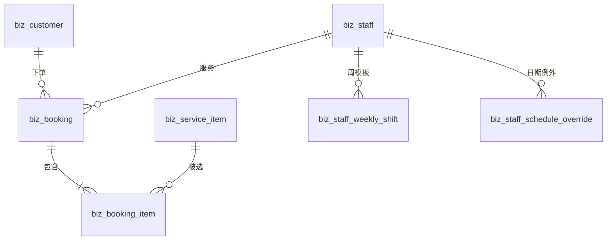
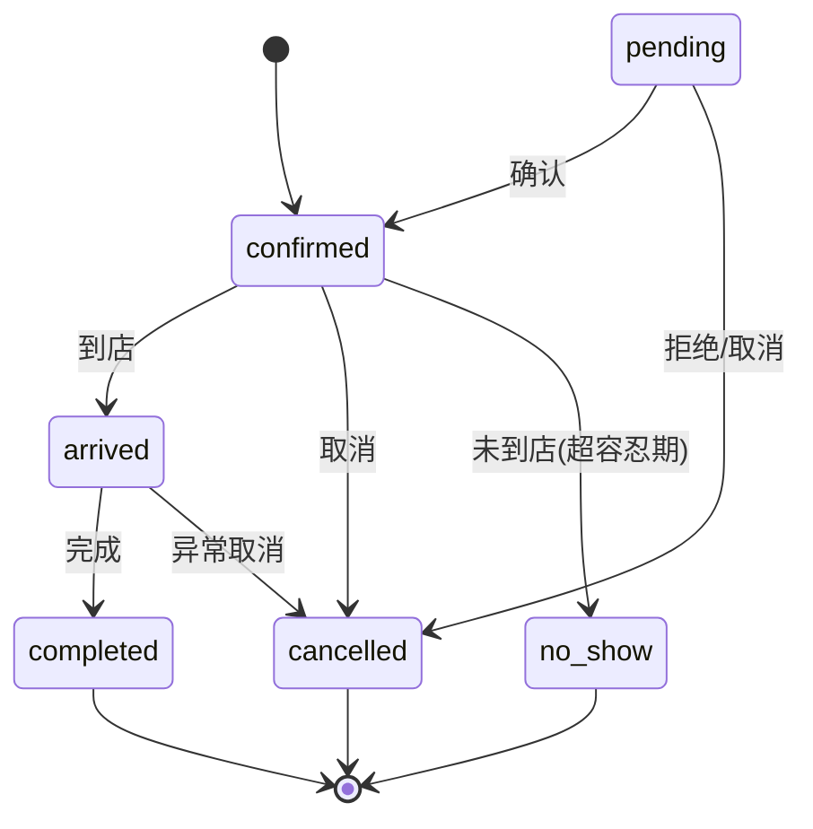

# 美甲店到店预约系统 · 设计方案

> 版本 v1.0 · 2026-09-11 · 状态：**待评审**
> 首期范围：后台管理（服务项目 / 美甲师 / 排班 / 预约）
> 技术基线：NestJS + Fastify + Drizzle ORM(MySQL) + Zod，前端 Vue 3 + lew-ui（沿用 `nest-admin` 基线）

---

## 1. 背景与目标

美甲店需要把「顾客打电话/微信口头约时间」的流程搬到系统里，解决四个具体痛点：

| 痛点                                 | 目标                                           |
| ------------------------------------ | ---------------------------------------------- |
| 靠纸质台账或微信记录，容易漏单、撞单 | 预约单集中管理，**同一美甲师同一时段绝不重叠** |
| 不知道哪个美甲师哪个时段空着         | 系统按排班 + 已有预约**自动算出可约时段**      |
| 说不清美甲师哪天上班                 | 排班可维护：周模板 + 临时请假/加班             |
| 老顾客信息散落、爽约无记录           | 顾客档案 + **爽约标记**，可查历史              |

**首期只做店内后台**（店员/店长操作），微信小程序与会员体系后置（见 §12）。

---

## 2. 范围界定

### 2.1 首期做（C + D）

- **C 基础数据**：服务项目、美甲师、排班、顾客档案
- **D 预约核心**：可约时段计算、提交预约、冲突检测与防超订、状态流转、后台预约管理
- 配套：权限点、菜单、数据权限、定时任务

### 2.2 首期明确不做（YAGNI）

| 不做的事                   | 原因                                     |
| -------------------------- | ---------------------------------------- |
| 微信小程序端               | 独立工程，后置到 P2                      |
| 会员等级 / 积分 / 储值     | 涉及资金与合规，单独立项                 |
| 在线支付、收款、退款       | 首期只做到店付                           |
| 短信/订阅消息提醒          | 项目当前**没有**通用通知模块，需单独建设 |
| 顾客自助预约（C 端接口）   | 依赖小程序与顾客认证体系                 |
| 美甲师可做项目的差异化配置 | 首期默认「所有美甲师都能做所有项目」     |
| 评价、报表、提成           | 后续按运营需要再加                       |
| 周期预约（每周三固定）     | 复杂度高，首期手工重复录入即可           |

### 2.3 分期概览

| 期       | 内容                                            |
| -------- | ----------------------------------------------- |
| **P1-1** | 服务项目 + 美甲师 + 顾客档案 CRUD               |
| **P1-2** | 排班（周模板 + 日期例外）                       |
| **P1-3** | 预约核心（可约时段 + 提交 + 防超订 + 状态流转） |
| **P1-4** | 预约管理 UI + 定时任务                          |
| **P2**   | 小程序端 + 会员体系（另立 spec）                |
| **P3**   | 通知提醒 / 周期预约 / 报表 / 支付               |

---

## 3. 术语与约定

| 术语                | 含义                                                          |
| ------------------- | ------------------------------------------------------------- |
| **服务项目**        | 顾客要做的美甲服务，如「基础美甲 60 分钟」「延长甲 120 分钟」 |
| **美甲师**          | 提供服务的员工，是**被占用的资源**（同一时段只能服务一人）    |
| **班次**            | 美甲师某天的一段可工作时间，如 10:00–12:00                    |
| **缓冲**            | 两个预约之间预留的清洁/准备时间                               |
| **可约时段**        | 由「班次 − 已有预约 − 缓冲」算出、可供顾客选择的候选开始时间  |
| **爽约（no-show）** | 顾客已确认但未到店                                            |

**沿用基线的既有约定**（必须遵守）：

- 表名 `snake_case`，业务表统一 `biz_` 前缀；Drizzle 变量 `camelCase`
- 所有业务表套用 `auditColumns`（`createdAt` / `updatedAt` / `deletedAt` / `createdBy` / `updatedBy`），软删除
- 权限点冒号分隔：`biz:<资源>:<操作>`
- 导入路径必须带 `.js` 后缀（`moduleResolution: NodeNext`）
- 列表接口返回 `{ items, page, pageSize }`（**无 total**，前端多取一条判断 `hasMore`）

---

## 4. 数据模型

### 4.1 表清单（7 张）

| 表                            | 职责                                    |
| ----------------------------- | --------------------------------------- |
| `biz_service_item`            | 服务项目（含时长、价格、缓冲）          |
| `biz_staff`                   | 美甲师档案                              |
| `biz_staff_weekly_shift`      | 周模板班次（美甲师 × 星期，一天可多段） |
| `biz_staff_schedule_override` | 日期例外（请假 / 临时加班 / 调班）      |
| `biz_customer`                | 顾客档案                                |
| `biz_booking`                 | 预约单                                  |
| `biz_booking_item`            | 预约项目明细（支持一次做多个项目）      |

### 4.2 ER 关系



### 4.3 表结构详情

#### `biz_service_item` 服务项目

| 字段               | 类型                                          | 说明                                 |
| ------------------ | --------------------------------------------- | ------------------------------------ |
| `id`               | int unsigned PK                               | 自增                                 |
| `name`             | varchar(50) NOT NULL                          | 项目名，如「基础美甲」               |
| `category`         | varchar(30) NULL                              | 分类：基础 / 延长 / 彩绘 / 护理      |
| `duration_minutes` | int unsigned NOT NULL                         | **标准时长（分钟）**，决定占用时段   |
| `buffer_minutes`   | int unsigned DEFAULT 0                        | 缓冲时长，参与冲突计算               |
| `price`            | int unsigned DEFAULT 0                        | 价格，**单位「分」**（避免浮点误差） |
| `description`      | varchar(500) NULL                             | 说明                                 |
| `image`            | varchar(500) NULL                             | 展示图（为小程序预留）               |
| `status`           | enum(active/disabled) DEFAULT active NOT NULL | 停用后不可被预约                     |
| `sort`             | int DEFAULT 0 NOT NULL                        | 排序                                 |
| `remark`           | varchar(500) NULL                             | 备注                                 |
| —                  |                                               | `...auditColumns`                    |

索引：`idx_service_item_status` on `(status, sort)`

> **价格为什么用「分」**：整数运算无精度问题，展示层除以 100。用 `decimal` 或浮点会在统计求和时出偏差。

#### `biz_staff` 美甲师

| 字段       | 类型                                          | 说明                                                 |
| ---------- | --------------------------------------------- | ---------------------------------------------------- |
| `id`       | int unsigned PK                               |                                                      |
| `user_id`  | int unsigned NULL                             | **可选**关联 `sys_user.id`（美甲师本人是否登录后台） |
| `nickname` | varchar(50) NOT NULL                          | 昵称 / 艺名                                          |
| `avatar`   | varchar(500) NULL                             | 头像                                                 |
| `phone`    | varchar(20) NULL                              | 联系电话                                             |
| `bio`      | varchar(500) NULL                             | 简介 / 擅长                                          |
| `status`   | enum(active/disabled) DEFAULT active NOT NULL | 停用后不再出现在可约列表                             |
| `sort`     | int DEFAULT 0 NOT NULL                        |                                                      |
| `remark`   | varchar(500) NULL                             |                                                      |
| —          |                                               | `...auditColumns`                                    |

索引：`idx_staff_user` on `(user_id)`；外键 `user_id → sys_user.id` `ON DELETE SET NULL`

> **为什么不直接复用 `sys_user`**：美甲师未必有后台账号（店里可能只有店长登录）。用可空的 `user_id` 让「是否给登录账号」变成可选，两种情形共用一张档案表。

#### `biz_staff_weekly_shift` 周模板班次

| 字段         | 类型                  | 说明                            |
| ------------ | --------------------- | ------------------------------- |
| `id`         | int unsigned PK       |                                 |
| `staff_id`   | int unsigned NOT NULL | → `biz_staff.id`                |
| `weekday`    | tinyint NOT NULL      | **1=周一 … 7=周日**（ISO 8601） |
| `start_time` | time NOT NULL         | 如 `10:00:00`                   |
| `end_time`   | time NOT NULL         | 如 `12:00:00`                   |
| —            |                       | `...auditColumns`               |

索引：`idx_shift_staff_weekday` on `(staff_id, weekday)`
外键：`staff_id → biz_staff.id` `ON DELETE CASCADE`

> **一天多段**：同一 `staff_id + weekday` 存在多行即为多段（如 10:00–12:00 与 13:00–20:00 中间午休）。应用层校验同一天各段**不重叠**。
> **为什么用 `time` 而非 `datetime`**：周模板表达的是「每天的这个区间」，与具体日期无关。

#### `biz_staff_schedule_override` 日期例外

| 字段         | 类型                      | 说明                                |
| ------------ | ------------------------- | ----------------------------------- |
| `id`         | int unsigned PK           |                                     |
| `staff_id`   | int unsigned NOT NULL     | → `biz_staff.id`                    |
| `date`       | date NOT NULL             | 生效日期                            |
| `type`       | enum(off/custom) NOT NULL | `off`=整天休息；`custom`=自定义时段 |
| `start_time` | time NULL                 | `type=custom` 时必填                |
| `end_time`   | time NULL                 | `type=custom` 时必填                |
| `reason`     | varchar(200) NULL         | 请假原因，如「调休」                |
| —            |                           | `...auditColumns`                   |

索引：`idx_override_staff_date` on `(staff_id, date)`
外键：`staff_id → biz_staff.id` `ON DELETE CASCADE`

**求值优先级（重要）**：

```
若当天存在 type='off' 的记录        → 当天不可约（忽略周模板）
否则若当天存在 type='custom' 的记录 → 用这些段替代周模板
否则                                → 用周模板中该 weekday 的段
```

> 不加唯一约束，因为 `custom` 允许一天多段。

#### `biz_customer` 顾客档案

| 字段            | 类型                                               | 说明                           |
| --------------- | -------------------------------------------------- | ------------------------------ |
| `id`            | int unsigned PK                                    |                                |
| `name`          | varchar(50) NOT NULL                               | 姓名 / 称呼                    |
| `phone`         | varchar(20) NULL                                   | 手机号                         |
| `gender`        | enum(unknown/male/female) DEFAULT unknown NOT NULL |                                |
| `birthday`      | date NULL                                          | 生日（将来做生日关怀）         |
| `remark`        | varchar(500) NULL                                  | 备注，如「偏好裸色系」「孕妇」 |
| `visit_count`   | int unsigned DEFAULT 0 NOT NULL                    | 到店次数（冗余统计）           |
| `last_visit_at` | datetime NULL                                      | 最近到店时间                   |
| —               |                                                    | `...auditColumns`              |

索引：`uq_customer_phone` **UNIQUE** on `(phone)`

> MySQL 的 UNIQUE 允许多个 `NULL`，因此「无手机号的散客」可以有多个，不会冲突。
> `visit_count` / `last_visit_at` 是冗余统计，在预约完成时增量更新；提供 `POST /biz/customers/:id/recount` 供对账修复。

#### `biz_booking` 预约单

| 字段               | 类型                                                                                   | 说明                                          |
| ------------------ | -------------------------------------------------------------------------------------- | --------------------------------------------- |
| `id`               | int unsigned PK                                                                        |                                               |
| `booking_no`       | varchar(32) NOT NULL                                                                   | 单号，如 `B20260911-0007`，便于口头沟通       |
| `customer_id`      | int unsigned NOT NULL                                                                  | → `biz_customer.id`                           |
| `staff_id`         | int unsigned NOT NULL                                                                  | → `biz_staff.id`                              |
| `start_at`         | datetime NOT NULL                                                                      | **开始时间**                                  |
| `end_at`           | datetime NOT NULL                                                                      | **结束时间（含缓冲）**                        |
| `duration_minutes` | int unsigned NOT NULL                                                                  | 项目总时长快照（不含缓冲）                    |
| `total_price`      | int unsigned DEFAULT 0 NOT NULL                                                        | 总价快照（分）                                |
| `status`           | enum(pending/confirmed/arrived/completed/cancelled/no_show) DEFAULT confirmed NOT NULL | 见 §7                                         |
| `channel`          | enum(admin/miniapp) DEFAULT admin NOT NULL                                             | 来源，为小程序预留                            |
| `customer_name`    | varchar(50) NOT NULL                                                                   | **快照**，防顾客改名影响历史                  |
| `customer_phone`   | varchar(20) NULL                                                                       | **快照**                                      |
| `remark`           | varchar(500) NULL                                                                      | 顾客需求备注                                  |
| `cancel_reason`    | varchar(200) NULL                                                                      | 取消 / 爽约原因                               |
| `confirmed_at`     | datetime NULL                                                                          | 状态时间戳                                    |
| `arrived_at`       | datetime NULL                                                                          |                                               |
| `finished_at`      | datetime NULL                                                                          |                                               |
| `cancelled_at`     | datetime NULL                                                                          |                                               |
| —                  |                                                                                        | `createdBy` / `updatedBy` + `...auditColumns` |

**索引（关键）**：

| 索引名                     | 列                             | 用途                               |
| -------------------------- | ------------------------------ | ---------------------------------- |
| `idx_booking_staff_time`   | `(staff_id, start_at, end_at)` | **冲突检测核心索引**，缺失会全表扫 |
| `idx_booking_customer`     | `(customer_id, start_at)`      | 顾客历史预约                       |
| `idx_booking_status_start` | `(status, start_at)`           | 列表筛选 + 定时任务扫描            |

外键：`customer_id → biz_customer.id` `ON DELETE RESTRICT`；`staff_id → biz_staff.id` `ON DELETE RESTRICT`

> **快照字段的价值**：顾客改手机号、项目调价之后，历史单据必须还原成「当时的样子」。这也是价格独立存 `total_price` 而非 join 计算的原因。

#### `biz_booking_item` 预约项目明细

| 字段               | 类型                            | 说明                    |
| ------------------ | ------------------------------- | ----------------------- |
| `id`               | int unsigned PK                 |                         |
| `booking_id`       | int unsigned NOT NULL           | → `biz_booking.id`      |
| `service_item_id`  | int unsigned NOT NULL           | → `biz_service_item.id` |
| `name`             | varchar(50) NOT NULL            | 快照                    |
| `duration_minutes` | int unsigned NOT NULL           | 快照                    |
| `price`            | int unsigned DEFAULT 0 NOT NULL | 快照                    |
| `sort`             | int DEFAULT 0 NOT NULL          | 展示顺序                |

索引：`idx_booking_item_booking` on `(booking_id)`
外键：`booking_id → biz_booking.id` `ON DELETE CASCADE`

> 首期 UI 允许选 1–N 个项目（默认 1 个）；`biz_booking.end_at - start_at` 已包含所有项目时长之和 + 缓冲。
> 用子表而非 JSON 字段，是为了将来能直接统计「哪个项目最受欢迎」。

---

## 5. 核心算法：可约时段计算

### 5.1 输入与输出

**输入**：`staffId`、`date`（日期）、`serviceItemIds[]`（选中的项目）、`stepMinutes`（粒度，默认 15）

**输出**：该美甲师当天可选的开始时间列表（或合并后的连续区间）

### 5.2 算法

```
D = Σ serviceItem.durationMinutes          // 服务总时长
B = max(serviceItem.bufferMinutes, 0)      // 取最大缓冲（也可改成求和，见 §14）

// 步骤 1：求当天班次段
shifts = []
if override 存在且含 type='off'      → return []          // 整天休息
else if override 中存在 type='custom' → shifts = 这些 custom 段
else                                  → shifts = 周模板中 weekday == 该日 的所有段

// 步骤 2：取当天有效预约（占用时段）
bookings = SELECT start_at, end_at FROM biz_booking
           WHERE staff_id = :staffId
             AND status IN ('pending','confirmed','arrived')
             AND deleted_at IS NULL
             AND start_at < :date + 1 day      // 用范围条件而非 DATE(start_at)=:date
             AND end_at   > :date              // 避免函数包裹列导致索引失效

// 步骤 3：枚举候选起点
result = []
for seg in shifts:
    for t = seg.start; t + D + B <= seg.end; t += step:
        if t < now + minLeadMinutes:                 continue   // 至少提前 N 分钟
        if t > now + maxAdvanceDays * 1day:          continue   // 最多提前 N 天
        overlap = false
        for b in bookings:
            if t < b.end_at + B && t + D + B > b.start_at:
                overlap = true; break
        if !overlap: result.push(t)

return result
```

### 5.3 重叠判定

两个区间 `[s1,e1)` 与 `[s2,e2)` 重叠的充要条件：

$$s_1 < e_2 \;\land\; s_2 < e_1$$

代码里对每个已有预约加上缓冲 `B` 后再比较，等价于把缓冲当成「不可用的尾巴」。

### 5.4 复杂度与性能

- 单美甲师单日预约数通常 **< 20**，班次段 < 5，step=15 时一天的候选点 < 60
- 因此**纯内存计算完全够用**，不需要复杂的 SQL 时间区间运算
- 只依赖 `idx_booking_staff_time` 取出当天该美甲师的有效预约即可

### 5.5 提交时的二次校验（**不能省**）

`available-slots` 返回的结果**只是建议**——从「查询」到「提交」之间，别人可能已经占了。因此创建预约时**必须重复执行一次冲突检测**（在事务内，见 §6）。前端传的 `startAt` 只是期望值，服务端有权拒绝。

### 5.6 可配置参数（走 `sys_config`，运营可调）

| 配置 key                         | 含义                   | 默认值 |
| -------------------------------- | ---------------------- | ------ |
| `biz.booking.stepMinutes`        | 可约时段的粒度（分钟） | 15     |
| `biz.booking.minLeadMinutes`     | 至少提前多久预约       | 60     |
| `biz.booking.maxAdvanceDays`     | 最多提前多少天预约     | 30     |
| `biz.booking.noShowGraceMinutes` | 超时多久未到店判为爽约 | 15     |

读取失败（配置缺失）时回落默认值，**不因配置问题导致核心链路不可用**。

---

## 6. 并发控制与防超订

### 6.1 问题

「先查冲突、再插入」在并发下**必然超订**：两个请求同时查到「无冲突」，然后都插入成功。

### 6.2 方案：事务内锁美甲师行

```
db.transaction(async (tx) => {
  1) SELECT id FROM biz_staff WHERE id = :staffId FOR UPDATE     // 串行化同一美甲师
  2) 重新执行 §5.2 步骤 2–3 的冲突检测
  3) 若冲突 → 抛 ConflictException('该时段已被占用，请重新选择')
  4) INSERT biz_booking + biz_booking_item
  5) 更新顾客 visit_count / last_visit_at（若为完成态）
})
```

**为什么锁美甲师行而不是别的**：

| 方案                            | 评价                                                                  |
| ------------------------------- | --------------------------------------------------------------------- |
| **锁 `biz_staff` 该行**（选用） | 粒度刚好：同一美甲师串行、不同美甲师互不阻塞；不依赖额外组件          |
| 锁整个资源表 / `LOCK TABLES`    | 粒度过粗，并发性能差                                                  |
| Redis 分布式锁                  | 项目的 Redis 是**可选依赖**（未配置时静默降级），拿它保障正确性不可靠 |
| 唯一索引                        | 任意时间段无法用唯一约束表达（只适用于固定时段槽方案）                |

> Drizzle 用法：`.select().from(bizStaff).where(eq(bizStaff.id, staffId)).for('update')`

### 6.3 需要保护的其余写操作

改期（`PATCH /biz/bookings/:id`）、改美甲师、状态流转中的「确认」——凡会改变 `start_at`/`end_at`/`staff_id` 的操作，都走同一套「锁 + 复检」。

---

## 7. 预约状态机

### 7.1 状态定义

| 状态        | 含义                 | 首期是否使用                                    |
| ----------- | -------------------- | ----------------------------------------------- |
| `pending`   | 待确认               | ❌ 首期为小程序预留，后台代录**直接 confirmed** |
| `confirmed` | 已确认（默认态）     | ✅                                              |
| `arrived`   | 顾客已到店           | ✅                                              |
| `completed` | 服务完成             | ✅ 终态                                         |
| `cancelled` | 已取消（顾客/店家）  | ✅ 终态                                         |
| `no_show`   | 爽约（确认了但没来） | ✅ 终态                                         |

### 7.2 流转图



### 7.3 流转规则

| 规则                                         | 说明                                                |
| -------------------------------------------- | --------------------------------------------------- |
| 只有 `pending` / `confirmed` 可取消          | 已到店后取消要单独授权（首期不做，直接不允许）      |
| 只有 `confirmed` 可标记到店 / 爽约           | 防止跳过流程                                        |
| `completed` / `cancelled` / `no_show` 为终态 | 不允许再流转                                        |
| 改期仅限 `pending` / `confirmed`             | 改期 = 更新 `start_at`/`end_at`（需重新走冲突检测） |
| 每次流转记录时间戳与操作人                   | `arrived_at` 等 + `updated_by`                      |
| 状态校验集中在 service 一层                  | 用一张 `允许的流转` 映射表，禁止散落在 controller   |

> **状态流转用独立动作端点**（`POST /biz/bookings/:id/arrive`），而不是通用的 `PATCH status`。好处：每个动作可以有**独立权限点**（前台能点到店、但不能点爽约），且语义清晰、便于记录原因。

---

## 8. 权限与数据权限

### 8.1 权限点

| 资源     | 权限点                                                                                                          |
| -------- | --------------------------------------------------------------------------------------------------------------- |
| 服务项目 | `biz:serviceItem:list` / `create` / `update` / `delete`                                                         |
| 美甲师   | `biz:staff:list` / `create` / `update` / `delete`                                                               |
| 排班     | `biz:schedule:list` / `update`                                                                                  |
| 顾客     | `biz:customer:list` / `create` / `update` / `delete`                                                            |
| 预约     | `biz:booking:list` / `create` / `update` / `cancel` / `arrive` / `complete` / `noShow` / `delete` / `manageAll` |

> `biz:booking:manageAll`：授予后可查看**全部**预约，不受「美甲师只能看自己」的限制（店长/前台应有此权限）。

命名遵循基线约定（冒号分隔），超级管理员（`*:*:*`）自动通过。

### 8.2 数据权限（特殊处理）

现有 `resolveDataScope` 按 `userId` / `deptId` 过滤，而预约的可见性应该按 **`staffId`** 判断（美甲师只看自己的单）。

**决策：不改动通用的 `data-scope.ts`**，改在预约 service 内部处理：

```
// 1) 先判断「是否受美甲师身份限制」
staff = SELECT id FROM biz_staff
        WHERE user_id = :currentUserId AND deleted_at IS NULL LIMIT 1

if (staff 存在 && 当前用户不具备 'biz:booking:manageAll')
    conditions.push(eq(bizBooking.staffId, staff.id))     // 只能看自己的单
else
    // 2) 否则回落到通用数据权限
    scope = await resolveDataScope(db, actor)
    // all    → 不加额外条件
    // deptIds→ 用子查询按「创建人所属部门」过滤（与 operation-logs 同一写法）
    // self   → 仅看自己创建的单：eq(bizBooking.createdBy, actor.id)
```

**理由**：`data-scope.ts` 是被 users / depts / login-logs / operation-logs 共用的通用逻辑，为单个业务模块引入 `staffId` 概念会污染它；而且「美甲师身份」是业务概念，理应留在业务模块内。

---

## 9. 后端接口清单

前缀统一 `/api/v1`（沿用 `API_PREFIX`）。

### 9.1 服务项目

| 方法   | 路径                     | 权限     | 说明                            |
| ------ | ------------------------ | -------- | ------------------------------- |
| GET    | `/biz/service-items`     | `list`   | 分页；支持 `keyword` / `status` |
| GET    | `/biz/service-items/:id` | `list`   | 详情                            |
| POST   | `/biz/service-items`     | `create` |                                 |
| PATCH  | `/biz/service-items/:id` | `update` |                                 |
| DELETE | `/biz/service-items/:id` | `delete` | 软删；**被预约引用时拒绝**      |

### 9.2 美甲师

| 方法   | 路径              | 权限     | 说明                            |
| ------ | ----------------- | -------- | ------------------------------- |
| GET    | `/biz/staffs`     | `list`   | 分页；支持 `keyword` / `status` |
| GET    | `/biz/staffs/:id` | `list`   | 详情                            |
| POST   | `/biz/staffs`     | `create` |                                 |
| PATCH  | `/biz/staffs/:id` | `update` |                                 |
| DELETE | `/biz/staffs/:id` | `delete` | 软删；**有未完成预约时拒绝**    |

### 9.3 排班

| 方法   | 路径                                    | 权限                  | 说明                                                |
| ------ | --------------------------------------- | --------------------- | --------------------------------------------------- |
| GET    | `/biz/staffs/:id/weekly-shifts`         | `biz:schedule:list`   | 周模板（7 天全部段）                                |
| PUT    | `/biz/staffs/:id/weekly-shifts`         | `biz:schedule:update` | **整体替换**（事务内先删后插），比逐条增删更贴合 UI |
| GET    | `/biz/staffs/:id/overrides`             | `biz:schedule:list`   | 例外列表，支持 `from` / `to`                        |
| POST   | `/biz/staffs/:id/overrides`             | `biz:schedule:update` | 新增例外（请假 / 加班）                             |
| DELETE | `/biz/staffs/:id/overrides/:overrideId` | `biz:schedule:update` | 删除例外                                            |

> 排班用 **PUT 整体替换**而非逐条 CRUD：UI 上是一次编辑 7 天的表格，整体替换能天然保证「同天各段不重叠」的一致性，也避免前端做复杂的增量 diff。

### 9.4 顾客

| 方法   | 路径                          | 权限                | 说明                                |
| ------ | ----------------------------- | ------------------- | ----------------------------------- |
| GET    | `/biz/customers`              | `biz:customer:list` | 分页；支持 `keyword`（姓名/手机号） |
| GET    | `/biz/customers/:id`          | `list`              | 详情                                |
| GET    | `/biz/customers/:id/bookings` | `list`              | 该顾客的历史预约                    |
| POST   | `/biz/customers`              | `create`            | 手机号重复 → `ConflictException`    |
| PATCH  | `/biz/customers/:id`          | `update`            |                                     |
| DELETE | `/biz/customers/:id`          | `delete`            | 软删；**有预约记录时拒绝**          |

### 9.5 预约（核心）

| 方法   | 路径                            | 权限       | 说明                                                                                    |
| ------ | ------------------------------- | ---------- | --------------------------------------------------------------------------------------- |
| GET    | `/biz/bookings/available-slots` | `list`     | **可约时段**：`staffId` + `date` + `serviceItemIds[]` → `string[]`                      |
| GET    | `/biz/bookings`                 | `list`     | 分页；支持 `date` / `dateFrom,dateTo` / `staffId` / `status` / `customerId` / `keyword` |
| GET    | `/biz/bookings/:id`             | `list`     | 详情（含项目明细）                                                                      |
| POST   | `/biz/bookings`                 | `create`   | **创建（走锁 + 冲突复检）**                                                             |
| PATCH  | `/biz/bookings/:id`             | `update`   | 改期 / 改美甲师 / 改项目（走锁 + 复检）                                                 |
| POST   | `/biz/bookings/:id/confirm`     | `update`   | `pending → confirmed`（首期预留）                                                       |
| POST   | `/biz/bookings/:id/arrive`      | `arrive`   | `confirmed → arrived`                                                                   |
| POST   | `/biz/bookings/:id/complete`    | `complete` | `arrived → completed`，并累加顾客到店统计                                               |
| POST   | `/biz/bookings/:id/no-show`     | `noShow`   | `confirmed → no_show`，需填原因                                                         |
| POST   | `/biz/bookings/:id/cancel`      | `cancel`   | `→ cancelled`，需填原因                                                                 |
| DELETE | `/biz/bookings/:id`             | `delete`   | 软删（仅管理员，用于误录清理）                                                          |

**创建预约的请求体（草案）**：

```
customerId     number    必填，必须已存在（首期不支持内联新建顾客）
staffId        number    必填
startAt        string    必填，ISO8601（期望开始时间，服务端有权拒绝）
serviceItemIds number[]  必填，1..3 个
remark         string?   可选
```

> 首期前端流程是「先在顾客管理里建好档案，再在预约弹窗里搜索选择」，因此接口不做内联建人，保持单一职责。

响应：`{ id, bookingNo, startAt, endAt, status }`

**创建时的服务端处理顺序**（不可调换）：

1. Zod 校验入参
2. 校验顾客 / 美甲师 / 项目存在且启用
3. 计算 `D`（项目时长和）与 `B`（缓冲）
4. 开事务 → 锁美甲师行
5. 校验 `startAt` 落在班次内，且 `startAt + D + B` 不超出班次
6. 冲突检测（§5.3）
7. 生成 `bookingNo`、写入 `biz_booking` + `biz_booking_item`
8. 提交事务

---

## 10. 前端页面

### 10.1 页面清单

| 路径                 | 菜单名   | 组件                      | 说明                         |
| -------------------- | -------- | ------------------------- | ---------------------------- |
| `/biz/service-items` | 服务项目 | `biz/service-items/index` | 标准 CRUD                    |
| `/biz/staffs`        | 美甲师   | `biz/staffs/index`        | 标准 CRUD                    |
| `/biz/schedules`     | 排班管理 | `biz/schedules/index`     | 选美甲师 → 编辑周模板 + 例外 |
| `/biz/customers`     | 顾客档案 | `biz/customers/index`     | 标准 CRUD + 历史预约抽屉     |
| `/biz/bookings`      | 预约管理 | `biz/bookings/index`      | 列表 + 筛选 + 状态操作       |

菜单在 `src/database/seed/menus.ts` 中新增（目录 `type:'M'` + 页面 `type:'C'` + 按钮 `type:'F'`），**前端路由自动生成，无需改 `router/index.ts`**。

### 10.2 复用基线模式

所有列表页沿用 `useTable` + `LewTable` + `LewPagination` + `LewModal`/`LewForm`（`formKey` 强制重建 + `setForm` 回填），权限用 `v-permission` / `<IconButton permission="...">`，删除走 `confirmDanger`。

### 10.3 两个 UI 难点（需提前认知）

| 难点                                       | 首期方案                                                                | 为什么不做到最好                                                    |
| ------------------------------------------ | ----------------------------------------------------------------------- | ------------------------------------------------------------------- |
| **排班编辑**（美甲师 × 星期的二维网格）    | 选一个美甲师 → 表格展示周一至周日各班次 → 点击弹窗编辑，整体 `PUT` 提交 | lew-ui 无可直接复用的「周视图排班」组件，自研拖拽网格成本高、收益低 |
| **预约日历**（日视图时间轴，按美甲师分列） | **首期只做列表 + 日期/美甲师筛选**；日历留到 P1-4 视需要再加            | 自研时间轴网格工作量可能超过后端全部，先用列表验证流程是否够用      |

### 10.4 预约创建交互（首期）

弹窗表单：选顾客（可搜索/新建）→ 选服务项目（可多选，实时累加时长与价格）→ 选美甲师 → 选日期 → **拉取可约时段**（调 `available-slots`）→ 点选一个时段 → 提交。

若提交返回 409 冲突，**保留表单内容**并提示「该时段刚被占用，请重新选择」，同时自动刷新可约时段列表。

---

## 11. 定时任务

复用 `src/modules/jobs` 的 handler Map 模式（`sys_job` 表驱动 cron）。

| handler 名                    | 建议 cron        | 逻辑                                                                 |
| ----------------------------- | ---------------- | -------------------------------------------------------------------- |
| `autoCompleteExpiredBookings` | `0 */10 * * * ?` | `status='arrived'` 且 `end_at < now` → `completed`，累加顾客到店统计 |
| `autoNoShowBookings`          | `0 */10 * * * ?` | `status='confirmed'` 且 `start_at + graceMinutes < now` → `no_show`  |

**容忍期做成配置项**：在 `sys_config` 增加 `biz.booking.noShowGraceMinutes`（默认 15），运营可自行调整，避免硬编码。

> 注意：`sys_job` 的初始数据不会由 seed 自动写入（基线项目需手工/接口创建），首期需要在部署时执行一次，或把这两条加进 seed 脚本。

---

## 12. 实施分期与验收标准

### P1-1 基础数据（服务项目 / 美甲师 / 顾客）

- 交付：3 个模块的 service / controller / module + 菜单 + 前端 3 个页面
- **验收**：能完整增删改查；停用的项目不出现在可约选择中；手机号重复创建顾客被拒绝并给出明确提示

### P1-2 排班

- 交付：周模板整体替换接口 + 日期例外接口 + 排班页面
- **验收**：
  - 给某美甲师配「周一至周五 10:00–12:00 / 13:00–20:00」，周末不配 → 周末查询可约时段返回空
  - 添加一条 `off` 例外 → 该日可约时段返回空
  - 添加一条 `custom` 例外 → 该日时段改为自定义值

### P1-3 预约核心

- 交付：可约时段接口 + 创建/改期 + 冲突检测 + 锁 + 状态流转接口
- **验收**：
  - 可约时段正确扣除已有预约与缓冲
  - **并发测试**：对同一美甲师同一时段并发发起 10 个创建请求，**恰好 1 个成功**、9 个返回冲突
  - 跨班次边界的预约被拒绝（如 19:00 开始做 120 分钟的项目，20:00 下班 → 拒绝）
  - 非法状态流转被拒绝（如 `completed → arrived`）

### P1-4 预约管理 UI + 定时任务

- 交付：预约列表页 + 状态操作按钮 + 两个定时任务 handler
- **验收**：
  - 列表能按日期/美甲师/状态筛选，快照字段展示正确
  - `arrived` 且已过结束时间的单子被自动置为 `completed`
  - `confirmed` 且超过容忍期未到店的单子被自动置为 `no_show`

---

## 13. 风险与决策记录

| #   | 决策                            | 理由                                                       |
| --- | ------------------------------- | ---------------------------------------------------------- |
| 1   | 锁美甲师行防超订，不用 Redis 锁 | Redis 在基线中是可选依赖，未配置时静默降级，不能承担正确性 |
| 2   | 价格用「分」存 `int`            | 浮点/decimal 在统计求和时有精度风险                        |
| 3   | 预约项目用子表而非 JSON         | 便于将来统计「最受欢迎项目」                               |
| 4   | 快照顾客姓名/手机号/项目名/价格 | 主数据变更后历史单据必须可还原                             |
| 5   | 美甲师独立建表，`user_id` 可空  | 店里可能只有店长登录后台，美甲师本人无账号                 |
| 6   | 排班用「PUT 整体替换」          | 贴合「一次编辑一周」的 UI，天然保证一致性                  |
| 7   | 不改通用 `data-scope.ts`        | 避免为单模块引入 `staffId` 概念污染 4 个现有调用方         |
| 8   | 状态流转用独立动作端点          | 可给每个动作独立权限点（前台可点到店但不可点爽约）         |

### 风险清单

| 风险                           | 影响                                                         | 缓解                                                                             |
| ------------------------------ | ------------------------------------------------------------ | -------------------------------------------------------------------------------- |
| 时区错位                       | `datetime` 无时区，跨时区/服务器时区不一致会导致预约时间偏移 | 明确以 `Asia/Shanghai` 为准，或统一 UTC 存储、API 边界转换；**需在 P1-3 前定死** |
| 排班与预约的边界（缓冲、跨天） | 计算错误会导致可约时段不准                                   | 算法集中在单一 service 方法，配齐单元测试（含边界：整点结束、缓冲跨段）          |
| 日历 UI 工作量被低估           | 可能拖垮 P1-4                                                | 首期明确不做日历，用列表验证需求                                                 |
| 顾客手机号唯一约束             | 一位顾客换号或共用号码时会冲突                               | `phone` 允许 `NULL`；重复时提示「已存在同名顾客，是否为同一人？」由人工判断      |

---

## 14. 待确认事项

以下是我在设计中做的假设，**请逐条确认或否决**，确认后再进入实施计划：

| #   | 待确认                           | 我的默认假设                                              |
| --- | -------------------------------- | --------------------------------------------------------- |
| 1   | 是否保留 `pending` 状态          | 保留枚举，但首期流程不使用（店员代录直接 `confirmed`）    |
| 2   | 是否需要 `arrived`（已到店）状态 | 需要（便于区分「约了没来」和「来了在做」）                |
| 3   | 是否要「服务中」状态             | **不要**（首期用 `arrived` 表达「人在店里」）             |
| 4   | 缓冲时间首期是否启用             | 字段保留，默认 0，先不用；需要时按项目配置                |
| 5   | 多个项目的总时长/缓冲怎么算      | 时长**求和**；缓冲取**最大值**（不是求和）                |
| 6   | 提前预约窗口                     | 至少提前 1 小时；最多提前 30 天（做成 `sys_config` 可调） |
| 7   | 单次最多选几个项目               | 3 个                                                      |
| 8   | 营业时间是否需要独立配置         | 不需要——营业时间就是「所有美甲师班次的并集」，不单独建表  |

---

## 附录 A：与基线系统的集成点

新增模块遵循基线约定，需要触碰的文件：

**后端**

| #   | 文件                                | 改动                                          |
| --- | ----------------------------------- | --------------------------------------------- |
| 1   | `src/database/schema/index.ts`      | 新增 7 张表 + 加入 `defineRelations`          |
| 2   | —                                   | `bun run db:generate` → `bun run db:migrate`  |
| 3   | `src/modules/biz/service-items/` 等 | 新增 service / controller / module（含 spec） |
| 4   | `src/app.module.ts`                 | 注册新模块                                    |
| 5   | `src/database/seed/menus.ts`        | 新增菜单与权限点，`bun run db:seed:menus`     |
| 6   | `src/modules/jobs/jobs.service.ts`  | 注册 2 个新 handler                           |
| 7   | `src/config/app-config.service.ts`  | 若新增环境变量（如时区）需扩展 Zod schema     |

**前端**

| #   | 文件                            | 改动          |
| --- | ------------------------------- | ------------- |
| 8   | `web/src/types/api.d.ts`        | 新增类型      |
| 9   | `web/src/api/biz/*.ts`          | 新增 API 封装 |
| 10  | `web/src/views/biz/*/index.vue` | 新增 5 个页面 |

**AI 工具（可选）**：若希望 AI 助手能操作预约，需额外新增 `src/ai/tools/biz/*.tools.ts`（每个领域 5 个 Tool）并在 `ai.module.ts` 注册。

---

## 附录 B：为小程序 / 会员预留的扩展点

首期虽然不做，但设计中已留好口子，后续不需要推翻重来：

| 预留                           | 说明                                                                                                                       |
| ------------------------------ | -------------------------------------------------------------------------------------------------------------------------- |
| `biz_booking.channel`          | 已含 `miniapp` 枚举值，小程序提交的单子可直接区分来源                                                                      |
| `biz_booking.status = pending` | 小程序提交后进入待确认，与店员代录（直接 confirmed）区分                                                                   |
| `biz_service_item.image`       | 已留展示图字段，供小程序列表使用                                                                                           |
| 顾客 → 会员关联                | 后续新建 `app_member` 表，用**手机号**匹配到 `biz_customer`，历史预约不丢                                                  |
| 独立的认证域                   | 小程序接口将挂在 `/api/v1/app/**`，使用**独立的 JWT 域与守卫**，与后台 `AccessTokenGuard` 完全隔离，会员不具备任何后台权限 |
